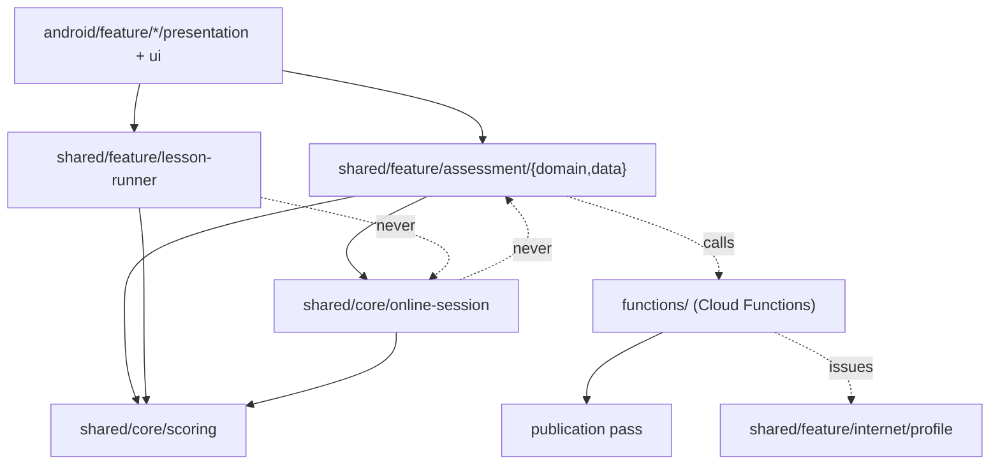
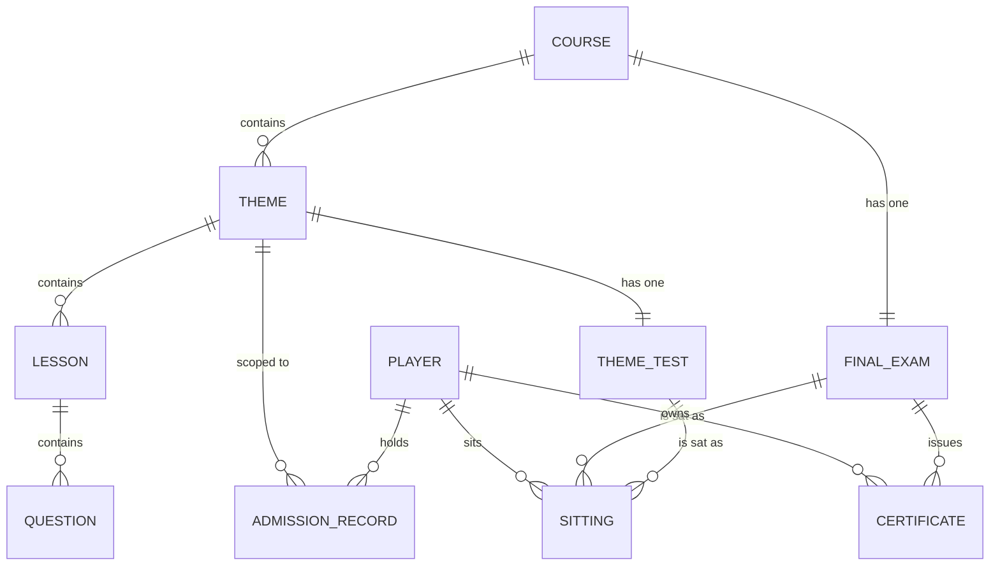

# Architecture Spine — Theme tests, the final exam, and the course certificate

## Design Paradigm

The app is layered Clean Architecture across KMP modules, and that is inherited unchanged: `domain` is pure Kotlin, `data` holds Room and Firebase adapters, `presentation` holds Decompose components, `ui` holds Compose, `core` holds shared contracts, `platform` holds SDK adapters.

What this feature adds is a second, deliberately opposite paradigm running beside the first:

| | Offline-first play (existing) | Server-authoritative assessment (new) |
| --- | --- | --- |
| Who owns the session | the device | the server |
| Who scores | the client, server re-verifies the arithmetic | the server, exclusively |
| When the player learns the result | immediately | when the server says |
| What is on the device | questions and their answers | questions; answers for easy only |
| Failure mode | queue and retry | the session ends |

The two never blend. A component belongs to one paradigm or the other, and the boundary is the presence of the correct answer on the device. Everything downstream — where code lives, what syncs, who computes a score — falls out of that single split.

## Invariants & Rules



Dashed `never` edges are prohibitions, not omissions.

### AD-1 — The online-session machinery is core, not a feature `[ADOPTED]`

- **Binds:** CAP-2, CAP-3, CAP-4, CAP-5, CAP-6, CAP-10
- **Prevents:** tournaments depending on a module named after exams; the cross-feature import the project rules treat as debt.
- **Rule:** session lifecycle, question delivery, deadline handling and terminal states live in `shared/core/online-session` and reference no feature type. Callers pass their draw scope, pass rule and completion effect in. `shared/feature/assessment` is the first caller.
- **Premise, stated as a bet:** tournaments are intended to become the second caller. Today they are not — they are derived from ordinary uploaded lesson attempts inside `submitLessonResultEvents` and ranked afterwards, with no server-owned session anywhere. If that intent is abandoned, this AD loses most of its case and the machinery should collapse back into the feature.

### AD-2 — The client never reads the session document `[ADOPTED]`

- **Binds:** CAP-2, CAP-5
- **Prevents:** redaction becoming a Firestore-rules problem, where one wrong rule leaks correct answers silently.
- **Rule:** all session traffic goes through callable functions. No client reads `exam_sessions/**` directly, and no security rule grants that read. Redaction is enforced in function code, on one path.

### AD-3 — The deadline starts at the client's acknowledgement `[ADOPTED]`

- **Binds:** CAP-4
- **Prevents:** charging network latency to the player, and equally the reverse — a client buying time by claiming a slow load.
- **Rule:** the server issues a question, the client acknowledges that the text has rendered, and the per-question deadline runs from that acknowledgement. The acknowledgement itself is bounded by AD-4. Image is delivered before text; text arrival is the start signal because it is the fast half.

### AD-4 — A broken session scores its remainder as wrong `[ADOPTED]`

- **Binds:** CAP-4, CAP-10, CAP-12
- **Prevents:** abandoning a bad sitting to protect one's statistics; and an ambiguous third state between passed and failed.
- **Rule:** if more than the gap timeout (~60s) passes between the player's answer reaching the server and the next question's acknowledgement, the session terminates. Every unanswered question scores the lowest digit, the sitting is recorded, and it consumes its cooldown. `buildCodeAnswerOnAbort` is the existing precedent for the fill.

### AD-5 — Scoring authority follows answer availability `[ADOPTED]`

- **Binds:** CAP-5, CAP-6, all lesson play
- **Prevents:** two scoring paths disagreeing, and the client being asked to score what it cannot see.
- **Rule:** easy questions publish with their correct answer and are scored on the device, as today — they reveal the answer during play anyway. Hard questions publish **without** their correct answer and are scored only by the server. There is no third arrangement, and no client code branches on which it has.
- **Consequence this AD owns, not the reader:** hard *lesson* play is server-scored too. A hard lesson attempt collects answers, uploads them, and receives its percent and advice on sync — the offline result is deferred, not immediate. `evaluateAnswer` is never called on a hard question client-side; a redacted payload never reaches `QuestionContent`, whose `init` would throw, and never falls through `evaluateAnswer`'s `else` branch, which would silently score every hard attempt as zero.

### AD-6 — Results carry topics, never items `[ADOPTED]`

- **Binds:** CAP-5, CAP-6, CAP-16
- **Prevents:** retakes degenerating into search with feedback, which collapses the 60% pass mark within a few sittings.
- **Rule:** a finished sitting returns the aggregate score, pass/fail, and a ranked list of lessons to revisit. It never returns per-question correctness, the correct answer, or anything from which a single item's answer can be inferred. Lesson attribution comes from each question's `lessonId`.

### AD-7 — One scoring implementation, one mirror `[ADOPTED]`

- **Binds:** all scoring, on both sides
- **Prevents:** four callers each growing their own arithmetic and the star scale drifting between them.
- **Rule:** `evaluateAnswer`, `computePercentScore`, `computeStars` and the all-easy-correct predicate move from `lesson-runner`'s domain to `shared/core/scoring`, taking the value types they are expressed in — `Score`, `CodeAnswer`, `PercentScore`, `Stars` — with them. `computePercentScore` is `internal` today and the all-easy-correct rule is an extension property on `CodeAnswer`, not a function; both become core API.
- **On the server there is exactly one JavaScript scoring module**, and it is new. `functions/result-verification.js` mirrors only `recomputePercentScore` today; nothing mirrors `evaluateAnswer` or `computeStars`. AD-5 makes the server the exclusive scorer of hard answers, so that module must exist — it is `assessment-scoring.js`, it absorbs `result-verification.js`'s arithmetic rather than sitting beside it, and it is the only JS implementation. Kotlin and JS change in the same commit, pinned by a shared fixture set run on both sides in CI.

### AD-8 — Admission is one monotonic record, written in the scoring transaction `[ADOPTED]`

- **Binds:** CAP-1, CAP-7, CAP-9, CAP-16, CAP-17
- **Prevents:** a window where a result exists and its admission does not; and out-of-order trigger delivery lowering a best score.
- **Rule:** one record per `(uid, themeId)` holding the best sitting percent and a passed flag, under `users/{uid}`. One mixed sitting produces one number, so the record needs no per-difficulty split. It is written by the same call that scores the sitting, in the same transaction, never by a trigger. Updates are monotonic — a value only ever improves — which makes them idempotent under replay. The theme's stars and the final exam's admission both read this record and nothing else.

### AD-9 — Admission compares a set against a course version `[ADOPTED]`

- **Binds:** CAP-1, CAP-9, CAP-16
- **Prevents:** an author adding a theme and thereby admitting whoever slipped through before it existed.
- **Rule:** admission compares the set of passed theme ids against the course's theme set at the player's course version, never a count against a count. The version the player is working through governs what they are earning.

### AD-10 — Certification eligibility is computed in the publication pass, by id set `[ADOPTED]`

- **Binds:** CAP-8, CAP-19
- **Prevents:** an incrementing counter crediting a 60-question course with 200 after four edits, because publication re-publishes edited questions through the same merge.
- **Rule:** the publication pass maintains cumulative sets of question ids per theme and per course, split by difficulty, and derives eligibility from their sizes. Nothing counts by increment. The pass sees one submission at a time; the accumulation, not the submission, is the source of truth.

### AD-11 — The submission validator is not the course validator `[ADOPTED]`

- **Binds:** CAP-19
- **Prevents:** the course-level minimum being placed in `QuestAuthoringValidation`, where it would reject every course's first submission.
- **Rule:** `QuestAuthoringValidation`'s `hasEasy && hasHard` stays a property of one submission. Certification minimums are a property of the accumulated course and are evaluated only where AD-10 accumulates them.

### AD-12 — A certifiable course cannot be de-certified by its author `[ADOPTED]`

- **Binds:** CAP-8, CAP-19
- **Prevents:** a player who passed every theme test being stranded at the final exam by an edit.
- **Rule:** the publication pass refuses an update that would drop a course below the certification minimums. Eligibility is therefore monotonic once reached, and no per-player freezing is needed.

### AD-13 — The draw index is built at publication and split by difficulty `[ADOPTED]`

- **Binds:** CAP-3, CAP-16
- **Prevents:** a course-wide fan-out on every exam start, per player, inside a capped instance budget; and a hard draw reading the easy half of the course.
- **Rule:** the same publication pass that accumulates AD-10 writes a server-only draw index — question ids per theme and per course, split easy/hard, and split again by scorable versus pretest per AD-22. No client reads this index.
- **Why an index rather than a query:** published questions live in a flat `questions/{id}` collection carrying only `lessonId`. Narrowing to a theme is *possible* — lessons carry `themeId`, and `whereIn("lessonId", …)` already exists on the client — but it costs a lesson fan-out per theme and a whole-course fan-out per final exam, on every start, per player. The index trades a write at publication for that read.

### AD-14 — The draw is uniform random over what the player could have seen `[ADOPTED]`

- **Binds:** CAP-3, CAP-16
- **Prevents:** two implementations inventing different selection policies, and an adaptive scheme arriving before there is data to tune it.
- **Rule:** the server draws 20 questions uniformly at random from the index, scoped to the subtree of the hierarchy node being assessed — the theme for a theme test, the course for the final exam — and to the questions published in the player's course version. A theme test draws 5 easy and 15 hard, mixed in presentation order; the final exam draws 20 hard. No ranking, no adaptive selection, no exposure weighting, and no filtering by what the player previously answered. Exposure control is Deferred.
- **The composition is a security parameter, not a pacing one.** Easy answers reach the device because offline lessons need them, so easy marks are readable by anyone willing to read their own database. Five of twenty caps that free share at 25%, which leaves a 60% bar needing 7 of 15 hard — guessable 6% of the time, against 76% at an even split.

### AD-15 — New hard questions are unscored until they prove themselves `[ADOPTED]`

- **Binds:** CAP-6, CAP-14
- **Prevents:** a broken hard question silently costing marks that nobody can contest, which is otherwise undetectable once answers reach no one.
- **Rule:** a newly authored hard question enters live sittings as an unscored pretest item, indistinguishable to the player, and contributes to no one's score until its statistics clear the quality bar. A sitting carries its 20 scored questions plus a small number of pretest ones.

### AD-16 — Item quality is judged by discrimination, and a bad item triggers rescoring `[ADOPTED]`

- **Binds:** CAP-14, CAP-21
- **Prevents:** the fairness hole that opens as soon as no player can see which item they failed.
- **Rule:** an item whose failures concentrate among players who scored well overall is flagged — a negative point-biserial correlation is the canonical signature of a wrong key. A confirmed bad item is **quarantined, never deleted** (AD-23), and every affected sitting is rescored (AD-24) — possible only because AD-17 keeps them. Players may also flag an item as unclear, without being told anything about correctness.
- **Starting point is thinner than it looks:** `functions/lesson-statistics.js` contains `summarizeLessonAnswers` and `summarizeAnswerDistribution`, but nothing in `index.js` requires the module — it is dead code, has never run against real data, and its `selectedOptionIds` has no `survey` branch despite claiming to cover polls. The raw material is real (`answerPayload` is stored per answer), but the aggregation is to be written, not merely extended.

### AD-17 — Every sitting is persisted, separately from lesson attempts `[ADOPTED]`

- **Binds:** CAP-14, CAP-21
- **Prevents:** discovering after launch that the pass rate against the 60% bar cannot be measured, and losing the ability to rescore.
- **Rule:** each sitting is stored server-side with its player, exam, questions drawn, answers, timings, percent and outcome. It is not folded into `result_events`, and no client write reaches it.

### AD-18 — Cooldown and spending are server-held `[ADOPTED]`

- **Binds:** CAP-12, CAP-13, CAP-11
- **Prevents:** a price that flickers — deducted locally, restored by the next profile sync — and a cooldown a client can lie about.
- **Rule:** the 23-hour cooldown belongs to an exam, not to a player, and is enforced server-side under the canonical key of AD-28. Charge for a sitting and nolics for a lesson unlock are both deducted in the same call that grants the thing, because the balances live in `users/{uid}` and `ProfileRepositoryImpl` overwrites the local profile with the remote one wholesale.
- **Nolics live in two fields and both are read.** The server writes `pointsNolics` and `nolics`; `FirebaseUserStatsDataSource` reads `pointsNolics` while `FirebaseEconomyRemoteDataSource` reads `nolics`. Any deduction writes both, or one of the two client paths shows a balance that was never charged.

### AD-19 — The certificate is server-issued, server-verified, and carries its own context `[ADOPTED]`

- **Binds:** CAP-8, CAP-18
- **Prevents:** a public page one day asserting something that was true and stopped being true.
- **Rule:** only the final exam's terminal state issues a certificate, signed with a server secret and verified only by the server, per ADR-0007. It carries the sitting, the percent, the date, the pass mark in force and the size of the bank it was drawn from, and it is valid for one year. The client never constructs or validates one.

### AD-20 — Content provisioning is neither runner's concern `[ADOPTED]`

- **Binds:** the arena boundary
- **Prevents:** arena's daily quota and purchase rules being built inside the offline runner or the online session machinery.
- **Rule:** how content reaches a device — arena's ten-a-day quota, purchased extras, difficulty-aware selection — is a provisioning policy in its own right. Arena is offline play with a provisioning policy, not an online session, and it never reaches for `shared/core/online-session`.

### AD-21 — Every sitting is server-scored, both rungs `[ADOPTED]`

- **Binds:** CAP-2, CAP-5, CAP-6, CAP-9
- **Prevents:** a patched client posting 100% on easy sittings, clearing AD-9's admission set and reaching the certificate. AD-5 alone would license exactly that, since easy answers *are* on the device.
- **Rule:** AD-5 governs lesson play only. Every sitting run through `online-session` — easy rung, hard rung, final exam — is scored exclusively by `assessment-scoring.js`. The client posts answers, never digits and never a percent, and `assessment/presentation` links no scoring function.

### AD-22 — Pretest items never change what a player is scored out of `[ADOPTED]`

- **Binds:** CAP-14, CAP-16
- **Prevents:** two arithmetics for the same play — 12 of 20 under one builder, 11 of 17 under another — and a `codeAnswer` whose percent depends on whether pretest positions were written as digits.
- **Rule:** a sitting's scored set is exactly the draw size after pretest exclusion. Pretest items come from a pool AD-13's index keeps separate from the scorable one, they occupy `'0'` positions in `codeAnswer` so `computePercentScore` never averages over them, and their count is server config. They still consume AD-3 deadlines and AD-30's gap budget, because the player must not be able to tell which they are.

### AD-23 — Eligibility counts scorable items, and bad items are quarantined `[ADOPTED]`

- **Binds:** CAP-8, CAP-14, CAP-19
- **Prevents:** a course reading "200 of 200" on the author's certification line while no sitting can open because every item is unpromoted; and AD-16's removal de-certifying a course through a door AD-12 does not watch.
- **Rule:** AD-10 accumulates and AD-19 reports the **scorable** set — promoted, not quarantined. A confirmed bad item is quarantined, which removes it from AD-13's draw pool but leaves it in the record, so no removal can cross a certification threshold downward. The author's line shows both numbers: how many questions exist and how many can be examined on.

### AD-24 — Rescoring corrects in both directions; admission is recomputed, not merged `[ADOPTED]`

- **Binds:** CAP-14, CAP-17, CAP-21
- **Prevents:** the fairness fix applying one-way. A wrong key marks some players wrong who were right *and* some right who were wrong, so an AD-8 record that only ever improves would keep the undeserved passes and drop the deserved corrections.
- **Rule:** sitting scores are corrigible in both directions by `item-quality.js`, stamped with a rescore version. After a rescore the AD-8 record is **recomputed from the player's sittings**, not monotonically merged. Monotonicity remains the rule for ordinary writes; a rescore is the one authorised exception and is the only writer allowed to lower a record.

### AD-25 — `courseVersion` is one server-owned counter `[ADOPTED]`

- **Binds:** CAP-1, CAP-9, CAP-16
- **Prevents:** admission anchoring to `version` while the draw anchors to `contentsVersion` or `lastModifiedAt` — three counters exist, none of them is a course version, and adding a theme bumps a different one than editing a question.
- **Rule:** the publication pass maintains a single monotonic `courseVersion`, bumped by any structural or question change. It is stored on the AD-8 record, set when the player first passes a theme test of that course, and advanced only by an explicit server rule. The client never supplies it and cannot pin an old one.

### AD-26 — The admission comparison is subset, over non-archived themes `[ADOPTED]`

- **Binds:** CAP-1, CAP-9
- **Prevents:** an author archiving a theme and permanently locking every player who passed it out of the final exam, which strict set equality would do.
- **Rule:** every non-archived theme id of the course at the player's `courseVersion` must appear in the passed set. Extra ids — themes since archived — are ignored, never disqualifying.

### AD-27 — Lesson progress has one server-side owner, and the gate waits for the outbox `[ADOPTED]`

- **Binds:** CAP-1, CAP-11
- **Prevents:** the exact success moment lying. A player clears the last lesson offline, the entry unlocks locally, they spend a charge, and the server refuses because the outbox has not drained.
- **Rule:** `lesson-progress.js` owns the server-side "lesson passed" aggregate and is written by `submitLessonResultEvents`. `startThemeTest` requires the theme's outbox to be drained; the client flushes first, and an undrained outbox returns a typed `ResultsNotSynced` refusal **before** any charge is taken.

### AD-28 — The final exam is one hard-only sitting, with its own record and key `[ADOPTED]`

- **Binds:** CAP-8, CAP-12, CAP-16, CAP-18
- **Prevents:** a second builder giving the course an easy and a hard final exam, which would split the cooldown key, leave two terminal states with no rule for which issues the certificate, and write `themeId = courseId` into the admission collection, poisoning AD-26's comparison.
- **Rule:** neither assessment has a ladder inside it. A theme test is one mixed sitting and the final exam is one hard-only sitting; the final exam's result lives in its own record keyed `(uid, courseId)` in a collection distinct from the AD-8 one. Cooldown keys are canonical and carry no rung segment: `theme:{themeId}` and `final:{courseId}`.

### AD-29 — A session is singular, resumable, and charged once `[ADOPTED]`

- **Binds:** CAP-2, CAP-10, CAP-12, CAP-13
- **Prevents:** a lost start response burning a charge and a 23-hour window on a session nobody can reach — AD-2 forbids reading it, and no listed call resumes it. And two devices acknowledging the same index, where AD-3 would hand the second one a fresh deadline: unlimited time, by the exact mechanism AD-3 exists to close.
- **Rule:** at most one open session per `(uid, exam)`. A start call against an exam with an open session returns that session and charges nothing. Only a terminal session opens a cooldown window. The first acknowledgement of a question index wins; later ones return the original deadline verbatim.

### AD-30 — One terminator, and the gap clock starts at session creation `[ADOPTED]`

- **Binds:** CAP-4, CAP-10, CAP-21
- **Prevents:** a first question held open forever, since AD-4's gap is defined between an answer and the next acknowledgement and there is no answer before the first; and a sweeper racing a late `submitAnswer` to write the same terminal state twice into the AD-8 transaction and the AD-17 sitting.
- **Rule:** the gap clock starts at session creation and resets on every answer receipt, first question included. Exactly one terminator — a scheduled sweeper — may write a terminal state, as a compare-and-set on the session. Foreground calls may only advance a session, never terminate it. `fetchSittingResult` on a still-open session returns a typed open state, not an error and not a partial score.

### AD-31 — Answer writes are idempotent per question `[ADOPTED]`

- **Binds:** CAP-4, CAP-5
- **Prevents:** an honest retry destroying a correct answer. The answer lands, the response is lost, the client retries past the deadline, and the stored `Score(9)` is overwritten with the timeout digit — on the one write that decides a 100%-easy pass.
- **Rule:** idempotency is keyed `(sittingId, questionIndex)`, not only `sittingId`. The first write wins; a later write returns the stored acknowledgement and never re-scores.

### AD-32 — Ordering answers travel in canonical ids, un-permuted exactly once `[ADOPTED]`

- **Binds:** CAP-5, CAP-14
- **Prevents:** the shuffle being undone twice — scoring a correct answer as wrong — or not at all. Neither shows up in tests, because AD-21 leaves no Kotlin scorer on the exam path to disagree with.
- **Rule:** the wire answer is expressed in server-issued item ids. Un-permutation happens exactly once, at the `online-session` boundary. AD-17 persists the canonical answer *and* the permutation, so an AD-24 rescore reads it in the same frame it was written.

### AD-33 — Advice is fixed-length and never resolves to one item `[ADOPTED]`

- **Binds:** CAP-6
- **Prevents:** AD-6 leaking through its own rule. One wrong answer produces one named lesson; if that lesson contributed one question to the draw, the player has just been told which item they failed.
- **Rule:** advice is a fixed-length list emitted at every score including a perfect one, and a lesson contributing fewer than a configured number of items to the sitting is never named. Where a sitting cannot support that, advice is drawn from the admission record's history rather than from the one sitting.

### AD-34 — Cooldowns and unlocks are server-written records under `users/{uid}` `[ADOPTED]`

- **Binds:** CAP-11, CAP-13, CAP-20
- **Prevents:** CAP-20 having no data source — AD-2 forbids reading sessions and no listed call enumerates cooldowns — so one builder hangs cooldowns off the profile and another off the admission record; and a lesson unlock stored client-side being erased by the profile's wholesale overwrite.
- **Rule:** the AD-8 record carries a server-written cooldown projection, and it is CAP-20's only source. `unlockLesson` joins the callable list, lives with the economy code that already holds the spend helpers, and writes the unlock as a record under `users/{uid}`.

### AD-35 — A pool below the draw cannot open a sitting `[ADOPTED]`

- **Binds:** CAP-3, CAP-12, CAP-13
- **Prevents:** the existing `selectSubset` precedent quietly serving 14 questions against a bar tuned for 20, writing a `bestEasyPercent` incomparable across themes — and doing it in the normal case, since a non-certifiable course still has theme tests.
- **Rule:** a difficulty whose scorable pool is below its share of the draw cannot open a sitting — 5 easy and 15 hard for a theme test, 20 hard for the final exam, each checked against its own pool. `PoolTooSmall` joins the typed refusal set. The publication pass records per-theme, per-rung scorable pool sizes so the client can render the lock without guessing. Charge is deducted only after a successful draw, in the same transaction.

### AD-36 — Payouts are first-pass only `[ADOPTED]`

- **Binds:** CAP-13, CAP-15, CAP-16
- **Prevents:** a nolics faucet. Retakes are unlimited at one a day, so crediting on every passing sitting pays forever, and it mutates the same balance AD-18 deducts from in a different call.
- **Rule:** a payout is keyed `(uid, themeId, rung)` with an `awardedAt`, written in the same transaction as the AD-8 record, and unaffected by an AD-24 rescore.

### AD-37 — Exam results are rendered verbatim `[ADOPTED]`

- **Binds:** CAP-6, CAP-7
- **Prevents:** the client recomputing stars from the percent and drifting from the server by a tenth, on the screen the certificate chain hangs off. Kotlin truncates integer division where JS would round, and AD-7's same-commit rule cannot catch a divergence that only appears on a path with no Kotlin scorer.
- **Rule:** an exam result is rendered exactly as the server sent it. `assessment/presentation` does not depend on `shared/core/scoring`.

## Consistency Conventions

| Concern | Convention |
| --- | --- |
| Naming | Assessment types are `ThemeTest` and `FinalExam`; the shared machinery says `Session`. Never `exam` for a theme-level thing — the vocabulary split is contractual, not cosmetic. |
| Callables | `startThemeTest`, `startFinalExam`, `acknowledgeQuestion`, `submitAnswer`, `finishSitting`, `fetchSittingResult`, `unlockLesson`. One verb, one noun, no batch variants. |
| Ids | `sittingId` is client-generated and idempotent, matching the existing `attemptId` contract; answer writes are idempotent on `(sittingId, questionIndex)` per AD-31; everything else is server-generated. |
| Redacted payloads | A redacted question is its own type on the wire and in `shared/core/online-session`. `QuestionContent` is never made nullable to accommodate it — its `init` invariants would throw and ordinary lessons would silently score as wrong. |
| Ordering questions | Redaction is not field-stripping: the server shuffles `items` and holds the permutation, because the order of `items` **is** the answer. |
| Surveys | Excluded from every draw. They score full marks for any answer and would be free correctness. |
| Errors | A refused start returns a typed reason the UI renders — `Locked`, `Cooldown`, `InsufficientCharge`, `LadderNotReached`, `ResultsNotSynced`, `PoolTooSmall` — never a generic failure. |
| Config | The pass mark, the 23-hour cooldown, the gap timeout, the draw size, the easy/hard composition and the certification minimums are server config, not code constants. The pass mark is additionally per-course, settable by the author or an algorithm. |
| Auth-scoped flows | Anything under `users/{uid}` is observed through `currentUidFlow().flatMapLatest { … }` per the project rule, emitting guest defaults on logout. |

## Stack

Ratified from the existing project, not chosen here. Versions read from `gradle/libs.versions.toml` and `functions/package.json` on 2026-08-29.

| Name | Version |
| --- | --- |
| Kotlin (KMP) | 2.3.10 |
| Android Gradle Plugin | 8.11.0 |
| kotlinx-coroutines | 1.10.2 |
| kotlinx-serialization | 1.7.3 |
| kotlinx-datetime | 0.5.0 |
| Decompose | 3.1.0 |
| Essenty | 2.1.0 |
| Koin | 3.5.6 |
| Compose BOM | 2024.09.02 |
| Firebase BOM (Android) | 33.2.0 |
| Cloud Functions runtime | Node 22 |
| firebase-functions (Node) | ^7.2.5 |
| firebase-admin (Node) | ^13.8.0 |

## Structural Seed

```text
shared/core/scoring/                      # moved out of lesson-runner: evaluate, percent, stars, all-easy-correct
shared/core/online-session/               # session lifecycle, redacted question type, deadlines, terminal states
shared/feature/assessment/domain/         # ThemeTest, FinalExam, admission record, use cases
shared/feature/assessment/data/           # callable client, Room cache of entities and results
android/feature/assessment/presentation/  # Decompose components + Compose screens
functions/
  assessment-session.js                   # start / acknowledge / submit / finish / fetch
  assessment-draw.js                      # uniform draw over the publication index
  assessment-scoring.js                   # the ONE JS scorer; absorbs result-verification.js
  lesson-progress.js                      # server-side lesson-passed aggregate (AD-27)
  item-quality.js                         # discrimination, pretest promotion, rescoring
  certification.js                        # eligibility accumulation, certificate issue, verification
```



## Capability → Architecture Map

| Capability | Lives in | Governed by |
| --- | --- | --- |
| CAP-1, CAP-9 admission and ladder | assessment/domain + `certification.js` | AD-8, AD-9 |
| CAP-2, CAP-10 session ownership and interruption | `online-session` + `assessment-session.js` | AD-1, AD-2, AD-4 |
| CAP-3, CAP-16 draw and the final exam | `assessment-draw.js` | AD-13, AD-14 |
| CAP-4 deadlines | `online-session` + `assessment-session.js` | AD-3, AD-4 |
| CAP-5, CAP-6 no feedback, server result | `assessment-scoring.js` | AD-5, AD-6, AD-7 |
| CAP-7, CAP-15 theme stars and payout | assessment/domain + AD-8 record | AD-8 |
| CAP-8, CAP-18 the certificate | `certification.js` + profile domain | AD-19, ADR-0007 |
| CAP-11 sequential lessons and purchase | quizzes-screen presentation + `certification.js` | AD-18, AD-20 |
| CAP-12, CAP-13 cooldown and charge | `assessment-session.js` | AD-18 |
| CAP-14 anti-cheat and item quality | `item-quality.js` | AD-15, AD-16, AD-17 |
| CAP-17 admission record | `users/{uid}` subtree | AD-8 |
| CAP-19 author certification line | quest-authoring presentation | AD-10, AD-11, AD-12 |
| CAP-20 cooldown overview | assessment presentation | AD-18 |
| CAP-21 sitting persistence | `item-quality.js` store | AD-17 |

## Deferred

- **Exposure control.** AD-14 fixes a uniform draw. Randomesque or Sympson-Hetter selection needs exposure data that does not exist yet; revisit once sittings have accumulated.
- **A self-contained verification link.** AD-19 makes verification depend on the server being alive, so certificates die with the domain. Packing the signed payload into the link would let the page survive as a static file — roughly a day's work. Revisit before the first certificate turns a year old.
- **Tournaments.** The second caller of `shared/core/online-session`. Its scoring, ranking and scheduling are not decided here; AD-1 exists so it does not have to be.
- **Arena provisioning.** AD-20 names the boundary and stops there. The quota, the purchase rules and the difficulty-aware selection are their own design.
- **The life-points-to-charge rename.** Touches the shop, the profile, the server economy and the legacy price list. Not this feature's diff.
- **What replaces `lifeCharged` as the economic throttle on lesson attempts.** It gates four things, and `attemptId` idempotency already ships; only a daily cap on paid attempts remains to be designed.
- **Theme placement / leaderboards.** CAP-15 allows a placement; whether it ranks against the theme, the course or everyone is undecided.
- **Whether a course carries stars of its own** from the final exam, as a theme does from its test.
