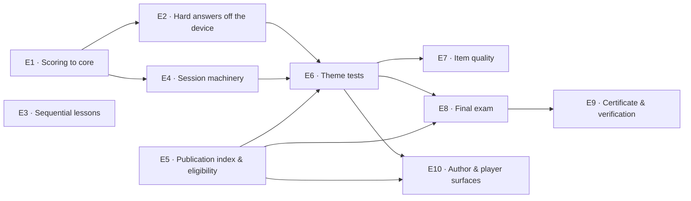

# Epic breakdown

How the work splits, in what order, and what each epic can be shipped without.

Derived from `ARCHITECTURE-SPINE.md`. Epic ids are stable; the AD and CAP references are the contract each epic is built against.

## Order and dependencies

`E3` and `E9` hang off nothing structural — see their rows.

## The epics

### E1 — Scoring moves to core

**Governed by:** AD-7 · **Serves:** every later epic

Move `evaluateAnswer`, `computePercentScore`, `computeStars` and the all-easy-correct predicate out of `lesson-runner`'s domain into `shared/core/scoring`. Pure move plus import updates; the JS mirror in `functions/result-verification.js` is unchanged but gains a comment binding the two.

Ships alone, changes no behaviour, and every test that exists should still pass untouched. Do it first because four callers arrive later and each one done before this is a call site to rewrite.

**Done when:** `lesson-runner` no longer owns a scoring function, and nothing outside `core` imports one from it.

---

### E2 — Hard answers stop reaching the device

**Governed by:** AD-5, AD-6 · **Depends on:** E1

The largest and least glamorous epic, and the one everything else assumes.

Publication stops writing the correct answer into a hard question's client-readable payload. Hard lesson attempts therefore can no longer be scored on the device: the client collects answers, uploads them, and the server returns the percent and the lesson-level advice. Easy questions are untouched — they reveal the answer during play, so they keep it.

This changes offline lesson play for hard mode: the result arrives on sync, not immediately. That is a product-visible change and needs its own UI treatment.

**Watch for:** the client currently computes `codeAnswer` and the server verifies the arithmetic. After this, hard sittings have no client-side digits at all, so the two paths must not both claim to produce a `codeAnswer`.

**Done when:** a hard question's payload on the device contains no correct answer, a hard attempt played offline scores correctly after sync, and easy play is byte-identical to before.

---

### E3 — Sequential lessons and purchase

**Governed by:** AD-18, AD-20 · **Depends on:** nothing structural · **Serves:** CAP-11

Inside a course catalog, a lesson opens when the previous one is passed, or when it is bought with nolics — any locked lesson, not only the next. The purchase is a server call, because `pointsNolics` lives in `users/{uid}` and the profile sync overwrites the local copy.

Independently shippable and independently valuable. It is a prerequisite of the theme test *gate* in product terms but not in code, so it can ship long before anything else here.

**Done when:** lesson 3 cannot be started while lesson 2 is unpassed and unbought; buying opens the bought lesson and leaves its stars at zero.

---

### E4 — The online session machinery

**Governed by:** AD-1, AD-2, AD-3, AD-4 · **Depends on:** E1

`shared/core/online-session` plus the callables that back it: start, acknowledge, submit, finish, fetch result. The redacted question type lives here, including the shuffled-`items` handling for `Ordering`. Nothing in this epic knows what a theme test or a final exam is.

This is where the risk in the whole feature sits — reconnect races, deadline arithmetic, terminal states, retries. Build it here and debug it at low stakes in E6, rather than discovering it under a certificate.

**Done when:** a session can be driven end to end against the emulator, a client that goes silent past the gap timeout gets a terminated sitting with its remainder scored wrong, and no correct answer appears anywhere in a captured response.

---

### E5 — Publication index and certification eligibility

**Governed by:** AD-10, AD-11, AD-12, AD-13 · **Depends on:** nothing structural

One pass over each publication submission that accumulates, per theme and per course, the sets of question ids split by difficulty — and derives from their sizes both the draw index the exams need and the certification eligibility the author sees. Counting is by id set, never by increment. The pass also refuses an update that would drop a certifiable course below the bar.

Can be built and deployed before any exam exists; it simply starts accumulating.

**Done when:** re-publishing an edited question does not change any count; a course crossing 12 theme tests at 100 easy and 100 hard flips to eligible; an update that would drop it below is refused.

---

### E6 — Theme tests

**Governed by:** AD-8, AD-9, AD-14, AD-18 · **Depends on:** E2, E4, E5

The first caller of the session machinery. Draw, cooldown, charge, the easy and hard rungs, the monotonic admission record written in the scoring transaction, and theme stars read from that record.

This is the rehearsal — for the player and for us. Every mechanism the final exam needs is exercised here where the stake is stars.

**Done when:** a theme test can be sat, scored and shown; the admission record improves and never falls; a second start inside 23 hours is refused with the time it returns; the theme's stars come from the best sitting and never from its lessons.

---

### E7 — Item quality

**Governed by:** AD-15, AD-16, AD-17 · **Depends on:** E6

Sittings are persisted. New hard questions ride unscored until their statistics clear the bar. An item whose failures concentrate among high scorers is flagged. A confirmed bad item is removed and affected sittings are rescored. Players can flag an item as unclear.

Half of it exists: `lesson-statistics.js` already records which options were picked. The missing half is correlating an item against its sitting's total.

Must ship before the final exam counts for anything, because it is the only thing standing between a mis-keyed hard question and a certificate.

**Done when:** a deliberately mis-keyed question is flagged from synthetic sittings without any human reading it, and a rescore updates the affected results.

---

### E8 — The final exam

**Governed by:** AD-9, AD-14, AD-19 · **Depends on:** E5, E6

The course-level sitting: admitted by every theme test passed at the player's course version, hard questions only, 20 drawn uniformly, 60% to pass, one sitting per 23 hours, unlimited retakes.

By this point it is a configuration of E4 plus an admission predicate — which is the whole reason E4 was built as machinery.

**Done when:** one unpassed theme test anywhere keeps it shut; a pass produces a result that carries no per-question information.

---

### E9 — Certificate and public verification

**Governed by:** AD-19 · **Depends on:** E8 to *issue*, nothing to *build*

The `Certificate` model in the profile domain, server signing, the one-year validity, the attestation snapshot, and the unauthenticated verification endpoint with its page.

The model and the endpoint depend on nothing and can be built in parallel from day one; only issuance waits for E8. Splitting it that way keeps the longest-lead item off the critical path.

**Done when:** a signed-out visitor resolves a verification link and sees the sitting, the percent, the date, the pass mark and the bank size; the client never constructs or validates a certificate.

---

### E10 — Author and player surfaces

**Governed by:** AD-6, AD-10, AD-18 · **Depends on:** E5, E6

The screens the round table found and the spec turned into capabilities:

- the author's certification line, showing distance from the first minute rather than a verdict at publish time;
- the exam lock screen distinguishing "not unlocked" from "unlocked but not passed";
- one place showing every ticking cooldown;
- the result screen's lesson-level advice, and no "next exam" as its primary action;
- a start door shown once per session, not once per sitting;
- an acknowledgement after each answer that is deliberately identical every time, because any pixel that varies reads as a verdict.

**Done when:** a player who bought a theme open can see, in words, that its lessons are unpassed rather than unavailable.

## What can ship on its own

| Epic | Ships alone | Why it might go early |
| --- | --- | --- |
| E1 | yes | pure refactor, zero behaviour change |
| E3 | yes | product value with no dependency on assessment at all |
| E5 | yes | starts accumulating before anything reads it |
| E9 model + endpoint | yes | longest lead, no dependency until issuance |

## The seam

The spine draws one deliberate seam, and the architect's argument for its direction stands: **theme tests before the certificate.** The risk in this feature is the server session — redaction, deadlines, reconnect races, retries — and that is debugged where the stake is stars, not where the stake is a document an employer opens. Shipping the certificate first would produce a verifier for an empty set and leave the session untested for months.

The one thing that does move earlier is E9's model and endpoint, which turned out to depend on nothing.
