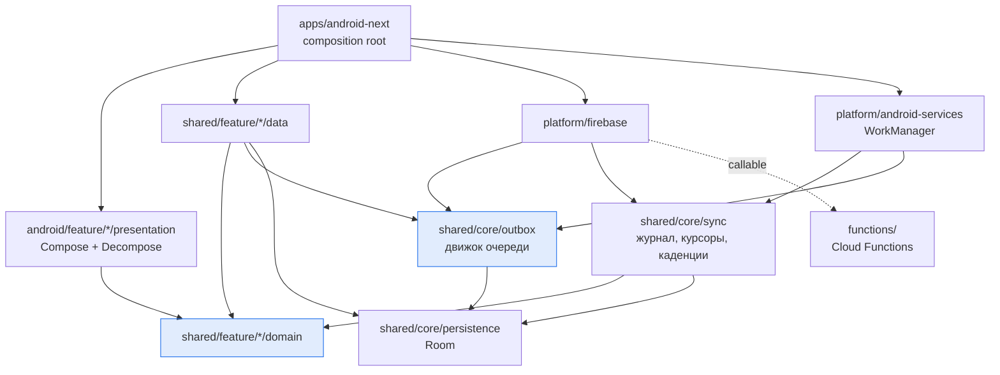
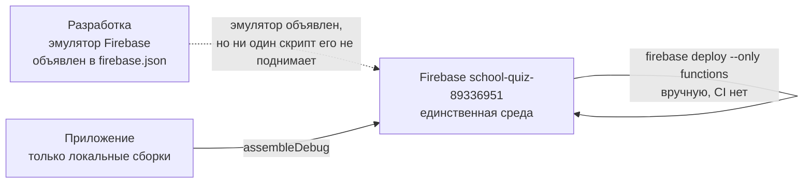

# Architecture Spine — Синхронизация

## Design Paradigm

Слои наследуются без изменений: `domain` — чистый Kotlin, `data` — Room и Firebase-адаптеры, `presentation` — Decompose-компоненты, `ui` — Compose, `core` — общие контракты, `platform` — адаптеры SDK. Модули: `shared/{core,feature}/*/{domain,data}`, `platform/firebase`, `platform/android-services`, `android/feature/*/presentation`, `apps/android-next`.

Что эта работа добавляет — **две противоположные модели записи, живущие рядом**:

| | Отложенная запись | Синхронный вызов |
| --- | --- | --- |
| Когда игрок узнаёт результат | при следующей синхронизации | сразу на экране |
| Кто знает цену действия | клиент, заранее | только сервер, в момент вызова |
| Что происходит без сети | действие ждёт в очереди | действие недоступно, и это сказано словами |
| Защита от повтора | `mutationId` на сервере | не нужна, вызов один |
| Примеры | разблокировка урока, действие ревьюера, перенос квеста на полку | покупка сердца, покупка и смена ника, покупка лота |

Граница между ними — **AD-1**, и она не вопрос удобства: цена сердца зависит от того, сколько сердец у игрока сейчас, цена ника рождается в реестре, лот может уйти другому покупателю за ту же минуту. Отложить такое действие означает показать игроку цену, которой не будет.

## Invariants & Rules



`shared/core/outbox` и `shared/core/sync` **не зависят друг от друга** и не зависят ни от одной feature-модели (AD-19). Стрелка от `platform/firebase` к обоим — реализация их портов, не обратная зависимость.

### AD-1 — Очередь или синхронный вызов решает не удобство, а место рождения цены

- **Binds:** CAP-2, CAP-3, все мутации
- **Prevents:** отложенную покупку, показывающую игроку цену, которой на сервере не будет
- **Rule:** Мутация идёт через очередь **тогда и только тогда**, когда её результат не вычисляется сервером в момент вызова. Если цена, награда или доступность рождаются на сервере и показываются на экране — действие синхронное. Синхронны: покупка слота сердца, покупка золотого сердца, покупка и смена ника, покупка лота ника, покупка лота логотипа, покупка логотипа. Отложены: разблокировка урока, действие ревьюера, перенос квеста на полку, снятие лота с продажи, прохождение урока, оценка квеста, заявка квеста на арену.

### AD-2 — `mutationId` — единственный ключ идемпотентности

- **Binds:** CAP-2, сервер
- **Prevents:** двойное списание при повторной доставке — сегодня на сервере нет ни одной проверки повтора
- **Rule:** Клиент генерирует `mutationId` в момент постановки в очередь, до первой попытки отправки, и никогда его не меняет. Сервер хранит выполненные `mutationId` и на повтор возвращает сохранённый результат, не выполняя операцию заново. Существующая дедупликация по doc-id (`attemptId`, `ratingId`) — частный случай и приводится к общему механизму.

### AD-3 — Один транспорт отложенной мутации

- **Binds:** CAP-2
- **Prevents:** расхождение, уже живущее в коде: прохождения уходят через callable, заявки арены — прямой записью в Firestore
- **Rule:** Всякая отложенная мутация уходит одним callable-приёмником. Прямая запись в Firestore из кода очереди запрещена — проверить `mutationId` можно только там, где выполняется код.

### AD-4 — Одна таблица очереди, содержимое — строка

- **Binds:** CAP-2, CAP-3
- **Prevents:** миграцию схемы на каждый новый тип действия
- **Rule:** Одна таблица на все отложенные действия. Колонки: `local_id`, `mutation_id`, `owner_uid`, `operation`, `payload` (String), `entity_ref` (String?, для пометки сущности — AD-17), `expected_version` (Long?, для версионируемых — AD-24), `attempt_count`, `next_retry_at_ms`, `last_error`, `created_at_ms`. Ядро не разбирает `payload` — его сериализует и десериализует владеющая фича (AD-19).

### AD-5 — Отправленная запись удаляется

- **Binds:** CAP-2, CAP-3
- **Prevents:** две несовместимые формы «отправлено», уже сосуществующие в коде — надгробие `sent_at_ms` и `DELETE`
- **Rule:** Успешно отправленная запись удаляется. Надгробий нет, `sent_at_ms` не вводится. История хранится на сервере и архивируется там. Три существующие очереди приводятся к этой форме.

### AD-6 — Карантин вместо вечного повтора

- **Binds:** CAP-3
- **Prevents:** одну отвергаемую запись, останавливающую всю очередь — сегодня падение прохождений глушит оценки в том же прогоне
- **Rule:** Выборка берёт только записи с `next_retry_at_ms <= now`, отсортированные по времени создания. Отказ одной записи увеличивает её `attempt_count`, отодвигает `next_retry_at_ms` по экспоненте и **не прерывает** обработку остальных: цикл не выпускает исключение наверх. После порога отказов запись уходит в карантин и исключается из выборки, оставаясь видимой (AD-17).

### AD-7 — Очередь принадлежит аккаунту

- **Binds:** CAP-5
- **Prevents:** начисление действий игрока A игроку B — сегодня выборка не фильтрует по владельцу, а сервер атрибутирует событие вызывающему
- **Rule:** Каждая запись несёт `owner_uid`, зафиксированный в момент постановки. Выборка фильтрует по текущему uid. Отправка записи под другим uid невозможна.

### AD-8 — Смена аккаунта — только онлайн и только после слива очереди

- **Binds:** CAP-5
- **Prevents:** молчаливую потерю очереди при переключении аккаунта, которое сегодня реально: `signInWithCredential` возвращает `SWITCHED`, а обработчик — всплывающая надпись
- **Rule:** Перед сменой аккаунта очередь сливается. Если слить не удалось — игрок получает явное предупреждение до смены: последние действия могут не сохраниться, и вход может не пройти. `GoogleLinkOutcome.SWITCHED` обязан вести к этому пути. Курсоры, привязанные к аккаунту (`private_quests:{uid}`, `review_assignments:{uid}`), при смене сбрасываются; курсоры публичного контента переживают смену, потому что контент от аккаунта не зависит.

### AD-9 — Локальное изменение и постановка в очередь — одна транзакция

- **Binds:** CAP-2
- **Prevents:** сохранённое действие, которое никогда не попало в очередь
- **Rule:** Изменение локального состояния и вставка записи очереди фиксируются одной транзакцией Room. Прецедент уже есть — `LessonAttemptRepositoryImpl` через `buildAttemptRow`; `LessonRatingRepositoryImpl` делает два независимых вызова и приводится к тому же.

### AD-10 — Курсор двигается после применения и умеет сбрасываться

- **Binds:** CAP-4
- **Prevents:** разошедшиеся курсор и базу, которые сегодня чинятся только переустановкой
- **Rule:** `setCursor` вызывается только после успешного применения изменений. Существует явная операция полного ресинка, обнуляющая курсоры. Курсор — пара `(changedAtMs, docId)` либо чтение с перекрытием окна: строгое `>` по одному лишь времени теряет две записи в одну миллисекунду. Выборка изменений ограничена и продолжаема.

### AD-11 — Журнал — карта «последнее изменение на узел», а не лог

- **Binds:** CAP-8
- **Prevents:** неограниченный рост журнала и изменение, которого клиент не увидит никогда
- **Rule:** Два инварианта, общие для всех четырёх журналов: **один документ на узел** и **id документа не содержит времени**. Конкретная схема id остаётся за журналом — они уже разделены путём: `{type}_{id}` для контента каталога, `{questionId}` для вопросов урока, `{catalogId}_{questId}` для приватных квестов, `{assignmentId}` для заданий на ревью. Тело записи — `{type, id, changedAtMs}`; читатель не содержит защитного fallback. **Всякое изменение узла на сервере обязано сопровождаться записью в его журнал** — изменение без записи клиент не увидит никогда. Сид-скрипты подчиняются тому же правилу: сегодня они формируют id из таймстемпа и потому растят коллекцию неограниченно.

### AD-12 — `version` пишет только сервер

- **Binds:** CAP-7
- **Prevents:** молчаливую перезапись двух устройств одного автора
- **Rule:** Клиент не отправляет `localRevision`. Сервер инкрементирует `version`. Три сосуществующих способа записи `quests.version` — клиентский `localRevision`, read-modify-write `+1`, `FieldValue.increment(1)` — сводятся к одному.

### AD-13 — Порядок парных изменений: правила, сервер, клиент

- **Binds:** все парные клиент-серверные изменения
- **Prevents:** сломанное создание квеста, если убрать `contentsVersion` с клиента раньше, чем из правил Firestore, которые требуют его равным нулю при создании
- **Rule:** Порядок выкатки — `firestore.rules`, затем `functions`, затем клиент; каждый шаг подтверждён до следующего. Обратная совместимость клиента **не поддерживается**: живых установок нет, механизм минимальной версии не строится. Серверные данные при этом не удаляются — форма данных меняется backfill-скриптом.

### AD-14 — Одна чистая схема локальной базы, дальше только тестируемые миграции

- **Binds:** CAP-2, CAP-8
- **Prevents:** наращивание цепочки на недостоверную историю — схема `1.json` совпадает с `2.json` вплоть до `identityHash`
- **Rule:** Локальная база пересоздаётся одной схемой; это разрешено ровно потому, что живых установок нет (AD-13). С этого момента каждая миграция покрыта тестом через `runMigrationsAndValidate`, а `fallbackToDestructiveMigration` запрещён.

### AD-15 — Один источник времени

- **Binds:** all
- **Prevents:** три легальных способа получить «сейчас», уже сосуществующих в sync-коде, и расходящиеся из-за этого тесты
- **Rule:** Один доменный контракт времени, внедряемый через конструктор. Прямые вызовы `Clock.System.now()` и `System.currentTimeMillis()` в `core/sync`, `core/outbox` и их адаптерах запрещены.

### AD-16 — Ошибки различимы по типу, а не по тексту

- **Binds:** CAP-2, CAP-3, CAP-6
- **Prevents:** решение «повторять или карантин», принимаемое по строке сообщения — сегодня «нет сети» и «не хватает золота» доходят до UI одинаково
- **Rule:** Ошибка транспорта мапится в доменный тип: `НетСети` / `Отказ(причина)` / `КонфликтВерсии` / `Неизвестно`. Повтор назначается только для `НетСети` и `Неизвестно`; `Отказ` уходит в карантин без повторов; `КонфликтВерсии` обрабатывается отдельно (AD-24) и в карантин не уходит. Синхронная мутация при `НетСети` не показывает спиннер: сегодня он держится 70 секунд, потому что таймаут callable не настроен.

### AD-17 — Состояние синхронизации — наблюдаемый контракт

- **Binds:** CAP-6
- **Prevents:** невозможность увидеть, что очередь встала — сегодня наружу не выходит ничего, кроме `Log.w`
- **Rule:** Отдельный репозиторий отдаёт `Flow`: время последнего успеха, число ожидающих, число в карантине, последняя ошибка. Он auth-scoped по инварианту 8 — при смене uid поток пересоздаётся через `flatMapLatest` и отдаёт гостевые значения, а не `emptyFlow()`. Для пометки конкретной сущности («этот результат ещё не отправлен») запись очереди несёт необязательный `entity_ref` — непрозрачную для ядра строку, которую задаёт фича. Фича спрашивает «есть ли неотправленное для этой сущности», не заставляя ядро разбирать `payload` (AD-19).

### AD-18 — Push несёт повод, а не данные

- **Binds:** CAP-10
- **Prevents:** второй путь применения изменений, расходящийся с основным
- **Rule:** Полезная нагрузка уведомления не является источником истины. Получив push, приложение синхронизируется обычным путём. Токен устройства живёт в `users/{uid}/devices/{token}`, пишется клиентом при регистрации и удаляется при смене аккаунта.

### AD-19 — `shared/core/outbox` не знает о фичах

- **Binds:** all
- **Prevents:** наследование движком очереди зависимостей, которые `core/sync` уже несёт — его оркестратор тянет domain-репозитории шести фич
- **Rule:** `shared/core/outbox` зависит только от Kotlin и контрактов хранения. Он не импортирует ни одной feature-модели и не зависит от `core/sync`; `core/sync` не зависит от него. Тип операции, сериализация `payload` и его применение объявляются в модуле владеющей фичи.

### AD-20 — Одно место регистрации

- **Binds:** all
- **Prevents:** три разных места регистрации sync-классов, уже существующих в проекте: app-модуль, commonMain фичи, androidMain фичи
- **Rule:** Движок очереди, её таблица и планировщик регистрируются в composition root (`apps/android-next`). Обработчик конкретного типа операции регистрируется в модуле своей фичи. Одна production-привязка на тип (инвариант 5).

### AD-21 — Серверный приёмник — отдельный тестируемый модуль

- **Binds:** CAP-2
- **Prevents:** рост `index.js` (4142 строки, ни одного `module.exports`) и приёмник очереди, который невозможно протестировать
- **Rule:** Приёмник живёт в `functions/mutation-queue.js` с `module.exports`, покрыт тестом и включён в `npm test` и в `npm run lint`. Тесты прогоняются до деплоя.

### AD-22 — Серверно-защищённые поля не меняются локально

- **Binds:** CAP-2, AD-9
- **Prevents:** оптимистичную локальную запись полки квеста, квалификации или сертификата — к ней подталкивает AD-9, если читать его как общее правило
- **Rule:** Квалификации, сертификаты, полки квестов и всякое поле, которое пишет только сервер, локально не изменяются ни при каких условиях, включая постановку действия в очередь. AD-9 говорит о состоянии, которым владеет клиент; для server-owned полей локальная половина транзакции пуста — в очередь кладётся только намерение, а поле меняется, когда его пришлёт сервер. UI показывает такое поле неизменным до подтверждения.

### AD-23 — Удаление выражается отсутствием, а не флагом

- **Binds:** CAP-8
- **Prevents:** четвёртый способ удаления, изобретённый заново, потому что фактический контракт живёт только в коде
- **Rule:** Способов ровно три и новых не появляется: id, не вернувшийся в ответе `refreshByIds`, удаляется локально; пустой `visibleOn` означает «убрать с устройства»; `archived` скрывает узел. Поле `deleted` не вводится, retention tombstone неприменим. Всякое удаление на сервере обязано сопровождаться записью в журнал (AD-11) — иначе клиенту нечего перепроверять.

### AD-24 — Конфликт версий — отдельная ветвь, а не отказ

- **Binds:** CAP-7
- **Prevents:** серверный last-write-wins с инкрементом, при котором обещание AD-12 («молчаливая перезапись двух устройств») не выполняется — сама по себе серверная нумерация конфликт не ловит
- **Rule:** Мутация, изменяющая версионируемую сущность, несёт `expectedVersion`. Сервер отклоняет устаревшую отдельным кодом ошибки, не применяя её. Клиент принимает серверную версию и поднимает решение наверх; запись в карантин не уходит и не повторяется вслепую (AD-16).

## Consistency Conventions

| Concern | Convention |
| --- | --- |
| Именование очереди | `OutboxEntry`, `OutboxDao`, `OutboxEngine`, `MutationOp`, `<Feature>MutationHandler` |
| Именование синхронизаторов | существующее: `<Scope>Sync` для джоба, `<Scope>SyncOrchestrator` для составного |
| `mutationId` | UUID, строка, генерируется клиентом при постановке в очередь |
| Время | Unix millis, `Long`, из единственного контракта времени (AD-15) |
| `payload` | JSON через kotlinx-serialization; версия формата — поле внутри `payload`, не отдельная колонка |
| Ошибки | доменный `sealed interface` из трёх ветвей (AD-16); текст сервера кладётся внутрь `Отказ`, но решения по нему не принимаются |
| Курсоры | ключ `<scope>:<id>`, значение — millis; сброс только через явную операцию ресинка |
| Flow | user-specific — через `flatMapLatest` от `currentUidFlow`, гостевые значения вместо `emptyFlow()` |
| Тесты | фейки, не моки; без Turbine; `runMigrationsAndValidate` обязателен для каждой миграции |
| Гейт | `./gradlew ciCheck --no-configuration-cache`; на сервере — `npm test` в `functions/` |

## Stack

Версии — из `gradle/libs.versions.toml` и `functions/package.json` на 2026-08-31, не по памяти.

| Name | Version |
| --- | --- |
| Kotlin | 2.3.10 |
| AGP | 8.11.0 |
| KSP | 2.3.7 |
| kotlinx-coroutines | 1.10.2 |
| kotlinx-serialization | 1.7.3 |
| kotlinx-datetime | 0.5.0 |
| Decompose | 3.1.0 |
| Essenty | 2.1.0 |
| Koin | 3.5.6 |
| androidx.room | 2.7.0 |
| androidx.sqlite | 2.5.0 |
| androidx.work | 2.9.1 |
| Compose BOM | 2024.09.02 |
| Firebase BOM (Android) | 33.2.0 |
| firebase-admin (Node) | ^13.8.0 |
| firebase-functions (Node) | ^7.2.5 |
| Node (Cloud Functions) | 22 |

`firebase-messaging-ktx` уже объявлен в каталоге версий и берёт версию из BOM — для AD-18 зависимость добавлять не нужно, нужно её подключить.

## Structural Seed

Новое — один модуль. Остальное — существующие места, названные явно, чтобы не появились вторые.

```text
shared/core/outbox/                 # НОВЫЙ. Движок очереди: контракты, планирование повторов, карантин
  src/commonMain/kotlin/.../outbox/
    OutboxEntry.kt                  # запись очереди (AD-4)
    MutationOp.kt                   # идентификатор типа операции, без знания о фичах
    OutboxEngine.kt                 # выборка, отправка, повтор, карантин (AD-6)
    OutboxTransport.kt              # порт: одна отправка (AD-3)
    OutboxHandlerRegistry.kt        # фичи регистрируют обработчики (AD-19)
    SyncStatus.kt                   # наблюдаемое состояние (AD-17)

shared/core/sync/                   # существующий. Журнал, курсоры, каденции — без изменений границ
shared/core/persistence/            # существующий. Таблица очереди и курсоры живут здесь
platform/firebase/                  # существующий. Реализация OutboxTransport через callable
platform/android-services/          # существующий. WorkManager дергает и sync, и outbox
apps/android-next/di/               # существующий. Регистрация движка и таблицы (AD-20)

functions/
  mutation-queue.js                 # НОВЫЙ. Приёмник очереди + хранение mutationId (AD-21)
  index.js                          # существующий. Экспортирует приёмник
```

Операционный контур — намеренно скромный, и это фиксируется, а не умалчивается:



Отдельной staging-среды нет, CI для функций нет, деплой ручной. Это принято как есть (AD-13 задаёт порядок шагов), а не как задел на будущее — см. Deferred.

## Capability → Architecture Map

| Capability | Lives in | Governed by |
| --- | --- | --- |
| CAP-1 документ соответствует коду | `docs/architecture/0004-sync-contract.md` | закрыт 2026-08-31 |
| CAP-2 действие переживает отсутствие сети | `shared/core/outbox`, `functions/mutation-queue.js` | AD-1, AD-2, AD-3, AD-4, AD-9, AD-19, AD-21, AD-22 |
| CAP-3 застрявшая запись не блокирует очередь | `shared/core/outbox` | AD-5, AD-6, AD-16 |
| CAP-4 полный ресинк | `shared/core/sync` | AD-10 |
| CAP-5 очередь привязана к аккаунту | `shared/core/outbox`, `platform/firebase` | AD-7, AD-8 |
| CAP-6 игрок видит состояние синхронизации | `shared/core/outbox`, `android/feature/app-shell/presentation` | AD-16, AD-17 |
| CAP-7 версию назначает сервер | `functions/`, `shared/core/outbox` | AD-12, AD-24 |
| CAP-8 один механизм обнаружения изменений, `contentsVersion` удалён | `shared/core/sync`, `functions/`, `firestore.rules`, `scripts/` | AD-11, AD-13, AD-14, AD-23 |
| CAP-9 каденции ведут себя как обещано | `platform/android-services`, `apps/android-next` | AD-20 |
| CAP-10 критическое событие доходит при закрытом приложении | `platform/firebase`, `functions/` | AD-18 |

## Deferred

- **Оффлайн-мультиаккаунт** — несколько игроков на одном устройстве с раздельными очередями. AD-7 закладывает `owner_uid`, поэтому позже это добавляется без ломки схемы. Отложено по решению владельца.
- **Порог карантина и кривая backoff** — параметры, не инварианты. AD-6 фиксирует, что они существуют; числа настраиваются при реализации.
- **Что именно игрок видит про синхронизацию и где** — шторка, настройки, экран результата. AD-17 фиксирует контракт данных; их отображение — решение UI.
- **Состав push-событий и тексты уведомлений** — AD-18 фиксирует механику, список событий открыт.
- **Ретеншен серверных `result_events_*`** — коллекции задуманы write-only и растут неограниченно. Очереди это не касается (AD-5 удаляет локальные записи), но вопрос реален и не решается здесь.
- **CI для `functions` и отдельная staging-среда** — сегодня их нет, деплой ручной. AD-21 требует лишь, чтобы тесты прогонялись до деплоя.
- **`maxInstances` приёмника очереди** — станет самой горячей функцией, а общий `FUNCTION_OPTIONS` даёт один инстанс. Требует подтверждённой квоты, а не догадки.
- **Стык с server-authoritative сессией экзамена** — когда ответы hard-вопросов уйдут с устройства, часть контента перестанет синхронизироваться. Решается в спайне темы экзаменов.
- **Firestore listeners как общий канал** — две точечные подписки остаются как есть; каналом в `core/sync` они не становятся.
- **Pull при возврате из фона** — третий канал доставки из ADR-0004, которого не существует: сегодня есть только запуск на `onCreate` при `ON_LAUNCH` и периодический воркер. Не вводится здесь; после AD-18 push частично закрывает ту же потребность.
