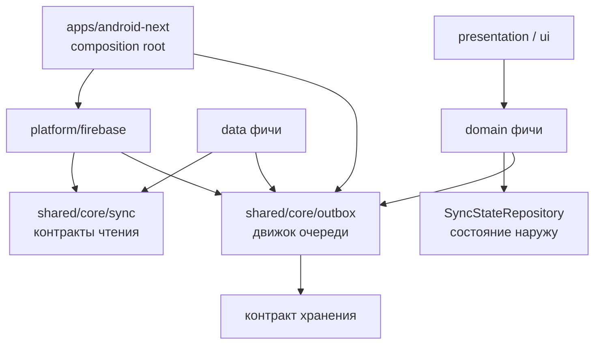
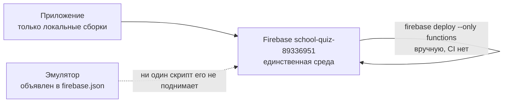

# Architecture Spine — Синхронизация приложения: клиент и сервер

## Design Paradigm

Слои проекта наследуются без изменений: `domain` — чистый Kotlin, `data` — Room и Firebase-адаптеры, `presentation` — Decompose-компоненты, `ui` — Compose, `core` — общие контракты, `platform` — адаптеры SDK.

Что эта работа добавляет — **разделение синхронизации на два направления с разной механикой и разными отказами**. Сегодня они перепутаны: чтение работает по журналу, запись разбросана по трём несовместимым очередям и восьми прямым вызовам.

| | Чтение с сервера | Запись на сервер |
| --- | --- | --- |
| Механизм | журнал `sync_changes` + курсор | одна очередь отложенных мутаций |
| Кто инициирует | каденция, push, ручной запуск | действие игрока |
| Единица | тип + id изменившейся сущности | мутация с `mutationId` |
| Идемпотентность | курсор двигается после применения | ключ `mutationId`, проверяется сервером |
| Отказ | повтор с того же курсора | повтор, затем карантин |
| Что нельзя | тянуть весь набор одним запросом | оптимистично менять то, что вычисляет сервер |

Направления не смешиваются. Мутация никогда не двигает курсор чтения; журнал никогда не несёт результат мутации. Push — повод сходить за данными обычным путём, а не источник истины.

**Ключ идемпотентности рождается вместе с намерением игрока, а не вместе с записью очереди** (AD-2). Синхронный путь тоже имеет неопределённый исход — потерянный ответ выглядит как отсутствие сети, — поэтому он защищён тем же ключом.

## Invariants & Rules



Стрелка означает «зависит от». Из `shared/core/outbox` стрелок не выходит ни одной — он не зависит ни от одной фичи и ни от `shared/core/sync`, и это и есть причина, по которой он отдельный модуль (AD-7).

### AD-1 — Сервер получает ключ идемпотентности `[ADOPTED]`

- **Binds:** CAP-2, CAP-3, все мутации
- **Prevents:** двойное применение при повторной доставке. Проверка повтора сегодня есть у двух мутаций из десяти и держится на doc-id, который выбирает клиент (`attemptId`, `ratingId`), плюс естественная идемпотентность `unlockLesson` по набору `lessonUnlocks`. Остальным опереться не на что, а doc-id не годится для действий без естественного уникального ключа
- **Rule:** каждая мутация несёт `mutationId`. Сервер хранит выполненные `mutationId` и на повтор возвращает сохранённый результат, не выполняя заново. **Запись выполненного `mutationId` и эффект операции фиксируются одной транзакцией.** Где эффект в одну транзакцию не умещается, `mutationId` резервируется до эффекта, и повтор по зарезервированному, но не завершённому id никогда не считается выполненным — он ждёт или отвергается, но не выполняет операцию второй раз. **Срок хранения выполненного `mutationId` строго больше предельного возраста записи очереди** — правило выборки, снимающее такую запись, живёт в AD-22, а само число общее для клиента и сервера, а не серверная настройка ретеншена.

### AD-2 — `mutationId` рождается вместе с намерением и идентифицирует неизменяемое содержимое `[ADOPTED]`

- **Binds:** CAP-2, CAP-3
- **Prevents:** два разных отказа сразу — появление второго ключа при повторной отправке той же записи, и тихую подмену содержимого под уже выданным ключом
- **Rule:** `mutationId` присваивается один раз, в момент, когда игрок совершил действие, и не меняется ни при одной попытке. Синхронная мутация (AD-3) получает его так же — иначе ветвь `Неизвестно` из AD-15 повторяет незащищённый вызов. **Ключ идентифицирует содержимое: изменение `payload` или `expected_version` — это новая мутация с новым id, а прежняя запись очереди снимается.** Ключ синхронной мутации переживает смерть процесса и живёт в той же таблице AD-5 со `state = СИНХРОННАЯ`, которую движок не выбирает никогда. При старте с оставшейся такой записью фича сначала спрашивает сервер об этом ключе и только потом снова предлагает действие: потерянный ответ неотличим от неудачи, и повторное нажатие без этого вопроса списало бы второй раз.

### AD-3 — Синхронно то, что зависит от состояния, которого у клиента нет `[ADOPTED]`

- **Binds:** CAP-2
- **Prevents:** отложенную покупку, показывающую цену, которой не будет: цена заряда зависит от текущего числа зарядов, цена ника — от реестра, лот может уйти другому покупателю
- **Rule:** критерий — **источник входных данных, а не место вычисления**. Мутация синхронна, если её результат зависит от состояния, которого у клиента нет: баланс, реестр ников, чужая покупка лота. Мутация откладывается, если результат детерминированно выводится из синхронизированного контента. Синхронны: покупка заряда, покупка и смена ника, покупка лота, покупка логотипа. Отложены: прохождение урока, оценка квеста, разблокировка урока, действие ревьюера, перенос квеста на полку, заявка квеста на арену. **Следствие:** формула цены разблокировки урока (сегодня она живёт только на сервере, `functions/lesson-unlocks.js`, а поле `unlockPriceNolics` на клиенте не присваивается нигде) переезжает в общий `shared/core` — иначе очередь не может показать цену до отправки. Без сети синхронное действие недоступно и объяснено словами: не спиннером и не очередью.

### AD-4 — Отправленная запись очереди удаляется `[ADOPTED]`

- **Binds:** CAP-2, CAP-3
- **Prevents:** сосуществование двух несовместимых форм «отправлено» — сегодня `quest_rating_outbox` ставит надгробие `sent_at_ms`, а `quest_arena_submission_outbox` удаляет запись
- **Rule:** очередь — это очередь, не архив. Побеждает форма DELETE-on-sent; обе существующие таблицы приводятся к ней. История остаётся на сервере.

### AD-5 — Одна таблица отложенных действий на всё `[ADOPTED]`

- **Binds:** CAP-2, CAP-3, CAP-5, CAP-6
- **Prevents:** миграцию схемы на каждый новый тип действия и расползание движка повторов по таблицам
- **Rule:** одна таблица: `id`, `mutation_id`, `owner_uid`, `operation`, `payload` строкой, `entity_ref` (String?, ссылка на сущность для AD-14 — непрозрачна для ядра), `expected_version` (Long?, для AD-24), **`state`**, `attempt_count`, `next_retry_at_ms`, `last_error`, `created_at_ms`. Новый тип действия не требует правки схемы. Вариант «таблица на тип» отвергнут: типов будет много, а история миграций в проекте недостоверна.

  **`state` — закрытый набор из пяти значений**, и он единственный источник ответа «что с этой записью»: `ЖДЁТ` (в выборке), `ЖДЁТ_ПРЕДУСЛОВИЯ` (в выборке, AD-27), `КОНФЛИКТ` (вне выборки, ждёт решения игрока — AD-24), `КАРАНТИН` (вне выборки, терминальное — AD-22), `СИНХРОННАЯ` (вне выборки; хранит только ключ синхронной мутации — AD-2). Кодировать состояние через `next_retry_at_ms = MAX` или через переполнение `attempt_count` запрещено: оба способа сливают разные состояния в один счётчик AD-14.

  **`operation` и `entity_ref` живут в пространстве имён владеющей фичи** и записываются как `<фича>.<имя>` (`lesson.UNLOCK`, `review.SUBMIT`). Реестр обработчиков отвергает регистрацию занятого `operation` при старте, а не молча перезаписывает: ядро не разбирает `payload` (AD-7) и подмену обработчика заметить не сможет.

### AD-6 — Единственный транспорт отложенной мутации — один callable-приёмник `[ADOPTED]`

- **Binds:** CAP-2
- **Prevents:** обход проверки `mutationId` — сегодня `QuestArenaSubmissionSync` пишет в Firestore напрямую через `.set()`, а `LessonResultSync` идёт через callable
- **Rule:** прямая запись в Firestore из очереди запрещена. Проверить `mutationId` можно только там, где выполняется код.

### AD-7 — Движок очереди живёт в новом модуле `shared/core/outbox` `[ADOPTED]`

- **Binds:** CAP-2, CAP-3, CAP-5
- **Prevents:** наследование движком веса `shared/core/sync`, который уже тянет domain-репозитории шести фич через `CatalogSyncListOrchestrator`
- **Rule:** `shared/core/outbox` содержит только Kotlin и контракты хранения. Он не зависит ни от одной фичи и ни от `shared/core/sync`. Ядро **никогда** не разбирает `payload` и не трогает таблицы фич.

### AD-8 — Смена аккаунта: слив до переключения, судьба остатка названа словом `[ADOPTED]`

- **Binds:** CAP-5
- **Prevents:** вечный отказ сервера записям с прежним `uid` и молчаливое расхождение «удалить или сохранить». `FirebaseGoogleSignInRepository` делает `signInWithCredential`, а не `link`, и возвращает `GoogleLinkOutcome.SWITCHED`; единственный обработчик сегодня — тост
- **Rule:** **точка слива — до вызова `signInWithCredential`**, а не после: после него прежнего `uid` уже нет. `SWITCHED`, полученный без слива, ведёт к тому же пути с предупреждением. Если слить не удалось или в карантине что-то осталось, игрок предупреждается явно, и **предупреждение и есть согласие: записи, не принадлежащие новому `uid`, удаляются в момент смены**. Курсоры вида `private_quests:{uid}` и `review_assignments:{uid}` сбрасываются; курсоры публичного контента переживают смену, потому что контент от аккаунта не зависит. Локальные строки прежнего владельца (приватные квесты, задания на ревью) удаляются вместе с его курсорами.

### AD-9 — Один источник времени на весь sync `[ADOPTED]`

- **Binds:** все
- **Prevents:** расхождение курсоров и времён следующей попытки между тремя легальными источниками времени, сосуществующими в коде: лямбда `nowMs`, `kotlinx.Clock`, `QuestAuthoringTimestampProvider`
- **Rule:** доменный контракт времени в `core`, инжектится. Прямые вызовы `Clock.System.now()` и `System.currentTimeMillis()` в `core/sync`, `core/outbox` и их адаптерах запрещены.

### AD-10 — Регистрация в Koin разнесена по владению `[ADOPTED]`

- **Binds:** все
- **Prevents:** дублирующие биндинги — сегодня sync-классы регистрируются в трёх местах: app-модуль, `commonMain` фичи, `androidMain` фичи (нарушение инварианта 5)
- **Rule:** движок очереди и её таблица регистрируются в composition root. Обработчик типа мутации — в модуле своей фичи. Одна production-привязка на тип.

### AD-11 — Журнал: документ на узел, id без времени, запись обязательна `[ADOPTED]`

- **Binds:** CAP-8
- **Prevents:** неограниченный рост журнала, изменение, которого клиент не увидит никогда, и потерю узла, читаемого из нескольких журналов
- **Rule:** три инварианта, общие для всех четырёх журналов. **(1) Один документ на узел, и id документа не содержит времени** — сид-скрипты подчиняются тому же правилу: сегодня они формируют id как `{changedAtMs}-{type}-{id}` и потому растят коллекцию неограниченно. **(2) Всякое изменение узла на сервере сопровождается записью в журнал — в каждый журнал, откуда этот узел читают**; квест живёт узлом в `private/{uid}/…`, `catalogs/{c}/…` и `admin/review/…`, и принадлежность фиксируется явно, а не выводится. **(3) Поле `id` в теле записи — это ключ для `refreshByIds`, а не id документа журнала.** Тело — `{type, id, changedAtMs}`; конкретная схема id документа остаётся за журналом, они уже разделены путём. **Уже записанное приводится к инвариантам backfill-скриптом до того, как у читателя снимут защитный fallback** — сегодня сиды оставили в журналах append-лог с временем в id, а журнал ревью пишет тело без поля `type`. Снять fallback раньше приведения значит уронить читателя на первой же старой записи.

### AD-12 — `version` сущности пишет только сервер `[ADOPTED]`

- **Binds:** CAP-7
- **Prevents:** молчаливую перезапись чужих изменений: сегодня версию диктует клиент через `localRevision`, и параллельно существуют три способа её записи — клиентский, read-modify-write `+1` и `FieldValue.increment(1)`
- **Rule:** клиент перестаёт слать `localRevision`. Сервер инкрементирует `version`. Сам по себе инкремент конфликт не ловит — обнаружение живёт в AD-24.

### AD-13 — Порядок парных изменений — по совместимости, а не по слоям `[ADOPTED]`

- **Binds:** CAP-8, все парные клиент-серверные изменения
- **Prevents:** промежуточное состояние, ломающее работающий прод. Порядок «правила, сервер, клиент» безопасен только для послаблений; в объёме есть и ужесточение — AD-6 запрещает прямую запись очереди в Firestore, которую правила сегодня разрешают
- **Rule:** каждый шаг обязан быть работоспособен и с предыдущим, и со следующим состоянием остальных частей. **Послабление правил идёт первым, ужесточение — последним**, после того как клиент перестал пользоваться старым путём. Частный случай `contentsVersion`: сначала `firestore.rules` перестают требовать `contentsVersion == 0` при create, затем сервер прекращает писать поле, затем оно уходит с клиента. `getLocalContentsVersion` реализован в шести местах и ни разу не вызывается из production-кода — удаляется вместе с полем.

### AD-14 — Состояние синхронизации выходит наружу отдельным репозиторием `[ADOPTED]`

- **Binds:** CAP-6
- **Prevents:** невидимость синхронизации: сегодня наружу не выходит ничего, кроме `Log.w`
- **Rule:** репозиторий отдаёт `Flow` с временем последнего успеха, последней ошибкой и числами **по каждому значению `state` из AD-5 отдельно** — ожидающие, ждущие предусловия, конфликтные, карантинные. Одно число «ожидает» на все состояния сразу означало бы у разных фич разное при одинаковой цифре на экране. Auth-scoped по инварианту 8: пересоздаётся при смене аккаунта, `emptyFlow()` для null `uid` запрещён. **Пометка конкретной сущности** («этот результат ещё не отправлен») отвечается через `entity_ref` из AD-5: фича спрашивает «есть ли неотправленное для этой ссылки», не заставляя ядро разбирать `payload` (AD-7).

### AD-15 — Ошибки различаются по типу, сеть детектируется `[ADOPTED]`

- **Binds:** CAP-2, CAP-3, CAP-6
- **Prevents:** решение о повторе, принимаемое по строке сообщения — сегодня отсутствие сети и «не хватает золота» доходят до UI одинаково, детектора сети нет вообще (ноль совпадений `ConnectivityManager`/`NetworkMonitor`/`isOnline`), а `FirebaseFunctions` без `setTimeout` держит спиннер 70 секунд
- **Rule:** ошибка мапится в доменный тип из пяти ветвей: `НетСети` / `ПредусловиеНеВыполнено` / `Отказ(причина)` / `КонфликтВерсии` / `Неизвестно`. Повтор назначается для `НетСети`, `ПредусловиеНеВыполнено` и `Неизвестно`; `Отказ` переводит запись в `КАРАНТИН` без повторов; `КонфликтВерсии` переводит в `КОНФЛИКТ` и обрабатывается по AD-24. Синхронная мутация при `НетСети` не показывает спиннер.

### AD-16 — ~~Локальная база пересоздаётся одной чистой схемой~~ — ОТМЕНЁН 2026-09-01

**Отменён реальностью, а не спором.** Пока эпик планировался, база пошла настоящими миграциями и дошла до версии 5 с экспортированными схемами `1..5.json`. Это строже того, что разрешал AD-16, и лучше: недостоверная история миграций перестала быть недостоверной без единой потерянной строки. Выполнять пересоздание сейчас означало бы стереть базу и отменить уже сделанные миграции.

Живой остаток решения переходит в AD-17: снятие колонок `contentsVersion` с пяти Room-сущностей и сведение трёх очередей к одной делаются **своими миграциями**, каждая со своим тестом. Разрешение на пересоздание снято; NFR11 читается как «пересоздание запрещено», а не «допустимо один раз».

Исходная формулировка сохранена ниже как след решения.

### AD-16 (исходная формулировка, недействительна)

- **Binds:** CAP-2, CAP-8
- **Prevents:** цепочку миграций поверх недостоверной истории (Room версии 3, 23 entity, `1.json` идентична `2.json` вплоть до `identityHash`, ни одна миграция не покрыта тестом) — и одновременно потерю того, чего нет на сервере
- **Rule:** очередь, удаление `contentsVersion` и починка фиктивной истории делаются разом, одной чистой схемой. Основание — живых установок нет, подтверждено владельцем; это **явная отмена** ограничения `SPEC-sync` про миграции, и она истекает в момент первой публикации. **Граница:** пересоздание допустимо только при пустой очереди и опубликованных черновиках. Данные без серверного двойника — неопубликованные черновики квестов, расписание повторов, история ответов — либо доезжают до сервера до пересоздания, либо их потеря названа явно и принята.

### AD-17 — С момента чистой схемы миграции обязательны и покрыты тестом `[ADOPTED]`

- **Binds:** CAP-2, CAP-8
- **Prevents:** повторение той же недостоверной истории после того, как AD-16 её обнулит
- **Rule:** каждая последующая миграция сопровождается тестом `runMigrationsAndValidate` — сегодня этот вызов не встречается в репозитории ни разу. `fallbackToDestructiveMigration` запрещён.

### AD-18 — Серверные данные не удаляются `[ADOPTED]`

- **Binds:** все
- **Prevents:** перенос логики AD-16 на сервер: пересоздание коллекции уничтожило бы курсы, вопросы и профили, которые существуют не только у владельца
- **Rule:** изменение формы серверных данных делается backfill-скриптом. Прецеденты: `scripts/backfill-catalogs.js`, `scripts/backfill-sync-changes.js`. **Запрет касается содержательных коллекций** — курсов, вопросов, профилей, событий. Журнал изменений содержательной коллекцией не является: он производный, и приведение его к инвариантам AD-11 может удалять лишние документы.

### AD-19 — Обратная совместимость клиента не поддерживается `[ADOPTED]`

- **Binds:** все
- **Prevents:** постройку механизма минимальной версии, которого нет ни в каком виде — нет Remote Config, сервер не знает версию клиента, клиент не шлёт `schemaVersion`
- **Rule:** сервер не принимает старый формат. Основание то же, что у AD-16, и истекает вместе с ним.

### AD-20 — Push несёт повод, а не данные `[ADOPTED]`

- **Binds:** CAP-10
- **Prevents:** превращение полезной нагрузки уведомления в источник истины — второй путь применения изменений, расходящийся с основным
- **Rule:** токен устройства живёт в `users/{uid}/devices/{token}`, пишется клиентом, читается сервером. Получив push, приложение синхронизируется обычным путём. **Требует правки `firestore.rules`:** сегодня `match /users/{userId}` объявлен без `{document=**}`, подколлекции не сопоставлены и catch-all в файле нет — под текущими правилами клиент записать токен не может. Зависимость `firebase-messaging-ktx` уже объявлена в каталоге версий и берёт версию из BOM.

### AD-21 — Push делается после первой волны фиксов `[ADOPTED]`

- **Binds:** CAP-10
- **Prevents:** попытку строить доставку событий поверх ещё не починенной очереди
- **Rule:** место под push закладывается сразу (AD-20), реализация идёт последней. Ни один другой AD не зависит от наличия push.

### AD-22 — Карантин вместо вечного повтора, и отказ одной записи не роняет остальные

- **Binds:** CAP-3
- **Prevents:** цикл, падающий на первой отвергнутой записи — сегодня отказ прохождения глушит отправку всех оценок навсегда, потому что исключение уходит наверх до их обработки
- **Rule:** выборка берёт записи, у которых `state` ∈ {`ЖДЁТ`, `ЖДЁТ_ПРЕДУСЛОВИЯ`}, `next_retry_at_ms <= now` и **возраст меньше предельного** — по времени создания. Отказ одной записи увеличивает `attempt_count`, отодвигает `next_retry_at_ms` по экспоненте и **не прерывает** обработку остальных: цикл не выпускает исключение наверх. Запись переходит в `КАРАНТИН` по одному из трёх поводов: превышен порог отказов, получен `Отказ` (AD-15), либо **возраст превысил предельный**. Порог отказов и кривая — параметры (Deferred). **Предельный возраст — не параметр клиента:** он общий для клиента и сервера и строго меньше срока хранения выполненных `mutationId` (AD-1). Запись, пережившая этот срок и всё же ушедшая, была бы для сервера новой операцией — ровно то двойное применение, ради которого AD-1 существует.

### AD-23 — Локальное изменение и запись в очередь — одна транзакция

- **Binds:** CAP-2
- **Prevents:** невидимую потерю: действие показано игроку как сделанное и никогда не доедет. В коде уже два разных ответа — `LessonAttemptDao` идёт через `@Transaction`, а оценка квеста ставится отдельным вызовом
- **Rule:** изменение локального состояния и вставка записи очереди фиксируются одной транзакцией Room. Прецедент — `LessonAttemptDao.saveAttemptWithAnswers`; расходящееся место — `LessonRatingRepositoryImpl` — приводится к нему.

### AD-24 — Конфликт версий — отдельная ветвь, а не отказ

- **Binds:** CAP-7
- **Prevents:** серверный last-write-wins с инкрементом, при котором обещание AD-12 не выполняется: сама по себе серверная нумерация конфликт не ловит
- **Rule:** мутация, изменяющая версионируемую сущность, несёт `expected_version`. Сервер отклоняет устаревшую отдельным кодом, не применяя её. Запись переходит в `state = КОНФЛИКТ` (AD-5): она вне выборки, вслепую не повторяется и в карантин не уходит. Клиент принимает серверную версию и поднимает решение наверх. **Разрешение конфликта порождает новую мутацию с новым `mutationId`** (AD-2), а прежняя запись снимается.

### AD-25 — Серверно-защищённые поля локально не меняются

- **Binds:** CAP-2
- **Prevents:** оптимистичную локальную запись полки квеста, квалификации или сертификата — к ней подталкивает AD-23, если читать его как общее правило
- **Rule:** квалификации, сертификаты, полки квестов и всякое поле, которое пишет только сервер, локально не изменяются ни при каких условиях. AD-23 говорит о состоянии, которым владеет клиент; для server-owned полей локальная половина транзакции пуста — в очередь кладётся только намерение, а поле меняется, когда его пришлёт сервер.

### AD-26 — Удаление выражается отсутствием, а не флагом

- **Binds:** CAP-8
- **Prevents:** четвёртый способ удаления, изобретённый заново, потому что фактический контракт живёт только в коде
- **Rule:** способов ровно три и новых не появляется: id, не вернувшийся в ответе `refreshByIds`, удаляется локально; пустой `visibleOn` означает «убрать с устройства»; `archived` скрывает узел. Поле `deleted` не вводится, retention tombstone неприменим. Удаление на сервере обязано сопровождаться записью в журнал (AD-11).

### AD-27 — Очередь не даёт гарантий порядка; предусловие проверяет сервер

- **Binds:** CAP-2, CAP-3
- **Prevents:** молчаливую поломку причинной цепочки: AD-22 разрешает пропустить упавшую запись, и «разблокировал урок, затем прошёл его» может уехать в обратном порядке
- **Rule:** очередь не обещает порядок, и выражения зависимости между записями в ней не существует. Предусловие проверяет сервер, а не клиент. **Сервер обязан отличать «ещё нет» от «нет»:** мутация, чьё предусловие удовлетворяется другой мутацией, ещё летящей из той же очереди, получает ветвь `ПредусловиеНеВыполнено` — она повторяется, а не отвергается. Пример, ради которого это правило существует: игрок в авиарежиме разблокирует урок и проходит его; прохождение может приехать первым, и отказ по неоплаченной разблокировке уничтожил бы прохождение. Ветвь снимается сама, когда предусловие доедет, либо становится `Отказ` по истечении срока из AD-22.

### AD-28 — Карантин терминален, и его последствие принадлежит фиче

- **Binds:** CAP-3, CAP-6
- **Prevents:** локальное состояние, навсегда разошедшееся с сервером: движок уводит запись в карантин, а по AD-7 не имеет права трогать таблицы фичи — и никто не приводит их в соответствие
- **Rule:** переход в `КАРАНТИН` — терминальное состояние мутации. Движок **сообщает** о нём обработчику владеющей фичи; локальные таблицы правит фича, а не ядро (AD-7). **Последствие одно и то же для всех мутаций: локальное изменение откатывается**, и откат виден игроку через AD-14 — молчаливого расхождения нет ни в одну сторону. Вариант «оставить и пометить» отвергнут владельцем: локальное состояние всегда приводится к серверному.

  **Риск принят явно.** Игрок, прошедший урок в самолёте, теряет прохождение, если сервер отверг его насовсем. Смягчение — система резервных копий, которой сегодня не существует; до её появления откат необратим. Это решение владельца, а не следствие архитектуры.

  **На `ЖДЁТ_ПРЕДУСЛОВИЯ` и `КОНФЛИКТ` правило не распространяется** — они не терминальны, и откатывать по ним нечего.

### AD-29 — Серверный приёмник — отдельный тестируемый модуль

- **Binds:** CAP-2
- **Prevents:** рост `functions/index.js` (4142 строки, ни одного `module.exports`) и приёмник, который невозможно покрыть тестом
- **Rule:** приёмник живёт в `functions/mutation-queue.js` с `module.exports`, покрыт тестом и включён и в `npm test`, и в `npm run lint` — сегодня из lint выпали два файла из одиннадцати. Тесты прогоняются до деплоя.

### AD-30 — Принудительный ресинк существует как операция

- **Binds:** CAP-4
- **Prevents:** разошедшиеся курсор и базу, которые сегодня чинятся только переустановкой: `setCursor` монотонен, API сброса нет, единственный форс — хардкод для каталога `courses`
- **Rule:** существует явная операция полного ресинка: она обнуляет курсоры чтения и перечитывает журналы. **Ресинк лечит только сторону чтения.** Он переписывает то, чем владеет сервер, и не трогает ни записи очереди, ни локальные эффекты, которые они уже применили по AD-23: эти эффекты уже верны локально и переигрывать их не нужно. Локальное состояние, разошедшееся из-за карантинной записи, — не забота ресинка, а последствие карантина (AD-28). Запускается игроком из настроек и приложением при обнаружении расхождения. Курсор двигается только после успешного применения.

### AD-31 — Выборка изменений ограничена и продолжаема

- **Binds:** CAP-4, CAP-8
- **Prevents:** один запрос на весь изменившийся набор — сегодня `fetchChangedSince` не ставит `limit` и не пагинируется, и полная перепубликация большого курса приходит целиком
- **Rule:** выборка ограничена размером страницы и продолжаема. Обрыв на середине страницы не двигает курсор: следующий проход перечитывает ту же страницу. **Курсор — пара `(changedAtMs, docId)`, во всех четырёх журналах одинаково**; сравнение лексикографическое по паре. Строгое `>` по одному лишь времени теряет две записи, записанные в одну миллисекунду. Чтение с перекрытием окна рассмотрено и отвергнуто: оно не даёт гарантии, а лишь уменьшает вероятность, и требует помнить ширину окна отдельно от курсора.

## Consistency Conventions

| Concern | Convention |
| --- | --- |
| Именование | `operation` — `<фича>.<ИМЯ>` (`lesson.UNLOCK`), уникальность проверяется реестром при старте (AD-5); `entity_ref` — в том же пространстве имён фичи; ключ курсора — `{область}:{id}` (`catalog_sync:{catalogId}`), форма уже в проде; классы очереди — `OutboxEntry`, `OutboxDao`, `OutboxEngine`, `<Feature>MutationHandler` |
| Данные и форматы | `mutationId` — UUID, генерируется клиентом; `payload` — строка JSON через kotlinx-serialization, версия формата внутри payload; **значение курсора — пара `(changedAtMs, docId)` во всех журналах одинаково** (AD-31); тело журнала — `{type, id, changedAtMs}`; время — миллисекунды эпохи из единственного источника (AD-9) |
| Состояние и сквозное | Мутация меняет серверное состояние только через callable (AD-6); ошибка — доменный тип, не текст (AD-15); состояние синхронизации — auth-scoped `Flow` (AD-14); Koin — по владению (AD-10); ядро не разбирает `payload` и не трогает таблицы фич (AD-7) |
| Тесты | фейки, не моки; без Turbine; `runMigrationsAndValidate` обязателен для каждой миграции (AD-17); гейт — `./gradlew ciCheck --no-configuration-cache`, на сервере `npm test` в `functions/` |

## Stack

Наследуется целиком; новый модуль `shared/core/outbox` — чистый Kotlin на уже закреплённых версиях, сторонних зависимостей не вводит. Версии сверены с `gradle/libs.versions.toml` и `functions/package.json` на 2026-08-31, не по памяти.

| Name | Version |
| --- | --- |
| Kotlin | 2.3.10 |
| AGP | 8.11.0 |
| KSP | 2.3.7 |
| kotlinx-coroutines | 1.10.2 |
| kotlinx-serialization | 1.7.3 |
| kotlinx-datetime | 0.5.0 |
| Decompose | 3.1.0 |
| Essenty | 2.1.0 |
| Koin | 3.5.6 |
| androidx.room | 2.7.0 |
| androidx.sqlite | 2.5.0 |
| androidx.work | 2.9.1 |
| Compose BOM | 2024.09.02 |
| Firebase BOM (Android) | 33.2.0 |
| firebase-admin (Node) | ^13.8.0 |
| firebase-functions (Node) | ^7.2.5 |
| Node (Cloud Functions) | 22 |

## Structural Seed

Новых мест два. Остальное — существующие, названные явно, чтобы не появились вторые.

```text
shared/core/outbox/                  # НОВЫЙ. Только Kotlin и контракты хранения (AD-7)
  OutboxEntry.kt                     # запись очереди (AD-5)
  OutboxEngine.kt                    # выборка, повторы, карантин (AD-22, AD-28)
  OutboxTransport.kt                 # порт: одна отправка (AD-6)
  OutboxHandlerRegistry.kt           # фичи регистрируют обработчики (AD-7, AD-28)
  SyncStatus.kt                      # наблюдаемое состояние (AD-14)

functions/mutation-queue.js          # НОВЫЙ. Приёмник + хранение mutationId (AD-1, AD-29)

shared/core/sync/                    # существующий. Журнал, курсоры, каденции, ресинк (AD-30, AD-31)
shared/core/persistence/             # существующий. Таблица очереди и курсоры
platform/firebase/                   # существующий. Реализация OutboxTransport
platform/android-services/           # существующий. WorkManager
apps/android-next/di/                # существующий. Регистрация (AD-10)
firestore.rules                      # существующий. AD-13, AD-20
```

Операционный контур фиксируется скромным, а не умалчивается:



Отдельной staging-среды нет, CI для функций нет, деплой ручной. Принято как есть; AD-13 задаёт порядок шагов, AD-29 — что прогоняется до деплоя. CI и staging — в Deferred.

## Capability → Architecture Map

| Capability | Живёт в | Управляется |
| --- | --- | --- |
| CAP-1 — документация соответствует коду | `docs/architecture/0004-sync-contract.md` | закрыта 2026-08-31, не требует AD |
| CAP-2 — офлайн-действие доезжает | `shared/core/outbox`, `functions/mutation-queue.js` | AD-1, AD-2, AD-3, AD-4, AD-5, AD-6, AD-7, AD-23, AD-25, AD-27, AD-29 |
| CAP-3 — одна плохая запись не держит очередь | `shared/core/outbox` | AD-22, AD-28, AD-15, AD-4 |
| CAP-4 — принудительный полный ресинк | `shared/core/sync` | AD-30, AD-31 |
| CAP-5 — запись принадлежит своему аккаунту | `shared/core/outbox`, auth | AD-5, AD-8 |
| CAP-6 — игрок видит состояние синхронизации | `SyncStateRepository`, шторка, настройки | AD-14, AD-15, AD-28 |
| CAP-7 — версию назначает сервер | `functions/`, публикация | AD-12, AD-24 |
| CAP-8 — один механизм обнаружения изменений | журнал, сид-скрипты, правила | AD-11, AD-13, AD-16, AD-17, AD-26, AD-31 |
| CAP-9 — каденция запускает то, что называет | `platform/android-services/**/sync` | не AD; дефект планировщика, инварианта не требует |
| CAP-10 — критическое событие доходит push-ом | `users/{uid}/devices/{token}`, `firestore.rules` | AD-20, AD-21 |

## Deferred

1. **Оффлайн-мультиаккаунт** — несколько игроков на одном устройстве с раздельными очередями. AD-5 закладывает `owner_uid`, поэтому позже добавляется без ломки схемы.
2. ~~**Порог карантина и кривая backoff**~~ — **решено владельцем 2026-09-01:** порог 5 отказов, кривая 1с → 2с → 4с → … с потолком в 1 час.
3. ~~**Два срока**~~ — **решено владельцем 2026-09-01:** предельный возраст записи очереди 7 дней, срок хранения выполненных `mutationId` 30 дней. Неравенство из AD-1 соблюдено, оба — общий параметр клиента и сервера.

   Остальные числа, решённые тем же ответом: таймаут callable 20 секунд (было 70 по умолчанию SDK), размер страницы выборки изменений 200 записей, минимальный интервал между прогонами очереди 30 секунд.
4. **Какие события шлют push и что игрок видит в уведомлении** — продуктовый вопрос; AD-20 фиксирует форму, не содержание.
5. **Где именно игрок видит состояние синхронизации** — шторка, настройки, экран результата. AD-14 отдаёт данные, размещение решает UX.
6. **Точка стыка с server-authoritative сессией экзамена** — что перестаёт синхронизироваться, когда ответы на сложные вопросы уходят с устройства. Ждёт эпиков E2/E4 из `spec-theme-exams`.
7. **CI для `functions` и отдельная staging-среда** — сегодня их нет, деплой ручной. AD-29 требует лишь прогона тестов до деплоя.
8. **`maxInstances` приёмника очереди** — станет самой горячей функцией, а общий `FUNCTION_OPTIONS` даёт один инстанс. Требует подтверждённой квоты, а не догадки.
9. **Серверная наблюдаемость** — дашборды и алерты. Отдельная работа.
10. **Ретеншен серверных `result_events_*`** — коллекции задуманы write-only и растут неограниченно. Очереди не касается (AD-4), но вопрос реален.
11. **Pull при возврате из фона** — третий канал доставки из ADR-0004, которого не существует. Не вводится здесь; push (AD-20) частично закрывает ту же потребность.
12. **Firestore listeners как общий канал** — две точечные подписки остаются как есть.
13. **Реализация под iOS** — контракты уже в `commonMain`, платформенная часть только Android.
14. **Protobuf вместо JSON** для `payload` — не рассматривается на этом горизонте.
