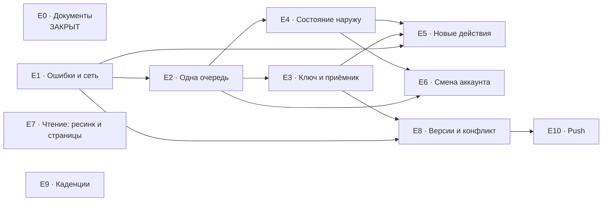

# Разбивка работы

Как работа делится, в каком порядке и без чего каждый кусок можно выкатить.

Выведено из `ARCHITECTURE-SPINE.md`. Номера эпиков стабильны; ссылки на `AD` и `CAP` — контракт, против которого эпик строится.

## Порядок и зависимости

`E7` и `E9` не висят ни на чём — см. их строки.

## Эпики

### E0 — Документы приведены в соответствие с кодом

**Закрыт 2026-08-31.** `docs/architecture/0004-sync-contract.md` переписан: каждое решение помечено `[РАБОТАЕТ] / [ЧАСТИЧНО] / [РЕШЕНО]`, Amendment про каскад отозван, три неточности про легаси исправлены. `README` фичи `home-and-my-quests` помечен superseded в части sync, `PROJECT-CONTEXT.md` очищен от мёртвой ссылки.

**Закрывает:** CAP-1.

---

### E1 — Ошибки различимы, сеть детектируется

**Управляется:** AD-15 · **Зависит от:** ничего · **Служит:** всему остальному

Самый маленький эпик и самый нужный первым. Сегодня отсутствие сети и «не хватает золота» доходят до UI одной строкой `error.message`, детектора сети в проекте нет вообще, а `FirebaseFunctions` без `setTimeout` держит спиннер семьдесят секунд.

Даёт доменный тип ошибки из пяти ветвей и детектор сети. Без него нельзя решить ни один вопрос «повторять или в карантин» — то есть E2 без него не строится.

**Готово, когда:** покупка без сети мгновенно объясняет, что нужен интернет, а не крутит спиннер; отказ сервера и отсутствие сети приходят в компонент разными типами.

---

### E2 — Одна очередь: чистая схема и движок

**Управляется:** AD-4, AD-5, AD-7, AD-9, AD-10, AD-16, AD-17, AD-22, AD-23, AD-28 · **Зависит от:** E1

Новый модуль `shared/core/outbox`, одна таблица вместо трёх, чистая схема Room взамен недостоверной истории, движок с экспоненциальным откладыванием, неломающийся цикл, транзакционность записи, передача последствия карантина владеющей фиче. Карантин здесь только по числу отказов и по устойчивому отказу сервера: карантин по возрасту требует парного серверного срока и живёт в E3.

Сюда же — единственное пересоздание схемы по AD-16, а вместе с ним послабление `firestore.rules` (снять требование `contentsVersion == 0` при создании квеста) и удаление клиентской колонки `contentsVersion`. Отдельной миграцией в E8 это делать нельзя: «пересоздаётся один раз» из AD-16 запрещает.

Две существующие очереди результатов переезжают на него, транспорт пока остаётся прежний — то есть эпик выкатывается без серверных изменений и уже чинит худший из живых дефектов: одна отвергнутая запись перестаёт навсегда глушить отправку оценок.

**Осторожно:** AD-16 разрешает пересоздать локальную базу, но только при пустой очереди и опубликованных черновиках. Неопубликованные черновики квестов, расписание повторов и история ответов серверного двойника не имеют.

**Готово, когда:** подложенная неотправляемая запись уходит в карантин, а соседние записи продолжают уезжать; сохранение результата и постановка в очередь либо происходят вместе, либо не происходят вовсе.

---

### E3 — Ключ идемпотентности и единый приёмник

**Управляется:** AD-1, AD-2, AD-6, AD-29 · **Зависит от:** E2

Здесь сидит главный риск всей работы. `mutationId` рождается вместе с намерением игрока, сервер хранит выполненные ключи и на повтор возвращает сохранённый результат вместо повторного выполнения. Запись ключа и эффект — одна транзакция; где не умещается, ключ резервируется до эффекта.

Серверная половина — `functions/mutation-queue.js` с `module.exports`, покрытый тестом и включённый в `npm test` и `npm run lint` (сегодня из lint выпали два файла из одиннадцати). Заявка квеста на арену переезжает с прямой записи в Firestore на callable — иначе ключ на ней не работает в принципе.

Здесь же рождаются две вещи, у которых нет клиентской половины без сервера: форма серверной пометки «предусловие ещё не доехало» и пара сроков — предельный возраст записи очереди и срок хранения выполненных ключей, связанные неравенством из NFR9. Вместе с парой приезжает карантин по возрасту.

**Готово, когда:** повторная доставка той же мутации не удваивает эффект; убитый посреди операции инстанс не приводит ни к двойному списанию, ни к потере; тест на это существует и гоняется до деплоя.

---

### E4 — Состояние синхронизации выходит наружу

**Управляется:** AD-14, AD-28 · **Зависит от:** E2

Поток с временем последнего успеха, числом ожидающих, числом в карантине и последней ошибкой. Пометка конкретной сущности через `entity_ref` — чтобы результат урока можно было показать как неотправленный, не заставляя ядро разбирать содержимое записи.

Без этого эпика предыдущие три невозможно проверить в бою: сегодня наружу не выходит ничего, кроме `Log.w`.

**Готово, когда:** игрок видит время последней синхронизации и число неотправленных; запись, ушедшая в карантин, видна, а не исчезает молча.

---

### E5 — Новые действия переезжают в очередь

**Управляется:** AD-3, AD-25, AD-27 · **Зависит от:** E1, E3, E4

То, ради чего всё затевалось. В очередь переезжают разблокировка урока, действие ревьюера, перенос квеста на полку, снятие лота с продажи. Формула цены разблокировки переезжает в `shared/core` — сегодня она живёт только на сервере, а поле `unlockPriceNolics` на клиенте не присваивается нигде, поэтому очередь не сможет показать цену до отправки.

Покупки остаются синхронными и получают честное объяснение вместо спиннера. Серверно-защищённые поля не меняются локально даже при постановке действия в очередь.

**Осторожно:** очередь не обещает порядок. Всякая переезжающая мутация обязана быть корректной при любом порядке доставки, а предусловие проверяет сервер.

**Готово, когда:** игрок в авиарежиме разблокирует урок и переносит квест на полку, включает сеть, и оба действия применяются без его участия и без удвоения.

---

### E6 — Смена аккаунта перестаёт терять данные

**Управляется:** AD-8 · **Зависит от:** E2, E4

Слив очереди до вызова `signInWithCredential`, а не после — после него прежнего `uid` уже нет. Явное предупреждение, если слить не удалось, и оно же согласие на удаление остатка. Сброс личных курсоров и локальных строк прежнего владельца.

Сегодня этот путь реален и обслужен всплывающей надписью: `FirebaseGoogleSignInRepository` делает `signInWithCredential`, а не привязку, и возвращает `SWITCHED`.

**Готово, когда:** смена аккаунта с непустой очередью либо сливает её, либо предупреждает словами; после смены ни одна запись прежнего владельца не уходит под новым.

---

### E7 — Чтение: принудительный ресинк и постраничная выборка

**Управляется:** AD-11, AD-26, AD-30, AD-31 · **Зависит от:** ничего структурно

Операция полного ресинка, обнуляющая курсоры чтения и не трогающая очередь записи. Постраничная выборка изменений вместо одного запроса на весь набор. Курсор как пара `(changedAtMs, docId)`. Приведение сид-скриптов к продовой схеме id — сегодня они формируют id из таймстемпа и растят коллекцию неограниченно.

Выкатывается в одиночку и чинит дефект, который сегодня лечится только переустановкой приложения.

**Готово, когда:** после полного ресинка база восстанавливается, даже если курсор был впереди всех записей журнала; повторный прогон сида не растит коллекцию.

---

### E8 — Версию назначает сервер, конфликт обнаруживается

**Управляется:** AD-12, AD-13, AD-24 · **Зависит от:** E1, E3

Клиент перестаёт слать `localRevision`, сервер инкрементирует `version`, мутация несёт `expected_version`, устаревшая отклоняется отдельным кодом. Конфликт — четвёртая ветвь ошибки, в карантин не уходит, а порождает новую мутацию с новым ключом.

Сюда же — последний шаг по `contentsVersion`: сервер прекращает писать поле. Правила и клиентская колонка уже сняты в E2, где происходит единственное пересоздание схемы; порядок AD-13 соблюдён, потому что послабление правил шло первым.

**Осторожно:** порядок «правила, сервер, клиент» верен для послаблений. Ужесточения — например запрет прямой записи очереди в Firestore из E3 — идут последними, после того как клиент перестал пользоваться старым путём.

**Готово, когда:** публикация с устаревшей версией отвергается, а не затирает чужие изменения; `contentsVersion` не пишется ни сервером, ни клиентом, и создание квеста работает.

---

### E9 — Каденция запускает то, что называет

**Управляется:** CAP-9 · **Зависит от:** ничего

Мелкий дефект планировщика, инварианта не требующий: сегодня `ON_LAUNCH` для профиля запускает полный контентный список вместо профильного воркера, а выбор `ON_LAUNCH` в пикере профиля не запускает ничего.

Выкатывается в одиночку в любой момент.

**Готово, когда:** профильная каденция ставит профильный воркер, и обе каденции реагируют на выбор одинаково.

---

### E10 — Push для критических событий

**Управляется:** AD-20, AD-21 · **Зависит от:** E8

Правка `firestore.rules` (сегодня подколлекции `users/{uid}/…` не сопоставлены, и клиент не может записать токен), подключение уже объявленной зависимости `firebase-messaging-ktx`, сервис приёма, коллекция токенов, серверная отправка.

Идёт последним по решению владельца. Ни один другой эпик от него не зависит.

**Готово, когда:** выданный сертификат доходит до устройства уведомлением при закрытом приложении, а приложение по этому поводу синхронизируется обычным путём.

## Что выкатывается в одиночку

| Эпик | В одиночку | Почему может пойти раньше |
| --- | --- | --- |
| E1 | да | маленький, ничего не ломает, нужен всем остальным |
| E7 | да | чинит дефект, лечимый сегодня только переустановкой |
| E9 | да | мелкий фикс планировщика, полчаса работы |
| E2 | да | чинит худший живой дефект ещё до серверных изменений |

## Шов

Разбивка проводит одну намеренную границу: **сначала запись, потом чтение.**

Живая потеря данных сидит на стороне записи — одна отвергнутая запись навсегда глушит отправку оценок, действия без сети теряются молча, смена аккаунта уносит очередь. Дефекты чтения (курсор без сброса, выборка без страниц) неприятны, но данные не теряют: они лечатся переустановкой, а не восстановлением из ниоткуда.

E7 стоит отдельной веткой именно поэтому: он не блокирует ничего и может идти параллельно любым руками, если они появятся.
