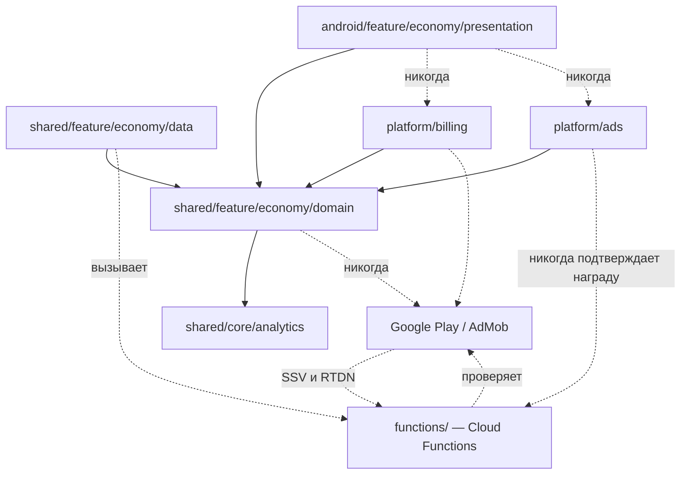
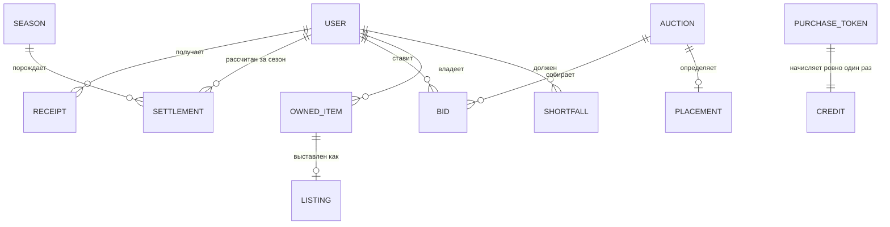

# Architecture Spine — Монетизация

Локальные решения нумеруются **ADM-n**. Унаследованные цитируются с префиксом источника —
`SYNC-AD-n` для спайна синхронизации, `CHG-CAP-n` для spec-charges. Без этого пять номеров в одном
документе означали бы две разные вещи каждый.

## Design Paradigm

Слоистая Clean Architecture наследуется без изменений. Поверх неё монетизация добавляет одну идею,
из которой следует всё остальное:

> **Клиент заявляет намерение. Сервер двигает деньги. Клиент узнаёт об этом из квитанции.**

Граница проходит по классу ресурса, и классов **три**, а не два — так их называет
`economy-constants.md`:

| Класс | Ресурсы | Правило |
| --- | --- | --- |
| Motivational | нолики, очки навыка, обычные заряды | Клиент считает, сервер сверяет. Офлайн разрешён |
| Промежуточный | коробки | Копятся офлайн, **открываются только онлайн** — открытие выдаёт монетарное |
| Monetary | золото, плазма, премиум, всё купленное за деньги | Только сервер. Офлайн операция отклоняется, а не откладывается |

## Inherited Invariants

| Унаследовано | Откуда | Что связывает здесь |
| --- | --- | --- |
| SYNC-AD-1 — сервер получает ключ идемпотентности | спайн синхронизации 2026-08-31 | Основание для ADM-7; ключ называется для каждой операции |
| SYNC-AD-2 — `mutationId` рождается с намерением и опознаёт неизменяемое содержимое | там же | Ключ для операций, где Play своего ключа не даёт: ставка, покупка лота, покупка премиума за золото |
| SYNC-AD-3 — синхронно то, что зависит от состояния, которого у клиента нет | там же | Все денежные операции синхронные |
| SYNC-AD-6 — один callable-приёмник отложенных мутаций | там же | Денежные операции **не** идут через него (ADM-5) |
| SYNC-AD-11 — журнал изменений: документ на узел, запись обязательна | там же | Канал, которым серверное начисление доезжает до клиента (ADM-3) |
| SYNC-AD-15 — ошибки различаются по типу, сеть детектируется | там же | Таксономия ошибок денежных операций расширяет её, а не заменяет |
| SYNC-AD-25 — серверно-защищённые поля локально не меняются | там же | Клиент никогда не прибавляет себе золото, даже получив квитанцию |
| CHG-CAP-4 / CHG-CAP-5 — серверная таблица констант | spec-charges | Цены в золоте, размеры паков, процент комиссии, ставки выплат |
| Классификация золота как monetary | spec-charges | Основание для правой колонки таблицы выше |
| Плазма — лестница `[1,2,3]`, шесть золота один раз | spec-charges | Разовый сток; регулярные — комиссия, премиум, ставки |

## Invariants & Rules



### ADM-1 — Комиссия берётся из цены и сгорает `[ADOPTED]`

- **Binds:** CAP-5
- **Prevents:** вторую ценовую договорённость рядом с работающей; печать монеты на каждой второй
  сделке от независимого округления двух половин.
- **Rule:** покупатель платит ровно цену лота. Комиссия удерживается из неё и **уничтожается** —
  счёта дома нет. Остаток от деления уходит продавцу, две половины складываются в цену точно.
  Ратифицирует `splitSalePrice`.

### ADM-2 — Ставка списывает золото немедленно

- **Binds:** CAP-11
- **Prevents:** победителя без денег к закрытию и каскад ко второй ставке.
- **Rule:** размещение ставки списывает золото в тот же момент, одной транзакцией со записью самой
  ставки. Повышение своей ставки — возврат прежней и списание новой в одной транзакции.

### ADM-3 — Квитанция, а не поручение; квитанций много

- **Binds:** CAP-2, CAP-10, CAP-12
- **Prevents:** двойное начисление legacy (клиент прибавлял себе и гасил поле); и потерю причины —
  одно вложенное поле `AddPoints` затирается следующим начислением, и игрок не узнаёт, за что
  получил.
- **Rule:** сервер сам двигает баланс, затем добавляет квитанцию **в коллекцию** под пользователем,
  а не в единственное поле профиля: суммы, трофей, человеческое сообщение и повод. Клиент их
  показывает и гасит помеченными как прочитанные. Доезжают квитанции журналом изменений
  (SYNC-AD-11). Потерянное гашение показывает сообщение дважды и не двигает ни монеты.

### ADM-4 — Одна полка на всё

- **Binds:** CAP-1, CAP-8
- **Prevents:** полку, предлагающую непродаваемое, и магазин, продающий непоказанное.
- **Rule:** `ShopItemId` — единственный перечень покупаемого; товары за деньги — его записи с
  `ShopCurrency.EXTERNAL`. `StoreProductId` остаётся только соответствием «запись полки → SKU».
  Полка и её доступность приходят с сервера; отображаемая цена реальных денег — строка из Play
  (ADM-11), и она не помещается в `ShopPrice` — носитель называется в domain один раз.

### ADM-5 — Денежная операция — собственный синхронный вызов

- **Binds:** CAP-1, CAP-5, CAP-6, CAP-11
- **Prevents:** покупку в офлайн-очереди, пока игрок ждёт золото, которое офлайн прийти не может.
- **Rule:** денежные операции — отдельные callable, не отложенные мутации через общий приёмник
  (SYNC-AD-6). Офлайн вызов отклоняется названной причиной. **Это не запрещает** досеттлер: при
  запуске клиент предъявляет непогашенные покупки Play заново — это тот же синхронный вызов, просто
  инициированный не тапом.

### ADM-6 — Порядок расчёта покупки нерушим

- **Binds:** CAP-6
- **Prevents:** начисление по непроверенному чеку; погашение покупки до начисления.
- **Rule:** строго `проверить у Play → начислить → подтвердить клиенту → погасить покупку`.
  Клиент гасит только после подтверждения сервера.

### ADM-7 — Всякое движение монетарного ресурса — одна транзакция с названным ключом

- **Binds:** CAP-2, CAP-3, CAP-5, CAP-6, CAP-10, CAP-11, CAP-12
- **Prevents:** повтор, начисляющий второй раз, — в любой операции, а не только в покупке.
- **Rule:** изменение баланса и запись, делающая операцию неповторимой, происходят в одной
  транзакции. Ключ назван поимённо:

  | Операция | Ключ |
  | --- | --- |
  | Покупка за деньги | `purchaseToken` |
  | Награда за рекламу | id транзакции из SSV-колбэка сети |
  | Открытие коробки | `mutationId` намерения |
  | Ставка, повышение, покупка лота, премиум за золото | `mutationId` намерения |
  | Возврат проигравшей ставки | пара (аукцион, ставка) |
  | Сезонная выплата | пара (пользователь, сезон) |
  | Разовая выплата за шесть рефералов | пользователь — она пожизненная, не сезонная |
  | Возврат и отзыв Play | id уведомления |

### ADM-8 — Премиум — срок, и база продления названа

- **Binds:** CAP-4
- **Prevents:** три честных прочтения «прибавить к остатку», одно из которых не даёт ничего тому,
  у кого премиум истёк год назад.
- **Rule:** премиум — отметка окончания, владелец — сервер. Любой путь прибавляет длительность к
  `max(сейчас, окончание)`. Ратифицирует `giftBoxRewardUpdate`. Денормализованный `hasPremium`
  вычисляется из отметки, никогда не хранится независимо.

### ADM-9 — Премиум не покупает преимущества

- **Binds:** CAP-4
- **Prevents:** четыре эпика порознь — коробки, заряды, лидерборд, спонсор — каждый добавляет свою
  плюшку, и вместе они делают лидерборд платным.
- **Rule:** эффект премиума либо личный и несравнимый с другими, либо сравнимый и нематериальный.
  Ни один не меняет счёт, позицию в рейтинге или скорость дохода.

### ADM-10 — Награду за рекламу подтверждает сеть серверу, а не устройство

- **Binds:** CAP-3, CAP-7
- **Prevents:** пять поддельных вызовов вместо пяти просмотров — то есть коробку, золото и премиум
  из воздуха.
- **Rule:** прогресс к коробке засчитывается **только** по server-side verification колбэку
  рекламной сети, проверенному по подписи, с ключом из его transaction id (ADM-7). Событие с
  устройства — повод обновить экран, не основание начислить. SDK живёт в `platform/ads` и наружу
  типов сети не отдаёт.

### ADM-11 — Цена в реальных деньгах приходит из магазина

- **Binds:** CAP-1
- **Prevents:** захардкоженную гривну, неверную в большинстве стран.
- **Rule:** отображаемая цена — строка от Play в валюте пользователя. Клиент не форматирует и не
  пересчитывает.

### ADM-12 — Возврат отбирает выданное и имеет свой обработчик

- **Binds:** CAP-6
- **Prevents:** возврат как бесплатный генератор золота; и отсутствие юнита, который его исполняет.
- **Rule:** отзыв и возврат приходят уведомлением Play в отдельный обработчик, который снимает
  выданное, пишет квитанцию (ADM-3) и запись аудита (ADM-13) тем же порядком, что и начисление.

### ADM-13 — Аудит называет документ констант и его версию

- **Binds:** CAP-2, CAP-5, CAP-6
- **Prevents:** невозможность доказать, по какой цене принята операция, когда таблиц несколько и у
  части нет версии.
- **Rule:** запись аудита называет действующее лицо, сумму, разрешившую операцию, **и документ
  констант вместе с его версией**. Документ без монотонной версии не может владеть денежным
  значением — это касается `configs/nickname_policy`, где сегодня живёт процент комиссии.

### ADM-14 — Ссылку в объявлении проверяют до показа, и место не пустует

- **Binds:** CAP-11
- **Prevents:** непроверенную пользовательскую ссылку на экране приложения для школьников; и
  победителя, чьё объявление не прошло модерацию, оставляющего экран пустым при сгоревшем золоте.
- **Rule:** выигравшее объявление проходит проверку до выхода на экран. Не прошедшее не
  показывается, ставка возвращается, и место переходит к следующей по величине проверенной ставке.

### ADM-15 — Закрытие аукциона идемпотентно, планово и оставляет ровно одно живое место

- **Binds:** CAP-11
- **Prevents:** повторный прогон, возвращающий проигравшим золото второй раз; пустое место на
  переломе месяца; два открытых аукциона сразу.
- **Rule:** переворот месяца выполняет плановая работа. Она идемпотентна по паре (аукцион, ставка)
  для возвратов и по аукциону для установки места. В любой момент существует ровно одно живое
  размещение и ровно один открытый аукцион. При числе ставок больше вместимости транзакции возвраты
  идут порциями, каждая со своим ключом.

### ADM-16 — Одна таблица дропа, один грант, потолок вычитается

- **Binds:** CAP-3
- **Prevents:** вторую таблицу дропа у купленной коробки; и новый источник коробок, который тихо
  обесценит каждую цену в золоте.
- **Rule:** `generateGiftBoxReward` — единственная таблица; покупка и пять реклам сходятся в один
  серверный грант. Потолок «две коробки в день» — инвариант: всякий новый источник **вычитается**
  из него, а не прибавляется. Потолок проверяется сервером в той же транзакции, что и выдача.

### ADM-17 — Счётчик сезона не обнуляется, а закрывается снимком

- **Binds:** CAP-12
- **Prevents:** протечку между сезонами: выплата прошла, обнуление счётчика открытых коробок не
  прошло — следующий сезон платит за те же открытия под другим ключом.
- **Rule:** посезонный счётчик не обнуляется. Сезон закрывается снимком накопленного итога, и
  выплата считается как разность между снимком этого сезона и предыдущего. Потерянная запись
  снимка не теряет и не удваивает деньги.

### ADM-18 — Денежное поле пишется абсолютом после чтения в транзакции

- **Binds:** CAP-2
- **Prevents:** две несовместимые формы записи, живущие сегодня в одном файле — `increment` рядом с
  абсолютом по предчтению; при повторе они дают разный результат.
- **Rule:** монетарные поля читаются и пишутся абсолютом внутри транзакции, вместе с ключом
  идемпотентности (ADM-7). `increment` для монетарного поля запрещён — он не умеет отличить повтор.

### ADM-19 — Золото не бывает отрицательным

- **Binds:** CAP-2, CAP-6
- **Prevents:** каждый проверяющий и каждый возврат, гадающий, умеет ли баланс уходить в минус.
- **Rule:** баланс золота неотрицателен всегда — так исходит весь отгруженный код. Возврат, которому
  нечего снять, выражается **записью недостачи**, а не отрицательным балансом; недостача гасится из
  будущих начислений прежде, чем они дойдут до баланса.

## Consistency Conventions

| Область | Договорённость |
| --- | --- |
| Именование | Товар полки — `ShopItemId`, SKU магазина — `playSku`. Денежные вызовы — глагол плюс существительное: `verifyPurchase`, `placeBid`, `settleSeason` |
| Данные | Суммы — целые. Срок премиума — отметка времени в мс. Идентификатор сезона — `2026-Q3` |
| Ошибки | Расширяют таксономию SYNC-AD-15, а не заменяют: к сетевым и техническим добавляются бизнес-причины — недостаточно средств, товар недоступен, чек не прошёл проверку, операция требует сети |
| Время | Инжектируемый доменный контракт времени, как требует SYNC-AD-9; прямой вызов системных часов в core и functions запрещён |
| Конфигурация | Все цены, проценты и ставки — в серверной таблице констант. Копии запрещены и в `functions/`, и в Kotlin, кроме одной загрузочной, помеченной как загрузочная |
| Аналитика | `purchase_completed` эмитится после подтверждения **сервера**, не после ответа Play |
| Язык | Текст квитанции сервер отдаёт ключом и параметрами, а не готовой строкой: украинский обязателен по закону, а сервер не знает языка устройства |
| DI | Регистрация по владению: `billingModule`, `adsModule`, экономика — в своих модулях |

## Stack

**Публикация закрыта, пока не поднято.** С 31 августа 2026 Google Play принимает обновления только
с Billing 8+ и `targetSdk` 36+. Проект пинит Billing 7.1.1 и SDK 34/35 — опубликовать обновление
нельзя. Продление до 1 ноября 2026 запрашивается в Play Console. Живое приложение продолжает
работать: это шлюз публикации, а не выключатель.

| Название | В проекте | Требуется |
| --- | --- | --- |
| Google Play Billing | 7.1.1 | **8+ (актуальна 9.x)** |
| targetSdk / compileSdk | 34 / 35 | **36** |
| Google Mobile Ads | 23.3.0, ни одним модулем не потребляется | актуальная линия; выбрать при подключении |
| Play Install Referrer | 2.2 | — |
| Firebase BOM | 33.2.0 | — |
| Kotlin / AGP | 2.3.10 / 8.11.0 | — |
| Node (Cloud Functions) | 22 | — |
| firebase-functions / firebase-admin | ^7.2.5 / ^13.8.0 | — |

## Structural Seed

```text
shared/core/analytics/            # события воронки (есть)
shared/feature/economy/domain/    # ShopItemId, BillingRepository, модели рынка и аукциона
shared/feature/economy/data/      # репозитории, вызовы серверных функций
android/feature/economy/presentation/
platform/billing/                 # Play Billing (есть)
platform/ads/                     # НОВЫЙ — ADM-10
functions/
  purchase-verification.js        # НОВЫЙ — ADM-5, ADM-6, ADM-7
  purchase-notifications.js       # НОВЫЙ — ADM-12, обработчик уведомлений Play
  rewarded-verification.js        # НОВЫЙ — ADM-10, приём SSV-колбэка сети
  auction.js                      # НОВЫЙ — ADM-2, ADM-14, ADM-15
  season-settlement.js            # НОВЫЙ — ADM-15 не касается; ADM-17, ADM-3
  index.js                        # рынок и комиссия живут здесь (ратифицированы ADM-1)
```



## Capability → Architecture Map

| Возможность | Живёт в | Управляется |
| --- | --- | --- |
| CAP-1 платный каталог | `economy/domain` + `platform/billing` | ADM-4, ADM-11 |
| CAP-2 источники и стоки золота | `functions/` | ADM-3, ADM-7, ADM-13, ADM-18, ADM-19 |
| CAP-3 коробка двумя путями | `functions/` + `platform/ads` | ADM-10, ADM-16 |
| CAP-4 премиум | `functions/` | ADM-8, ADM-9 |
| CAP-5 рынок с комиссией | `functions/index.js` | ADM-1, ADM-7, ADM-13 |
| CAP-6 проверка чека | `functions/purchase-verification.js`, `purchase-notifications.js` | ADM-5, ADM-6, ADM-7, ADM-12 |
| CAP-7 рекламные поверхности | `platform/ads` + `functions/rewarded-verification.js` | ADM-10 |
| CAP-8 один каталог | `economy/domain` | ADM-4 |
| CAP-9 воронка | `shared/core/analytics` | конвенция аналитики |
| CAP-10 сезонный лидерборд | `functions/season-settlement.js` | ADM-3, ADM-7 |
| CAP-11 аукцион | `functions/auction.js` | ADM-2, ADM-14, ADM-15 |
| CAP-12 рефералка | `functions/season-settlement.js` | ADM-3, ADM-7, ADM-17 |

## Операционный конверт

Четыре решения этой высоты, без которых ADs нереализуемы. Остальное — мониторинг, окружения,
алерты — принадлежит уровню выше.

- **Канал уведомлений Play о возвратах** — Pub/Sub-топик, обработчик подписывается на него; это
  отдельная функция, не callable (ADM-12).
- **Доступ к Play Developer API** — учётные данные среды выполнения (сервисный аккаунт функции),
  которому владелец даёт права в Play Console; ключ не выпускается и в репозиторий не попадает
  никогда. Путь через Secret Manager допустим, если ключ понадобится, но объявляется только после
  того, как секрет создан — иначе он валит деплой.
- **Сборка без AdMob id** — падать на старте нельзя. Отсутствие идентификатора выключает рекламные
  поверхности и оставляет остальное приложение рабочим.
- **`maxInstances: 1`** — отгруженное значение задано на каждую функцию отдельно, не глобально, и
  один инстанс 2-го поколения обслуживает до 80 одновременных запросов. Денежные функции всё
  равно получают собственный предел: игрок ждёт ответа на экране, а вызов сам ждёт Play, и запас
  нужен именно там.

## Deferred

- **Политика недостачи.** ADM-19 фиксирует представление — недостача, а не минус; сколько она живёт
  и что делать с несгораемой, решается на реальной частоте возвратов.
- **Форма экрана предложений** — UX, не спайн.
- **Порог квалификации реферала** — механизм и число уже названы спекой (шесть рефералов по десять
  коробок); место числа — серверная таблица.
- **Комиссия на дешёвых лотах.** При 5% и floor всякий лот дешевле 20 золота даёт комиссию ноль.
  Это следствие ратифицированного ADM-1, а не дефект; менять — продуктовое решение.
- **Декларация аудитории Play (Families).** Приложение — школьная викторина; если декларируется
  как детское, политика ограничивает рекламные SDK и персонализацию. Решение продуктовое и
  предшествует подключению рекламы.
- **Дорожная карта продвижения** — в `promotion-and-offers.md`, намеренно не проектируется здесь.
