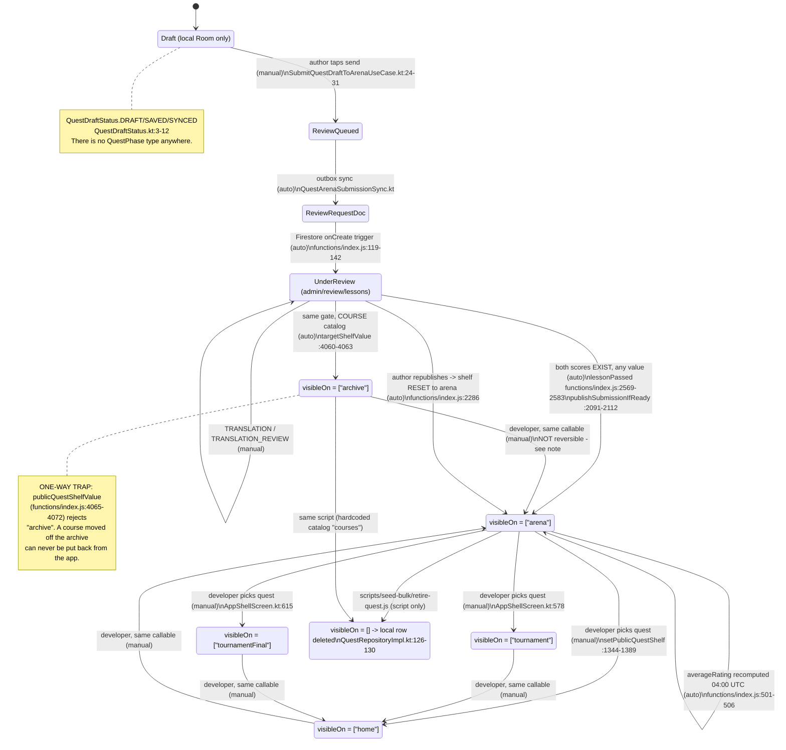

I have a complete verified picture. Writing the synthesis.

# 1. The lifecycle as it actually is today

Note on the dossier: the eight-agent dossier and verifier rulings referenced in my brief were **not present** in the message I received. I therefore re-derived every claim from the code myself. Everything below carries a `file:line` I personally opened. One prior analysis document exists in-tree (`_bmad-output/specs/spec-quest-lifecycle/shelf-mechanism.md`); I treated it as a hypothesis source only and re-verified each of its claims — two needed correction (see §5).

**Edges ADR-0005 and the product owner describe that DO NOT exist in code.** Every one of these is absent, not partial — I grepped the whole tree excluding `legacy/` for each type name and got zero non-documentation hits:

```mermaid
stateDiagram-v2
    direction TB

    ABSENT_A: ARENA
    ABSENT_B: TOURNAMENT
    ABSENT_C: TOURNAMENT_LEADER
    ABSENT_D: HOME
    ABSENT_E: RETIRED
    ABSENT_F: DRAFT (returned)
    ABSENT_G: IN_REVIEW

    ABSENT_A --> ABSENT_B: ABSENT - "top-3 by season avg + threshold"\nno scheduler exists; only 2 schedulers in tree\n(functions/index.js:267, :501)
    ABSENT_B --> ABSENT_C: ABSENT - "qualifier winners"\nno promotion code anywhere
    ABSENT_C --> ABSENT_D: ABSENT - "finalists reach the showcase"\nno promotion code anywhere
    ABSENT_D --> ABSENT_E: ABSENT - no RETIRED state, no retire callable
    ABSENT_G --> ABSENT_F: ABSENT - review CANNOT reject\nlessonReviewStatus returns only\nREADY_FOR_PUBLICATION | UNDER_REVIEW\n(functions/index.js:2565-2567)

    note right of ABSENT_E
        server/workers/ exists as an empty
        Gradle scaffold: `find server -name "*.kt"`
        returns 0 files. The ADR's promotion
        workers were never written.
    end note
```

Also absent as *types*: `QuestPhase`, `PublicationShelf`, `QuestChecks`, `CheckStatus`, `TranslationStatus`, `QuestRevision`, `CompletionEffect`, `IssueCourseCertificate`, `OfferQualification`. A case-insensitive search across the entire non-legacy tree returns matches only in `docs/` and `_bmad-output/`. The three orthogonal axes of ADR-0005 exist in code as: a `Set<String>` on the quest (`Quest.kt:60`), an enum on the *catalog* (`QuestType.kt:20-27`), and nothing at all for phase — phase is implied by which collection the document sits in.

---

# 2. Slice-by-slice ledger

| slice | works end-to-end | partial | absent |
|---|---|---|---|
| Authoring a draft | Draft CRUD, question editor, validation, local Room persistence | — | — |
| Submit for review | Outbox → `quest_review_requests` → trigger → `admin/review/lessons` | — | — |
| Review routing | Qualification-based task offer, translation stage machine, reviewer reputation deltas | Review Queue drawer entry visible to *everyone* (`DrawerSection.kt:49-51`, no required roles); screen is empty for the unqualified | — |
| Review **decision** | — | Scores 1..3 recorded (`index.js:3286-3290`) | **No reject path.** `lessonPassed` only asks whether a score *exists* (`index.js:3468-3474`); no threshold, no return-to-author |
| Publish to arena / archive | Auto on last score, correct shelf per `QuestType` | — | — |
| Play from arena | Runner, scoring, timer, outbox, offline | — | — |
| Rating a quest | Client → callable → dirty doc → daily aggregate → `averageRating` + sync_change | Prompt only after a *perfect* run (`CompleteAttemptUseCase.kt:51`); aggregation is once daily | No minimum sample; no "must have played" binding |
| Promote arena→home | Picker → `setPublicQuestShelf` → `visibleOn=["home"]` → sync_change → local requery | — | — |
| Promote arena→tournament | Same path, `targetShelf` = `tournament` / `tournamentFinal` | — | — |
| Vanish from arena | Genuine: shelf is replaced, not added (`index.js:1372`); DAO shelf query stops matching (`QuestDao.kt:37-40`) | — | — |
| Tournament play + standings | Attempt → groups/results/participants; ranking algorithm implemented and unit-tested | Leaderboard recompute is a **developer-only manual callable** (`index.js:1393-1402`), no scheduler | — |
| Course publish to archive | Author picks COURSE catalog → `["archive"]` | — | — |
| Course play + on-demand download | `syncQuestContent` bound (`SyncModule.kt:54`), download UI, archive list | — | — |
| Exam mode | — | `SessionMode.EXAM` exists, affects reveal + timer, unit-tested | **Never constructed in production** — only in tests; no "сдать экзамен" entry point; no random question sampling |
| Certificates | — | — | **Entirely absent.** No `Certificate` type, no issuance |
| Qualification offer on completion | — | — | **Entirely absent** |
| Retire / unpublish | — | — | **No in-app path.** Only `scripts/seed-bulk/retire-quest.js`, hardcoded to catalog `courses` |
| Automatic shelf promotion | — | — | **Entirely absent.** `server/` has zero source files |
| Shelf audit trail | — | — | `setPublicQuestShelf` writes only `visibleOn`, `version`, `lastModifiedAt` |
| SURVEY quest type | — | Enum value exists; `DraftQuestionType.SURVEY` authorable; routes to arena | No survey result aggregation; nothing distinguishes it at play time |

---

# 3. The gap between intent and code

Ordered most release-threatening first.

**1. Review approves by attendance, not by judgement. — CRITICAL**
Owner/ADR expect `IN_REVIEW → PUBLISHED` only when all checks are `PASSED`, and `IN_REVIEW → DRAFT` with a reason when any check `FAILED`. The code publishes when a score *exists*, whatever it is: `hasTestingResult` returns true on `isTested` or any non-null `testingScore` (`functions/index.js:3468-3470`), `hasLogicResult` likewise (`:3472-3474`), and `lessonPassed` is just their conjunction plus a language check (`:2569-2583`). Scores are constrained to 1..3 (`:3286-3290`) with no threshold anywhere. `lessonReviewStatus` can only return `READY_FOR_PUBLICATION` or `UNDER_REVIEW` (`:2565-2567`).
*Missing link:* no pass threshold on `testingScore`/`logicScore`, and no `REJECTED` status with a write-back to the author's draft. A tester who rates a quest 1/3 publishes it to arena.

**2. Eleven ratings from throwaway accounts make anyone a curator — and open other users' PII. — CRITICAL**
Owner expects DEVELOPER to be a granted qualification. In code it is a running total of quest ratings: `QUEST_RATING_QUALIFICATION_PROFILE_FIELD = "developerLevel"` (`functions/index.js:89`), delta `(rating - 2) * 10` (`:1968-1970`), written into both `users/{uid}` and `profiles/{uid}` (`:2029-2054`). The gate everywhere is `> 100` (`:76`). Eleven 3-star ratings ⇒ `developerLevel = 110`. That unlocks `setPublicQuestShelf` (`:1347`), blanket review submission (`:2427-2429`), `isVerifier()` → every user's real name, birthday, city and Telegram handle (`firestore.rules:186-193`, payload at `functions/index.js:601-607`), and `isReviewer()` → `private/{anyUser}/**` and `admin/**` (`firestore.rules:195-204`). Rating requires only auth plus a profile doc (`functions/index.js:440-441`).
*Missing link:* the rating score is written to the same field the privilege gates read. It needs its own field (e.g. `authorRatingScore`), and `isVerifier`/`isReviewer` must stop reading `developerLevel`.

**3. An author can review and publish their own quest. — CRITICAL**
`canSubmit` (`functions/index.js:2427-2455`), `isStageOpenForSubmit` (`:2518-2536`), `availableTasks` (`:2406-2423`) and `toAssignmentDto` (`:2383-2404`) never compare the reviewer's uid to `task.ownerUid` — the field is carried through at `:2390` and never used for exclusion.
*Missing link:* no `profile.uid !== task.ownerUid` guard. Combined with #1 and #2, one farmed account self-publishes to arena and then self-promotes to the home screen, with no other human involved.

**4. The author can rewrite `visibleOn` directly, bypassing the developer gate. — HIGH**
`firestore.rules:111-116` lets the author update `['title','description','picturePath','visibleOn','archived','catalogId']`. `hasOnly` restricts *which keys* change, never their values. `firestore.rules:97-109` similarly admits `visibleOn` on create.
*Missing link:* `visibleOn`, `archived` and `catalogId` must leave the update allowlist; create should be `if false` — the app never writes `/quests` (`FirebaseQuestRemoteDataSource.kt:17,27,43` read only; authored content goes to `private/{uid}/...`).
*Reachability, corrected from the prior in-tree analysis:* the tampered value does **not** reach other devices through the shelf query, because that query is dead code (see #8). It reaches them through the sync-list path: the daily rating aggregation writes a `sync_change` for the quest (`functions/index.js:1936-1943`), the orchestrator then re-fetches it by id (`CatalogSyncListOrchestrator.kt:108-112`), and `upsertFromSyncList` replaces the local row on *any* field difference at equal `lastModifiedAt` (`QuestDao.kt:106-109`). Fresh installs pick it up unconditionally. So the hole is real, just one step longer than previously described.

**5. No way to unpublish anything from inside the app. — HIGH**
ADR has `PUBLISHED → RETIRED`; the owner will need it the first time a quest must come down. `publicQuestShelfValue` accepts only the four public shelves (`functions/index.js:117`, `:4065-4072`) — it cannot express "no shelf". The only retire mechanism is `scripts/seed-bulk/retire-quest.js`, which hardcodes `CATALOG_ID = 'courses'` (line 36) and needs a laptop with service-account credentials.
*Missing link:* a `retireQuest` callable writing `visibleOn: []` plus a sync_change. The *client* half already works (`QuestRepositoryImpl.kt:126-130`).

**6. Courses cannot be returned to the archive. — MEDIUM**
`PUBLIC_QUEST_SHELVES` omits `"archive"` (`functions/index.js:117`), and the shelf menu is not gated by mode or type (`QuestListScreen.kt:233-240`, `DefaultQuestListComponent.kt:148-153` — no `QuestType` check). A developer browsing the course archive can long-press a course and send it to `home`, irreversibly. This also violates ADR invariant 1 (`COURSE ⇒ shelves ⊆ {ARCHIVE}`), which is enforced nowhere.
*Missing link:* type-aware shelf menu, and `archive` accepted as a target for COURSE quests.

**7. Automatic promotion between shelves does not exist. — MEDIUM (expectation gap, not a defect)**
ADR-0005 specifies `ARENA→TOURNAMENT→TOURNAMENT_LEADER→HOME` driven by `server/workers/rewards` and `server/workers/review-collisions`. `find server -name "*.kt"` returns **0 files**; the module is an empty Gradle scaffold. The only two schedulers in the tree are `reconcileQuestReviewDaily` (`functions/index.js:267`) and `aggregateQuestRatingsDaily` (`:501`). The owner's stated current rule — manual developer promotion only — is what is actually built, so **code matches the owner and contradicts the ADR**. The ADR needs amending, not the code.

**8. `SyncQuestsUseCase` and `refreshFromRemote` are dead code with a live Koin binding. — MEDIUM**
`QuestDomainModule.kt:11` registers `SyncQuestsUseCase`, whose only caller would be… nothing. `refreshFromRemote` (`QuestRepositoryImpl.kt:74-105`) is reached only from that use case, and with it `fetchOwnChanged` and `fetchPublicChanged` (`FirebaseQuestRemoteDataSource.kt:22-49`). All real syncing goes through `CatalogSyncListOrchestrator` → `refreshByIds`. The `availableShelves` access-control concept therefore never executes.
*Consequence:* the composite indexes those two queries need are irrelevant to the shipping app — which defuses the missing-`firestore.indexes.json` concern for release (`firebase.json` has no `"indexes"` key; no such file exists), but leaves ~150 lines of misleading code and documentation.

**9. `QuestType` is documented as copied onto the quest; it is not. — MEDIUM**
`QuestType.kt:8-11` states "On publication the server copies it onto the quest itself, so neither the server nor the runner has to look the catalog up." The publish writer (`functions/index.js:2280-2292`) writes twelve fields and `questType` is not among them; `QuestEntity` and `QuestDto` have no such field (grep returns nothing), while `CatalogEntity.kt:22` does.
*Missing link:* either write `questType` in `publicDocuments` and add the column, or delete the claim. Today "is this a course" is still decided by catalog identity (`CatalogSyncListOrchestrator.kt:151`, `COURSES_CATALOG_ID`) — exactly the convention the comment says was removed.

**10. Exam mode is unreachable. — MEDIUM**
`SessionMode.EXAM` is fully implemented in the domain and unit-tested, but `SessionMode.EXAM` appears in **no production call site** — `QuizzesConfig.kt:66` defaults to `LEARNING` and nothing overrides it. ADR's "random question sample in EXAM" is also absent: `StartLessonAttemptUseCase.kt:38-80` samples identically in both modes.
*Missing link:* an entry point (the ADR's "сдать экзамен" button on a course) passing `SessionMode.EXAM` into `QuizzesConfig.LessonRunner`.

**11. Certificates and qualification offers are absent. — MEDIUM**
`CompletionEffect`, `IssueCourseCertificate`, `OfferQualification` have zero code hits. `SessionMode.kt:20` says EXAM "is what a course certificate is issued against" — nothing issues one. Finishing a course produces a score and nothing else.

**12. Arena ranking is one raw mean with no minimum sample, and counts the author's own star. — MEDIUM**
`averageRating = sum/count` over all ratings with no floor (`functions/index.js:1845-1854`) — a single 3-star rating yields a perfect 3.0. The arena list sorts on it directly (`DefaultQuestListComponent.kt:212-218`). The author's own rating is explicitly skipped when computing the *author's* points (`:1961-1962`) but is counted in the *public* average 100 lines earlier — an asymmetry that reads as unintentional.

**13. Tournament standings only refresh when a developer taps. — MEDIUM**
`recalculateTournamentLeaderboard` is a developer-only callable (`functions/index.js:1393-1402`) with no scheduler and no client caller (`getHttpsCallable` grep over `platform/firebase` shows only `fetchTournamentOverview`). Players will see stale places indefinitely.

**14. Review Queue is in every user's drawer. — LOW**
`DrawerSection.LocalSection.ReviewQueue.requiredRoles` is `emptyMap()` (`DrawerSection.kt:49-51`) and it is listed unconditionally for `Tab.LOCAL` (`Visibility.kt:74-81`). The server correctly returns nothing for the unqualified (`toAssignmentDto` → `availableTasks` empty → `null`, `functions/index.js:2384-2385`), so this is an empty screen, not a leak.

**15. No shelf-move audit record. — LOW**
`setPublicQuestShelf` writes three fields (`functions/index.js:1370-1382`). Nothing records who moved what, when, or from where. With #2 unfixed there is no way to reconstruct an abuse incident.

---

# 4. Release blockers

Only the ones that break a paying user or leak data.

| # | Blocker | One-line fix direction |
|---|---|---|
| 1 | **PII leak via farmed ratings.** 11 ratings from free anonymous accounts ⇒ `developerLevel > 100` ⇒ `isVerifier()` opens every user's real name, birthday, city, Telegram handle (`functions/index.js:89`, `:1968-1970`, `firestore.rules:186-193`) | Rename the rating sink to `authorRatingScore` in `functions/index.js:88-89`, and drop `developerLevel` from `isVerifier()`/`isReviewer()` in `firestore.rules:186-204`; then zero the farmed `developer`/`developerLevel` fields and reset `qualificationAppliedScore` on every `quest_rating_aggregates` doc |
| 2 | **Moderation gate is a no-op.** Any score 1..3 publishes; no reject path (`functions/index.js:2569-2583`, `:3468-3474`, `:2565-2567`) | Require `testingScore >= threshold && logicScore >= threshold` in `lessonPassed`, and add a `REJECTED` status that writes the reason back to the author's draft |
| 3 | **Self-review.** No author-exclusion in `canSubmit`/`availableTasks` (`functions/index.js:2427-2455`, `:2406-2423`) | Add `if (profile.uid === task.ownerUid) return false` at the top of `canSubmit` and filter it in `availableTasks` |
| 4 | **Client can write `visibleOn` on `/quests`.** (`firestore.rules:111-116` update, `:97-109` create) | Remove `visibleOn`/`archived`/`catalogId` from the update allowlist and set `allow create: if false` — the app never writes this collection; add the deny cases to `scripts/rules-emulator-test.js` |
| 5 | **No way to take content down.** Retire exists only as a laptop script hardcoded to one catalog (`scripts/seed-bulk/retire-quest.js:36`) | Add a `retireQuest` callable writing `visibleOn: []` + a sync_change; the client-side removal already works (`QuestRepositoryImpl.kt:126-130`) |
| 6 | **No report/block for user-generated content.** Grep for report/block across `functions/index.js` and `firestore.rules` returns nothing | Google Play requires both for UGC apps; add a report callable and a block list before submission |

Items 1–4 compose into a single unattended chain: farm 11 ratings → become a developer → self-review your own quest with the lowest score → auto-publish to arena → self-promote to the children's home screen. Each fix above breaks the chain independently; all four should ship.

---

# 5. Contradictions found across areas

**a. `QuestType.kt` contradicts the publish writer.** The enum's own KDoc (`QuestType.kt:8-11`) asserts the server copies the type onto the quest at publication. `functions/index.js:2280-2292` writes no `questType`, and neither `QuestEntity` nor `QuestDto` has the field. The convention the comment claims to have replaced (`catalogId == "courses"`) is still load-bearing at `CatalogSyncListOrchestrator.kt:151`.

**b. ADR-0005 contradicts both the code and the product owner on promotion.** The ADR specifies automatic, server-driven shelf promotion; the code has none and `server/` is an empty scaffold; the owner describes manual developer promotion. Code and owner agree — the ADR is the outlier and should be amended.

**c. ADR-0005 shelf names contradict every layer of the code.** ADR says `TOURNAMENT_LEADER` and `ARCHIVE_COURSES`; code uniformly uses `"tournamentFinal"` and `"archive"`. Verified identical in all six places that name shelves: `Quest.kt:98-100`, `SetPublicQuestShelfUseCase.kt:22`, `functions/index.js:117`, `functions/tournament-ranking.js:9`, `QuestListScreen.kt:85-91`, `AppShellScreen.kt:85-87`. **The string literals themselves are consistent across the whole codebase** — this is the one place I expected divergence and found none.

**d. I corrected the in-tree prior analysis on the reachability of the `visibleOn` write hole.** `_bmad-output/specs/spec-quest-lifecycle/shelf-mechanism.md:105-107` claims an injected home-shelf quest reaches clients via `whereArrayContainsAny("visibleOn", …)`. That query lives in `fetchPublicChanged`, reachable only from `refreshFromRemote` ← `SyncQuestsUseCase`, which has **no call site** — dead code. The hole is still real but travels the sync-list path instead (see §3 item 4). The same document's index concern (`firestore.indexes.json` missing) is consequently not release-blocking: the queries needing those indexes never run.

**e. `>` vs `>=` on the same developer threshold.** `canManagePublicShelves` uses `developer > LEVEL_1.points` (`AppShellScreen.kt:204`) while drawer visibility uses `developer >= LEVEL_1.points` (`Visibility.kt:55`). Both match the server's `> 100` (`functions/index.js:76`) closely enough that no user lands in the gap except at exactly 100, where the drawer opens but the shelf menu does not. Cosmetic, but it is a genuine disagreement between two files about one threshold.

No other cross-area disagreement survived checking. In particular `QuestType` values (`REGULAR|COURSE|SURVEY`), the U+001F `visibleOn` delimiter (`StringSetConverter.kt:14` vs `QuestDao.kt:29` `CHAR(31)`), and who may mutate `visibleOn` at the *callable* level (developer-only, client and server agreeing at 100) are all consistent.

---

# 6. Device test matrix

Accounts needed overall: **5** (A = author, B = player/rater, C = tester-qualified, D = admin-qualified, E = developer-qualified). Qualification fields live in `profiles/{uid}` which is client-unwritable (`firestore.rules:47-51`) — they must be set with a service-account script before testing. `configs/arena_review` must also be seeded (`functions/index.js:2824-2826`; only `scripts/review-pipeline-e2e.js:119` and `scripts/run-pixel-live-review-e2e.js:193` do it today), otherwise required languages silently fall back to the quest's own source language (`:2629-2633`).

| # | scenario | shelf | role / qualification | accounts | what proves it passed |
|---|---|---|---|---|---|
| 1 | Author a quest in a REGULAR catalog, add a lesson + questions, save | — | none | 1 (A) | Draft appears in My Quests; `QuestDraftStatus` reaches `SAVED`; survives app kill |
| 2 | Submit the draft for review | — | none | 1 (A) | `quest_review_requests/{id}` created with `processed:false`; `admin/review/lessons/{lessonId}` appears within seconds (trigger `index.js:119`) |
| 3 | Review it: TESTING then LOGIC | — | C then D | 2 (C, D) | Task visible in Review Queue for C but not for B; after both scores the request flips to `status:"PUBLISHED"` (`index.js:2102-2111`) |
| 4 | Quest appears on arena for a plain player | arena | none | 1 (B) | `quests/{id}.visibleOn == ["arena"]`; B's Arena list shows it after sync |
| 5 | Play it from arena to completion | arena | none | 1 (B) | Attempt row written; result reaches `submitLessonResultEvents`; score displayed |
| 6 | Rate it (requires a **perfect** run) | arena | none | 1 (B) | Rating prompt appears only when every shown answer is correct (`CompleteAttemptUseCase.kt:51`); `quest_rating_submissions` doc written |
| 7 | See the rating on the card | arena | developer to force it | 2 (B, E) | Daily job runs 04:00 UTC — **for a same-day test, E must invoke `aggregateQuestRatingsNow`, which has no in-app caller**; then `averageRating` appears and the arena list re-sorts (`DefaultQuestListComponent.kt:212-218`) |
| 8 | Promote arena → home | arena → home | developer (`> 100`) | 1 (E) | Home "+" → catalog picker → arena-filtered list → tap quest; `visibleOn` becomes `["home"]` |
| 9 | **Verify it vanished from arena** | arena | none | 1 (B) | On B's device the quest leaves the Arena list and appears on Home after sync. This is the single most important assertion: it proves the shelf is *replaced*, not added (`index.js:1372`) |
| 10 | Promote arena → tournament | arena → tournament | developer | 1 (E) | Events tab → Qualifier → add lessons → tap; `visibleOn == ["tournament"]`; gone from arena |
| 11 | Play a tournament quest | tournament | none | 2 (B + one more, for a real group) | `tournaments/tournament/groups/{g}/results/{uid}` and `participants/{uid}` written (`index.js:1499-1563`) |
| 12 | See tournament standings | tournament | developer to force it | 2 (E, B) | **No scheduler exists** — E must invoke `recalculateTournamentLeaderboard` (`index.js:1393`), which has no in-app caller; then `fetchTournamentOverview` shows places |
| 13 | Publish a course to the archive | archive | C + D to review | 3 (A, C, D) | Author picks a COURSE-typed catalog; on publish `visibleOn == ["archive"]` and `archived == true` (`index.js:2279, 2291`) |
| 14 | Download and play a course | archive | none | 1 (B) | Download button syncs question payload via `syncQuestContent`; lesson playable offline afterwards |
| 15 | Promote a course off the archive, then try to put it back | archive → arena → ✗ | developer | 1 (E) | **Expected to fail on the way back** — `publicQuestShelfValue` rejects `"archive"` (`index.js:4065-4072`). Run it to confirm the trap before release |

**Scenarios that CANNOT be run today because the code path is absent:**

| scenario | why |
|---|---|
| Reject a quest in review and see it return to the author | No reject action and no `REJECTED`/`DRAFT` return path (`index.js:2565-2567`, `:3286-3290`) |
| Retire / unpublish a quest from the app | No callable; only `scripts/seed-bulk/retire-quest.js`, hardcoded to catalog `courses` |
| Sit a course exam | `SessionMode.EXAM` never constructed in production code |
| Receive a course certificate | `CompletionEffect` / certificate types do not exist |
| Be offered a qualification after a quest | `OfferQualification` does not exist |
| Observe automatic arena → tournament → final → home promotion | No promotion code; `server/` contains zero source files |
| Report or block a quest or an author | No report/block anywhere in `functions/index.js` or `firestore.rules` |

---

# 7. What I could not determine

1. **Whether the eight-agent dossier contained findings I missed.** The dossier and the verifier's REFUTED/CORRECTED rulings were referenced in my brief but not included in the message. I rebuilt the map from source, so nothing here rests on unverified secondhand claims — but I cannot honour the instruction to drop REFUTED gaps or restate CORRECTED ones, because I never saw them. *Would be answered by:* re-sending the dossier; I would then diff it against this synthesis.

2. **Whether the required Firestore composite indexes exist in the live project.** No `firestore.indexes.json`, no `"indexes"` key in `firebase.json`; `scripts/create-indexes.js:3` hardcodes a service-account path under `/home/tpov/Downloads/`. Since the queries needing them are dead code (§3 item 8), this looks harmless — but I cannot confirm what the deployed project actually has. *Would be answered by:* `firebase firestore:indexes --project <id>`.

3. **The live values of `profiles/*.developerLevel`.** The escalation in blocker #1 is arithmetically certain from the code, but I cannot tell how many accounts already crossed 100 by rating, nor whether any of them were farmed. *Would be answered by:* a service-account query counting `profiles` where `developerLevel > 100`, cross-referenced against intentional grants.

4. **Whether `configs/arena_review` exists in production.** Only test scripts write it. If absent, `requiredLanguages` silently falls back to the quest's own source language and the translation stage never binds. *Would be answered by:* reading `configs/arena_review` in the live project.

5. **Whether `reconcileQuestReviewDaily` can publish.** It calls `reconcileChangedReviewLessons` (`index.js:267-273`), which I did not open. If that path reaches `publishSubmissionIfReady`, quests could publish 24h after their last score without any further human action — which would sharpen blocker #2. *Would be answered by:* reading `reconcileChangedReviewLessons` end-to-end.

6. **What SURVEY quests actually do at play time.** The type routes to arena (`DefaultQuestCreateComponent.kt:1497`) and `DraftQuestionType.SURVEY` is authorable, but I found no result-distribution aggregation. Whether a survey is scored like a quiz — and what that does to arena ratings — is unresolved. *Would be answered by:* tracing `QuestionContent.Survey` through `RunnerLogic` and the scoring module.

7. **Whether the tournament `sourceShelf` fallback is deliberate.** `LessonResultOutboxWriter.kt:113-120` prioritises arena > home > archive and reaches tournament shelves only through the `else -> first()` branch. It works today because a quest sits on exactly one shelf, but it would silently misroute if `visibleOn` ever held two. *Would be answered by:* the author of that ordering confirming whether multi-shelf was intended to remain impossible.