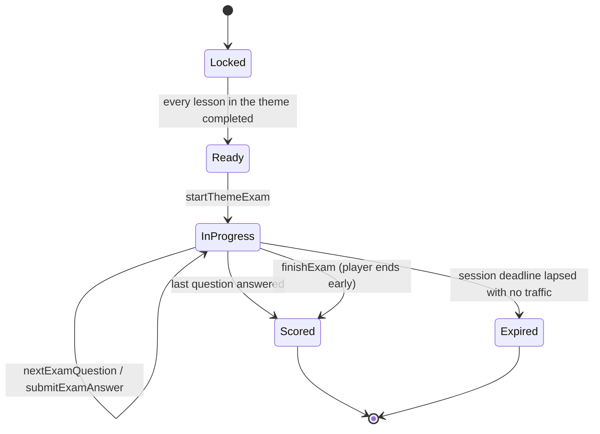

# Exam protocol

The contract between client and server for one exam sitting. It exists because the exam inverts
the app's usual direction of trust: in lesson play the client owns the session and the server
verifies the arithmetic afterwards, while in an exam the server owns the session and the client
owns nothing but the screen.

## Session lifecycle



`Scored` and `Expired` are both terminal and both produce a result the client can read back.
There is no `Paused`: a session the client walks away from expires on the server's clock, which is
what makes CAP-10 decidable without client cooperation.

## Calls

Callable functions, alongside the existing ones in `functions/index.js`. Every one requires an
authenticated uid and rejects a session that does not belong to it.

| Call | In | Out |
|---|---|---|
| `startThemeExam` | `themeId`, `difficulty` | `sessionId`, question count, first redacted question, its deadline |
| `nextExamQuestion` | `sessionId` | redacted question, deadline, index — or the terminal state if the exam is over |
| `submitExamAnswer` | `sessionId`, `questionId`, serialized `UserAnswer` | acknowledgement and the next question; never a verdict |
| `finishExam` | `sessionId` | the scored result |
| `fetchExamResult` | `sessionId` | the scored result, for a client that reconnected after the fact |

`submitExamAnswer` returning the next question folds `nextExamQuestion` into the steady state; the
separate call exists for the first question after a reconnect.

`startThemeExam` refuses before it opens anything, with a reason the UI can render, when: a lesson
of the theme is below two stars (CAP-1), the ladder rung is not reached (CAP-9), the 23-hour
cooldown has not run out (CAP-12), or the player is short of charge (CAP-13). All four are server checks; the
client's copy of them is a courtesy that keeps the button from lying, never the gate itself.

## Redaction

A question leaves the server stripped of everything that decides correctness. For the ADR-0003
schema that means:

- `SingleChoice` — options without `correctOptionId`.
- `MultipleChoice` — options without `correctOptionIds`.
- `Ordering` — items in a shuffled order, without the correct sequence.
- `FillBlank` — candidates without the blank-to-candidate mapping.
- `Survey` — excluded from exams entirely; it has no right answer and is scored on participation.

Redaction happens server-side on the stored payload. The client-side parser must accept a redacted
payload without inventing a correct answer for it, which is the one change the exam forces on
`shared/core/question-schema`.

## Deadlines

The per-question allowance uses the same formula as the runner — `computeTimer` with
`TimerCoefficients.examFactor` — but the server computes it and stamps an absolute deadline on the
question. The client shows a countdown derived from that stamp; it is display only.

An answer arriving after its deadline is scored as unanswered. A question whose deadline lapses
with no answer at all is scored the same way when the next call arrives, so a player cannot buy
time by staying silent.

## Scoring

Per-question scoring reuses the runner's rules unchanged (`evaluateAnswer` → `Score` 1..9,
unanswered → the timeout digit), assembled into the same `codeAnswer` string, reduced by the same
`computePercentScore`, and mapped to stars by the same `computeStars(percentScore, difficulty)`.
The formulas already exist in two places — Kotlin in `RunnerLogic.kt`, JavaScript in
`functions/result-verification.js` — and the exam adds a third caller, not a third formula.

The consequence to hold onto: EASY tops out at 2 stars, HARD spans 2 to 3, so a theme only shows
three stars once its hard exam has gone well.

## Pass rule

A theme is passed on **100% of its easy exam plus 50% of its hard one**. In stars that is 2.5 of 3
— the table below is the whole scale, and it is worth reading before moving the number, because the
star display and the pass mark are the same arithmetic seen twice.

| Easy | Hard | Stars | Share of the 3-star scale |
|---|---|---|---|
| 100% | — | 2.0 | 66.7% |
| 100% | 20% | 2.2 | 73.3% |
| 100% | 40% | 2.4 | 80.0% |
| 100% | **50%** | **2.5** | **83.3%** |
| 100% | 100% | 3.0 | 100% |

50% rather than 20% because a four-option `SingleChoice` answered at random already scores about
25%: a 20% bar passes a player who read nothing.

## Cost and rate

One sitting spends one whole charge — 100 points, against the 33 a lesson attempt costs — checked
and deducted by `startThemeExam` before the session opens.

A theme allows one sitting per rolling **23 hours** per rung of the ladder, counted from the start
of the previous sitting. 23 rather than 24 so a player who sits an exam at the same hour each day is
never turned away by a few minutes, and a rolling window rather than a calendar date so there is no
timezone to argue about and none to exploit. A session the server ends by timeout has spent the
window just as a finished one has, so walking away from a losing exam buys nothing.

## Anti-cheat record

Every sitting stores, per question: the id, the deadline, when the answer arrived, how long it
took, and the answer itself. Nothing acts on it yet — there is no rule worth writing before there
is data to draw it from. It exists so the rule can be written later against real distributions
rather than a guess, and so a suspicious sitting can be reconstructed after the fact.

## Result

```
sessionId, themeId, difficulty, startedAt, finishedAt,
codeAnswer, percentScore, starsRawTenths, passed,
nextAttemptAvailableOn
```

No per-question breakdown, no correct answers, and no certificate — the course issues its single
certificate when its last section closes, not here. The result is what the client renders and what
the theme's best-of is recomputed from; the certificate, when the chain finally reaches it, arrives
through the existing profile sync.
