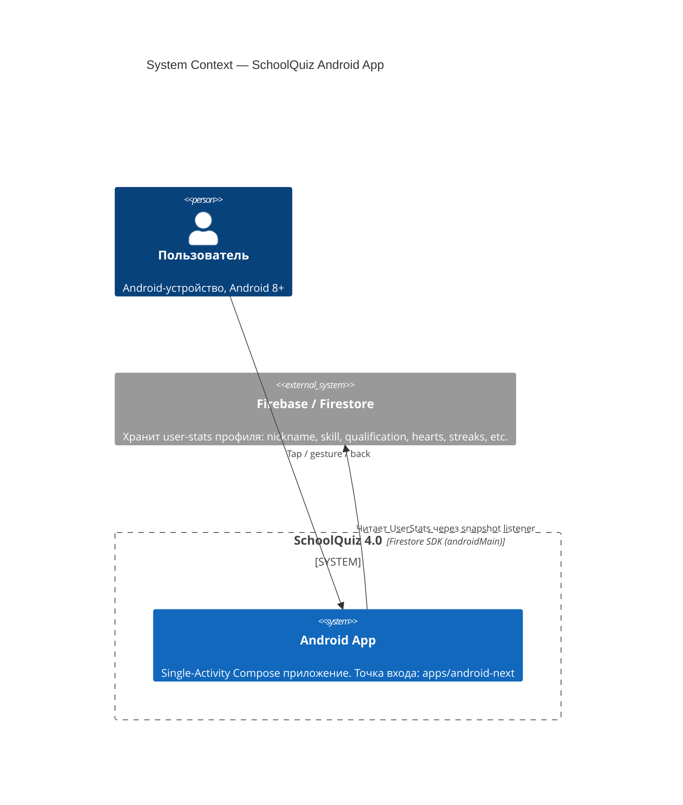
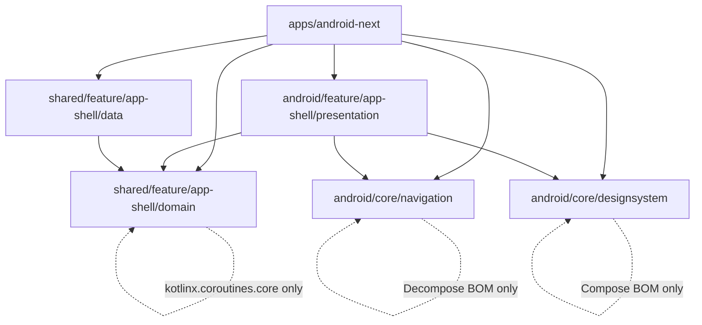
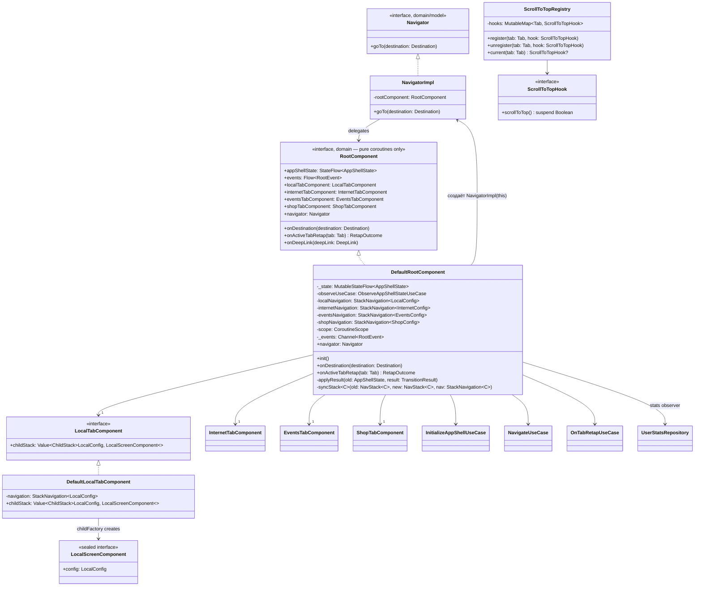
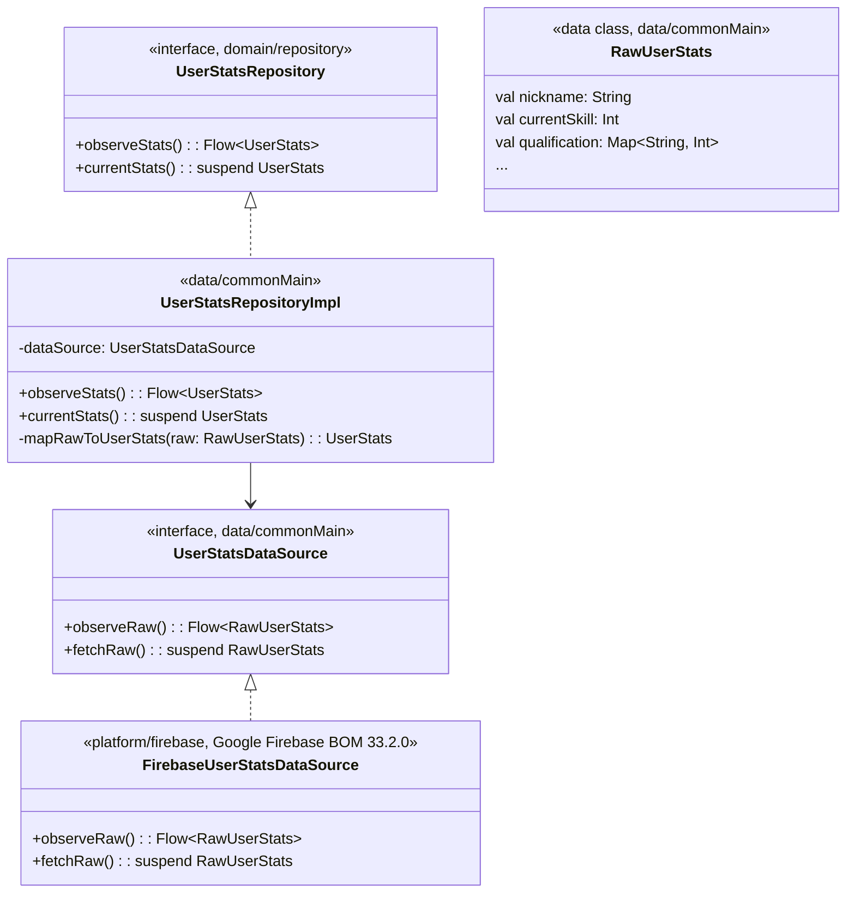
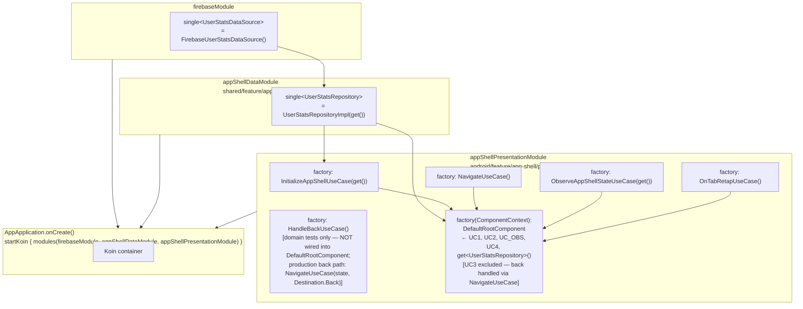

---

## date: 2026-04-18 feature: app-shell-menu authors: \[architect-high-level, architect-component\]

# Architecture: App Shell Menu

Документ содержит C4 L1–L2 (high-level, зона architect-high-level) и C4 L3 (component-level, зона architect-component).

---

## L1: System Context



**Scope этой фичи**: реализация `App Shell` — Bottom Navigation + per-tab ModalNavigationDrawer + UserStats header + полная дизайн-система Material3. Экраны конкретных фич (quiz, arena, profile и т.д.) — placeholder'ы `UnderConstructionScreen`.

---

## L2: Container Diagram (5 целевых модулей + entry point)

```mermaid
C4Container
    title Container Diagram — app-shell-menu (6 Gradle-модулей)

    Person(user, "Пользователь")

    Container_Boundary(app, "apps/android-next") {
        Component(mainActivity, "MainActivity", "Android / AppCompatActivity",
            "Создаёт defaultComponentContext() + RootComponent. Точка входа setContent{AppShellScreen}. Через AppApplication.onCreate() запускает startKoin{} (ADR-0009 revised).")
    }

    Container_Boundary(presentation, "android/feature/app-shell/presentation") {
        Component(rootComp, "RootComponent", "Kotlin / Decompose ComponentBase",
            "Держит AppShellState. Делегирует жесты в NavigateUseCase / HandleBackUseCase / OnTabRetapUseCase.")
        Component(appShellScreen, "AppShellScreen", "Jetpack Compose",
            "Scaffold + TopAppBar + NavigationBar + ModalNavigationDrawer. Реактивно читает AppShellState через subscribeAsState.")
        Component(tabComponents, "4 TabComponents", "Kotlin / Decompose",
            "LocalTabComponent, InternetTabComponent, EventsTabComponent, ShopTabComponent — per-tab ChildStack + StackNavigation.")
        Component(drawerComposables, "DrawerComposables", "Jetpack Compose",
            "DrawerHeader (UserStats), DrawerSectionList (per-tab), DrawerFooter (debug/release).")
        Component(navigatorImpl, "NavigatorImpl", "Kotlin",
            "Реализует Navigator interface из domain. Делегирует вызовы goTo() → RootComponent.")
    }

    Container_Boundary(domain, "shared/feature/app-shell/domain") {
        Component(useCases, "5 Use Cases", "Pure Kotlin / KMP",
            "InitializeAppShellUseCase, NavigateUseCase, HandleBackUseCase, OnTabRetapUseCase, ObserveAppShellStateUseCase.")
        Component(appShellState, "AppShellState + transitions", "Pure Kotlin / KMP",
            "AppShellState, TabState, NavStack, AppShellTransitions (pure functions), AppShellFactory, Visibility.")
        Component(domainModels, "Domain Models", "Pure Kotlin / KMP",
            "Tab, Destination, DrawerSection (sealed: Local/Internet/Events), TabConfig sealed per-tab, UserStats, Role, Title, Qualification, BadgeContent, DrawerFooterAction, RetapOutcome, RootEvent.")
        Component(navigatorIface, "Navigator interface", "Pure Kotlin / KMP",
            "interface Navigator { fun goTo(destination: Destination) }. Единственный контракт для feature-модулей. [OQ#1: add в phase-01]")
        Component(userStatsRepo, "UserStatsRepository", "Pure Kotlin / KMP interface",
            "fun observeStats(): Flow<UserStats>; suspend fun currentStats(): UserStats.")
    }

    Container_Boundary(data, "shared/feature/app-shell/data") {
        Component(userStatsImpl, "UserStatsRepositoryImpl", "Kotlin / commonMain",
            "Delegates to UserStatsDataSource interface → emit Flow<UserStats>. [OQ#5 Variant A: commonMain impl, platform-specific source in platform/firebase androidMain]")
        Component(dataModule, "appShellDataModule", "Koin module",
            "val appShellDataModule = module { single<UserStatsRepository> { UserStatsRepositoryImpl(get()) } }")
    }

    Container_Boundary(nav, "android/core/navigation") {
        Component(navHelpers, "Decompose Compose Helpers", "Kotlin / Android",
            "subscribeAsState(), Children() extensions, animation helpers. НЕ содержит Navigator interface — он в domain.")
    }

    Container_Boundary(ds, "android/core/designsystem") {
        Component(theme, "SchoolQuizTheme", "Jetpack Compose",
            "darkColorScheme (#000000 background, #4285F4 primary, #FFD700 secondary, #7D4FAB tertiary). MaterialTheme wrapper.")
        Component(wrappers, "Brand Components", "Jetpack Compose",
            "BrandCard, BrandPrimaryButton, BrandSecondaryButton, BrandProgressBar, BrandCircleIconButton, CategoryIcon.")
        Component(designCatalog, "DesignCatalogScreen", "Jetpack Compose",
            "Debug-only runtime screen. Рендерится по LocalConfig.DesignCatalogRoot. В release — fallback UnderConstructionScreen.")
    }

    Rel(user, mainActivity, "Touch / back / gesture")
    Rel(mainActivity, rootComp, "Создаёт RootComponent, передаёт в setContent")
    Rel(mainActivity, appShellScreen, "setContent { SchoolQuizTheme { AppShellScreen(rootComponent) } }")

    Rel(appShellScreen, rootComp, "Читает AppShellState, вызывает navigatorImpl.goTo()")
    Rel(appShellScreen, tabComponents, "Children(childStack) для активного tab")
    Rel(appShellScreen, drawerComposables, "DrawerContent slot")
    Rel(appShellScreen, theme, "SchoolQuizTheme wrapper")

    Rel(rootComp, useCases, "Инжектирует 5 use cases через Koin")
    Rel(rootComp, navigatorImpl, "Создаёт NavigatorImpl(this)")
    Rel(navigatorImpl, navigatorIface, "implements")
    Rel(navigatorImpl, rootComp, "Делегирует goTo() → onDestination()")

    Rel(useCases, appShellState, "Читает/создаёт AppShellState через pure functions")
    Rel(useCases, userStatsRepo, "ObserveAppShellStateUseCase инжектирует interface")

    Rel(userStatsImpl, userStatsRepo, "implements")
    Rel(dataModule, userStatsImpl, "Koin single<UserStatsRepository>")

    Rel(userStatsImpl, firebase, "Firestore snapshot listener")

    Rel(tabComponents, navHelpers, "subscribeAsState(), Children()")
    Rel(drawerComposables, wrappers, "BrandCard, BrandProgressBar для stats header")
    Rel(designCatalog, wrappers, "Демонстрирует все Brand Components")
```

### Dependency graph (направление стрелок = направление Gradle `implementation`)



**Ключевые правила модульных границ:**

| Правило | Обоснование |
| --- | --- |
| `android/*` не видит Firebase SDK | ADR-0001 Rule 1: `android/*` зависит от `shared/*`, не от `platform/*` |
| `shared/feature/app-shell/domain` — pure KMP, 0 Android deps | Invariant #1 (domain purity), подтверждён grep: 0 android/firebase imports |
| `android/core/navigation` не зависит от domain | Core-module не знает про feature domain; Navigator interface живёт в domain |
| `shared/feature/app-shell/data` зависит от domain + UserStatsDataSource interface | Стандартный data→domain flow; Firebase SDK — в `platform/firebase` adapter per ADR-0001:36-37 \[OQ#5 resolved\] |
| Нет bidirectional coupling между feature-модулями | Invariant #3; все зависимости unidirectional |
| Feature-presentation модули импортируют только `Navigator + Destination` из domain | Spec NFR #3; compile-time enforced через Gradle dep scope |

---

## Модульные ответственности (краткое)

| Модуль | Owns | НЕ owns |
| --- | --- | --- |
| `shared/feature/app-shell/domain` | AppShellState, 5 use cases, AppShellTransitions, Visibility, Navigator interface, UserStatsRepository interface, все domain models | UI, DI wiring, Decompose API, Firebase |
| `shared/feature/app-shell/data` | UserStatsRepositoryImpl (через UserStatsDataSource interface), appShellDataModule | Firebase SDK (в platform/firebase), Navigation logic, UI |
| `android/feature/app-shell/presentation` | RootComponent, 4 TabComponents, AppShellScreen, DrawerComposables, NavigatorImpl, appShellPresentationModule | Business rules, Firebase, design tokens |
| `android/core/navigation` | Decompose Compose helpers (subscribeAsState, Children, animation) | Navigator interface (в domain), Tab/Section models |
| `android/core/designsystem` | SchoolQuizTheme, darkColorScheme, Brand components, DesignCatalogScreen | Navigation logic, user data |
| `apps/android-next` | MainActivity, Koin module aggregation (startKoin), entry point | Business logic, UI components |

---

## Open Questions (high-level, блокируют design)

| \# | Вопрос | Impact | Статус | Рекомендация |
| --- | --- | --- | --- | --- |
| OQ#1 | `Navigator` interface: добавить в domain (Path A) или feature-modules используют use cases напрямую (Path B)? | Если Path B — нарушает spec NFR #3. | open | Path A: 3-line interface, spec-compliant |
| OQ#2 | `@Serializable` на Config-иерархии: в domain + add plugin (Path A) vs integration-layer wrap (Path B)? | Path B удваивает код; Path A нарушает «конвенцию» (но допустимо per web research) | open | Path A per spec NFR #2 |
| OQ#3 | `startKoin` расположение: `MainActivity` (per ADR-0009:71) vs `Application.onCreate()`? | **\[SPEC AMBIGUITY — BLOCKS DESIGN\]** ADR-0009:71 прямо указывает MainActivity. Koin 3.5.6 official docs настоятельно рекомендуют Application.onCreate() — риск double-init при rotation; Service/BroadcastReceiver не получат Koin до первого открытия Activity. | **ADR CONFLICT** | **Требует явного ADR update**: создать `AppApplication : Application` + зарегистрировать в AndroidManifest. Без этого Firebase/other SDK рискуют не инициализироваться вовремя. |
| OQ#4 | Compose в convention plugin: новый `schoolquiz.android.compose.library` плагин vs ad-hoc per-module? | Scope: 4 модуля требуют Compose | open | Новый plugin — меньше дублирования |
| OQ#5 | Firebase в KMP data module: gitlive-firebase KMP wrapper vs platform/firebase adapter? | **\[RESOLVED\]**: `:platform:firebase` уже настроен в `settings.gradle.kts:75` с Google Firebase BOM 33.2.0 (`platform/firebase/build.gradle.kts:9`). gitlive не используется. | **Resolved → Variant A** | `platform/firebase` adapter per ADR-0001:36-37. Google Firebase BOM 33.2.0 (Android-only). `UserStatsDataSource` interface в `data/commonMain`; `FirebaseUserStatsDataSource` impl в `platform/firebase` (androidMain). |

### OQ#3 — ADR Conflict Detail

**Факты** (источник: web-researcher `05-prior-art.md`):

- ADR-0009:71: `startKoin { androidContext(this@MainActivity) }` в `MainActivity.onCreate()`
- Koin 3.5.6 official docs: `Application.onCreate()` — единственный рекомендуемый вариант
- Koin docs предупреждают: initKoin в Activity может привести к повторной инициализации при rotation. В Koin 3.x `startKoin` при повторном вызове выбрасывает `KoinApplicationAlreadyStartedException` (если не использовать `stopKoin()`).
- Firebase SDK best practice: инициализация в `Application.onCreate()`, не в Activity

**Recommended ADR fix**: `AppApplication : Application` + `android:name=".AppApplication"` в `AndroidManifest.xml`. Это меняет только `apps/android-next/build.gradle.kts` + `AndroidManifest.xml` (scaffold — backend-dev scope).

> **Эскалация**: OQ#3 требует явного решения пользователя или team-lead-а: следовать ADR-0009 буква-в-букву (MainActivity, с риском double-init) или обновить ADR-0009 (Application class). Зафиксировать в `03-decisions.md`.

### OQ#5 — Resolution Detail

**Факты**:

- `:platform:firebase` уже присутствует в `settings.gradle.kts:75`
- `platform/firebase/build.gradle.kts:9` использует `implementation(platform(libs.firebase.bom))` + `libs.firebase.firestore` — Google Firebase BOM 33.2.0, Android-only
- gitlive `dev.gitlive:firebase-firestore:2.4.0` **не используется** (это KMP wrapper; MVP scope = Android-only)
- ADR-0001:36-37 предусматривал `platform/firebase` adapter — выбранный Variant A соответствует

**Resolved dependency graph update** (platform/firebase adapter, Variant A):

```
shared/feature/app-shell/data/commonMain → UserStatsDataSource interface
platform/firebase (androidMain) → FirebaseUserStatsDataSource implements UserStatsDataSource
                                   (Google Firebase BOM 33.2.0, firebase-firestore-ktx)
apps/android-next → aggregates platform/firebase module
```

Это изменяет ячейку в dependency graph выше (firebase не в `androidMain` data, а в `platform/firebase`). Финальный граф фиксируется в `03-decisions.md`.

### BackHandler — Confirmed

web-researcher подтвердил: Essenty `BackHandler` (из `ComponentContext`) обязателен для root FSM (`AppShellTransitions.onBack`). Jetpack `BackHandler` в child-компонентах перехватывает back globally — нарушает иерархию. Мои DFD и sequences в `02-behavior.md` корректны.

---

## L3: Component-Level Architecture

> Автор: architect-component. Согласован с L1-L2 от architect-high-level. OQ#5 resolved (platform/firebase adapter), OQ#3 resolved (Application class), OQ#1 Path A, OQ#2 Path A.

---

### Обоснование: RootComponent в presentation, не в domain

> \[SPEC AMBIGUITY\] Spec NFR #1 (`0-spec.md:43`) буквально требует `RootComponent` в `shared/feature/app-shell/domain/commonMain`. Конфликт с:
>
> - `.claude/rules/domain-models.md` — third-party SDK типы (`ComponentContext`, Essenty `BackHandler`) запрещены в domain signatures
> - Walking Skeleton реализован как pure Kotlin без Decompose (229 tests green — Invariant #6)
> - `2-grounding.md` Problem 1 Fix Shape явно размещает `RootComponent` в `android/feature/app-shell/presentation/`
> ****Решение** (Phase-01): RootComponent → `android/feature/app-shell/presentation/`. Domain остаётся pure KMP. Spec NFR #1 корректируется в `03-decisions.md` ADR-0011 (RootComponent placement).

---

### Domain — 2 дополнения к Walking Skeleton (Invariant #6: integrate, not rewrite)

#### Navigator.kt — новый файл (OQ#1 Path A)

```
shared/feature/app-shell/domain/src/commonMain/kotlin/.../domain/navigation/Navigator.kt
```

```kotlin
package com.tpov.schoolquiz.shared.feature.app_shell.domain.navigation

interface Navigator {
    fun goTo(destination: Destination)
}
```

Три строки, pure Kotlin. Spec NFR #3 требует: feature-modules импортируют только `Navigator + Destination` из domain.

#### Config serialization — ADR-LEAD-01 (state-saving deferred)

**User-approved deviation (2026-04-18)**: MVP использует `serializer = null` для всех `childStack(...)` → Decompose не сохраняет стек при process death. Каждый cold start = default state. Spec NFR #2 state-saving перенесено в future phase.

`@Serializable` на Config-иерархиях (LocalConfig, InternetConfig, EventsConfig, ShopConfig) — **опционально для domain unit-тестов**, не требуется для MVP Decompose wiring. Если `@Serializable` отсутствует (как в текущем Walking Skeleton `TabConfig.kt:15` — see comment "intentionally absent") — MVP компилируется и работает.

`shared/feature/app-shell/domain/build.gradle.kts`: kotlinx-serialization plugin — **не требуется для phase-01 MVP**.

Future state-saving phase: добавить `@Serializable` + `serializer = Config.serializer()` + plugin. Фиксировано в ADR-LEAD-01.

---

### Presentation Layer — Класс-диаграмма



---

#### DefaultRootComponent — ключевые детали

**Конструктор** (Koin `factory { (ctx: ComponentContext) → … }`):

```kotlin
class DefaultRootComponent(
    componentContext: ComponentContext,
    private val initUseCase: InitializeAppShellUseCase,
    private val navigateUseCase: NavigateUseCase,
    private val observeUseCase: ObserveAppShellStateUseCase,
    private val retapUseCase: OnTabRetapUseCase,
) : RootComponent, ComponentContext by componentContext
// handleBackUseCase NOT injected — production back via navigateUseCase(state, Destination.Back) per ADR-COMP-07
// userStatsRepository NOT a direct dep — injected inside InitializeAppShellUseCase + ObserveAppShellStateUseCase
```

| Поле | Тип | Назначение |
| --- | --- | --- |
| `_state` | `MutableStateFlow<AppShellState>` | Pure coroutines; `override val appShellState = _state.asStateFlow()`. Compose использует `collectAsStateWithLifecycle()`. При необходимости: `_state.asValue(lifecycle)` через `decompose-extensions-coroutines`. |
| `localNavigation` | `StackNavigation<LocalConfig>` | передаётся в `DefaultLocalTabComponent` |
| `scope` | `CoroutineScope` | Essenty `coroutineScope(Dispatchers.Main.immediate)` |
| `_events` | `Channel<RootEvent>(BUFFERED)` | → `events: Flow<RootEvent>` via `receiveAsFlow()` |
| `navigator` | `Navigator` | `NavigatorImpl(this)` — создаётся в init |

`init {}` **порядок** (нарушение порядка = race condition):

```kotlin
init {
    // 1. Navigator (синхронно, до coroutines)
    _navigator = NavigatorImpl(this)

    // 2. Cold start: suspend → launch
    scope.launch {
        val initialState = initUseCase()              // InitializeAppShellUseCase.kt:20
        applyResult(AppShellState.fallback(), TransitionResult(initialState))
    }

    // 3. Stats observer via ObserveAppShellStateUseCase (ADR-LEAD-02 target state)
    scope.launch {
        observeUseCase(currentStateProvider = { _state.value })
            .catch { emit(AppShellState.fallback(UserStats.guest())) }
            .collect { newState -> _state.update { newState } }
    }

    // 4. Essenty BackHandler (не Jetpack — 1-research.md:138)
    backHandler.register(BackCallback(isEnabled = true) {
        onDestination(Destination.Back)
    })
}
```

> **ObserveAppShellStateUseCase — production wire (ADR-LEAD-02)**: User одобрил (2026-04-18) изменение сигнатуры domain use case для устранения stale closure. Новая сигнатура: `invoke(currentStateProvider: () -> AppShellState): Flow<AppShellState>`. `DefaultRootComponent.init {}` вызывает: `observeUseCase { _state.value }.collect { newState -> _state.update { newState } }`. Provider lambda `{ _state.value }` читает актуальный navigation state при каждом stats emit — stale closure исключён. Phase-01 backend-dev обновляет `ObserveAppShellStateUseCase.kt` + его тесты (см. Phase-01 Integration Notes ниже).

`syncStack<C: Any>` **— Decompose stacks выравниваются с domain NavStack:**

```kotlin
private fun <C : Any> syncStack(old: NavStack<C>, new: NavStack<C>, nav: StackNavigation<C>) {
    if (old == new) return
    val all = new.backStack + new.active  // NavStack.backStack[0] = oldest; active = top
    nav.replaceAll(*all.toTypedArray())   // Decompose: last entry = active
}
```

REQUIRES: `StackNavigation.replaceAll(vararg C)` signature — verify Decompose 3.1.0 API (OQ-COMP-1).

---

#### LocalTabComponent — паттерн создания

`StackNavigation<LocalConfig>` живёт в `DefaultRootComponent` и передаётся в tab component:

```kotlin
// В DefaultRootComponent:
private val localNavigation = StackNavigation<LocalConfig>()

override val localTabComponent: LocalTabComponent =
    DefaultLocalTabComponent(
        componentContext = childContext("LocalTab"),   // Decompose: unique key
        navigation = localNavigation,
    )
```

```kotlin
class DefaultLocalTabComponent(
    componentContext: ComponentContext,
    navigation: StackNavigation<LocalConfig>,
) : LocalTabComponent, ComponentContext by componentContext {

    override val childStack: Value<ChildStack<LocalConfig, LocalScreenComponent>> =
        childStack(
            source = navigation,
            serializer = null,                              // ADR-LEAD-01: state-saving deferred; cold start = default state
            initialConfiguration = LocalConfig.MyQuestsRoot,
            handleBackButton = false,                       // back managed by DefaultRootComponent
            key = "LocalStack",                             // unique: "LocalStack"/"InternetStack"/...
            childFactory = { config, _ -> LocalScreenComponent.Placeholder(config) },
        )
}
```

MVP child factory = config-only placeholder (нет полного ComponentContext, экраны placeholder). Future: `childFactory = { config, ctx -> createLocalScreen(config, ctx) }`.

Tab component sealed screen types (MVP):

```kotlin
sealed interface LocalScreenComponent {
    data class Placeholder(val config: LocalConfig) : LocalScreenComponent
}
```

Аналогично: `InternetScreenComponent`, `EventsScreenComponent`, `ShopScreenComponent`.

`childContext` **key table:**

| Tab | childContext key | StackNavigation key | Initial config |
| --- | --- | --- | --- |
| LOCAL | `"LocalTab"` | `"LocalStack"` | `LocalConfig.MyQuestsRoot` |
| INTERNET | `"InternetTab"` | `"InternetStack"` | `InternetConfig.QualificationsRoot` (guest default) |
| EVENTS | `"EventsTab"` | `"EventsStack"` | `EventsConfig.EmptyRoot` (guest default — no visible sections) |
| SHOP | `"ShopTab"` | `"ShopStack"` | `ShopConfig.ShopRoot` |

> NOTE: `initialConfiguration` в `childStack(...)` используется только до первого `initUseCase()` в `init {}`. `syncStack` в `applyResult` сразу выравнивает с domain state.

---

#### ScrollToTopRegistry (spec `0-spec.md:82`)

```kotlin
class ScrollToTopRegistry {
    private val hooks = mutableMapOf<Tab, ScrollToTopHook>()

    fun register(tab: Tab, hook: ScrollToTopHook) { hooks[tab] = hook }

    // Identity-aware: crossfade outgoing screen не снимает регистрацию incoming
    fun unregister(tab: Tab, hook: ScrollToTopHook) {
        if (hooks[tab] === hook) hooks.remove(tab)  // ===: reference equality
    }

    fun current(tab: Tab): ScrollToTopHook? = hooks[tab]
}

val LocalScrollToTopRegistry = staticCompositionLocalOf<ScrollToTopRegistry> {
    error("ScrollToTopRegistry not provided")
}
```

`AppShellScreen`: `val registry = remember { ScrollToTopRegistry() }` → `CompositionLocalProvider(LocalScrollToTopRegistry provides registry)`.

---

### Data Layer — platform/firebase adapter (OQ#5 Variant A — Google Firebase BOM)

По результатам OQ#5 resolution (`01-architecture.md L2`): `platform/firebase` adapter через Google Firebase BOM 33.2.0 (Android-only). Модуль `:platform:firebase` уже присутствует в `settings.gradle.kts:75` и настроен на `firebase-bom:33.2.0` в `platform/firebase/build.gradle.kts:9`. gitlive KMP wrapper **не используется**.



**Dependency direction**: `data/commonMain` → `UserStatsDataSource` interface (defined in `data/commonMain`). `platform/firebase` → `data` (implements the interface). `apps/android-next` aggregates both.

NOTE: `platform/firebase/build.gradle.kts` уже содержит `implementation(platform(libs.firebase.bom))` + `libs.firebase.firestore` (строки 10-11). backend-dev добавляет только `implementation(project(":shared:feature:app-shell:data"))` для доступа к `UserStatsDataSource` interface (Invariant #7).

---

### Koin Module Graph (обновлён с учётом platform/firebase + AppApplication)



**ADR-0009 compliance**:

- Каждый leaf-module — ровно один Koin module val
- `startKoin` — `AppApplication.onCreate()` (OQ#3 ADR fix: `AppApplication : Application` + `android:name=".AppApplication"`)
- `HandleBackUseCase` зарегистрирован как factory для test-injection и прямого использования

---

### apps/android-next — MainActivity wiring (с AppApplication)

```kotlin
// AppApplication.kt (apps/android-next)
class AppApplication : Application() {
    override fun onCreate() {
        super.onCreate()
        startKoin {
            androidContext(this@AppApplication)
            modules(firebaseModule, appShellDataModule, appShellPresentationModule)
        }
    }
}
```

```kotlin
// MainActivity.kt (apps/android-next)
class MainActivity : AppCompatActivity() {

    override fun onCreate(savedInstanceState: Bundle?) {
        super.onCreate(savedInstanceState)

        // Decompose ComponentContext — defaultComponentContext() extension wires
        // Activity's OnBackPressedDispatcher so BackCallback.onBack() fires on system back.
        // Do NOT use DefaultComponentContext(lifecycle, stateKeeper) — it creates an
        // isolated BackDispatcher not connected to Android back system (Decompose 3.1.0).
        val componentContext = defaultComponentContext()
        // import: com.arkivanov.decompose.defaultComponentContext

        // RootComponent через Koin
        val rootComponent: DefaultRootComponent =
            get { parametersOf(componentContext) }

        // Collect domain→UI events (SystemBack)
        lifecycleScope.launch {
            repeatOnLifecycle(Lifecycle.State.STARTED) {
                rootComponent.events.collect { event ->
                    if (event is RootEvent.SystemBack) moveTaskToBack(true)
                }
            }
        }

        setContent {
            SchoolQuizTheme {
                AppShellScreen(rootComponent = rootComponent)
            }
        }
    }
}
```

REQUIRES: backend-dev добавляет Compose + Decompose + Koin deps в `apps/android-next/build.gradle.kts` (Invariant #7).

---

### Presentation Package Structure (полная)

Domain interfaces (Phase-01 — не существуют в Walking Skeleton, создаются backend-dev):

```
shared/feature/app-shell/domain/src/commonMain/kotlin/.../domain/navigation/
├── Navigator.kt                       interface Navigator { fun goTo(Destination) }
└── RootComponent.kt                   interface RootComponent { appShellState: StateFlow<AppShellState>; ... }
```

Presentation implementations (Phase-01):

```
android/feature/app-shell/presentation/src/main/kotlin/.../presentation/
├── component/
│   ├── DefaultRootComponent.kt        : RootComponent, ComponentContext by ctx  (Decompose impl)
│   ├── NavigatorImpl.kt               : Navigator, delegates → RootComponent.onDestination
│   └── tab/
│       ├── LocalTabComponent.kt       interface + DefaultLocalTabComponent (key="LocalStack")
│       ├── InternetTabComponent.kt    interface + DefaultInternetTabComponent (key="InternetStack")
│       ├── EventsTabComponent.kt      interface + DefaultEventsTabComponent (key="EventsStack")
│       └── ShopTabComponent.kt        interface + DefaultShopTabComponent (key="ShopStack")
├── screen/
│   ├── LocalScreenComponent.kt        sealed; Placeholder(config: LocalConfig)
│   ├── InternetScreenComponent.kt
│   ├── EventsScreenComponent.kt
│   └── ShopScreenComponent.kt
├── ui/
│   ├── AppShellScreen.kt              ModalNavigationDrawer { Scaffold { NavBar + TopBar + Children } }
│   ├── UnderConstructionScreen.kt     @Composable fun(title: String, icon: ImageVector)
│   ├── drawer/
│   │   ├── DrawerContent.kt           per-tab content switch
│   │   ├── DrawerHeader.kt            UserStats → avatar + nickname + 10-seg streak + stats row
│   │   ├── DrawerSectionList.kt       visibleSections(tab, stats) → NavigationDrawerItem list
│   │   └── DrawerFooter.kt            visibleFooterActions(DEBUG) → DesignCatalog | About + version label
│   └── scroll/
│       ├── ScrollToTopHook.kt
│       └── ScrollToTopRegistry.kt
└── di/
    └── AppShellPresentationModule.kt
```

---

### Domain → Presentation mapping (use case → component method)

| Domain API | Вызывается из | Действие | Файл:строка |
| --- | --- | --- | --- |
| `InitializeAppShellUseCase.invoke()` | `DefaultRootComponent.init {}` | cold start, applyResult | `InitializeAppShellUseCase.kt:20` |
| `NavigateUseCase.invoke(state, dest)` | `DefaultRootComponent.onDestination(d)` | все navigation events | `NavigateUseCase.kt:19` |
| `OnTabRetapUseCase.invoke(state, tab)` | `DefaultRootComponent.onActiveTabRetap(tab)` | re-tap FSM | `OnTabRetapUseCase.kt:22` |
| `navigate(state, dest)` ← top-level fun | через `NavigateUseCase` | main dispatcher | `logic/AppShellTransitions.kt:69` |
| `onBack(state)` ← top-level fun | через `NavigateUseCase(state, Destination.Back)` | 4-step FSM | `logic/AppShellTransitions.kt:90` |
| `onActiveTabRetap(state, tab)` ← top-level fun | через `OnTabRetapUseCase` | re-tap | `logic/AppShellTransitions.kt:171` |
| `ObserveAppShellStateUseCase.invoke({ _state.value })` | `DefaultRootComponent.init {}` | stats updates без stale closure (ADR-LEAD-02) | `ObserveAppShellStateUseCase.kt:17` |
| `UserStatsRepository.observeStats()` | внутри `ObserveAppShellStateUseCase` | stats source | `UserStatsRepository.kt:15` |
| `AppShellState.activeSection` | `AppShellScreen` TopAppBar title | реактивный | `AppShellState.kt:34` |
| `AppShellState.isShopActive` | hamburger visibility в TopAppBar | `!state.isShopActive` | `AppShellState.kt:43` |
| `visibleSections(tab, stats)` | `DrawerSectionList` per-recomposition | progressive unlock | `Visibility.kt:~90` |
| `visibleFooterActions(isDebugBuild)` | `DrawerFooter` | debug/release filter | `Visibility.kt:~140` |
| `AppShellState.isDrawerOpen` | `LaunchedEffect(state.isDrawerOpen)` → `drawerState.open()/close()` | async drawer sync | `AppShellState.kt:31` |
| `RootEvent.SystemBack` | `MainActivity lifecycleScope events.collect` | → `moveTaskToBack(true)` | `RootEvent.kt` |

---

### Component-level Open Questions

| \# | Вопрос | Где затронуто | Статус |
| --- | --- | --- | --- |
| OQ-COMP-1 | `StackNavigation.replaceAll(vararg C)` exact signature в Decompose 3.1.0 | `DefaultRootComponent.syncStack` | REQUIRES verify (web-researcher) |
| OQ-COMP-2 | `essentyLifecycle()` extension — exact import в MainActivity vs `LifecycleRegistry()` manual | `MainActivity` wiring | REQUIRES verify Essenty 2.1.0 |
| OQ-COMP-3 | `DefaultComponentContext` constructor — нужен ли `backHandler: BackDispatcher` параметр или достаточно `lifecycle + stateKeeper`? | `MainActivity` Decompose init | **RESOLVED**: использовать `defaultComponentContext()` extension (`com.arkivanov.decompose.defaultComponentContext`). Он автоматически подключает `Activity.onBackPressedDispatcher` к Essenty BackHandler. Ручной `DefaultComponentContext(lifecycle, stateKeeper)` создаёт изолированный `BackDispatcher()` без связи с Android back system. |
| OQ-COMP-4 | `UserStatsDataSource` — `RawUserStats` достаточно flat (все поля) или нужен domain-agnostic raw type? | `data/commonMain/datasource/` | Design decision для `03-decisions.md` |
| OQ-COMP-5 | `platform/firebase` зависит от `shared/feature/app-shell/data` для `UserStatsDataSource` interface — не нарушает ли ADR-0001 rule (platform не должен знать о feature)? | Module boundaries | Если да: `UserStatsDataSource` переезжает в `shared/core/`; фиксировать в `03-decisions.md` |


---

## ADR-0011: RootComponent Placement (High-Level Decision)

**Status**: Accepted — 2026-04-18
**Authors**: architect-high-level
**Resolves**: `03-decisions.md` OQ-COMP-3, SPEC AMBIGUITY в L3 секции

### Context

Spec NFR #1 (`0-spec.md:43`) буквально требует: «вся navigation-логика (`RootComponent`, `AppShellComponent`, tab components, `Navigator`, `Destination`, `Config`, `UserStats`, `UserStatsRepository`, use cases) живёт в `shared/feature/app-shell/domain/commonMain`».

Конфликт с тремя инвариантами:
1. `.claude/rules/domain-models.md` — запрещает третьесторонние SDK-типы (`ComponentContext`, Essenty `BackHandler`, `ChildStack`) в domain
2. Walking Skeleton (229 tests) — реализован как pure Kotlin без Decompose; Invariant #6 требует «integrate, not rewrite»
3. `2-grounding.md` Problem 1 Fix Shape — явно размещает `RootComponent` в `android/feature/app-shell/presentation/`

### Decision: Split Interface / Implementation

**`interface RootComponent`** остаётся в domain (`shared/feature/app-shell/domain/commonMain/.../navigation/RootComponent.kt`) — pure Kotlin, Flow API.

**`class DefaultRootComponent`** (Decompose `ComponentBase`) — в `android/feature/app-shell/presentation/`.

```
shared/feature/app-shell/domain/commonMain/.../navigation/
    RootComponent.kt        <- interface: Flow<AppShellState>, Flow<RootEvent>, fun onDestination(Destination), ...
    Navigator.kt            <- interface: fun goTo(Destination)

android/feature/app-shell/presentation/src/main/kotlin/.../
    DefaultRootComponent.kt <- implements RootComponent, extends ComponentBase(componentContext)
```

**Interface контракт** (pure Kotlin, только coroutines):

```kotlin
interface RootComponent {
    val appShellState: Flow<AppShellState>   // NO Value<> from Decompose
    val events: Flow<RootEvent>
    fun onDestination(destination: Destination)
    fun onActiveTabRetap(tab: Tab): RetapOutcome
    fun onDeepLink(deepLink: DeepLink)
}
```

### Consequences

| | |
|--|--|
| ✅ Invariant #1 (domain purity) | Interface содержит только `Flow<T>` (kotlinx.coroutines) + domain types |
| ✅ Invariant #6 (Walking Skeleton) | Domain не переписывается; DefaultRootComponent — новый класс в presentation |
| ✅ Spec NFR #1 (фактическая цель) | Navigation interface в commonMain; Decompose impl — деталь Android платформы |
| ✅ Testability | Domain-тесты используют fake `RootComponent` без Decompose зависимости |
| ⚠ Spec NFR #1 (буква) | Spec говорит «`RootComponent` в domain» — подразумевая impl. Принято как ошибка формулировки; исправлено этим ADR |

### Alternatives Considered

**Alt A** — `RootComponent` (полная impl) в `shared/feature/app-shell/domain/commonMain`:
- Нарушает domain purity (Decompose `ComponentBase` + `ComponentContext` в domain)
- Ломает Walking Skeleton (rewrite 229 tests)
- Отвергнуто: Invariant #1 + Invariant #6

**Alt B** — `RootComponent` только в presentation, без interface в domain:
- Spec NFR #3 нарушается: feature-modules не могут зависеть от presentation
- Нет compile-time enforcement KMP-compatibility
- Отвергнуто: Spec NFR #1 + #3

### OQ-COMP-5: UserStatsDataSource interface location

Смежный вопрос от architect-component: если `platform/firebase` реализует `UserStatsDataSource`, нарушает ли это ADR-0001 (platform не должен зависеть от feature)?

**Рекомендация high-level**: `UserStatsDataSource` переносится в `shared/core/stats/` (не в `shared/feature/app-shell/data/`). Это делает `platform/firebase` зависимым от `shared/core/` — допустимо per ADR-0001. **Фиксируется в `03-decisions.md`.**

---

## ADR-LEAD-01: State-saving deferred — MVP accepts default-state on cold start

**Date**: 2026-04-18  
**Decision by**: User (via team-lead escalation after Codex Realist pass 2 finding HIGH #3)

### Context

Spec NFR #2 требует `@Serializable` Config иерархий + `serializer = Config.serializer()` в Decompose `childStack()` для восстановления стека после process death. Walking Skeleton (`TabConfig.kt:15`) явно не добавляет `@Serializable` с комментарием "intentionally absent". Design doc (ADR-COMP-02) выбрал `serializer = null`. Codex нашёл противоречие между spec и design.

### Decision

Принята вариант **B**: сохранить `serializer = null` для MVP. Каждый cold start / process death → default state (LOCAL tab, первая доступная секция, drawer closed). Это User-Approved Design Deviation.

### Rationale

- Walking Skeleton уже имеет 229 тестов без `@Serializable` — не ломаем.
- State-saving требует добавления kotlinx-serialization plugin в domain (scaffold change) — отдельная итерация.
- MVP не ставит process-death восстановление как P0.

### Impact

- `0-spec.md:44` NFR #2 обновлён (MVP: `serializer=null`; future: `@Serializable`).
- `childStack(serializer = null, ...)` во всех TabComponent implementations.
- Phase-01 не добавляет kotlinx-serialization в domain build.gradle.kts.

### Alternatives Considered

**Alt A** — Реализовать state-saving сейчас: добавить `@Serializable` + plugin в Walking Skeleton. Отвергнуто: нарушает Walking Skeleton ownership (domain-designer зона), риск сломать 229 тестов, не является P0 для MVP.

---

## ADR-LEAD-02: ObserveAppShellStateUseCase — provider lambda signature (user-approved Walking Skeleton delta)

> ⚠️ **User-Approved Walking Skeleton Exception (2026-04-18)**  
> Этот ADR явно переопределяет Invariant #6 ("Walking Skeleton ownership: domain код не переписывается в downstream фазах") в одном точечном месте. Решение зафиксировано в `0-spec.md` User Decisions таблице, Q21. Codex-reviewer должен рассматривать этот ADR как override Invariant #6, а не как нарушение.  
> **Scope exception**: только параметр `ObserveAppShellStateUseCase.invoke` — никакие другие domain файлы не затрагиваются.

**Date**: 2026-04-18  
**Decision by**: User (via team-lead escalation after Codex Realist pass 2 finding HIGH #4)

### Design Document Semantics

Все сниппеты в этом ADR и в Phase-01 Integration Notes описывают **целевое состояние** domain кода **после** того, как phase-01 backend-dev применяет signature change. Текущий Walking Skeleton (`ObserveAppShellStateUseCase.kt:29`) содержит старую сигнатуру `invoke(initialState: AppShellState)` — это временное несоответствие до phase-01, не ошибка в дизайн-документе.

Walking Skeleton integrity (229 тестов зелёных) сохраняется: signature change + адаптация 9 тестов выполняются в **одном коммите** phase-01. После коммита `./gradlew :shared:feature:app-shell:domain:jvmTest` должен показывать 229+ зелёных.

Invariant #6 constraint: «Изменение business rules в domain после spec approval — architectural mismatch, эскалация пользователю». Signature change **не является** изменением business rules (поведение `copy(userStats = stats)` не меняется, меняется только способ получения текущего state).

### Context

Существующий Walking Skeleton: `ObserveAppShellStateUseCase.invoke(initialState: AppShellState): Flow<AppShellState>` — захватывает `initialState` в closure. При stats update после навигации use case эмитит `initialState.copy(userStats = stats)` → stale navigation state snap-back. Codex нашёл этот баг в design.

Design (ADR-COMP-01) решал это прямым `observeStats().collect { _state.update { it.copy(userStats=stats) } }` вместо use case — но это выбрасывало use case из production wire, нарушая spec `0-spec.md:456`.

### Decision

Принята вариант **A**: изменить сигнатуру domain use case.

```kotlin
// Было (Walking Skeleton — ObserveAppShellStateUseCase.kt:17-21):
class ObserveAppShellStateUseCase(private val repo: UserStatsRepository) {
    operator fun invoke(initialState: AppShellState) =
        repo.observeStats().map { stats -> initialState.copy(userStats = stats) }
}

// Стало (target state после ADR-LEAD-02 phase-01 change):
class ObserveAppShellStateUseCase(private val repo: UserStatsRepository) {
    operator fun invoke(currentStateProvider: () -> AppShellState) =
        repo.observeStats().map { stats -> currentStateProvider().copy(userStats = stats) }
}
```

Вызов в `DefaultRootComponent.init {}`:

```kotlin
scope.launch {
    observeUseCase { _state.value }
        .catch { emit(UserStats.guest()) }
        .collect { newState -> _state.update { newState } }
}
```

### Rationale

- Provider lambda `{ _state.value }` читает **текущий** navigation state при каждом stats emit → нет stale closure.
- Use case остаётся в production wire — spec `0-spec.md:456` соблюдён.
- Signature change — не бизнес-правило, не поведенческий change. Walking Skeleton ownership rule допускает такие delta при явном user approval (User Decision Q21).

### Impact on Walking Skeleton

Phase-01 backend-dev обновляет ровно 2 файла в domain (см. Phase-01 Integration Notes):
- `ObserveAppShellStateUseCase.kt:17-21`: parameter `initialState` → `currentStateProvider: () -> AppShellState`; body `.map { stats -> currentStateProvider().copy(userStats = stats) }`
- `ObserveAppShellStateUseCaseTest.kt`: 9 тестов адаптируются. Паттерн: `invoke(initialState)` → `invoke { initialState }` (lambda wrapper); добавить тест на stale closure: передать mutable state, эмитировать stats, убедиться что новый state берётся из provider, не из closure.

### Alternatives Considered

**Alt B** — Прямой collect в DefaultRootComponent без use case: `observeStats().collect { _state.update { it.copy(userStats=stats) } }`. Отвергнуто: выбрасывает use case из production wire, нарушает spec `0-spec.md:456`, снижает testability.

---

## Phase-01 Integration Notes

### Domain files requiring change (Walking Skeleton delta — ADR-LEAD-02)

Backend-dev обновляет при phase-01 implementation:

| Файл | Изменение | ADR |
|------|-----------|-----|
| `shared/feature/app-shell/domain/src/commonMain/kotlin/.../use_case/ObserveAppShellStateUseCase.kt` | parameter `initialState: AppShellState` → `currentStateProvider: () -> AppShellState`; impl `.map { stats -> currentStateProvider().copy(userStats = stats) }` | ADR-LEAD-02 |
| `shared/feature/app-shell/domain/src/commonTest/kotlin/.../use_case/ObserveAppShellStateUseCaseTest.kt` | adapt 9 existing tests: call site `invoke(initialState)` → `invoke { initialState }`; verify stale closure is absent | ADR-LEAD-02 |

### Scaffold files NOT requiring change for phase-01 MVP

- `shared/feature/app-shell/domain/build.gradle.kts` — kotlinx-serialization plugin НЕ добавляется (ADR-LEAD-01: state-saving deferred)
- `TabConfig.kt` — `@Serializable` НЕ добавляется для phase-01 MVP
