# Behavior: App Shell Menu

Документ содержит DFD для ключевых pipeline (зона architect-high-level) и sequence-диаграммы (зона architect-component).

---

## DFD (a): UserStats Observation Pipeline

Описывает поток данных от Firebase до Drawer Header Composable.

```mermaid
flowchart TD
    subgraph Firebase["External: Firebase / Firestore"]
        FS[(Firestore\nuser-stats document)]
    end

    subgraph PlatformFirebase["platform/firebase (androidMain)"]
        DS[FirebaseUserStatsDataSource\nFirestore snapshot listener\nFirestore → RawUserStats]
    end

    subgraph Data["shared/feature/app-shell/data (commonMain)"]
        IMPL[UserStatsRepositoryImpl\nRawUserStats → UserStats mapper\nimplements UserStatsRepository]
    end

    subgraph Domain["shared/feature/app-shell/domain (commonMain)"]
        REPO_IFACE[UserStatsRepository interface\nobserveStats(): Flow<UserStats>]
        UC["ObserveAppShellStateUseCase\ninvoke(currentStateProvider: () -> AppShellState)\n→ Flow<AppShellState>\nADR-COMP-01: provider lambda fixes stale closure"]
    end

    subgraph Presentation["android/feature/app-shell/presentation"]
        ROOT[DefaultRootComponent\n_state: MutableStateFlow<AppShellState>]
        COLLECT["scope.launch {\n  observeStatsUC(\n    currentStateProvider = { _state.value }\n  )\n  .catch { emit(AppShellState.fallback(guest())) }\n  .collect { newState ->\n    _state.update { newState }\n  }\n}"]
    end

    subgraph UI["AppShellScreen (Compose)"]
        SUBSCRIBE[collectAsStateWithLifecycle(rootComponent.appShellState)\nRecomposition trigger]
        HEADER[DrawerHeader Composable\nAvatar + Nickname + Premium badge\n10-segment streak bar\nStars / Nolics / Hearts / Gold]
    end

    FS -- "snapshot\nlistener\nevent" --> DS
    DS -- "emit RawUserStats\n(Firestore fields mapped)" --> IMPL
    IMPL -- "emit UserStats\n(domain model)" --> REPO_IFACE
    REPO_IFACE -- "Flow<UserStats>\nobserveStats()" --> UC
    UC -- "Flow<AppShellState>\ncurrentStateProvider().copy(userStats=stats)" --> COLLECT
    COLLECT -- "_state.update { newState }\nnavigation preserved via provider" --> ROOT
    ROOT -- "StateFlow<AppShellState>" --> SUBSCRIBE
    SUBSCRIBE -- "state.userStats: UserStats" --> HEADER
```

### Ключевые инварианты pipeline

| Точка | Инвариант | Файл:строка |
|-------|-----------|-------------|
| `DS` → `IMPL` | Firebase-типы (`DocumentSnapshot`) не выходят за границы `platform/firebase (androidMain)`. Data layer получает только `RawUserStats` (чистый Kotlin). Domain получает только `UserStats`. | `platform/firebase/src/main/` (phase-01) |
| `ObserveAppShellStateUseCase.invoke(currentStateProvider)` | `observeStats().map { stats -> currentStateProvider().copy(userStats = stats) }` — provider читает `_state.value` динамически; нет stale navigation closure. **ADR-COMP-01** | `ObserveAppShellStateUseCase.kt` (updated signature) / `ADR-COMP-01` |
| Offline / error | Production impl добавляет `.catch { emit(UserStats.guest()) }` — UI не падает без сети | Spec Error Recovery #4 |
| `UserStats.guest()` | Cold start: `InitializeAppShellUseCase` → `userStatsRepository.currentStats()` → может вернуть guest() для неаутентифицированных | `InitializeAppShellUseCase.kt:17` |
| Cancellation | Koin scope / ViewModel scope отменяет coroutine при уходе из экрана → отписка от Firestore listener | Platform-level, RootComponent lifecycle |

---

## DFD (b): Navigation Pipeline

Описывает поток от UI-жеста до реактивного перерендеринга.

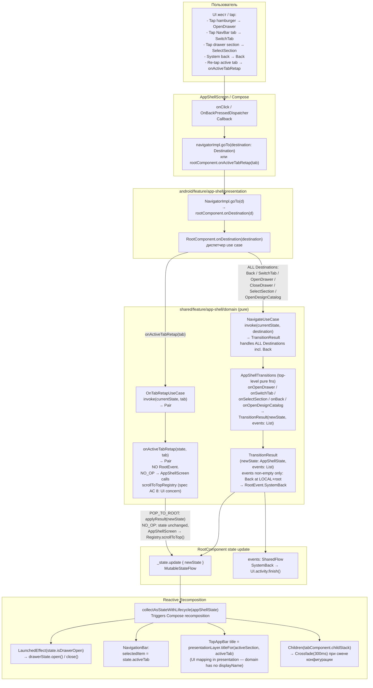

### State machine entry points (AppShellTransitions)

| Destination / trigger | Pure function | Возвращает | Файл:строка |
|-----------------------|--------------|-----------|-------------|
| `Destination.OpenDrawer` | `onOpenDrawer(state)` | `TransitionResult(state(isDrawerOpen=true), [])` — **no-op для SHOP** (returns unchanged state) | `AppShellTransitions.kt:285` |
| `Destination.CloseDrawer` | `navigate(state, CloseDrawer)` → internal | `TransitionResult(state(isDrawerOpen=false), [])` | `AppShellTransitions.kt:69` |
| `Destination.SwitchTab(tab)` | `onSwitchTab(state, target)` | `TransitionResult(newState(activeTab=target, TabState saved/restored), [])` | `AppShellTransitions.kt:148` |
| `Destination.SelectSection(section)` | `onSelectSection(state, section)` | `TransitionResult(newState(cross-tab+section+drawerClosed), [])` | `AppShellTransitions.kt:229` |
| `Destination.Back` | `onBack(state)` — 4-step FSM | `TransitionResult(newState, [])` (steps 1–3); `TransitionResult(state, [RootEvent.SystemBack])` (step 4) | `AppShellTransitions.kt:90` |
| `Destination.OpenDesignCatalog` | `onOpenDesignCatalog(state)` | `TransitionResult(newState(LOCAL, NavStack(DesignCatalogRoot), drawerClosed), [])` | `AppShellTransitions.kt:308` |
| `onActiveTabRetap(tab)` | `onActiveTabRetap(state, tab)` | `Pair<AppShellState, RetapOutcome>` — POP_TO_ROOT or NO_OP (no events) | `AppShellTransitions.kt:171` |

### Back FSM (4 steps) — AppShellTransitions.onBack

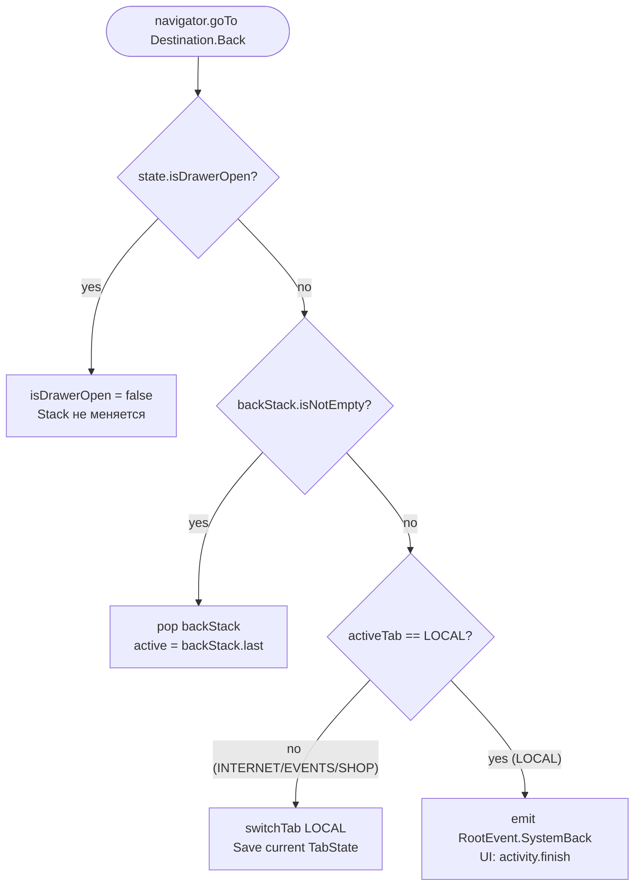

### Section Visibility gate (progressive unlock)

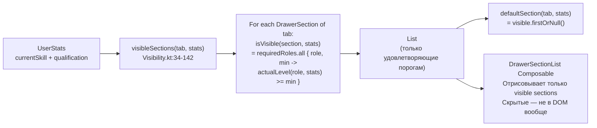

**Ключевые условия visibility** (из `DrawerSection.kt` + `0-spec.md:649-668`):

| Секция | requiredRoles | Виден guest? |
|--------|--------------|-------------|
| `LocalSection.*` (3 секции) | `emptyMap()` | Да |
| `InternetSection.Qualifications` | `emptyMap()` | Да |
| `InternetSection.Profile` | `emptyMap()` | Да |
| `InternetSection.Catalog` | `{USER to 3000}` | Нет (guest.currentSkill=0) |
| `InternetSection.Arena` | `{USER to 3000}` | Нет (guest.currentSkill=0) |
| `InternetSection.Social` | `{USER to 10000}` | Нет |
| `InternetSection.Leaderboard` | `{USER to 3000}` | Нет |
| `EventsSection.ActiveEvents` | `{TESTER to 100, MODERATOR to 100, ADMIN to 100, DEVELOPER to 100}` | Нет |
| `EventsSection.Minigames` | `{USER to 10000}` | Нет |

**Следствие**: при cold start с `UserStats.guest()` — Events tab показывает `EmptyRoot` sentinel, drawer Events пуст (только footer). Уведомлений «заблокировано» нет (spec FR #20: скрытые не отрисовываются).

---

## Reactive UI Sync: Drawer State

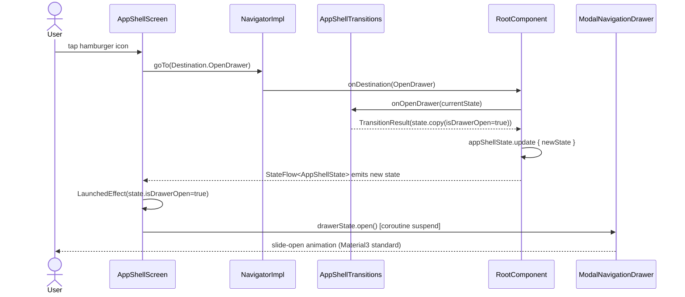

---

## Sequence (c): Cold Start

Описывает инициализацию компонентного дерева от `AppApplication.onCreate()` до первого рендера `AppShellScreen`.

```mermaid
sequenceDiagram
    participant App as AppApplication
    participant Koin
    participant MainActivity
    participant RootComp as DefaultRootComponent
    participant InitUC as InitializeAppShellUseCase
    participant Repo as UserStatsRepositoryImpl
    participant DataSource as FirebaseUserStatsDataSource
    participant UI as AppShellScreen

    App->>Koin: startKoin { androidContext; modules(firebaseModule, appShellDataModule, appShellPresentationModule) }
    Koin-->>App: KoinApplication ready

    MainActivity->>MainActivity: onCreate()
    MainActivity->>MainActivity: val ctx = defaultComponentContext()
    Note over MainActivity: ctx wires Activity.onBackPressedDispatcher → Essenty BackHandler
    MainActivity->>Koin: get<DefaultRootComponent>(parametersOf(ctx))
    Koin->>RootComp: DefaultRootComponent(ctx, initUC, navigateUC, observeUC, retapUC, userStatsRepo)

    Note over RootComp: init {} block — строго последовательно
    RootComp->>RootComp: _navigator = NavigatorImpl(this)
    RootComp->>RootComp: backHandler.register(BackCallback { onDestination(Back) })

    RootComp->>RootComp: scope.launch { initUseCase() }
    RootComp->>InitUC: invoke()
    InitUC->>Repo: currentStats()
    Repo->>DataSource: fetchRaw()
    DataSource-->>Repo: UserStats (или UserStats.guest() если offline)
    Repo-->>InitUC: UserStats
    InitUC-->>RootComp: AppShellState.default(stats)

    RootComp->>RootComp: applyResult(fallback, TransitionResult(initState, []))
    Note over RootComp: syncStack для всех 4 StackNavigation — aligns Decompose с domain NavStack
    RootComp->>RootComp: _state.update { initState }

    RootComp->>RootComp: scope.launch { observeStatsUC({ _state.value }).catch{...}.collect { newState -> _state.update { newState } } }
    Note over RootComp: Coroutine suspended — ObserveAppShellStateUseCase эмитит AppShellState при каждом Firestore snapshot

    MainActivity->>UI: setContent { AppShellScreen(rootComponent) }
    UI->>UI: val state by rootComponent.appShellState.collectAsStateWithLifecycle()
    UI-->>MainActivity: первый рендер: LOCAL tab, visible sections по UserStats
```

### Инварианты cold start

| Шаг | Инвариант |
|-----|-----------|
| `startKoin` до `setContent` | Koin ready до первого `get<>()` в MainActivity |
| `initUseCase()` до первого рендера | `_state` содержит реальные stats, не пустой объект |
| `syncStack` в `applyResult` | Все 4 Decompose StackNavigation синхронизированы с domain NavStack |
| `observeStats` после init | coroutine стартует после `_state.update`, не перезатирает initState |

---

## Sequence (d): Tab Switch — State Preservation

Описывает сохранение и восстановление `TabState` при переключении между вкладками.

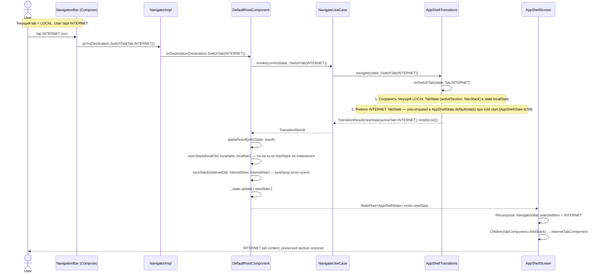

### Инварианты Tab Switch

| Инвариант | Где |
|-----------|-----|
| Все per-tab states **precomputed** в `AppShellState.default(stats)` при cold start | `AppShellState.kt:59-67` |
| `onSwitchTab` только меняет `activeTab` + `isDrawerOpen=false`; нет lazy visibleSections compute | `AppShellTransitions.kt:148` |
| Состояние LOCAL вкладки (позиция в NavStack) сохраняется в `state.localState` при уходе | `AppShellTransitions.onSwitchTab:148` |
| Decompose ChildStack обновляется только через `syncStack` — атомарно через `replaceAll` | `DefaultRootComponent.syncStack` |

---

## Sequence (e): Back FSM — Full Sequence

Полный sequence для 4-шагового FSM back-навигации (подробности FSM см. Back FSM flowchart выше).

> **Wiring requirement**: `EssentyBack` получает system back events **только** если `MainActivity` использует `defaultComponentContext()` extension (`com.arkivanov.decompose.defaultComponentContext`), а не ручной `DefaultComponentContext(lifecycle, stateKeeper)`. Ручной конструктор создаёт изолированный `BackDispatcher()`, не подключённый к `Activity.onBackPressedDispatcher`. See `01-architecture.md` OQ-COMP-3 (RESOLVED).

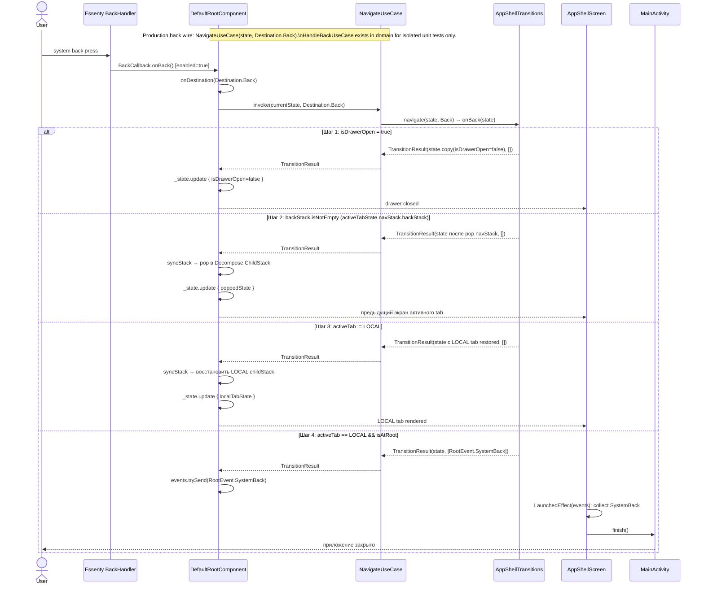

---

## Sequence (f): Re-tap Active Tab — Scroll-to-Top Hook

Описывает путь от повторного tap активной вкладки до скрола списка наверх.

> **Ownership**: `ScrollToTopRegistry` owned by `AppShellScreen` (CompositionLocal). `RootComponent` НЕ вызывает Registry — только возвращает `RetapOutcome`. Spec AC 8: `AppShellScreen` реагирует на `NO_OP` вызовом `scrollToTopRegistry.current(activeTab)?.scrollToTop()`.

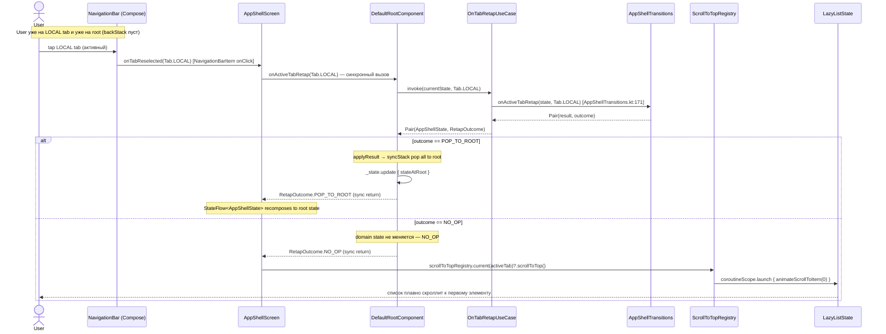

### ScrollToTopHook lifecycle (DisposableEffect)

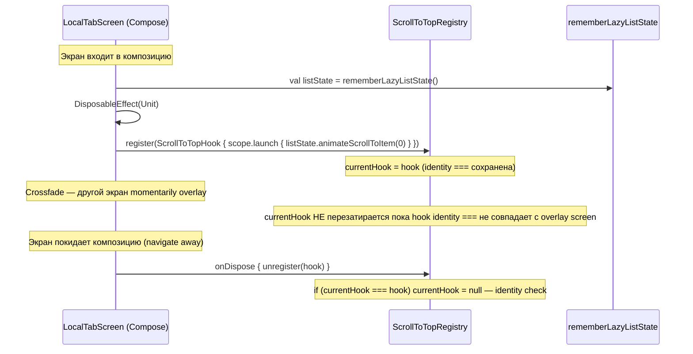

---

## Sequence (g): Cross-Tab Section Select

Описывает Destination.SelectSection когда target section принадлежит другой вкладке.

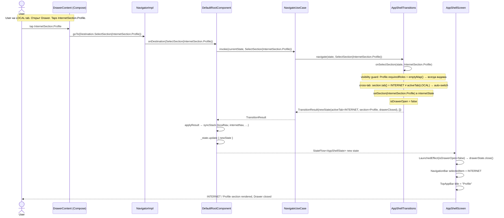

> **Journey 2 cross-reference** (Spec `0-spec.md:199-207`): hamburger → open drawer → tap Settings (same tab section) = комбинация sequence (k) [drawer open via snapshotFlow / programmatic] + sequence (g) [SelectSection]. Для same-tab section: `onSelectSection` row 2 [AppShellTransitions.kt:229] — set section, replace NavStack, close drawer. Full end-to-end трейс = (k) затем (g) с `DrawerSection.LocalSection.Settings`.

---

## Sequence (h): OpenDesignCatalog (Debug-Only)

Описывает путь к DesignCatalog через debug footer action в Drawer.

```mermaid
sequenceDiagram
    actor Dev as Developer
    participant Drawer as DrawerFooter (debug build)
    participant NavImpl as NavigatorImpl
    participant RootComp as DefaultRootComponent
    participant NavUC as NavigateUseCase
    participant Transitions as AppShellTransitions
    participant ChildStack as LocalTabComponent.childStack

    Note over Dev,Drawer: Debug build — DrawerFooterAction.DesignCatalog отрисован
    Dev->>Drawer: tap "Design Catalog"
    Drawer->>NavImpl: goTo(Destination.OpenDesignCatalog)
    NavImpl->>RootComp: onDestination(OpenDesignCatalog)
    RootComp->>NavUC: invoke(currentState, OpenDesignCatalog)
    NavUC->>Transitions: navigate(state, OpenDesignCatalog)
    Transitions->>Transitions: onOpenDesignCatalog(state)
    Note over Transitions: activeTab=LOCAL; localState=TabState(activeSection=null, stack=NavStack(DesignCatalogRoot, backStack=[]))
    Note over Transitions: REPLACE — не push. backStack очищается. Spec AC 15: back от DesignCatalog = system exit.
    Note over Transitions: AppShellTransitions.kt:308 — NavStack(active=LocalConfig.DesignCatalogRoot)
    Transitions-->>NavUC: TransitionResult(newState(LOCAL, NavStack(DesignCatalogRoot, []), drawerClosed), [])
    NavUC-->>RootComp: TransitionResult
    RootComp->>RootComp: applyResult
    RootComp->>RootComp: syncStack(localOld, localNew, localNav) → localNav.replaceAll(DesignCatalogRoot)
    RootComp->>RootComp: _state.update { newState }
    RootComp-->>Drawer: drawer closes (state.isDrawerOpen=false)
    ChildStack-->>Dev: LocalScreenComponent.Placeholder(config=LocalConfig.DesignCatalogRoot) rendered
    Note over Dev: Back from DesignCatalog: backStack=[] → FSM step 4 → SystemBack → activity.finish()
```

---

## Sequence (i): Cold Start / Process Death Recovery — Full Default State (MVP)

Описывает поведение при первом старте и при возврате после process death.
MVP: `AppShellState` не сериализуется. Каждый cold start = fresh default state из `InitializeAppShellUseCase`.

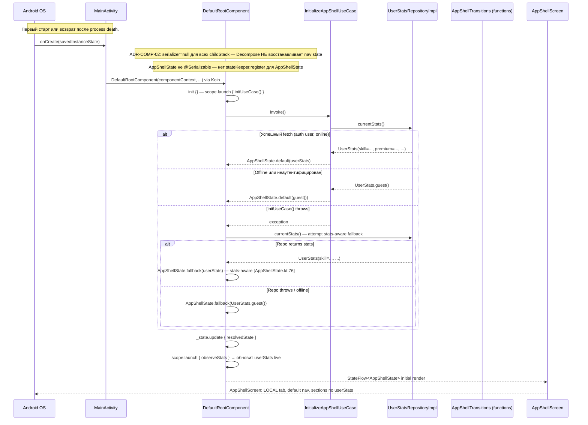

### Инварианты process death recovery (MVP)

| Инвариант | Обоснование |
|-----------|-------------|
| `AppShellState` не `@Serializable` — не восстанавливается после process death | ADR-COMP-02: `serializer=null` для всех childStack; `AppShellState` хранится только in-memory |
| Каждый cold start = fresh default state из `InitializeAppShellUseCase` | Репозиторий перечитывает `currentStats()` — навигация сбрасывается на LOCAL root |
| Fallback при exception → `AppShellState.fallback()` | `AppShellTransitions.kt:341` — гарантирует валидный state даже без сети |
| Full process-death восстановление (tab positions) — future work | MVP spec не требует точного восстановления sub-stack после death |

---

## Sequence (j): Runtime Progressive Unlock

Описывает реактивный путь от обновления `UserStats` до перерисовки Drawer (без авто-навигации).

```mermaid
sequenceDiagram
    participant Firestore
    participant DataSource as FirebaseUserStatsDataSource
    participant Repo as UserStatsRepositoryImpl
    participant UC as ObserveAppShellStateUseCase
    participant RootComp as DefaultRootComponent
    participant UI as AppShellScreen
    participant Visibility as visibleSections() [Visibility.kt]

    Note over Firestore: User набрал 3000 skill → Firestore doc обновился
    Firestore->>DataSource: snapshot listener event (newStats.currentSkill = 3000)
    DataSource->>Repo: emit(newStats) via Flow
    Repo-->>UC: Flow<UserStats> next emission
    UC->>UC: currentStateProvider().copy(userStats = newStats)
    Note over UC: currentStateProvider = { _state.value } — читает текущий nav state динамически
    Note over UC: ADR-COMP-01: нет stale closure — navigation preserved
    UC-->>RootComp: Flow<AppShellState> emits newState
    Note over RootComp: collecting в init{} coroutine (.catch { emit(AppShellState.fallback(guest())) })
    RootComp->>RootComp: _state.update { newState }
    Note over RootComp: ТОЛЬКО userStats обновляется — activeTab, navStack preserved via provider
    RootComp-->>UI: StateFlow<AppShellState> new state (same nav, new userStats)

    UI->>UI: collectAsStateWithLifecycle recompose
    UI->>Visibility: visibleSections(Tab.INTERNET, newStats)
    Note over Visibility: Visibility.kt:74 — declaration order: Arena, Catalog, Qualifications, Profile, Social, Leaderboard
    Note over Visibility: Arena: {USER to 3000} → visible; Leaderboard: {USER to 3000} → visible
    Note over Visibility: Social: {USER to 10000} → still hidden at skill=3000
    Visibility-->>UI: [Arena, Catalog, Qualifications, Profile, Leaderboard]
    UI->>UI: DrawerSectionList rerender — Arena и Leaderboard появляются в DOM
    Note over UI: НЕТ авто-навигации — activeSection и navStack не меняются
    UI-->>Firestore: [пользователь видит новые секции в Drawer без смены контента]
```

### Инвариант: только userStats — не навигация

`_state.update { newState }` обновляет весь `AppShellState` с сохранённой навигацией. `ObserveAppShellStateUseCase` использует `currentStateProvider().copy(userStats = stats)` — provider `{ _state.value }` читает актуальный nav state в момент каждого emit. Stale closure устранён. **ADR-COMP-01**: provider lambda — `03-decisions.md:13`.

---

## Sequence (k): Journey 7 — Edge-swipe open drawer

> Spec Journey 7. M3 `ModalNavigationDrawer` не имеет gesture callbacks. Sync через 2 `LaunchedEffect`:
> **1. gesture → domain**: `snapshotFlow { drawerState.currentValue }.collect { value → goTo(Open/CloseDrawer) }`
> **2. domain → gesture**: `LaunchedEffect(state.isDrawerOpen) { if (isDrawerOpen) drawerState.open() else drawerState.close() }`

```mermaid
sequenceDiagram
    actor User
    participant MND as ModalNavigationDrawer
    participant AppShellScreen as AppShellScreen
    participant NavImpl as NavigatorImpl
    participant RootComp as DefaultRootComponent
    participant NavUC as NavigateUseCase
    participant Transitions as AppShellTransitions

    Note over AppShellScreen,MND: LaunchedEffect(Unit): snapshotFlow { drawerState.currentValue }.collect { value -> sync domain }
    User->>MND: edge swipe gesture (gesturesEnabled=true)
    MND->>MND: drawerState.currentValue = DrawerValue.Open (M3 internal animation)
    MND-->>AppShellScreen: snapshotFlow emits DrawerValue.Open
    AppShellScreen->>NavImpl: goTo(Destination.OpenDrawer)
    NavImpl->>RootComp: onDestination(OpenDrawer)
    RootComp->>NavUC: invoke(currentState, OpenDrawer)
    NavUC->>Transitions: onOpenDrawer(state) [AppShellTransitions.kt:285]
    Note over Transitions: Guard: SHOP → no-op; others → isDrawerOpen=true
    Transitions-->>NavUC: TransitionResult(state.copy(isDrawerOpen=true), [])
    NavUC-->>RootComp: TransitionResult
    RootComp->>RootComp: _state.update { newState }
    RootComp-->>AppShellScreen: StateFlow<AppShellState> emits (isDrawerOpen=true)
    Note over AppShellScreen,MND: LaunchedEffect(state.isDrawerOpen=true): drawerState.open() — уже Open, idempotent
    MND-->>User: drawer fully open
```

---

## Sequence (l): Journey 8 — Scrim close drawer

> Spec Journey 8. User taps scrim → M3 closes drawer internally → `snapshotFlow` детектирует `DrawerValue.Closed` → `goTo(CloseDrawer)` → domain sync. [05-prior-art.md:92]

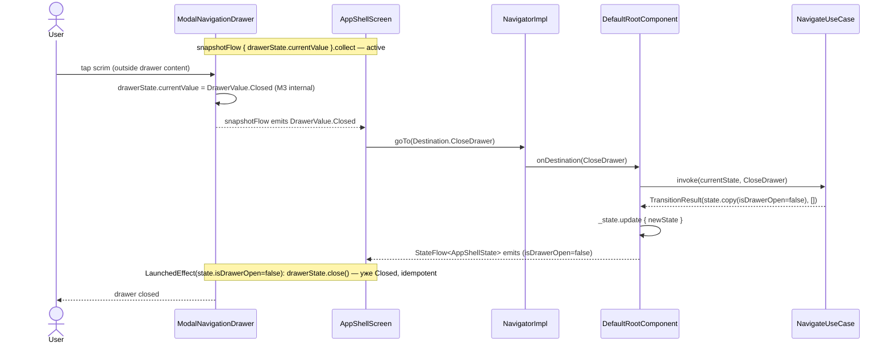

---

## Sequence (m): Journey 9 — Swipe close drawer

> Spec Journey 9. Идентичный `snapshotFlow` путь как Journey 8. `drawerState.currentValue → Closed` через swipe gesture → domain sync.

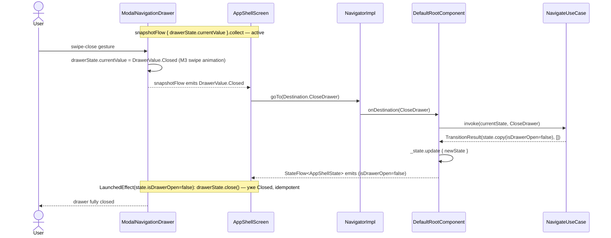

---

## Sequence (n): Journey 11 — Programmatic drawer open (deep link)

> Spec Journey 11. External caller → `Navigator.goTo(OpenDrawer)` → domain updates → `LaunchedEffect(state.isDrawerOpen)` imperatively calls `drawerState.open()` (no snapshotFlow needed — no gesture).

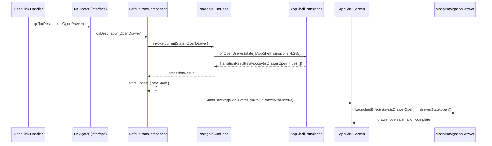

---

## Sequence (o): Journey 12 — Tap active drawer section (drawer closes only)

> Spec Journey 12. `onSelectSection` row 3 [AppShellTransitions.kt:229]: `activeSection == target` AND `isDrawerOpen=true` → close drawer, content unchanged.

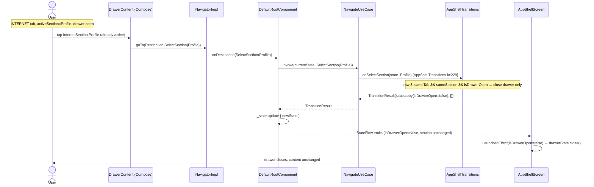

---

## Sequence (p): Journey 13 — Back on root SHOP tab

> Spec Journey 13. SHOP has no sub-stack. FSM step 3 [AppShellTransitions.kt:90]: `activeTab != LOCAL` → switchTab(LOCAL).

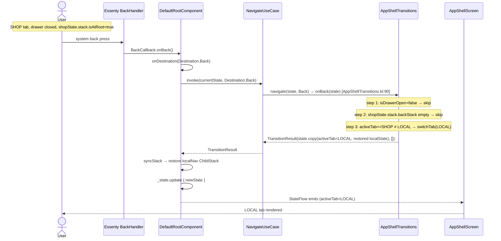

---

## Sequence (q): Journey 14b — Guest enters INTERNET tab

> Spec Journey 14b / `0-spec.md:307`. `internetState` **precomputed** в `AppShellState.default(guest)` при cold start: `initialInternetTabState(guest)` → `visibleSections=[Qualifications, Profile]` → `activeSection=Qualifications` [AppShellState.kt:59, Visibility.kt:74, DrawerSection.kt:62-65].
> `onSwitchTab` только меняет `activeTab` — нет lazy visibleSections compute.

```mermaid
sequenceDiagram
    actor User
    participant NavBar as NavigationBar (Compose)
    participant RootComp as DefaultRootComponent
    participant NavUC as NavigateUseCase
    participant Transitions as AppShellTransitions
    participant AppShellScreen as AppShellScreen

    Note over RootComp: Cold start precomputed [AppShellState.kt:59]:
    Note over RootComp: internetState = initialInternetTabState(guest) = (activeSection=Qualifications, stack.active=QualificationsRoot)
    Note over RootComp: visibleSections(INTERNET, guest) = [Qualifications, Profile] [DrawerSection.kt:62-65]
    Note over User: UserStats.guest() — currentSkill=0
    User->>NavBar: tap INTERNET icon
    NavBar->>RootComp: onDestination(SwitchTab(Tab.INTERNET))
    RootComp->>NavUC: invoke(currentState, SwitchTab(INTERNET))
    NavUC->>Transitions: onSwitchTab(state, INTERNET) [AppShellTransitions.kt:148]
    Note over Transitions: save LOCAL TabState; set activeTab=INTERNET, isDrawerOpen=false
    Note over Transitions: internetState already precomputed — НЕТ lazy visibleSections compute
    Transitions-->>NavUC: TransitionResult(newState(activeTab=INTERNET, internetState unchanged), [])
    NavUC-->>RootComp: TransitionResult
    RootComp->>RootComp: _state.update { newState }
    RootComp-->>AppShellScreen: StateFlow emits newState
    AppShellScreen-->>User: INTERNET / Qualifications rendered (precomputed: only Qualifications+Profile in drawer)
```

---

## Sequence (r): Journey 14c — Guest enters EVENTS tab

> Spec Journey 14c. `eventsState` **precomputed** в `AppShellState.default(guest)` при cold start: `initialEventsTabState(guest)` → `visibleSections(EVENTS, guest)=[]` → `activeSection=null, stack.active=EmptyRoot` [AppShellState.kt:59].
> `onSwitchTab` только меняет `activeTab` — нет lazy compute.

```mermaid
sequenceDiagram
    actor User
    participant NavBar as NavigationBar (Compose)
    participant RootComp as DefaultRootComponent
    participant NavUC as NavigateUseCase
    participant Transitions as AppShellTransitions
    participant AppShellScreen as AppShellScreen

    Note over RootComp: Cold start precomputed [AppShellState.kt:59]:
    Note over RootComp: eventsState = initialEventsTabState(guest) = (activeSection=null, stack.active=EmptyRoot)
    Note over RootComp: visibleSections(EVENTS, guest) = [] — all sections locked for guest
    Note over User: UserStats.guest() — all EventsSection require high qualification
    User->>NavBar: tap EVENTS icon
    NavBar->>RootComp: onDestination(SwitchTab(Tab.EVENTS))
    RootComp->>NavUC: invoke(currentState, SwitchTab(EVENTS))
    NavUC->>Transitions: onSwitchTab(state, EVENTS) [AppShellTransitions.kt:148]
    Note over Transitions: save LOCAL TabState; set activeTab=EVENTS, isDrawerOpen=false
    Note over Transitions: eventsState already precomputed — НЕТ lazy visibleSections compute
    Transitions-->>NavUC: TransitionResult(newState(activeTab=EVENTS, eventsState unchanged), [])
    NavUC-->>RootComp: TransitionResult
    RootComp->>RootComp: _state.update { newState }
    RootComp-->>AppShellScreen: StateFlow emits newState
    AppShellScreen-->>User: EVENTS tab — EmptyRoot sentinel rendered (precomputed: activeSection=null, drawer empty)
```
