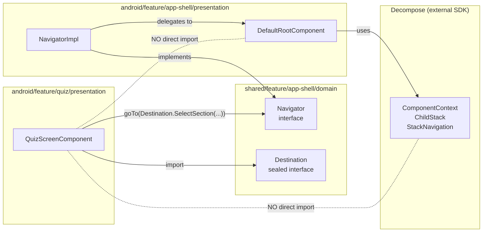

# API Contract: App Shell Menu

Публичные контракты фичи: что производит app-shell и что потребляют внешние feature-модули.

Базовый пакет: `com.tpov.schoolquiz.shared.feature.app_shell.domain`

---

## 1. Navigator Interface Contract

**Расположение (phase-01, создаётся backend-dev/frontend-dev):**
`shared/feature/app-shell/domain/src/commonMain/.../navigation/Navigator.kt`

**Решение**: ADR-COMP-04 Path A — interface в `shared/feature/app-shell/domain/commonMain`. Spec NFR #3: feature-presentation модули импортируют только `Navigator + Destination`, не Decompose API.

```kotlin
package com.tpov.schoolquiz.shared.feature.app_shell.domain.navigation

import com.tpov.schoolquiz.shared.feature.app_shell.domain.model.Destination

/**
 * Single navigation entry-point for all feature-presentation modules.
 *
 * KMP-pure: no Android, no Decompose in this interface.
 * Feature modules depend only on Navigator + Destination — never on RootComponent directly.
 *
 * Spec FR #16, NFR #3. See ADR-COMP-04.
 */
interface Navigator {
    fun goTo(destination: Destination)
}
```

**Navigator создание**: `NavigatorImpl(rootComponent)` создаётся ВНУТРИ `DefaultRootComponent.init{}` (per `01-architecture.md:389`) — не отдельный Koin binding. Доступ из UI: через `rootComponent.navigator`. Feature-модули получают `Navigator` как параметр конструктора своих ViewModels/Components (передаётся вручную через Decompose `ChildFactory`).

Это избегает runtime `MissingPropertyException` в Koin 3.5.x при попытке `get<RootComponent>()` без `parametersOf(componentContext)`. `RootComponent` является parametrized factory, доступен только через `get<RootComponent>(parametersOf(ctx))` в MainActivity.

**Boundary diagram** — что ВИДЯТ feature-модули, что НЕ видят:



---

## 2. Destination Sealed — Full Shape

**Файл**: `domain/model/Destination.kt:9`

```kotlin
sealed interface Destination {
    /** Navigate back via FSM: drawer→pop→switchLocal→SystemBack. Destination.kt:11 */
    data object Back : Destination

    /**
     * Switch to target tab, preserving all TabStates.
     * If tab == activeTab: delegates to onActiveTabRetap FSM. Destination.kt:14
     */
    data class SwitchTab(val tab: Tab) : Destination

    /**
     * Select a drawer section.
     * - If section.tab != activeTab: auto-switches tab first (BR #6).
     * - If !isVisible(section, stats): no-op (BR #20 domain guard).
     * - If section == activeSection AND drawer open: only closes drawer (BR #12).
     * Destination.kt:20
     */
    data class SelectSection(val section: DrawerSection) : Destination

    /** Open side drawer. No-op guard if activeTab == SHOP (BR #5). Destination.kt:23 */
    data object OpenDrawer : Destination

    /** Close side drawer. Destination.kt:25 */
    data object CloseDrawer : Destination

    /**
     * Open DesignCatalog dev tool (debug only).
     * Result: activeTab=LOCAL, activeSection=null, stack.active=LocalConfig.DesignCatalogRoot,
     * backStack=[], isDrawerOpen=false.
     * UI-guard: rendered only in debug build (AppShellScreen checks BuildConfig.DEBUG).
     * Destination.kt:34
     */
    data object OpenDesignCatalog : Destination
}
```

**Usage examples** (для feature-developers):

```kotlin
// Навигация назад:
navigator.goTo(Destination.Back)

// Переключить вкладку:
navigator.goTo(Destination.SwitchTab(Tab.INTERNET))

// Открыть раздел (возможно cross-tab):
navigator.goTo(Destination.SelectSection(DrawerSection.InternetSection.Profile))

// Открыть drawer программно:
navigator.goTo(Destination.OpenDrawer)

// Из system-back handler (UI слой):
val callback = object : OnBackPressedCallback(true) {
    override fun handleOnBackPressed() = navigator.goTo(Destination.Back)
}
onBackPressedDispatcher.addCallback(this, callback)
```

---

## 3. DeepLink Boundary

**Файл**: `domain/model/DeepLink.kt:9`

```kotlin
/** Platform-neutral deep link container. DeepLink.kt:9 */
data class DeepLink(val uri: String)
```

**Boundary** — Android → domain mapping (только в `apps/android-next/MainActivity.kt`):

```kotlin
// В MainActivity.onNewIntent:
override fun onNewIntent(intent: Intent?) {
    super.onNewIntent(intent)
    val deepLink = DeepLink(intent?.dataString ?: "")
    rootComponent.onDeepLink(deepLink)   // domain stub, MVP no-op
}
```

**RootEvent** (domain → UI events channel):

`domain/model/RootEvent.kt:12`

```kotlin
sealed interface RootEvent {
    data object SystemBack : RootEvent  // RootEvent.kt:17
}
// UI collects: rootComponent.events.collect { if (it == SystemBack) activity.finish() }
```

**Контракт RootComponent** (interface в domain per ADR-0011, реализация в presentation):

```kotlin
// Создаётся phase-01 в domain/navigation/RootComponent.kt
interface RootComponent {
    val appShellState: Flow<AppShellState>    // cold MutableStateFlow
    val events: Flow<RootEvent>               // SharedFlow, no replay
    fun onDestination(destination: Destination)
    fun onActiveTabRetap(tab: Tab): RetapOutcome
    fun onDeepLink(deepLink: DeepLink)
}
```

> **ADR-0011**: `RootComponent` interface в domain (pure Kotlin / Flow API), `DefaultRootComponent` impl в `android/feature/app-shell/presentation/` (Decompose ComponentBase). Это разрешает конфликт spec NFR #1 (KMP) vs Invariant #1 (no Decompose in domain). `Flow<AppShellState>` — чистый coroutines тип, допустим в domain.

---

## 4. UserStatsRepository Contract

**Файл**: `domain/repository/UserStatsRepository.kt:15`

```kotlin
interface UserStatsRepository {
    /**
     * Cold flow. First emission = current persisted state.
     * First emission may be UserStats.guest() for unauthenticated users.
     * UserStatsRepository.kt:24
     */
    fun observeStats(): Flow<UserStats>

    /**
     * One-shot snapshot. Cold start / fallback initialisation.
     * Returns UserStats.guest() if no authenticated user. UserStatsRepository.kt:30
     */
    suspend fun currentStats(): UserStats
}
```

**Production impl contract** (создаётся phase-01 в `shared/feature/app-shell/data/`):

```kotlin
class UserStatsRepositoryImpl(
    private val dataSource: UserStatsDataSource,   // interface, impl в platform/firebase
) : UserStatsRepository {

    override fun observeStats(): Flow<UserStats> =
        dataSource.observeRaw()
            .map { raw -> raw.toDomain() }
            .catch { emit(UserStats.guest()) }    // Spec Error Recovery #4

    override suspend fun currentStats(): UserStats =
        runCatching { dataSource.fetchRaw().toDomain() }    // single fetch per 02-behavior.md:255-259, 08-storage-model.md:23
            .getOrDefault(UserStats.guest())
}
```

**UserStats data class**: `domain/model/UserStats.kt:11`

```
data class UserStats(
    nickname: String, avatarUrl: String?, hasPremium: Boolean,
    streakDays: Int,              // 0..10 (drawer streak bar)
    stars: Long, nolics: Long,
    standardHearts: Int,          // 0..5
    goldHearts: Int,              // 0..1
    gold: Long,
    currentSkill: Int,            // >= 0, maps to Role.USER
    qualification: Qualification, // maps to roles TESTER..DEVELOPER
)
```

`UserStats.guest()` factory: `domain/model/UserStats.kt:33`

---

## 5. Koin Module Published APIs

Каждый модуль публикует ровно один Koin val (ADR-0009 Rule 1).

### `appShellDataModule` — `shared/feature/app-shell/data/src/commonMain/kotlin/.../di/`

```kotlin
val appShellDataModule = module {
    // UserStatsDataSource lives in shared/core/stats/ — binding in firebaseModule (per OQ-COMP-5 resolution)
    single<UserStatsRepository> { UserStatsRepositoryImpl(get()) }  // gets UserStatsDataSource from firebaseModule
}
```

### `appShellPresentationModule` — `android/feature/app-shell/presentation/src/main/kotlin/.../di/`

```kotlin
val appShellPresentationModule = module {
    factory<RootComponent> { (context: ComponentContext) ->  // factory, не single — per ADR-COMP-07 (Activity-scoped ComponentContext)
        DefaultRootComponent(
            componentContext = context,
            initUseCase = get(),
            navigateUseCase = get(),
            observeUseCase = get(),
            retapUseCase = get(),
            // handleBackUseCase NOT injected — production back via navigateUseCase(state, Destination.Back) per ADR-COMP-07
            // userStatsRepository NOT a direct dep — injected inside InitializeAppShellUseCase + ObserveAppShellStateUseCase
        )
    }
    single<Navigator> { NavigatorImpl(get<RootComponent>()) }
    // Use cases — factory (per RootComponent lifecycle):
    factory { InitializeAppShellUseCase(get()) }     // gets UserStatsRepository
    factory { NavigateUseCase() }
    factory { OnTabRetapUseCase() }
    factory { ObserveAppShellStateUseCase(get()) }   // gets UserStatsRepository
    factory { HandleBackUseCase() }                  // domain tests only — NOT wired into DefaultRootComponent
}
```

### `firebaseModule` — `platform/firebase/src/main/kotlin/.../di/`

```kotlin
val firebaseModule = module {
    single<UserStatsDataSource> { FirebaseUserStatsDataSource(Firebase.firestore) }
}
```

### Integration в `apps/android-next/MainActivity.kt` (или `AppApplication.kt`)

```kotlin
startKoin {
    androidContext(this@AppApplication)    // per ADR-0011 update: Application, not Activity
    modules(
        firebaseModule,            // platform/firebase
        appShellDataModule,                // shared/feature/app-shell/data
        appShellPresentationModule,        // android/feature/app-shell/presentation
        // future: quizDataModule, quizPresentationModule, ...
    )
}
```

> **OQ#3 resolved** (per web-researcher evidence): `startKoin` переносится в `AppApplication : Application`, не в `MainActivity`. Требует обновления ADR-0009. Зафиксировано в `03-decisions.md`.

---

## 6. ScrollToTopRegistry + CompositionLocal API

**UI-layer contract** (per ADR-COMP-06, создаётся в `android/feature/app-shell/presentation/`).

```kotlin
// Контракт регистрации scroll-to-top для scrollable экранов
interface ScrollToTopHook {
    /**
     * Scrolls content to top. Returns true if scrolled, false if already at top.
     * Called by AppShellScreen on RetapOutcome.NO_OP.
     */
    suspend fun scrollToTop(): Boolean
}

/**
 * Registry: per-tab storage of ScrollToTopHook.
 * Identity-aware unregister: prevents outgoing crossfade screen from removing
 * incoming screen's fresh hook (spec FR #9 / Scope 3).
 */
class ScrollToTopRegistry {
    fun register(tab: Tab, hook: ScrollToTopHook)
    fun unregister(tab: Tab, hook: ScrollToTopHook)  // identity-checked: only removes if hook === current
    fun current(tab: Tab): ScrollToTopHook?
}

// CompositionLocal for injection into scrollable composables
val LocalScrollToTopRegistry = staticCompositionLocalOf<ScrollToTopRegistry> {
    error("ScrollToTopRegistry not provided — wrap in AppShellScreen")
}
```

**Usage pattern в scrollable placeholder screen:**

```kotlin
@Composable
fun MyQuestsScreen(tab: Tab) {
    val registry = LocalScrollToTopRegistry.current
    val listState = rememberLazyListState()

    DisposableEffect(Unit) {
        val hook = object : ScrollToTopHook {
            override suspend fun scrollToTop(): Boolean {
                val atTop = listState.firstVisibleItemIndex == 0
                if (!atTop) listState.animateScrollToItem(0)
                return !atTop
            }
        }
        registry.register(tab, hook)
        onDispose { registry.unregister(tab, hook) }
    }
    // ... content
}
```

**AppShellScreen usage** (при `RetapOutcome.NO_OP`):

```kotlin
// В AppShellScreen при обработке onActiveTabRetap:
val outcome = rootComponent.onActiveTabRetap(activeTab)
if (outcome == RetapOutcome.NO_OP) {
    coroutineScope.launch {
        scrollToTopRegistry.current(activeTab)?.scrollToTop()
    }
}
```

---

## 7. SchoolQuizTheme + DS Wrappers Published Surface

**Модуль**: `android/core/designsystem`

### SchoolQuizTheme

```kotlin
// android/core/designsystem/src/main/kotlin/.../SchoolQuizTheme.kt
@Composable
fun SchoolQuizTheme(content: @Composable () -> Unit) {
    MaterialTheme(
        colorScheme = schoolQuizDarkColorScheme,  // #000000 bg, #4285F4 primary, etc.
        shapes = schoolQuizShapes,                 // extraSmall=4, small=8, medium=12, large=16, extraLarge=24
        typography = MaterialTheme.typography,     // M3 defaults (Roboto/System)
        content = content,
    )
}
```

**ADR-0010 rules**: все экраны оборачиваются в `SchoolQuizTheme { ... }`. Только `MaterialTheme.colorScheme.X` — без hardcoded цветов.

### Brand Components — контракт публичных параметров

| Component | Signature | Note |
|-----------|-----------|------|
| `BrandCard` | `@Composable fun BrandCard(modifier, content)` | Surface + 1dp outline + 16dp corners |
| `BrandPrimaryButton` | `@Composable fun BrandPrimaryButton(text, onClick, modifier, enabled)` | M3 Button + brandColorScheme |
| `BrandSecondaryButton` | `@Composable fun BrandSecondaryButton(text, onClick, modifier, enabled)` | M3 OutlinedButton |
| `BrandProgressBar` | `@Composable fun BrandProgressBar(progress: Float, modifier, height: Dp, color)` | Linear, colored fill; height default = 8.dp |
| `BrandCircleIconButton` | `@Composable fun BrandCircleIconButton(icon, contentDescription, onClick, modifier)` | Круглая + 1dp stroke |
| `CategoryIcon` | `@Composable fun CategoryIcon(icon, contentDescription: String?, modifier, tint: Color)` | Квадратная цветная иконка; contentDescription required for accessibility |

### Placeholder и debug screens

```kotlin
// android/feature/app-shell/presentation/src/main/kotlin/.../UnderConstructionScreen.kt
@Composable
fun UnderConstructionScreen(
    title: String,
    icon: ImageVector = Icons.Default.Construction,
    modifier: Modifier = Modifier,
)

// android/core/designsystem/src/main/kotlin/.../DesignCatalogScreen.kt
@Composable
fun DesignCatalogScreen()  // debug-only; runtime; no @Preview wrapper required (само является каталогом)
```

**AppShellScreen**: рендерит `DesignCatalogScreen` только при `BuildConfig.DEBUG`. В release при `LocalConfig.DesignCatalogRoot` → fallback `UnderConstructionScreen("Недоступно")` (AC #16).

---

## 8. External SDK Consumption Map

| SDK | Version | Consumed by | Mechanism | Не видят |
|-----|---------|-------------|-----------|---------|
| **Decompose 3.1.0** | `decompose:3.1.0`, `essenty-lifecycle:2.1.0`, `essenty-state-keeper:2.1.0` | `android/feature/app-shell/presentation` (DefaultRootComponent, TabComponents), `android/core/navigation` (helpers) | Gradle dep | domain, designsystem, data |
| **Compose BOM 2024.09.02** (Material3) | `compose-bom`, `compose-material3`, `compose-material-icons-extended` | `android/feature/app-shell/presentation`, `android/core/designsystem`, `apps/android-next` | Gradle dep | domain, data |
| **Koin 3.5.6** | `koin-core`, `koin-android`, `koin-androidx-compose` | `android/feature/app-shell/presentation` (di/), `shared/feature/app-shell/data` (di/), `apps/android-next` (startKoin), `platform/firebase` (di/) | Gradle dep | domain (напрямую не зависит) |
| **Google Firebase BOM 33.2.0** | `firebase-bom:33.2.0`, `firebase-firestore-ktx` (уже в `platform/firebase/build.gradle.kts:9-12`) | `platform/firebase` ТОЛЬКО (androidMain) | Gradle dep | все остальные модули |
| **kotlinx-serialization-json 1.6.3** | `kotlinx-serialization-json` | **NOT consumed в MVP** — per ADR-LEAD-01 + ADR-COMP-05 state-saving deferred; plugin не применяется в `shared/feature/app-shell/domain/build.gradle.kts` в phase-01. Future feature добавит одновременно с `@Serializable` на `TabConfig`. | — | — |
| **kotlinx-coroutines-core 1.7.3** | (KMP) | `shared/feature/app-shell/domain` (Flow), `shared/feature/app-shell/data` | `commonMain` dep | UI не напрямую |

**Decompose BackHandler rule** (подтверждено web-researcher):
- `android/feature/app-shell/presentation/DefaultRootComponent` использует Essenty `BackHandler` (из `ComponentContext`)
- Jetpack `BackHandler` в child-компонентах = global intercept = broken hierarchy
- Правило: только Essenty `BackHandler` в Decompose компонентах

---

## 9. REST / WebSocket

**N/A.** Фича app-shell-menu не имеет сетевых вызовов. `UserStatsRepository` читает Firestore через snapshot listener (не HTTP). Deep link URL patterns в MVP не зарегистрированы.

---

## Invariant check

| Invariant | Status |
|-----------|--------|
| #1 Domain purity | `Navigator` interface — pure Kotlin, no Android. `UserStatsRepository` — pure Kotlin interface. `DeepLink` — pure data class. ✅ |
| #3 No bidirectional coupling | feature → domain (Navigator, Destination). domain ← data (UserStatsRepository impl). Unidirectional. ✅ |
| ADR-0001 Rule 1 | Firebase SDK только в `platform/firebase`. `android/*` → `shared/*` contracts only. ✅ |
| Spec NFR #3 | feature-presentation импортирует только `Navigator + Destination`, не Decompose. ✅ (enforced by Gradle dep scope) |
