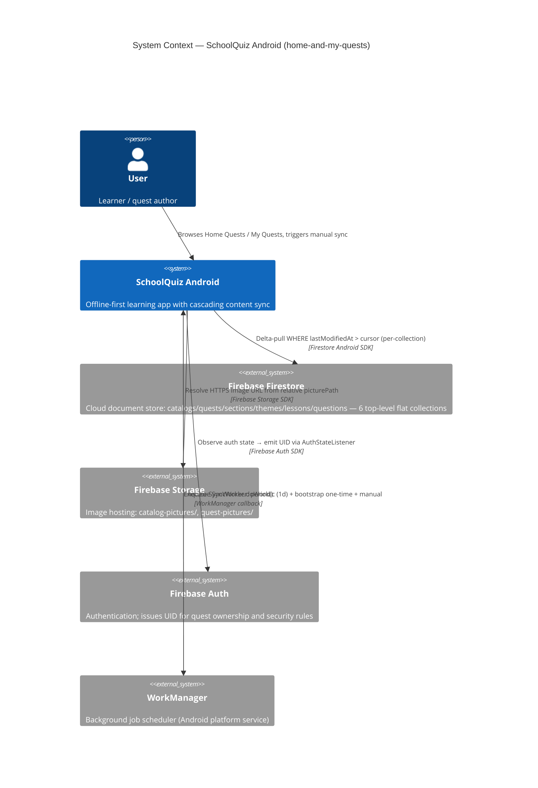
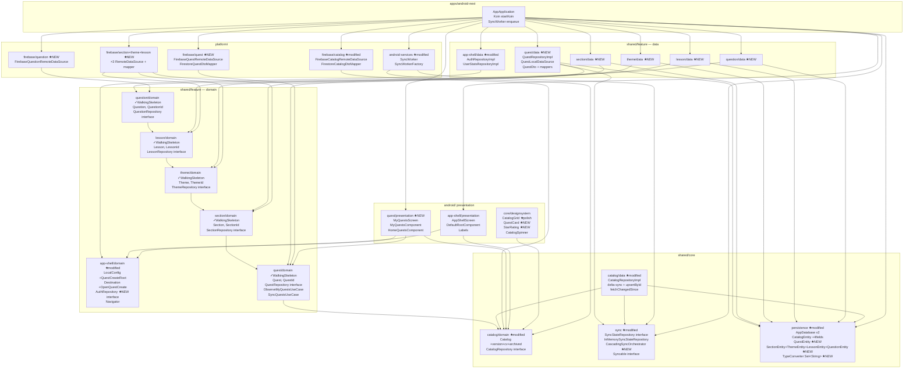
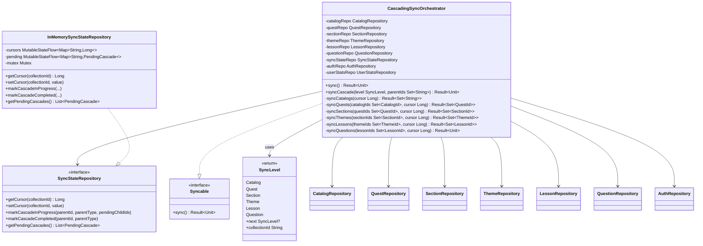
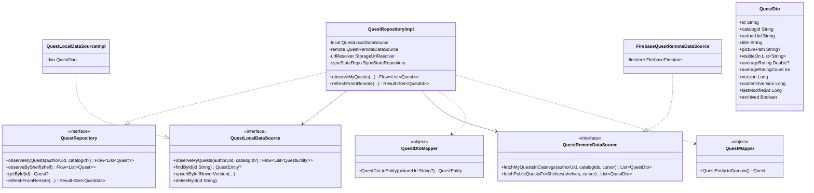
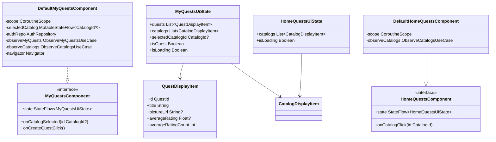

# Architecture: Home Quests & My Quests + Cascading Catalog Sync

> **Status: TO-BE** — описывает состояние после phase-01 implementation.
> Модули/классы/методы, помеченные `(NEW)` или `(EXTENDED)`, не существуют в текущей кодовой базе — создаются в phase-01 согласно `docs/features/home-and-my-quests/plan/phase-01/`.
> AS-IS snapshot текущего кода: см. `2-grounding.md`.
> Существующий код: `shared/core/persistence/AppDatabase.kt` (v1, 2 entities), `shared/core/catalog/*`, `apps/android-next/di/SyncModule.kt`.

## C4 L1 — System Context



---

## C4 L2 — Container Diagram (modules)



---

## Modules Affected — Summary Table

| Module | Status | Change |
|--------|--------|--------|
| `shared/core/catalog/domain` | **modified** | `Catalog` + 4 поля; invariants расширены |
| `shared/core/catalog/data` | **modified** | `fetchChangedSince(cursor)`, `upsertByIdIfNewerVersion`, `deleteById`; `archived` обработка |
| `shared/core/persistence` | **modified** | Schema v1→v2; `CatalogEntity` +4 cols; 5 новых Entity; `fallbackToDestructiveMigration`; `TypeConverter` для `Set<String>` |
| `shared/core/sync` | **modified** | Koin binding `SyncStateRepository`; новый `CascadingSyncOrchestrator implements Syncable` |
| `shared/feature/quest/domain` | existing (Walking Skeleton ✓) | интегрируется без переписывания |
| `shared/feature/quest/data` | **NEW** | полный data stack: RepositoryImpl, LocalDataSource, DTO, mappers, DI module |
| `shared/feature/section/domain` | existing (Walking Skeleton ✓) | интегрируется |
| `shared/feature/section/data` | **NEW** | полный data stack |
| `shared/feature/theme/domain` | existing (Walking Skeleton ✓) | интегрируется |
| `shared/feature/theme/data` | **NEW** | полный data stack |
| `shared/feature/lesson/domain` | existing (Walking Skeleton ✓) | интегрируется |
| `shared/feature/lesson/data` | **NEW** | полный data stack |
| `shared/feature/question/domain` | existing (Walking Skeleton ✓) | интегрируется |
| `shared/feature/question/data` | **NEW** | полный data stack |
| `shared/feature/app-shell/domain` | **modified** | `LocalConfig.QuestCreateRoot`; `Destination.OpenQuestCreate`; `AuthRepository` interface |
| `shared/feature/app-shell/data` | **modified** | `AuthRepositoryImpl` обёртывает `authUidFlow` из `AppApplication.kt:41` |
| `android/feature/quest/presentation` | **NEW** | `MyQuestsScreen` + `MyQuestsComponent` + `HomeQuestsComponent`; Koin module |
| `android/feature/app-shell/presentation` | **modified** | routing в `AppShellScreen`; `DefaultRootComponent.onDestination(OpenQuestCreate)`; `Labels.kt` exhaustive when |
| `android/core/designsystem` | **modified** | `QuestCard` + `StarRating` (NEW); `CatalogGrid` typography polish |
| `platform/firebase/catalog` | **modified** | `fetchChangedSince(cursor: Long)` + читает 4 новых поля из DocumentSnapshot |
| `platform/firebase/quest` | **NEW** | `FirebaseQuestRemoteDataSource`; dual-query (A+B); `FirestoreQuestDtoMapper`; Koin module |
| `platform/firebase/section` | **NEW** | remote source + mapper + Koin module |
| `platform/firebase/theme` | **NEW** | remote source + mapper + Koin module |
| `platform/firebase/lesson` | **NEW** | remote source + mapper + Koin module |
| `platform/firebase/question` | **NEW** | remote source + mapper + Koin module |
| `platform/android-services` | **modified** | `SyncWorker` инжектирует `CascadingSyncOrchestrator` как единственный `Syncable` для каскада |
| `apps/android-next` | **modified** | `startKoin` + ~12 новых модулей; cleanup `quiz/` из `settings.gradle.kts` |

**Cleanup (Decision #44):**

| Module / File | Action |
|---------------|--------|
| `shared/feature/quiz/domain` | **DELETED** — empty scaffold, `settings.gradle.kts:47` строка убирается |
| `shared/feature/quiz/data` | **DELETED** — empty scaffold, `settings.gradle.kts:48` строка убирается |
| `android/feature/quiz/presentation` | **DELETED** — empty scaffold, `settings.gradle.kts:71` строка убирается |
| `shared/core/catalog/domain/model/Quest.kt` | **DELETED** — placeholder, duplicate QuestId |
| `shared/core/catalog/domain/repository/QuestRepository.kt` | **DELETED** — placeholder (1 метод `save`) |
| `shared/core/catalog/domain/use_case/CreateQuestUseCase.kt` | **DELETED** — использует placeholder |
| `shared/core/catalog/domain/…/fake/FakeQuestRepository.kt` | **DELETED** — для placeholder |
| `shared/core/catalog/domain/…/QuestCatalogLinkTest.kt` | **DELETED** — тест placeholder |

---

## Cross-Feature Dependency Rules (Invariant #3)

Направление зависимостей строго **одностороннее** вниз по каскаду:

```
Question → Lesson → Theme → Section → Quest → Catalog(core)
```

| Зависимость | Разрешена? | Механизм |
|------------|-----------|---------|
| `quest/domain` → `catalog/domain` (CatalogId) | **YES** | catalog — core shared type |
| `section/domain` → `quest/domain` (QuestId) | **YES** | parent-id reference, one-way |
| `theme/domain` → `section/domain` (SectionId) | **YES** | one-way |
| `lesson/domain` → `theme/domain` (ThemeId) | **YES** | one-way |
| `question/domain` → `lesson/domain` (LessonId) | **YES** | one-way |
| `catalog/domain` → `quest/domain` | **FORBIDDEN** | нарушит Invariant #3 |
| `feature-A/data` → `feature-B/data` (прямой) | **FORBIDDEN** | нарушит Invariant #3 |
| `android/presentation` → `shared/*/data` (прямой) | **FORBIDDEN** | нарушит Clean Architecture |

Bidirectional coupling между любыми двумя feature-модулями — **blocker**, независимо от механизма.

---

## Module Ownership по Clean Architecture Layer

| Layer | Modules | Depends on |
|-------|---------|-----------|
| **domain** | `shared/feature/*/domain`, `shared/core/catalog/domain`, `shared/core/sync` | ничего (или другой domain через one-way) |
| **data** | `shared/feature/*/data`, `shared/core/catalog/data` | domain + `shared/core/persistence` + `shared/core/sync` |
| **platform adapters** | `platform/firebase/*`, `platform/android-services` | domain interfaces (RemoteDataSource impls) |
| **presentation** | `android/feature/*/presentation` | domain interfaces + Decompose |
| **ui / design** | `android/core/designsystem` | domain models (display items) |
| **composition root** | `apps/android-next` | все вышеперечисленные (Koin wiring) |

---

## Firestore — External System Topology

6 flat top-level collections (не subcollections — Decision #2 / Decision #16):

```
Firestore
├── catalogs/{catalogId}         — extended: +version, +contentsVersion, +lastModifiedAt, +archived
├── quests/{questId}             — NEW: catalogId, authorUid, visibleOn[], version, contentsVersion, lastModifiedAt, archived
├── sections/{sectionId}         — NEW: questId, title, order, version, contentsVersion, lastModifiedAt, archived
├── themes/{themeId}             — NEW: sectionId, title, order, version, contentsVersion, lastModifiedAt, archived
├── lessons/{lessonId}           — NEW: themeId, title, order, version, contentsVersion, lastModifiedAt, archived
└── questions/{questionId}       — NEW: lessonId, text, payload, language, order, version, lastModifiedAt, archived
```

Связь: исключительно через parent-id поля (`Quest.catalogId`, `Section.questId`, …). Нет subcollection-иерархии — обеспечивает cross-catalog "Мои квесты" фильтр одним Firestore query.

---

## Open Questions

*Нет blocker-уровня: все Design-фазовые вопросы закрыты Decisions #41-55. Детали см. `03-decisions.md`.*

---

## C4 L3 — Component Diagrams (architect-component)

### CascadingSyncOrchestrator Components



**Location**: `shared/core/sync/src/commonMain/kotlin/com/tpov/schoolquiz/shared/core/sync/CascadingSyncOrchestrator.kt`

---

### Quest Data Stack — Full Component Diagram



**Pattern**: идентичен `CatalogRepositoryImpl.kt:13` — canonical reference для реализации.

---

### Interface ↔ Implementation Pairs Table

| Interface | Implementation | Module |
|-----------|----------------|--------|
| `CatalogRepository` | `CatalogRepositoryImpl` | `shared/core/catalog/data` |
| `CatalogLocalDataSource` | `CatalogLocalDataSourceImpl` | `shared/core/catalog/data` |
| `CatalogRemoteDataSource` | `FirebaseCatalogRemoteDataSource` | `platform/firebase/catalog` |
| `QuestRepository` | `QuestRepositoryImpl` | `shared/feature/quest/data` |
| `QuestLocalDataSource` | `QuestLocalDataSourceImpl` | `shared/feature/quest/data` |
| `QuestRemoteDataSource` | `FirebaseQuestRemoteDataSource` | `platform/firebase/quest` |
| `SectionRepository` | `SectionRepositoryImpl` | `shared/feature/section/data` |
| `SectionRemoteDataSource` | `FirebaseSectionRemoteDataSource` | `platform/firebase/section` |
| `ThemeRepository` | `ThemeRepositoryImpl` | `shared/feature/theme/data` |
| `ThemeRemoteDataSource` | `FirebaseThemeRemoteDataSource` | `platform/firebase/theme` |
| `LessonRepository` | `LessonRepositoryImpl` | `shared/feature/lesson/data` |
| `LessonRemoteDataSource` | `FirebaseLessonRemoteDataSource` | `platform/firebase/lesson` |
| `QuestionRepository` | `QuestionRepositoryImpl` | `shared/feature/question/data` |
| `QuestionRemoteDataSource` | `FirebaseQuestionRemoteDataSource` | `platform/firebase/question` |
| `SyncStateRepository` | `InMemorySyncStateRepository` | `shared/core/sync` |
| `AuthRepository` | `AuthRepositoryImpl` | `shared/feature/app-shell/data` |
| `MyQuestsComponent` | `DefaultMyQuestsComponent` | `android/feature/quest/presentation` |
| `HomeQuestsComponent` | `DefaultHomeQuestsComponent` | `android/feature/quest/presentation` |
| `StorageUrlResolver` | Firebase SAM lambda | `platform/firebase/catalog` |

---

### Presentation Components — Class Diagram



**Lifecycle**: `lifecycle.coroutineScope(mainContext + SupervisorJob())` через Essenty `lifecycle-coroutines`. `mainContext: CoroutineContext` — constructor param (не hardcode `Dispatchers.Main`) для testability. В production: `Dispatchers.Main.immediate`; в тестах: `UnconfinedTestDispatcher`.

**QuestDisplayItem location**: `android/core/designsystem/src/main/kotlin/.../model/QuestDisplayItem.kt` — по аналогии с `CatalogDisplayItem.kt:13`.

---

### DI Binding Tables (Koin)

#### `questDataModule`

```kotlin
val questDataModule = module {
    single<QuestLocalDataSource> { QuestLocalDataSourceImpl(get<AppDatabase>().questDao()) }
    single<QuestRepository> {
        QuestRepositoryImpl(
            local = get(),
            remote = get(),
            urlResolver = get(named("storageUrlResolver")),
            syncStateRepo = get(),
        )
    }
}
```

#### `firebaseQuestModule`

```kotlin
val firebaseQuestModule = module {
    single<QuestRemoteDataSource> { FirebaseQuestRemoteDataSource(firestore = get()) }
}
```

#### `syncOrchestratorModule` (NEW — replaces split `syncModule` list)

```kotlin
val syncOrchestratorModule = module {
    single<SyncStateRepository> { InMemorySyncStateRepository() }
    single<Syncable>(named("cascading")) {
        CascadingSyncOrchestrator(
            catalogRepo = get(), questRepo = get(), sectionRepo = get(),
            themeRepo = get(), lessonRepo = get(), questionRepo = get(),
            syncStateRepo = get(), authRepo = get(), userStatsRepo = get(),
        )
    }
}
```

**`syncModule.kt` update** (REQUIRED):
```kotlin
single<List<Syncable>> {
    listOf(
        get<UserStatsRepository>() as Syncable,
        get<Syncable>(named("cascading")),  // replaces get<CatalogRepository>() as Syncable
    )
}
```

#### `questPresentationModule`

```kotlin
val questPresentationModule = module {
    factory<MyQuestsComponent> { params ->
        DefaultMyQuestsComponent(
            componentContext = params.get(),
            authRepo = get(),
            observeMyQuests = get(),
            observeCatalogs = get(),
            navigator = params.get(),
        )
    }
    factory<HomeQuestsComponent> { params ->
        DefaultHomeQuestsComponent(componentContext = params.get(), observeCatalogs = get())
    }
}
```

#### `section/theme/lesson/questionDataModule` pattern

```kotlin
val sectionDataModule = module {
    single<SectionLocalDataSource> { SectionLocalDataSourceImpl(get<AppDatabase>().sectionDao()) }
    single<SectionRepository> {
        SectionRepositoryImpl(local = get(), remote = get(), syncStateRepo = get())
    }
}
// theme/lesson/question — идентично
```

---

### Designsystem New Components (API surface)

```kotlin
// android/core/designsystem/src/main/kotlin/.../components/QuestCard.kt
@Composable
fun QuestCard(
    item: QuestDisplayItem,
    onClick: (QuestId) -> Unit,
    modifier: Modifier = Modifier,
)
// @Preview: QuestCardEmptyPreview, QuestCardRatedPreview, QuestCardUnratedPreview, QuestCardLongTitlePreview

// android/core/designsystem/src/main/kotlin/.../components/StarRating.kt
@Composable
fun StarRating(
    rating: Float?,
    modifier: Modifier = Modifier,
)
// @Preview: StarRating0Preview, StarRatingHalfPreview, StarRating15Preview, StarRating27Preview, StarRating30Preview, StarRatingNullPreview
```

**BrandComponentsInvariantsTest constraints** (`/test/.../BrandComponentsInvariantsTest.kt:24-65`):
- ✅ Каждый файл в `components/` обязан иметь `@Preview`
- ✅ Нет `Color(0xFF...)` hardcoded — использовать `MaterialTheme.colorScheme.primary`
- `GoogleBlue = Color(0xFF4285F4)` в `Color.kt:13` → маппится через `SchoolQuizTheme` → `MaterialTheme.colorScheme.primary`

---

### Component-Level Open Questions

- **OQ-L3-1**: `LocalScreenComponent` sealed hierarchy (`AppShellScreen.kt:298`) — текущий `Placeholder` subtype покрывает все `LocalConfig` через when-branch. При добавлении `HomeQuestsComponent` и `MyQuestsComponent` — нужны ли новые sealed subtypes (`HomeQuests(component)`, `MyQuests(component)`)? Если да — это breaking change для всех `when (screen)` exhaustive blocks. REQUIRES: architect-high-level определить в L2 design. Рекомендация component-level: добавить subtypes только для экранов с dedicated Component; остальные остаются `Placeholder`.
- **OQ-L3-2**: `UserStatsRepository.currentStats()` — синхронный или suspend? REQUIRES: verify `UserStatsRepository.kt:15` signature перед реализацией `CascadingSyncOrchestrator.syncQuests()` (нужен `availableShelves` из UserStats для Query B).
- **OQ-L3-3**: `StorageUrlResolver` Koin named qualifier — `named("storageUrlResolver")`. Для Quest pictures используется тот же resolver или отдельный? Рекомендация: тот же singleton (Firebase Storage instance один на процесс). Путь различается (`catalog-pictures/` vs `quest-pictures/`) — resolver не имеет prefix constraints.
