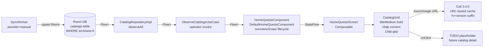
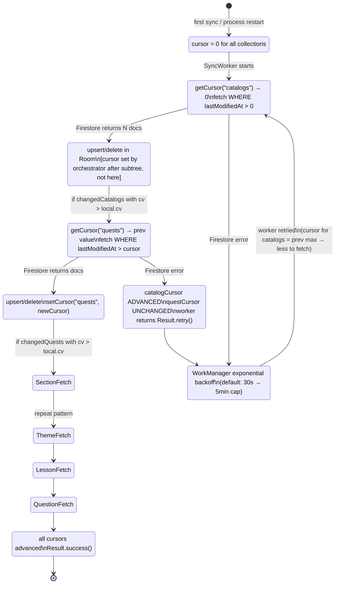
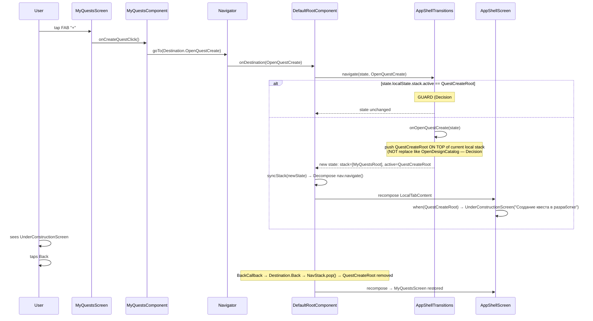
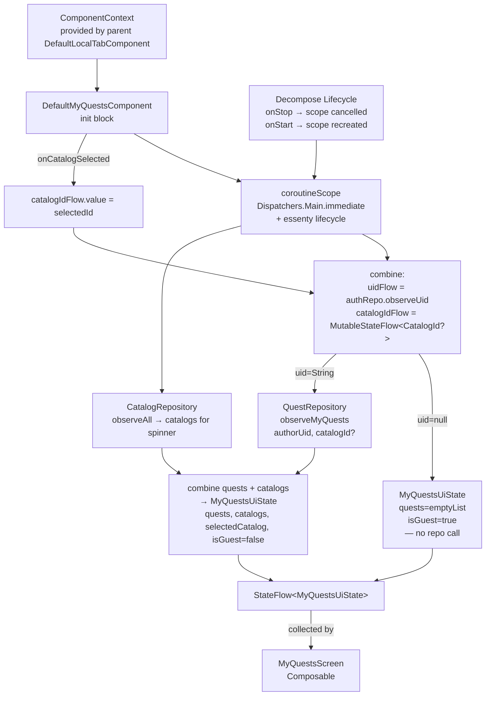
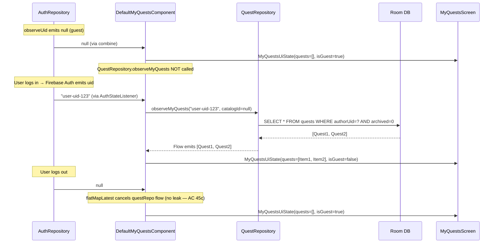
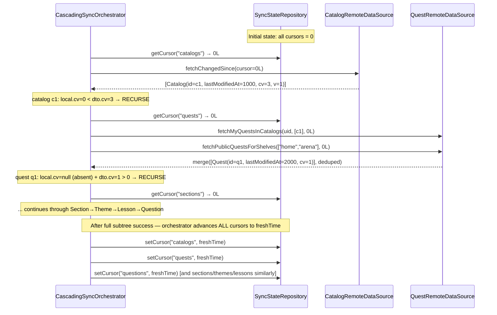
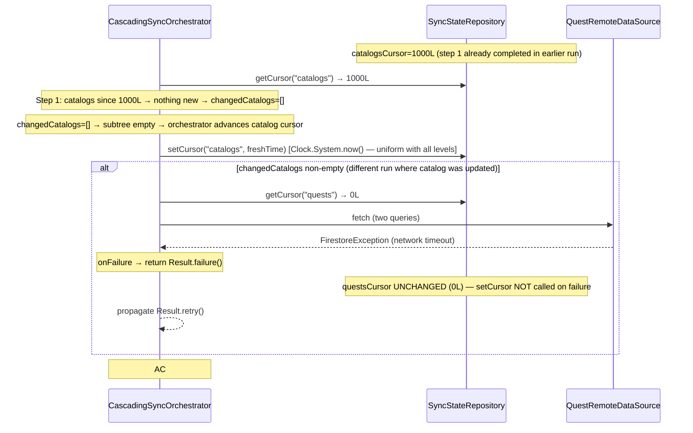
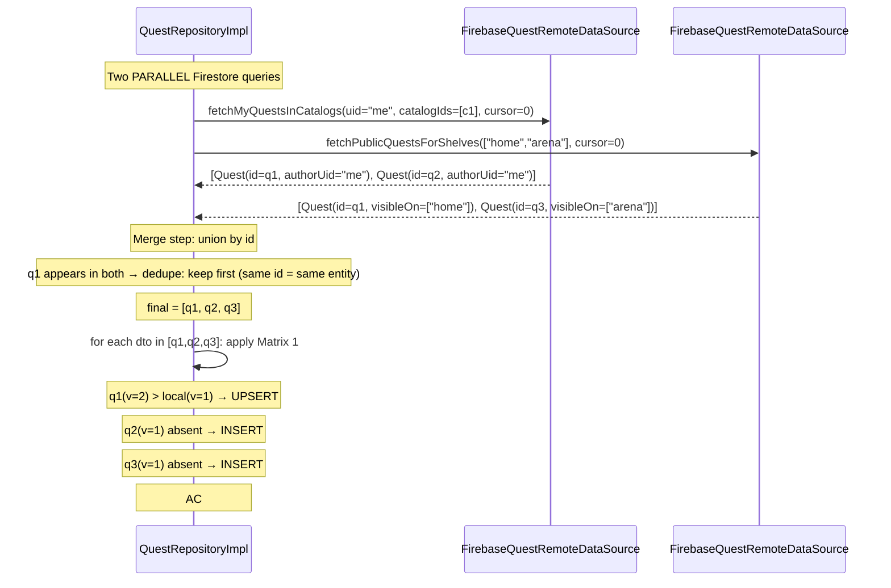

# Behavior: Home Quests & My Quests + Cascading Catalog Sync

## DFD 1 — Cascading Sync Flow (6 levels)

От `SyncWorker.doWork()` до Room через `CascadingSyncOrchestrator.syncCascade(SyncLevel.Catalog, emptySet())`.

```mermaid
sequenceDiagram
    participant WM as WorkManager
    participant SW as SyncWorker
    participant CSO as CascadingSyncOrchestrator
    participant SSR as SyncStateRepository
    participant CR as CatalogRepository
    participant QR as QuestRepository
    participant SR as SectionRepository
    participant Room as Room DB

    WM->>SW: doWork()
    SW->>CSO: sync() [implements Syncable]
    CSO->>CSO: syncCascade(SyncLevel.Catalog, parentIds=∅)

    Note over CSO,SSR: STEP 1 — Catalogs
    CSO->>SSR: getCursor("catalogs") → catalogCursor
    CSO->>CR: refreshFromRemote()  [reads cursor internally via getCursor; does NOT set cursor]
    CR->>SSR: getCursor("catalogs") → catalogCursor [internally, read only]
    CR->>Room: upsertByIdIfNewerVersion(entity) OR deleteById(id) if archived=true
    Note over CSO,SSR: Cursor advanced by orchestrator after subtree success (B2 fix)
    CSO->>CSO: changedCatalogs = [catalogs where dto.cv > local.cv]

    alt changedCatalogs non-empty
        Note over CSO,SSR: STEP 2 — Quests (dual query A+B, batch ≤30)
        CSO->>SSR: getCursor("quests") → questCursor
        CSO->>QR: refreshFromRemote(currentUserUid, availableShelves, changedCatalogIds, questCursor)
        Note right of QR: Query A: authorUid==me & catalogId IN changedCatalogIds & lastMod > cursor<br/>Query B: visibleOn array-contains-any shelves & lastMod > cursor<br/>Merge+dedupe by id client-side
        QR->>Room: upsert OR delete (archived=true OR visibleOn.isEmpty)
        QR->>SSR: setCursor("quests", newCursor)
        CSO->>CSO: changedQuests = [quests where dto.cv > local.cv]

        alt changedQuests non-empty
            Note over CSO,SSR: STEP 3 — Sections
            CSO->>SSR: getCursor("sections") → secCursor
            CSO->>SR: refreshByParents(changedQuestIds, cursor=secCursor)
            SR->>Room: upsert OR delete per Matrix 2
            SR->>SSR: setCursor("sections", newCursor)
            Note over CSO: STEP 4 Themes → STEP 5 Lessons → STEP 6 Questions — same pattern<br/>Each recurses only where contentsVersion grew (Matrix 3)
        end
    end

    CSO-->>SW: Result.success()
    SW-->>WM: Result.success()
```

**Cursor management rules (spec FR#14):**
- `newCursor = Clock.System.now()` (sampled once as `freshTime` at cascade entry — uniform for all 6 levels)
- `setCursor` вызывается **только при успешном завершении** каждого Step
- При ошибке Step — Worker возвращает `Result.retry()`; курсор остаётся прежним → следующий retry повторит тот же Step
- `InMemorySyncStateRepository` — курсоры живут в памяти процесса; process death → все курсоры сбрасываются в 0 → следующий sync начинает с нуля (приемлемо MVP, upsert-by-id идемпотентен)

---

## DFD 2 — HomeQuests Screen Data Flow



**Ключевые инварианты:**
- `CatalogRepository.observeAll()` → DAO query `SELECT * FROM catalogs WHERE archived = 0` (Decision #52)
- `HomeQuestsComponent` заменяет `AppShellScreen.CatalogGridSection` — pre-existing нарушение `use-cases.md` устраняется (Decision #51)
- Экран показывает **каталоги**, не квесты (Decision #32 / Codex fix #1)

---

## DFD 3 — MyQuests Screen Data Flow

```mermaid
flowchart LR
    subgraph "Auth source"
        AA[AppApplication.kt:41\nauthUidFlow\ncallbackFlow AuthStateListener]
        AR[AuthRepository\nAuthRepositoryImpl\nobserveUid: Flow<String?>]
        AA --> AR
    end

    subgraph "Quest source"
        Room2[(Room DB\nquests table\nWHERE archived=0\nauthorUid=? catalogId=?)]
        QR[QuestRepositoryImpl\nobserveMyQuests\nauthorUid: String\ncatalogId: CatalogId?]
        Room2 --> QR
    end

    subgraph "Catalog spinner source"
        Room3[(Room DB\ncatalogs table\nWHERE archived=0)]
        CatR[CatalogRepositoryImpl\nobserveAll]
        Room3 --> CatR
    end

    AR -->|Flow<String?>| MQC[MyQuestsComponent\nDefaultMyQuestsComponent\ncombine uid+catalogId+quests]
    QR -->|Flow<List<Quest>>| MQC
    CatR -->|Flow<List<Catalog>>| MQC

    MQC -->|StateFlow<MyQuestsUiState>| MQS[MyQuestsScreen\nComposable]
    MQS --> CS[CatalogSpinner\nExposedDropdownMenuBox\n"Все категории" pseudo-item]
    MQS --> LC[LazyColumn\nQuestCard × N]
    MQS --> FAB[FAB "+"\nonCreateQuestClick]
    MQS --> ES[Empty State\nif quests.isEmpty\nIcon + text + arrow to FAB]

    FAB -->|onCreateQuestClick| Nav[Navigator.goTo\nDestination.OpenQuestCreate]
    LC --> QC[QuestCard\ntitle + StarRating + AsyncImage]

    CS -->|onSelectionChanged(catalogId?)| MQC
```

**Guest behavior (Decision #39, Journey 11):**
- `AuthRepository.observeUid()` эмитит `null` → `MyQuestsUiState(quests=emptyList, isGuest=true)`
- `QuestRepository.observeMyQuests(...)` **не вызывается** при `uid == null`
- Empty state одинаков для guest и для authenticated-0-quests (без login CTA)
- Mid-session login/logout: `combine(uidFlow, catalogFlow)` реактивно обновляет state

---

## DFD 4 — Cursor Management (SyncStateRepository seam)



**Phase-01 constraint**: `InMemorySyncStateRepository` — курсоры в `MutableStateFlow<Map<String,Long>>` + `Mutex`. Process death = reset to 0. Это **acceptable MVP** (spec FR#14, Decision #36).

---

## DFD 5 — FAB Navigation (Destination.OpenQuestCreate → QuestCreateRoot)



**Navigation constraints (Decisions #41, #45, #47, #48):**
- `Destination.OpenQuestCreate` — `data object`, аналог именования `OpenDesignCatalog`
- Семантика: **push** (не replace) — `[MyQuestsRoot, QuestCreateRoot]`; Back → `[MyQuestsRoot]`
- Guard: если `active == QuestCreateRoot` → no-op (повторный tap FAB)
- `Destination.kt` + `AppShellTransitions.kt` меняются **атомарно** (Decision #48) — добавление sealed variant ломает exhaustive when

---

## DFD 6 — MyQuestsComponent Lifecycle (Decompose + reactive auth)



**Decision #51**: Decompose `Component` (не AndroidX ViewModel) — consistent с existing `DefaultRootComponent`. Lifecycle через essenty, не `viewModelScope`. State retention через `StateKeeper` при конфигурационных изменениях.

---

## State Matrix Summary

Полные матрицы в `0-spec.md § State Matrix`. Краткое резюме для ориентации:

| Matrix | Применимость | Ключевое правило |
|--------|-------------|-----------------|
| Matrix 1 | Catalog, Quest | `archived=true` ИЛИ `visibleOn.isEmpty()` → DELETE local; иначе upsert если `dto.v > local.v`; skip если `dto.v <= local.v` |
| Matrix 2 | Section, Theme, Lesson, Question | `archived=true` → DELETE local; иначе upsert если `dto.v > local.v` |
| Matrix 3 | Cascade recurse predicate | Идти на уровень N+1 **только если** `dto.contentsVersion > local.contentsVersion` |
| Matrix 4 | Visibility filter | MVP: `availableShelves = {"home", "arena"}`; tournament — future gating |

---

## Error Recovery Summary

| Scenario | Behavior |
|---------|----------|
| Network error в любом Step | `Result.retry()` → WorkManager exponential backoff; курсор шага не обновляется |
| Firestore permission denied | `Result.failure()` без retry (permanent auth error) |
| Partial cascade fail (Step 1 OK, Step 2 fail) | Step 1 курсор advanced; Step 2 курсор unchanged; retry повторяет с Step 1 (дешёво: меньше данных за новый cursor); уже upserted → no-op |
| Process death mid-cascade | InMemory потерян → cursor=0 → full re-sync → upsert-by-id идемпотентен |
| `in`-filter >30 parent-ids | Client batches chunks по 30; параллельные запросы; merge+dedupe на клиенте |
| Malformed DTO (missing required field) | Mapper возвращает `null`; запись пропускается; warning logged |

---

## State Matrix Extension (architect-component) — Edge Cases + Code Locations

### Matrix 1 Extended: Catalog / Quest — with code locations and testability

Spec State Matrix 1 (`0-spec.md:1045`) — расширена edge cases и маппингом на code.

| # | local state | dto.version | delete-marker | Action | Code location | Testable? | Test scenario |
|---|------------|-------------|---------------|--------|---------------|-----------|--------------|
| 1.1 | absent | any | `archived=true` OR `visibleOn.isEmpty()` | SKIP (no insert) | `CatalogRepositoryImpl.refreshFromRemote` + `QuestRepositoryImpl.refreshFromRemote` — Matrix 1 block | ✅ JVM | implicit in scenarios 23, 25 |
| 1.2 | absent | any | false / non-empty | INSERT via `upsertByIdIfNewerVersion` | `CatalogDao.upsertByIdIfNewerVersion` | ✅ JVM | 21, 24, 44 |
| 1.3 | present, `local.v < dto.v` | > local | delete-marker=true | DELETE local via `deleteById` | `CatalogDao.deleteById` / `QuestDao.deleteById` | ✅ JVM | 23, 25, 43 |
| 1.4 | present, `local.v < dto.v` | > local | false / non-empty | UPSERT via `upsertByIdIfNewerVersion` | `*Dao.upsertByIdIfNewerVersion` | ✅ JVM | 22, 44 |
| 1.5 | present, `local.v == dto.v` | == local | any | SKIP (up-to-date) | `upsertByIdIfNewerVersion` — SQL `WHERE NOT EXISTS (... version >= :version)` | ✅ JVM | 22, 46 |
| 1.6 | present, `local.v > dto.v` | < local | any | SKIP (server stale) | same SQL guard | ✅ JVM | 47 |
| **EDGE 1.7** | present | dto.v > local.v | `archived=true` BUT dto.v < local.v (race: stale tombstone) | SKIP — version check comes FIRST | `QuestRepositoryImpl.kt` — version check before archived check | ✅ JVM | 23b (version guard for delete) |
| **EDGE 1.8** | absent | any | `visibleOn=["home"]` | INSERT (non-empty visibleOn → not delete marker) | `QuestRepositoryImpl` | ✅ JVM | 24 |
| **EDGE 1.9** | present | dto.v > local.v | `visibleOn=[]` (empty set, authorUid=me) | DELETE (draft → physical delete, Decision #48) | `QuestRepositoryImpl` | ✅ JVM | 48 |
| **EDGE 1.10** | absent | any | `archived=false`, `picturePath` non-null | INSERT + resolve `pictureUrl` via `StorageUrlResolver` + append `?v=$version` | `QuestRepositoryImpl.refreshFromRemote` | ✅ JVM (FakeStorageUrlResolver) | — |

---

### Matrix 2 Extended: Section / Theme / Lesson / Question — with edge cases

| # | local state | dto.version | dto.archived | Action | Code location | Testable? | Test scenario |
|---|------------|-------------|--------------|--------|---------------|-----------|--------------|
| 2.1 | absent | any | true | SKIP | `*RepositoryImpl` Matrix 2 block | ✅ JVM | implicit |
| 2.2 | absent | any | false | INSERT | `*Dao.upsertByIdIfNewerVersion` | ✅ JVM | 41 |
| 2.3 | present, `local.v < dto.v` | > local | true | DELETE | `*Dao.deleteById` | ✅ JVM | 43 |
| 2.4 | present, `local.v < dto.v` | > local | false | UPSERT | `*Dao.upsertByIdIfNewerVersion` | ✅ JVM | 42, 44 |
| 2.5 | present, `local.v == dto.v` | == local | any | SKIP | SQL `NOT EXISTS version >= :v` | ✅ JVM | 46 |
| 2.6 | present, `local.v > dto.v` | < local | any | SKIP (stale) | same | ✅ JVM | 47 |
| **EDGE 2.7** | present | dto.v > local.v | archived=true | DELETE — Question has no contentsVersion → no recurse after delete | `QuestionRepositoryImpl` | ✅ JVM | 43 (question analog) |
| **EDGE 2.8** | present | dto.v > local.v | archived=false, order updated | UPSERT → downstream DAO query `ORDER BY order ASC` reflects change | `SectionDao.observeByQuest` | ✅ JVM | implicit in 42 |

---

### Matrix 3 Extended: Cascade Recurse Predicate — with code locations

Pure function `shouldRecurseIntoChildren` in `CascadeDecision.kt:46` — canonical implementation.

| # | parent state | dto.cv | local.cv | Result | Code location | Testable? | Test scenario |
|---|-------------|--------|----------|--------|---------------|-----------|--------------|
| 3.1 | just inserted (absent before sync) | > 0 | null | RECURSE | `shouldRecurseIntoChildren(dto.cv, null)` → `dto.cv > 0` | ✅ JVM | implicit in 41 |
| 3.2 | just inserted | == 0 | null | STOP (leaf content, no children) | `dto.cv > 0` → false | ✅ JVM | `CascadeDecisionTest.kt` |
| 3.3 | present, upserted | > local.cv | non-null | RECURSE | `dto.cv > localCv` | ✅ JVM | 30, 45 |
| 3.4 | present, upserted | == local.cv | non-null | STOP | `dto.cv > localCv` → false | ✅ JVM | 28, 45 (inverse) |
| 3.5 | present, skipped (version equal) | any | non-null | STOP — skip means parent unchanged, no recurse | CascadingSyncOrchestrator: if SKIP → don't add to changedParentIds | ✅ JVM | 29 |
| **EDGE 3.6** | present, skipped (version older) | any | non-null | STOP — server stale, don't recurse | same | ✅ JVM | implied by 47 |
| **EDGE 3.7** | present | dto.cv > local.cv | non-null | RECURSE — но если changedQuestIds.isEmpty() | early-exit in `CascadingSyncOrchestrator.syncCascade` → `if (changedParentIds.isEmpty()) return success` | ✅ JVM | 10 (AC) |
| **EDGE 3.8** | batch of 31+ parent-ids | N/A | N/A | BATCH SPLIT → parallel Firebase requests, merge+dedupe | `CascadingSyncOrchestrator` chunkedBy(30) | ✅ JVM (FakeRemote with 31 items) | 50 |

---

### Matrix 4 Extended: Visibility Filter — with future rows marked

| # | user role | availableShelves | Query B shape | phase | Testable? |
|---|-----------|------------------|---------------|-------|-----------|
| 4.1 | baseline (MVP) | `{"home", "arena"}` | `visibleOn array-contains-any ["home", "arena"]` + `lastModifiedAt > cursor` | **phase-01** | ✅ JVM (FakeQuestRemoteDataSource) |
| 4.2 | + tournament qual | `{"home", "arena", "tournament"}` | extend array | **future** | N/A phase-01 |
| 4.3 | + finalist qual | `{"home", "arena", "tournament", "tournamentFinal"}` | extend array | **future** | N/A |
| 4.4 | admin | all 5 shelves | `["home","arena","tournament","tournamentFinal","archive"]` | **future** | N/A |
| **EDGE 4.5** | baseline, `availableShelves` computed from `UserStats.qualification` | MVP: hardcoded `{"home","arena"}` per spec FR#15 | N/A | phase-01 | ✅ JVM — test that `availableShelves` arg passed to `QuestRepository.refreshFromRemote` equals `{"home","arena"}` |
| **EDGE 4.6** | guest (uid=null) | N/A — Query A skipped entirely | only Query B with shelves | phase-01 | ✅ JVM (FakeAuth with null, verify Query A not called) |

---

## Sequence Diagrams (architect-component)

### SEQ-1: Guest → Mid-Session Login → Quest List Appears



**Code location**: `DefaultMyQuestsComponent.state`:
```kotlin
override val state: StateFlow<MyQuestsUiState> =
    authRepo.observeUid()
        .flatMapLatest { uid ->
            if (uid == null) {
                flowOf(MyQuestsUiState(quests = emptyList(), isGuest = true))
            } else {
                combine(
                    observeMyQuests(uid, selectedCatalog.value),
                    observeCatalogs(),
                    selectedCatalog,
                ) { quests, catalogs, catalogId ->
                    MyQuestsUiState(
                        quests = quests.map { it.toDisplayItem() },
                        catalogs = catalogs.map { it.toDisplayItem() },
                        selectedCatalogId = catalogId,
                        isGuest = false,
                    )
                }
            }
        }
        .stateIn(scope, SharingStarted.Eagerly, MyQuestsUiState(isGuest = false))
```

---

### SEQ-2: Cursor Lifecycle — Successful Cascade



---

### SEQ-3: Partial Fail — questsCursor NOT advanced



**Test**: AC#54 — `CascadingSyncOrchestratorTest`:
```kotlin
@Test fun `when step 2 fails then questsCursor not advanced`() = runTest {
    fakeSyncStateRepo.setCursor("catalogs", 1000L)
    fakeQuestRemote.setNextFetchFailure(IOException("timeout"))
    // ... trigger sync with catalog that has cv change
    assertThat(fakeSyncStateRepo.getCursor("quests")).isEqualTo(0L)  // unchanged
    assertThat(fakeSyncStateRepo.getCursor("catalogs")).isEqualTo(1000L) // unchanged since no new catalogs
}
```

---

### SEQ-4: Merge/Dedupe — Query A + Query B



**Code pattern**:
```kotlin
// QuestRepositoryImpl.refreshFromRemote
val queryAResult = async { remote.fetchMyQuestsInCatalogs(currentUserUid, catalogIdsToSync, cursor) }
val queryBResult = async { remote.fetchPublicQuestsForShelves(availableShelves, cursor) }

val mergedById: Map<String, QuestDto> = buildMap {
    queryBResult.await()
        .filter { it.catalogId in catalogIdsToSync.map { id -> id.value } }  // local filter for B
        .forEach { put(it.id, it) }
    queryAResult.await()
        .forEach { put(it.id, it) }  // A overwrites B (same id = same dto)
}
// apply Matrix 1 to mergedById.values
```
