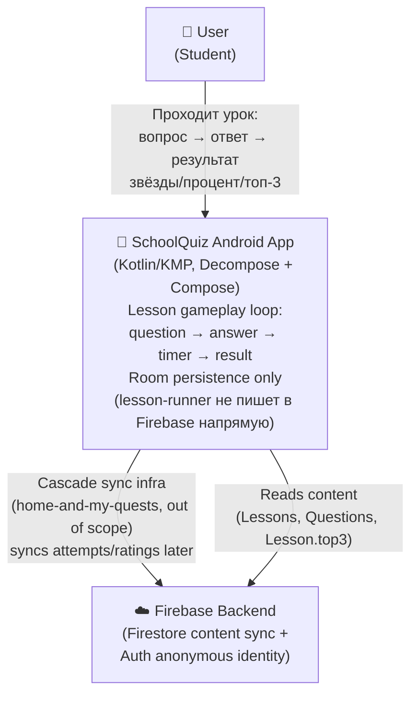
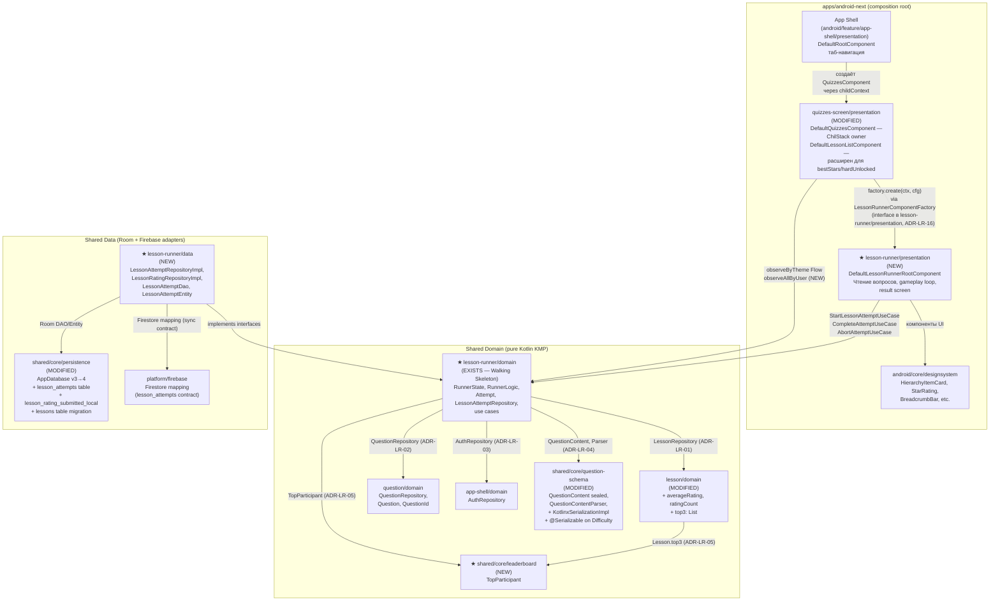
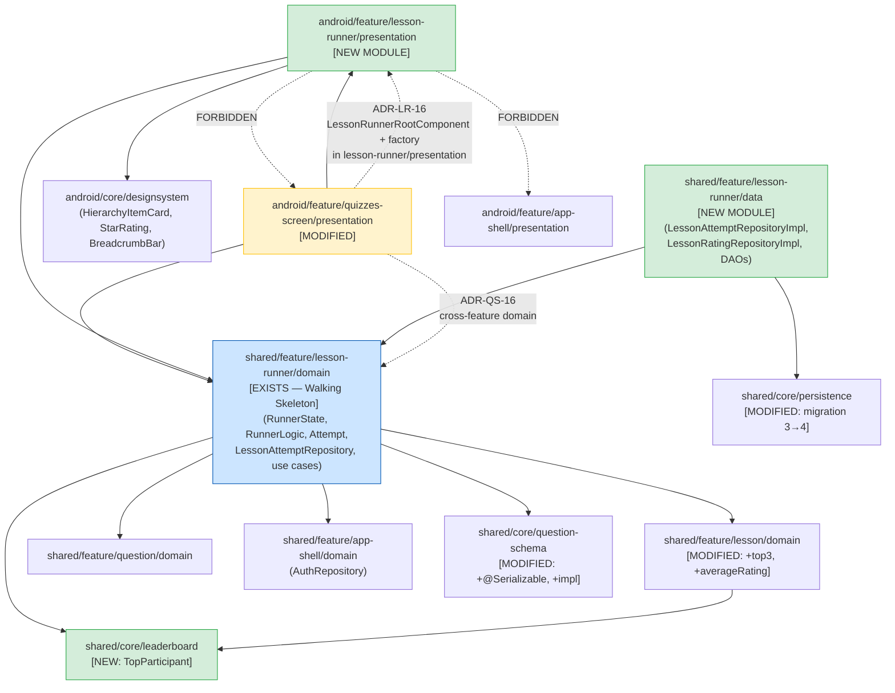
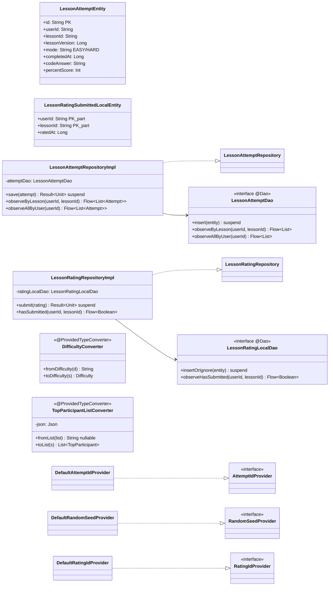
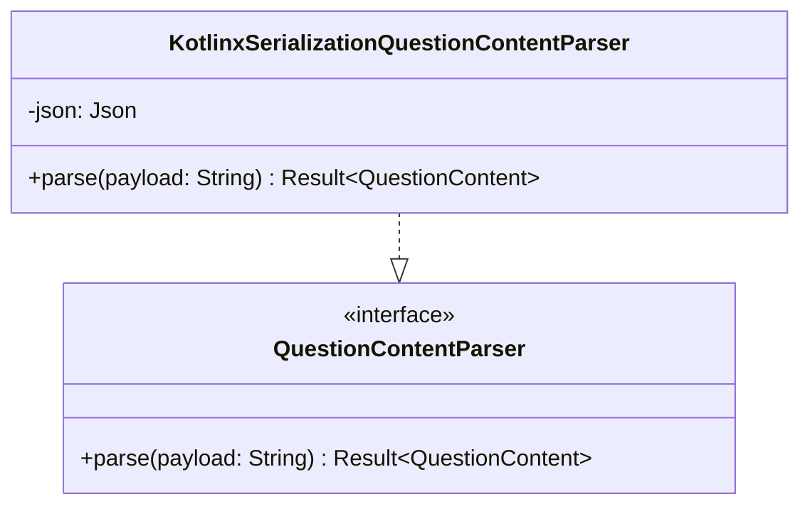
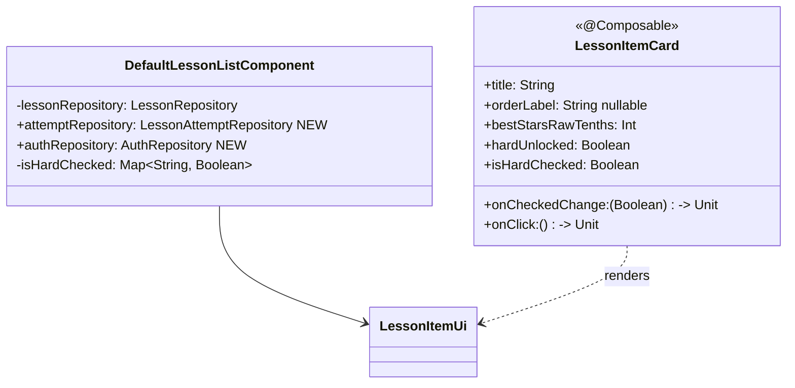

# 01 Architecture: Lesson Runner

## Overview

> **Target State Notice.** Этот документ описывает **target state** после phase-01 implementation, не текущее состояние codebase.
> - `★` — новый или модифицированный модуль
> - Несуществующие пока модули: `shared/core/leaderboard/` (создаётся ADR-LR-05 + phase-01)
> - `LessonPlaceholder → LessonRunner` — атомарная замена в phase-01 (ADR-LR-07)
> - `Lesson.{averageRating, ratingCount, top3}` — добавляются в phase-01 (08-storage-model)
> - `quizzes-screen/presentation` импортирует `lesson-runner/presentation` напрямую: `LessonRunnerRootComponent` interface + `LessonRunnerComponentFactory` (ADR-LR-16). Ранее планировавшийся factory через `core/navigation` (упомянут в ADR-QS-15) отменён из-за circular Gradle dep.

`lesson-runner` — центральный gameplay-loop экрана прохождения урока. Заменяет `LessonPlaceholderComponent` в `quizzes-screen` на полноценный flow: один вопрос на экран, таймер, auto-random на timeout, результат с %/звёздами/топ-3, опрос rating, запись в Room.

Ключевые архитектурные решения:
- **Walking Skeleton domain уже сгенерирован**: `shared/feature/lesson-runner/domain/` зелёный (~89 JVM tests). Phase-01 интегрирует через Room + sync, не переписывает domain.
- **Два новых модуля**: `shared/feature/lesson-runner/data/` (Room adapters) + `android/feature/lesson-runner/presentation/` (Decompose + Compose UI).
- **TopParticipant в shared/core/leaderboard/**: устраняет bidirectional coupling `lesson:domain ↔ lesson-runner:domain` (ADR-LR-05).
- **Атомарная замена LessonPlaceholder**: `QuizzesConfig.LessonPlaceholder` → `QuizzesConfig.LessonRunner` (ADR-LR-07).
- **Cascade sync out of scope**: lesson-runner пишет только в Room; sync infrastructure — отдельная задача.

---

<!-- HL_SECTION_START: C4 L1-L2, Module Dependency Graph, Bidirectional Risk (architect-high-level writes here) -->

## C4 L1 — System Context



Lesson-runner фича не пишет в Firebase напрямую. Cascade sync infrastructure (вне scope этой фичи) синхронизирует Room ↔ Firebase для `lesson_attempts` и `lesson_ratings`. Фича потребляет уже синхронизированный контент из Room (Lessons, Questions) и читает `Lesson.top3` / `Lesson.averageRating` как server-aggregated read-only данные.

---

## C4 L2 — Containers



---

## Module Dependency Graph



### Разрешённые cross-feature импорты

| От | К | Что именно | ADR |
|----|---|------------|-----|
| `lesson-runner:domain` | `lesson:domain` | `LessonId`, `LessonRepository` | ADR-LR-01 |
| `lesson-runner:domain` | `question:domain` | `QuestionId`, `QuestionRepository`, `Question` | ADR-LR-02 |
| `lesson-runner:domain` | `app-shell:domain` | `AuthRepository` | ADR-LR-03 |
| `lesson-runner:domain` | `shared/core/question-schema` | `QuestionContent`, `QuestionContentParser`, `Difficulty` | ADR-LR-04 |
| `lesson-runner:domain` | `shared/core/leaderboard` | `TopParticipant` | ADR-LR-05 |
| `lesson:domain` | `shared/core/leaderboard` | `TopParticipant` (для `Lesson.top3`) | ADR-LR-05 |
| `quizzes-screen/presentation` | `lesson-runner/presentation` | `LessonRunnerRootComponent` interface + `LessonRunnerComponentFactory`. Direct import разрешён (ADR-LR-16: interface inherently owns its state types; factory живёт там же). Ранее планировалось через `core/navigation` — отменено из-за cycle. | ADR-LR-16 |
| `quizzes-screen/presentation` | `lesson-runner:domain` | `LessonAttemptRepository` (bestStars/hardUnlocked) | ADR-QS-16 |

### Запрещённые импорты

| Запрещено | Причина |
|-----------|---------|
| `lesson-runner/presentation → quizzes-screen/presentation` | Bidirectional coupling нарушает Invariant 3 |
| `lesson-runner/presentation → app-shell/presentation` | feature → sibling feature нарушает layer boundary |
| `lesson:domain → lesson-runner:domain` | Создаёт bidirectional coupling (ADR-LR-05 устраняет это) |
| `android/core/designsystem → shared/feature/*` | Core не знает о product features |
| `shared/core/leaderboard → shared/feature/*` | Core не зависит от features |

---

## Bidirectional Coupling Risk — Диагностика `Lesson.top3`

### Исходная проблема

```
До ADR-LR-05 (БЫЛО — BLOCKER):
lesson-runner:domain → lesson:domain        [ADR-LR-01, допустимо]
lesson:domain         → lesson-runner:domain  [TopParticipant в lesson-runner]
        ↕ BIDIRECTIONAL = Invariant 3 BLOCKER
```

Если `Lesson.top3: List<TopParticipant>` и `TopParticipant` живёт в `lesson-runner:domain` → создаётся обратный import `lesson:domain → lesson-runner:domain` → circular Gradle dependency → build failure.

### Резолюция через ADR-LR-05

```
После ADR-LR-05 (СТАЛО — RESOLVED):
lesson-runner:domain → shared/core/leaderboard  [TopParticipant]
lesson:domain         → shared/core/leaderboard  [TopParticipant для Lesson.top3]

Оба feature modules → core (разрешено)
Bidirectional coupling отсутствует ✓
```

### Validation grep (выполнить после phase-01)

```bash
# Нет обратного импорта lesson:domain → lesson-runner:domain
rg "^import .*lesson_runner" shared/feature/lesson/domain/ -g "*.kt"
# Ожидаемый результат: пусто

# Нет обратного импорта lesson-runner:domain → lesson:domain через lesson-specific types
rg "^import .*feature\.lesson\." shared/feature/lesson_runner/domain/src/commonMain/ -g "*.kt"
# Ожидаемый результат: только LessonId и LessonRepository imports (allowed per ADR-LR-01)

# Проверка отсутствия TopParticipant в lesson-runner:domain
rg "TopParticipant" shared/feature/lesson_runner/domain/src/commonMain/ -g "*.kt"
# Ожидаемый результат: пусто (переехал в shared/core/leaderboard)
```

---

## Integration with quizzes-screen

### Место lesson-runner в существующей навигации

`DefaultQuizzesComponent` управляет `ChildStack<QuizzesConfig, QuizzesChild>`. После ADR-LR-07:

```
QuizzesConfig.Idle        → QuizzesChild.Idle
QuizzesConfig.QuestList   → QuizzesChild.QuestList(QuestListComponent)
QuizzesConfig.SectionList → QuizzesChild.SectionList(SectionListComponent)
QuizzesConfig.ThemeList   → QuizzesChild.ThemeList(ThemeListComponent)
QuizzesConfig.LessonList  → QuizzesChild.LessonList(LessonListComponent)
QuizzesConfig.LessonRunner → QuizzesChild.LessonRunner(LessonRunnerRootComponent)  ← НОВОЕ
[QuizzesConfig.LessonPlaceholder — УДАЛЁН по ADR-LR-07]
```

**3 exhaustive when ветви** требуют синхронного обновления при добавлении `LessonRunner`:
- `DefaultQuizzesComponent.createChild()` (`:117-138`)
- `QuizzesChild` sealed interface
- `QuizzesScreen.kt` exhaustive `when` (`:35-46`)

Compile-error safety: все три обновляются атомарно в одном PR.

### DefaultLessonListComponent — расширение зависимостей

`DefaultLessonListComponent` (в `quizzes-screen/presentation`) требует двух новых зависимостей для bestStars/hardUnlocked:

| Текущие зависимости | Новые зависимости |
|--------------------|--------------------|
| `LessonRepository` | `+ LessonAttemptRepository` (из lesson-runner:domain, ADR-QS-16) |
| — | `+ AuthRepository` (для userId, если не уже инжектируется) |

`DefaultQuizzesComponent` передаёт эти зависимости в `childFactory` при создании `DefaultLessonListComponent`. Koin module (`quizzesPresentationModule`) обновляется соответственно.

Canonical: `docs/features/lesson-runner/06-api-contract.md §LR-5`.

---

## Walking Skeleton Status

| Module | Статус | Phase-01 scope |
|--------|--------|----------------|
| `shared/feature/lesson-runner/domain/` | **EXISTS — зелёный** (~89 JVM tests) | Integration only, не rewrite |
| `shared/feature/lesson-runner/data/` | **НЕ СУЩЕСТВУЕТ** | Создаётся с нуля |
| `android/feature/lesson-runner/presentation/` | **НЕ СУЩЕСТВУЕТ** | Создаётся с нуля |
| `shared/core/leaderboard/` | **НЕ СУЩЕСТВУЕТ** | Создаётся (минимальный: TopParticipant.kt) |
| `shared/core/question-schema/` | EXISTS — без impl | `KotlinxSerializationQuestionContentParser` + `@Serializable` |
| `shared/core/persistence/` | EXISTS — v3 | Migration 3→4 |

<!-- HL_SECTION_END -->

---

<!-- CMP_SECTION_START: C4 L3 Component Diagram (architect-component writes here) -->

## C4 L3 — `shared/feature/lesson-runner/data` (NEW MODULE)

Слой Room adapters и repository implementations для lesson-runner. Все классы — в `commonMain` (KMP-совместимы, без Android/Firebase импортов на уровне Kotlin source; Room annotations — androidMain через KMP Room plugin).



**Package**: `com.tpov.schoolquiz.shared.feature.lesson_runner.data`  
**Subpackages**: `entity/`, `dao/`, `mapper/`, `repository/`, `converter/`, `provider/`, `di/`

Canonical signatures → `06-api-contract.md §LR-2`.  
Provider interfaces (`AttemptIdProvider`, `RandomSeedProvider`, `RatingIdProvider`) and their `Default*` impls — canonical: `06-api-contract.md §LR-13a`.

---

## C4 L3 — `shared/core/question-schema` (ADDITIONS)



**Note**: `QuestionContent` sealed interface получает `@Serializable` (discriminator — default `"type"` ключ, без `@JsonClassDiscriminator`; per ADR-0003 SSoT). Subclasses: `@SerialName("SingleChoice")`, `"MultipleChoice"`, `"Ordering"`, `"FillBlank"` (simple class names). `Difficulty` enum получает `@Serializable` (ADR-LR-06).

Signatures → `06-api-contract.md §LR-3`.

---

## C4 L3 — `android/feature/lesson-runner/presentation` (NEW MODULE)

Presentation layer: Decompose Component + Compose UI. Зависит от `lesson-runner:domain` и `android/core/designsystem`.

### Компонентная иерархия

```mermaid
classDiagram
    direction TB

    class LessonRunnerRootComponent {
        <<interface>>
        +uiState: StateFlow~RunnerUiState~
        +events: Flow~RunnerEvent~
    }

    class DefaultLessonRunnerRootComponent {
        -runnerHolder: RunnerStateHolder
        -scope: CoroutineScope
        -startAttemptUseCase: StartLessonAttemptUseCase
        -completeAttemptUseCase: CompleteAttemptUseCase
        -abortAttemptUseCase: AbortAttemptUseCase
        -submitRatingUseCase: SubmitLessonRatingUseCase
        -lessonRepository: LessonRepository
        -attemptRepository: LessonAttemptRepository
        -_events: Channel~RunnerEvent~
        -lessonId: LessonId
        -mode: Difficulty
    }

    class RunnerStateHolder {
        <<InstanceKeeper.Instance>>
        +stateFlow: MutableStateFlow~RunnerState~
        +onDestroy(): Unit
    }

    class RunnerUiState {
        <<sealed interface>>
    }
    class RunnerUiState_Loading {
        <<data object>>
    }
    class RunnerUiState_InitFailed {
        +reason: InitFailureReason
    }
    class RunnerUiState_Question {
        +index: Int
        +total: Int
        +deadlineMs: Long
        +mode: Difficulty
        +content: QuestionUiState
        +isPaused: Boolean
        +showExitConfirmDialog: Boolean
    }
    class RunnerUiState_Result {
        +attempt: Attempt
        +lesson: Lesson nullable
        +ownAttemptCount: Int
        +ownAveragePercent: Int
        +ratingPrompt: Boolean
        +selectedRating: Int nullable
        +isRatingSubmitting: Boolean
    }

    class QuestionUiState {
        <<sealed interface>>
        +text: String
        +imageUrl: String nullable
    }
    class SingleChoiceUiState {
        +options: List~OptionUi~
    }
    class MultipleChoiceUiState {
        +options: List~OptionUi~
        +selectedIds: Set~String~
    }
    class OrderingUiState {
        +currentOrder: List~OptionUi~
    }
    class FillBlankUiState {
        +templateParts: List~TemplatePart~
        +candidates: List~OptionUi~
        +filled: Map~String, String?~
    }

    class OptionUi {
        +id: String
        +text: String
    }
    class TemplatePart {
        <<sealed>>
    }

    DefaultLessonRunnerRootComponent ..|> LessonRunnerRootComponent
    DefaultLessonRunnerRootComponent --> RunnerStateHolder
    DefaultLessonRunnerRootComponent --> StartLessonAttemptUseCase
    DefaultLessonRunnerRootComponent --> CompleteAttemptUseCase
    DefaultLessonRunnerRootComponent --> AbortAttemptUseCase
    DefaultLessonRunnerRootComponent --> SubmitLessonRatingUseCase
    DefaultLessonRunnerRootComponent --> LessonRepository
    DefaultLessonRunnerRootComponent --> LessonAttemptRepository

    RunnerUiState <|-- RunnerUiState_Loading
    RunnerUiState <|-- RunnerUiState_InitFailed
    RunnerUiState <|-- RunnerUiState_Question
    RunnerUiState <|-- RunnerUiState_Result
    RunnerUiState_Question --> QuestionUiState
    QuestionUiState <|-- SingleChoiceUiState
    QuestionUiState <|-- MultipleChoiceUiState
    QuestionUiState <|-- OrderingUiState
    QuestionUiState <|-- FillBlankUiState
```



**Public API canonical**: `06-api-contract.md §LR-9` (LessonRunnerRootComponent full callbacks + events). `LessonRunnerRootComponent` interface в `android/feature/lesson-runner/presentation/` (ADR-LR-16 — переехал из планировавшегося `core/navigation` для устранения cycle). `RunnerUiState` fields: `06-api-contract.md §LR-10`.

### instanceKeeper pattern

`RunnerStateHolder` держит `RunnerState` через `instanceKeeper.getOrCreate { RunnerStateHolder(RunnerState.Loading) }` в `DefaultLessonRunnerRootComponent.init`. При rotation Component пересоздаётся, но `RunnerStateHolder` выживает (Decompose 3.1.0 — подтверждён в research, `retainedInstance{}` delegate недоступен до 3.2.0).

```kotlin
// Паттерн (для reference в implementation phase)
private val runnerHolder: RunnerStateHolder =
    instanceKeeper.getOrCreate { RunnerStateHolder(RunnerState.Loading) }
```

### Lifecycle hooks (новые patterns)

`doOnStop` / `doOnResume` из Essenty 2.1.0 — первые использования в проекте. Существующий паттерн: только `doOnDestroy` (7 мест в production code). REQUIRES: verify Essenty 2.1.0 API через web-researcher до implementation.

```kotlin
// Логика в DefaultLessonRunnerRootComponent.init
lifecycle.doOnStop {
    val state = runnerHolder.stateFlow.value
    if (state is RunnerState.Ready && !state.isPaused) {
        val now = clock.now().toEpochMilliseconds()
        val autoAnswered = autoAnswerOnTimeout(state, state.seed, now)
        runnerHolder.stateFlow.value = autoAnswered.copy(isPaused = true)
    }
}
// doOnResume: isPaused уже true → UiState.Question.isPaused = true → UI показывает диалог
// Нет явного действия нужно в doOnResume — состояние уже установлено в doOnStop
```

### Compose Screen structure

```
LessonRunnerScreen(component: LessonRunnerRootComponent)
├── rememberFlagSecure(enabled = mode == HARD)    // DisposableEffect, новый паттерн
├── when (uiState) {
│   is Loading   → CircularProgressIndicator (center)
│   is InitFailed → ErrorContent(reason) + BackButton
│   is Question  →
│   │  QuestionProgressHeader(index, total, deadline, mode)
│   │  CrossButton → onCrossClicked()
│   │  when (content) {
│   │     SingleChoiceUiState  → SingleChoiceContent(options, onAnswer)
│   │     MultipleChoiceUiState → MultipleChoiceContent(options, selected, onDraft, onConfirm)
│   │     OrderingUiState      → OrderingContent(order, onDraft, onConfirm)  // up/down arrows
│   │     FillBlankUiState     → FillBlankContent(parts, candidates, filled, onDraft, onConfirm)
│   │  }
│   │  if (isPaused) PauseResumeDialog(onResume, onAbort)
│   │  if (showExitConfirmDialog) ExitConfirmDialog(onConfirm, onCancel)
│   is Result    → ResultContent(attempt, lesson, ownAttempts, ratingPrompt, ...)
│      ├── PercentDisplay + StarsRating
│      ├── AttemptsStatistics
│      ├── if (ratingPrompt) RatingPrompt(1/2/3 звезды, onSelect)
│      ├── Top3Section (if lesson.top3 non-empty)
│      └── FinishButton → onFinish()
│   }
└── SnackbarHost (для RunnerEvent.SaveAttemptFailed, SaveRatingFailed)
```

---

## C4 L3 — `quizzes-screen/presentation` (MODIFICATIONS)



`LessonItemUi` fields — canonical: `06-api-contract.md §LR-12`. `LessonItemCard` props — canonical: `06-api-contract.md §LR-11`.

**Combine pattern** в `DefaultLessonListComponent.init`:
```kotlin
combine(
    lessonRepository.observeByTheme(themeId),
    attemptRepository.observeAllByUser(userId),
) { lessons, attempts ->
    lessons.map { lesson ->
        val lessonAttempts = attempts.filter { it.lessonId == lesson.id }
        LessonItemUi(
            id = lesson.id.value,
            title = lesson.title,
            bestStarsRawTenths = computeBestStars(lessonAttempts).rawTenths,
            hardUnlocked = computeHardUnlocked(lessonAttempts),
            isHardChecked = isHardChecked[lesson.id.value] ?: false,
        )
    }
}
```

`userId` получается через `authRepository.observeUid().filterNotNull().first()` при init (один раз snapshot; если uid = null → empty list, не crash).

---

## DI Wiring

### `lessonRunnerDataModule`

```kotlin
val lessonRunnerDataModule = module {
    // Providers (ADR-LR-09)
    single<AttemptIdProvider> { DefaultAttemptIdProvider() }
    single<RandomSeedProvider> { DefaultRandomSeedProvider() }
    single<RatingIdProvider> { DefaultRatingIdProvider() }

    // Repositories
    single<LessonAttemptRepository> {
        LessonAttemptRepositoryImpl(attemptDao = get())
    }
    single<LessonRatingRepository> {
        LessonRatingRepositoryImpl(ratingLocalDao = get())
    }

    // Parser binding НЕ здесь — живёт в questionSchemaModule (shared/core/question-schema, ADR-LR-08)
    // lessonRunnerDomainKoinAdapter inject-ит get<QuestionContentParser>() от questionSchemaModule
}
```

### `lessonRunnerDomainKoinAdapter` (phase-01, use-case factories, data/src/androidMain/)

> **Note**: Walking Skeleton генерирует `lessonRunnerDomainModule` как временный placeholder. В phase-01 он заменяется на `lessonRunnerDomainKoinAdapter` в `data/src/androidMain/` — вяжет providers → use case lambdas. Текущий snippet — целевое состояние после phase-01.

```kotlin
val lessonRunnerDomainKoinAdapter = module {
    factory {
        val aidp: AttemptIdProvider = get()
        val rsp: RandomSeedProvider = get()
        StartLessonAttemptUseCase(
            questionRepository = get(),
            lessonRepository = get(),
            parser = get(),
            authRepository = get(),
            clock = get(),
            randomSeedProvider = rsp::next,
        )
    }
    factory {
        val aidp: AttemptIdProvider = get()
        CompleteAttemptUseCase(
            attemptRepository = get(),
            ratingRepository = get(),
            clock = get(),
            attemptIdProvider = aidp::next,
        )
    }
    factory {
        val aidp: AttemptIdProvider = get()
        AbortAttemptUseCase(
            attemptRepository = get(),
            clock = get(),
            attemptIdProvider = aidp::next,
        )
    }
    factory {
        val ridp: RatingIdProvider = get()
        SubmitLessonRatingUseCase(
            ratingRepository = get(),
            lessonRepository = get(),
            clock = get(),
            ratingIdProvider = ridp::provide,
        )
    }
}
```

### `lessonRunnerPresentationModule`

```kotlin
val lessonRunnerPresentationModule = module {
    factory { (componentContext: ComponentContext, lessonId: LessonId, mode: Difficulty) ->
        DefaultLessonRunnerRootComponent(
            componentContext = componentContext,
            lessonId = lessonId,
            mode = mode,
            startAttemptUseCase = get(),
            completeAttemptUseCase = get(),
            abortAttemptUseCase = get(),
            submitRatingUseCase = get(),
            lessonRepository = get(),
            attemptRepository = get(),
            clock = get(),
        )
    }
}
```

**AppApplication registration order**:
```kotlin
modules(
    questionSchemaModule,           // NEW: parser (shared/core/question-schema)
    lessonRunnerDataModule,         // providers + repository impls
    lessonRunnerDomainKoinAdapter,  // NEW: use case factories with lambda wiring
    lessonRunnerPresentationModule,
)
```

<!-- CMP_SECTION_END -->

---

## Open Questions

### [DESIGN PHASE — RESOLVED]
Все 5 блокеров из grounding имеют ADR-резолюцию в этом документе:
- Blocker #1 (QuestionContentParser): ADR-LR-04 — impl в shared/core/question-schema
- Blocker #2 (TopParticipant): ADR-LR-05 — move to shared/core/leaderboard
- Blocker #3 (Migration): strategy documented — phase-01 impl (architect-component ADR-LR-08)
- Blocker #4 (Koin registration): design-phase documents modules — phase-01 backend-dev wires up
- Blocker #5 (Difficulty serializable): ADR-LR-06 — add @Serializable

### [RESOLVED — закрыты в ADRs]

- **Migration strategy**: resolved by ADR-LR-10 (architect-component).
- **Koin lambda binding strategy**: resolved by ADR-LR-09 (wrapper interface `AttemptIdProvider` etc.).
- **LessonItemCard vs HierarchyItemCard**: resolved by ADR-LR-11 (LessonItemCard в quizzes-screen/presentation).
- **`AttemptId.raw` → `AttemptId.value` rename**: resolved by ADR-LR-12.
