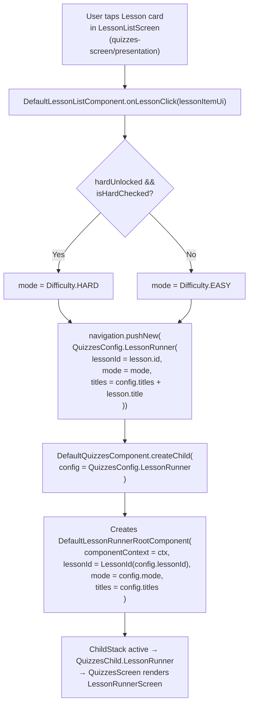
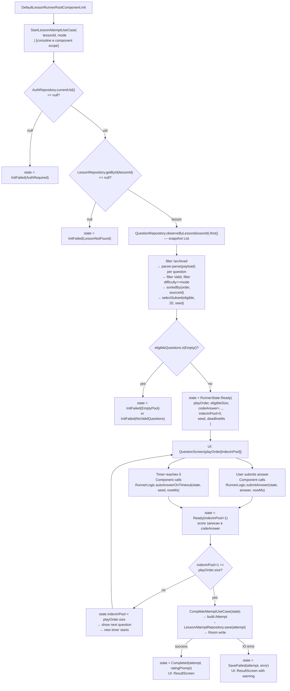
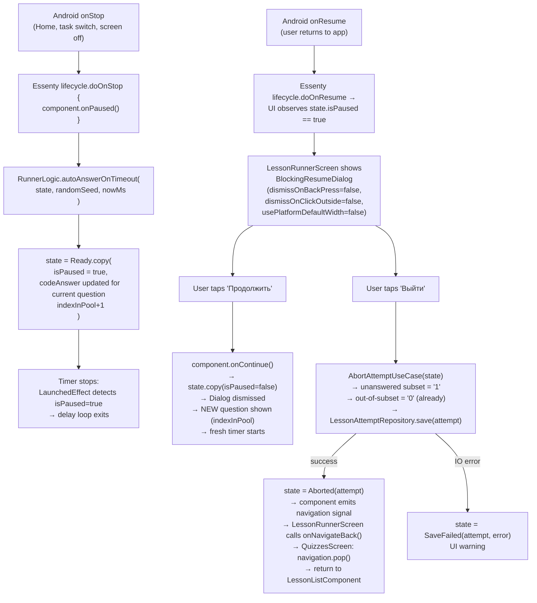
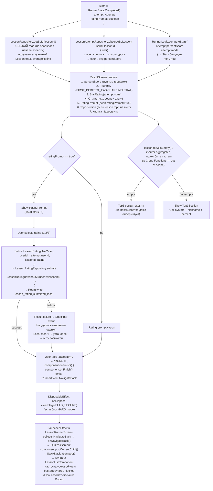
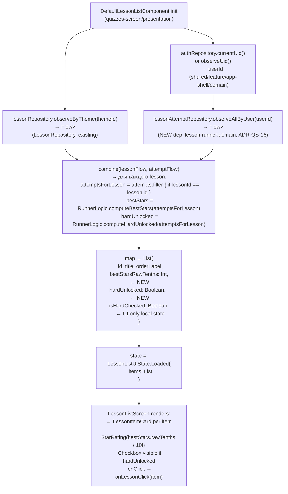
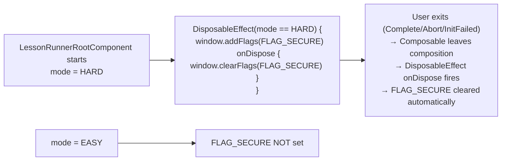
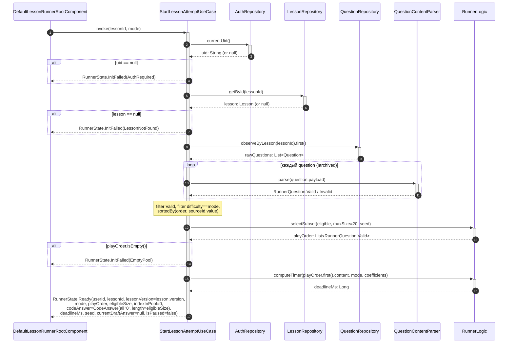
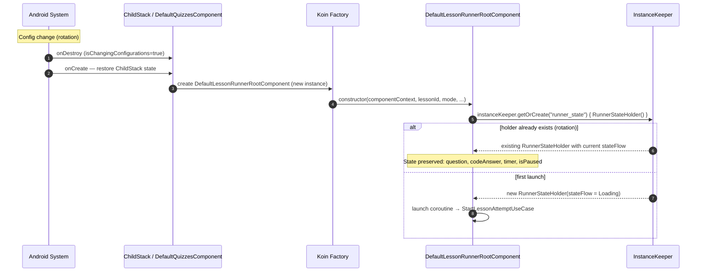
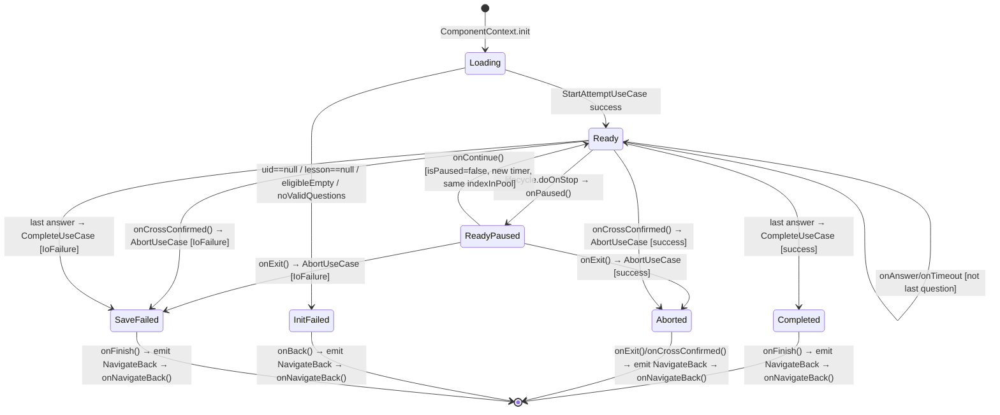

# 02 Behavior: Lesson Runner

## Overview

Этот документ описывает data flow между модулями. Domain logic (RunnerState transitions, scoring, timer formula, pool selection) — canonical в `0-spec.md State Matrix 1-8` и реализован в Walking Skeleton (`RunnerLogic.kt`). Здесь — только module-level flows.

---

<!-- HL_SECTION_START: DFD 1-5 (architect-high-level writes here) -->

## DFD 1: Entry from quizzes-screen → push LessonRunner

> **Target state** после phase-01 / ADR-LR-07 implementation. До реализации: `QuizzesConfig.LessonPlaceholder` push в `DefaultLessonListComponent.kt:55`.

Этот flow заменяет LessonPlaceholder push (ADR-LR-07).



**Integration points** (file:line):
- Push call site: `DefaultLessonListComponent.kt:55` — заменяет `QuizzesConfig.LessonPlaceholder` push
- `QuizzesConfig.LessonRunner` canonical definition: `06-api-contract.md §LR-1`
- `DefaultQuizzesComponent.createChild`: 3 exhaustive when ветви обновляются атомарно
- `DefaultLessonListComponent` получает `LessonAttemptRepository` + `AuthRepository` как новые deps (ADR-QS-16) для вычисления `hardUnlocked` в LessonItemUi

---

## DFD 2: Question lifecycle (load → display → submit/timeout → next OR complete → save Room)



**State Matrix refs** (из `0-spec.md`):
- Score per question type: `0-spec.md State Matrix 1`
- Pool/subset selection: `0-spec.md State Matrix 8` + Business Rule 1-2
- Сохранение attempt: `0-spec.md State Matrix 4` (Matrix 4: один write в конце)
- `KotlinxSerializationQuestionContentParser` impl: `shared/core/question-schema/` (Grounding Problem 1, ADR-LR-04)
- `instanceKeeper` для RunnerStateHolder: rotation → state preserved, таймер не сбрасывается (`0-spec.md §17`)

---

## DFD 3: onStop → auto-random fill → onResume → blocking dialog



**Ключевые integration points**:
- `Essenty lifecycle.doOnStop {}` / `doOnResume {}` — **новый pattern** для проекта (0 existing usages в production, Grounding Problem 8)
- `RunnerState.Ready.isPaused: Boolean` — `RunnerState.kt:47` (Walking Skeleton)
- Dialog implementation: `DialogProperties(dismissOnBackPress=false, dismissOnClickOutside=false, usePlatformDefaultWidth=false)` (Grounding Problem 8 Fix Shape)
- State Matrix 6 (`0-spec.md`): Sworn-fold behavior (onStop/onResume semantics)

**Process kill** (не показано, вне scope этого DFD): state теряется, ничего не пишется в Room. Spec §16: «попытка теряется полностью» — `[USER DECIDED]`.

---

## DFD 4: Result screen flow — читаем snapshot Lesson + statistics + rating prompt



**Integration points**:
- `LessonRepository.getById` — СВЕЖИЙ read (не snapshot) для top3 актуальности при параллельном sync (User Journey 12: «sync обновляет Lesson.top3 во время прохождения → result screen показывает свежий top3»)
- `LessonAttemptRepository.observeByLesson(userId, lessonId)` — user's history для statistics display
- Rating prompt условие: `0-spec.md State Matrix 5`
- Top3: graceful empty handling — `Lesson.top3.isEmpty()` → секция скрыта (Grounding Problem 9)
- FLAG_SECURE: `DisposableEffect(Unit)` паттерн (Grounding Problem 8)
- `SubmitLessonRatingUseCase` — использует `attempt.userId` snapshot, не перечитывает auth

---

## DFD 5: HARD unlock derivation — DefaultLessonListComponent combines Lesson + attempts



**Ключевые decisions**:
- `RunnerLogic.computeBestStars` и `computeHardUnlocked` — **pure functions** из Walking Skeleton (`RunnerLogic.kt`), вызываются в presentation слое — допустимо per `use-cases.md` (component may call domain pure functions)
- `isHardChecked: Boolean` — **ephemeral UI state** (в `remember { }` или в component state), не persist в Room
- `LessonAttemptRepository` — новый cross-feature import (ADR-QS-16)
- `computeHardUnlocked` string-based (`codeAnswer.allShownAnswersAre9`) — не Float comparison (Invariant B Business Rule 14 в `0-spec.md`)
- Карточка урока: `LessonItemCard` (quizzes-screen-specific) или расширение `HierarchyItemCard` — architect-component ADR-LR-08 decision

---

## FLAG_SECURE lifecycle



`FLAG_SECURE` — новый pattern для проекта (0 existing usages, Grounding Problem 8). Реализуется через `DisposableEffect` keyed on `mode == Difficulty.HARD`. При любом выходе из экрана (lifecycle/navigation) — Compose onDispose автоматически чистит флаг. Нет риска «leak» FLAG_SECURE при rotation (Decompose сохраняет компонент, Compose пересоздаёт и переустанавливает DisposableEffect).

---

## State Extension от spec (не упомянутые в State Matrix)

Presentation-level state transitions не покрытые domain State Matrix, но следующие из spec:

| Событие | UI Action | Domain Call | Итог |
|---------|-----------|-------------|------|
| Крестик во время прохождения | Диалог «Уверены?» → подтвердили | `AbortAttemptUseCase(state)` | `Aborted(attempt)` → pop |
| Крестик → отмена | Диалог закрыт | — | Продолжаем прохождение |
| `InitFailed(EmptyPool)` | Empty state + Назад | — | pop, return to LessonList |
| `InitFailed(RedactedNotSupported)` | Empty state + Назад (своё сообщение, отличное от `NoValidQuestions` и `EmptyPool`) | — | pop, return to LessonList |
| `InitFailed(LessonNotFound)` | Empty state + Назад | — | pop |
| `InitFailed(AuthRequired)` | Empty state + Назад | — | pop (не navigate to login — infrastructure concern) |
| `SaveFailed(attempt, error)` | ResultScreen + warning Snackbar | — | Кнопка Завершить доступна |

**Testable** в presentation integration tests (architect-component зона — `04-testing.md`).

<!-- HL_SECTION_END -->

---

<!-- CMP_SECTION_START: Component-level sequences (architect-component writes here) -->

## Sequence 1: StartLessonAttemptUseCase — parsing pipeline detail

Декомпозиция DFD 2 на уровне компонентов. Шаги внутри `StartLessonAttemptUseCase`.



**Code refs**:
- `StartLessonAttemptUseCase.kt:invoke()` — `shared/feature/lesson-runner/domain/src/.../use_case/StartLessonAttemptUseCase.kt:36`
- `RunnerLogic.selectSubset()` — `RunnerLogic.kt:154`
- `RunnerLogic.computeTimer()` — `RunnerLogic.kt:136`
- `QuestionContentParser` — REQUIRES implementation in `shared/core/question-schema/` (ADR-LR-08)

---

## Sequence 2: Answer submission → state update → CompleteAttemptUseCase

```mermaid
sequenceDiagram
    autonumber
    participant Screen as LessonRunnerScreen
    participant Comp as DefaultLessonRunnerRootComponent
    participant Holder as RunnerStateHolder
    participant Logic as RunnerLogic
    participant UC as CompleteAttemptUseCase
    participant Repo as LessonAttemptRepository

    Screen->>Comp: onAnswer(answer: UserAnswerDraft)
    Comp->>Holder: stateFlow.value (read Ready state)
    Holder-->>Comp: state: RunnerState.Ready
    note over Comp: draft → UserAnswer mapping:<br/>UserAnswerDraft.toUserAnswer(currentQuestion.content)
    Comp->>+Logic: submitAnswer(state, userAnswer: UserAnswer, nowMs)
    note over Logic: submitAnswer computes newDeadlineMs<br/>internally (RunnerLogic.kt:34-40) — no separate computeTimer call
    Logic-->>-Comp: newState: Ready(indexInPool+1, codeAnswer+deadlineMs updated)
    Comp->>Holder: stateFlow.value = newState
    alt newState.indexInPool < newState.playOrder.size
        note over Comp: next question timer already in newState.deadlineMs
    else last question (indexInPool == playOrder.size)
        Comp->>+UC: invoke(state)
        UC->>Repo: save(attempt)
        alt success
            Repo-->>UC: Result.success
            UC-->>-Comp: RunnerState.Completed(attempt, ratingPrompt)
            Comp->>Holder: stateFlow.value = Completed(...)
        else IO error
            Repo-->>UC: Result.failure(IoFailure)
            UC-->>Comp: RunnerState.SaveFailed(attempt, SaveError.IoFailure)
            Comp->>Holder: stateFlow.value = SaveFailed(...)
        end
    end
    note over Screen: Result screen shown; user taps «Завершить»
    Screen->>Comp: onFinish()
    Comp-->>Screen: events.trySend(RunnerEvent.NavigateBack)
    note over Screen: LaunchedEffect collects NavigateBack → invokes onNavigateBack()
    note over Screen: QuizzesScreen.popCurrentChild() → StackNavigation.pop()
```

**Code refs**:
- `RunnerLogic.submitAnswer()` — `RunnerLogic.kt:25`
- `CompleteAttemptUseCase.invoke()` — `shared/feature/lesson-runner/domain/src/.../use_case/CompleteAttemptUseCase.kt:20`

---

## Sequence 3: Timer countdown (LaunchedEffect pattern)

```mermaid
sequenceDiagram
    autonumber
    participant Compose as LessonRunnerScreen
    participant Comp as DefaultLessonRunnerRootComponent
    participant Logic as RunnerLogic

    note over Compose: LaunchedEffect(state.deadlineMs, state.indexInPool, state.isPaused)
    activate Compose
    loop каждые ~100ms
        Compose->>Compose: remaining = state.deadlineMs - System.currentTimeMillis()
        alt remaining <= 0 AND !state.isPaused
            Compose->>Comp: onTimeout()
            deactivate Compose
            Comp->>Logic: autoAnswerOnTimeout(state, seed, nowMs)
            Logic-->>Comp: newState: RunnerState.Ready
            note over Comp: follows Sequence 2 submit path
        else state.isPaused == true
            note over Compose: LaunchedEffect key changed → cancelled
            deactivate Compose
        end
    end
```

**Ключевые детали**:
- Keys `deadlineMs` + `indexInPool` — при смене вопроса LaunchedEffect рестартует
- Key `isPaused` — при onStop LaunchedEffect отменяется, тиков в background нет
- `autoAnswerOnTimeout` вызывается один раз (не пересоздаётся)
- Clock: `deadlineMs` = epoch millis (из domain `Clock.now()`); сравнение через `System.currentTimeMillis()` в Composable (не `SystemClock.elapsedRealtime()` — domain не знает Android clock). `05-prior-art.md SDK 6` документирует trade-offs монотонного clock.

---

## Sequence 4: Rotation через instanceKeeper



**Ключевые детали**:
- `instanceKeeper` живёт в `ComponentContext`; Decompose 3.1.0 гарантирует сохранение при config change
- `RunnerStateHolder.onDestroy()` — вызывается при NavigationPop (не при rotation)
- `getOrCreate` ключ: `"runner_state"` (строковый, уникален в scope компонента)

---

## State Machine: RunnerState Transitions



**Инварианты**:
- `InitFailed.*` — терминальные, no back-transition
- `ReadyPaused` — presentation alias для `Ready(isPaused=true)` (один domain state class)
- `SaveFailed` — attempt сформирован но не записан в Room; pop доступен
- `RunnerStateHolder.onDestroy()` при NavigationPop → cancels componentScope

---

## Extended State Matrix

### Extended Matrix 1: Score за ответ

| Тип | Верно (9) | Частично (2..8) | Неверно/timeout (1) | Edge Case | Code Location | Test IDs |
|-----|-----------|-----------------|---------------------|-----------|---------------|----------|
| SingleChoice | selected==correct | N/A | selected!=correct или null | Timeout random может попасть верно | `RunnerLogic.kt:66-70` | DT-01..DT-02, PT-10 |
| MultipleChoice | picked==correct && sizes match | Jaccard: `picked∩correct/picked∪correct × 8+1` | picked∩correct==0 | Пустой picked → wrong '1' | `RunnerLogic.kt:71-78` | DT-03..DT-05 |
| Ordering | все позиции совпали | `matched/total×8+1` | matched==0 | items.size in 2..8 (ADR-0003) | `RunnerLogic.kt:79-88` | DT-06..DT-07 |
| FillBlank | все blanks верны | `correct_filled/total×8+1` | ни один blank | Case sensitivity — зависит от parser | `RunnerLogic.kt:90-97` | DT-08..DT-09 |
| out-of-subset | '0' | — | — | init '0' в CodeAnswer | `CodeAnswer.kt init` | DT-13..DT-14 |

### Extended Matrix 2: Stars formula

| Mode | percentScore | rawTenths | Formula | Edge Case | Code Location | Test IDs |
|------|-------------|-----------|---------|-----------|---------------|----------|
| EASY | 0 | 0 | `(0×20+50)/100=0` | Stars(0); hardUnlocked=false | `RunnerLogic.kt:108-113` | DT-21..DT-22 |
| EASY | 50 | 10 | `(50×20+50)/100=10` | — | `RunnerLogic.kt:108-113` | DT-23 |
| EASY | 75 | 15 | `(75×20+50)/100=15` | — | `RunnerLogic.kt:108-113` | DT-24 |
| EASY | 100 | 20 | `(100×20+50)/100=20` | allShownAnswersAre9 → hardUnlocked=true | `RunnerLogic.kt:108-113` | DT-25 |
| HARD | 0 | 20 | `20+(0×10+50)/100=20` | HARD floor=20 даже при 0% | `RunnerLogic.kt:108-113` | DT-26 |
| HARD | 50 | 25 | `20+(50×10+50)/100=25` | — | `RunnerLogic.kt:108-113` | DT-27 |
| HARD | 80 | 28 | `20+(80×10+50)/100=28` | — | `RunnerLogic.kt:108-113` | DT-28 |
| HARD | 100 | 30 | `20+(100×10+50)/100=30` | Max stars | `RunnerLogic.kt:108-113` | DT-29 |

### Extended Matrix 3: bestStars per lesson

| История | bestStars.rawTenths | hardUnlocked | Edge Case | Code Location | Test IDs |
|---------|---------------------|--------------|-----------|---------------|----------|
| Нет попыток | 0 | false | emptyList() → Stars(0) | `RunnerLogic.kt:~190` | DT-30 |
| EASY без allShownAnswersAre9 | 1..20 | false | rawTenths=20 при percentScore=99 возможно — rounding: (99×20+50)/100=20; при 100% невозможно без allShown9=true (`CodeAnswer.kt:20-21`) | `RunnerLogic.kt:108-113,129` | DT-32..DT-33 |
| EASY с allShownAnswersAre9=true | 20 | **true** | all non-'0' chars == '9' | `RunnerLogic.kt:~210` | DT-34..DT-35 |
| HARD попытки | 20..30 | true (inherited) | HARD не resets unlock; max по всем | `RunnerLogic.kt:~190` | DT-35a |

### Extended Matrix 4: Когда писать attempt

| Событие | Записать? | codeAnswer | Edge Case | Code Location | Test IDs |
|---------|-----------|-----------|-----------|---------------|----------|
| Полное прохождение | Да | scores '1'..'9' per subset; '0' out | Ровно 1 write; REPLACE в Room | `CompleteAttemptUseCase.kt:~20` | DT-52..DT-54, PT-26, IT-04 |
| Exit через Resume диалог | Да | answered scores; unanswered='1'; not-shown='0' | AbortUseCase с текущим state | `AbortAttemptUseCase.kt` | PT-25, IT-05 |
| Крестик подтверждён | Да | то же что Exit | — | `AbortAttemptUseCase.kt` | PT-03, PT-27 |
| Save IO error | Нет → SaveFailed | attempt в памяти | ResultScreen shows warning | `LessonAttemptRepositoryImpl.kt` | DT-72, PT-40 |
| Config change | Нет | state preserved | instanceKeeper survives | `RunnerStateHolder` | IT-02 |
| Process kill | Нет | state lost | spec: попытка теряется | N/A | IT-03 (negative) |

### Extended Matrix 5: Rating prompt

| Условие | Показать? | Edge Case | Code Location | Test IDs |
|---------|-----------|-----------|---------------|----------|
| allShown9=true AND !hasSubmitted | Да | hasSubmitted via `.first()` snapshot | `CompleteAttemptUseCase.kt:~35` | DT-48..DT-50, PT-29, CT-18 |
| allShown9=true AND hasSubmitted | Нет | local Room flag | `LessonRatingRepository.hasSubmitted()` | DT-51, PT-30, CT-19 |
| allShown9=false | Нет | any shown digit < '9' | `CodeAnswer.allShownAnswersAre9` | DT-48, PT-31 |

### Extended Matrix 6: onStop/onResume

| Событие | Auto-action | UI | Edge Case | Code Location | Test IDs |
|---------|-------------|-----|-----------|---------------|----------|
| onStop | auto-random current question; isPaused=true | таймер остановлен | non-Ready state → no-op | `DefaultLessonRunnerRootComponent.init{doOnStop}` | PT-22..PT-23 |
| onResume | — | BlockingDialog если isPaused==true | нет isPaused → dialog absent | `LessonRunnerScreen: if isPaused` | PT-23..PT-24, CT-15 |
| Dialog «Продолжить» | — | следующий вопрос; new deadlineMs; isPaused=false | FLAG_SECURE stays (HARD) | `DefaultLessonRunnerRootComponent.onContinue()` | PT-24, CT-16 |
| Dialog «Выйти» | — | AbortUseCase → pop | IoFailure → SaveFailed | `DefaultLessonRunnerRootComponent.onExit()` | PT-25, CT-17 |

### Extended Matrix 7: Timer formula

| Mode | chars | seconds | Edge Case | Code Location | Test IDs |
|------|-------|---------|-----------|---------------|----------|
| EASY | 10 | **5** (floor) | min floor | `RunnerLogic.kt:~200` | DT-39b, AC-27 |
| EASY | 165 | 30 | spec example | `RunnerLogic.kt:~200` | DT-37, AC-24 |
| HARD | 165 | 20 | spec example | `RunnerLogic.kt:~205` | DT-39a, AC-25 |
| Any | +image | +100 pseudochars | image присутствует | `RunnerLogic.kt:~200` | DT-38..DT-39 |

### Extended Matrix 8: Pool selection

| eligible.size | subset | codeAnswer length | non-zero | Edge Case | Code Location | Test IDs |
|--------------|--------|-------------------|----------|-----------|---------------|----------|
| 0 | — | — | InitFailed(EmptyPool) | — | `StartLessonAttemptUseCase.kt:63-65` | DT-60 |
| 5 | 5 | 5 | 5 | eligible ≤ 20 → no random | `RunnerLogic.kt:~180` | DT-40..DT-42 |
| 20 | 20 | 20 | 20 | exactly max | `RunnerLogic.kt:~180` | DT-43 |
| 50 | 20 (random) | 50 | 20 | same seed → same subset | `RunnerLogic.kt:~180` | DT-44..DT-46, DT-75..DT-77 |
| 100 | 20 | 100 | 20 | 80 positions = '0' | `RunnerLogic.kt:~180` | DT-47 |

<!-- CMP_SECTION_END -->
