# Architecture: Menu Refactor

> **⚠️ TARGET STATE.** Этот документ описывает архитектуру **после phase-01 implementation** фичи `menu-refactor`. Новые модули/классы/методы помечены `[NEW]`, `[MOVED]`, `[REMOVED]`, `[TARGET]`. Для **current state** см. `1-research.md#Architecture Overview` + `2-grounding.md` VERIFIED claims.

## C4 L1 — System Context

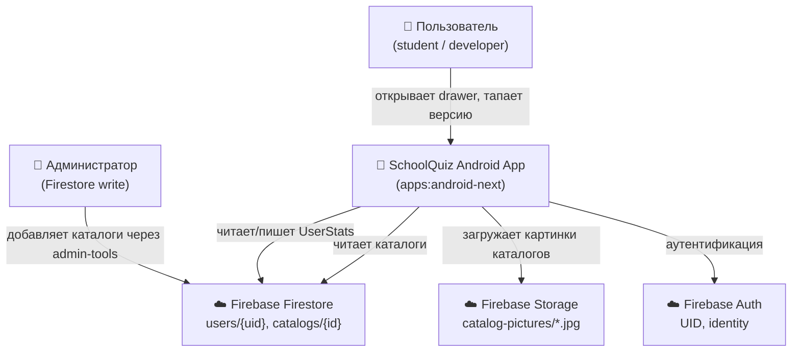

**Изменения menu-refactor**: app получает два новых источника данных (записи UserStats → Room local cache; каталоги из Firestore). Появляется фоновый sync pipeline (WorkManager).

---

## C4 L2 — Container Diagram (затронутые модули)

**TARGET state (post phase-01).** Показаны только модули, изменяемые или создаваемые в этой фиче. Стрелки = «зависит от».

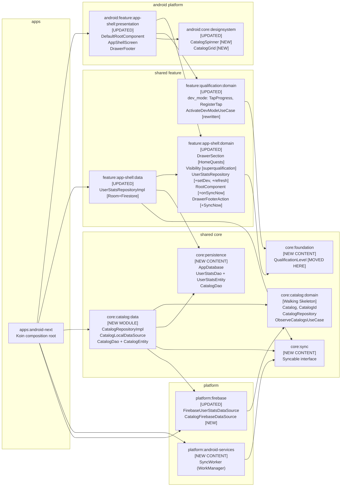

---

## Module Boundaries

| Модуль | Ответственность | State после фичи |
|--------|-----------------|-----------------|
| `core:foundation` | Shared cross-feature types (пороги квалификаций) | NEW CONTENT: `QualificationLevel` |
| `core:persistence` | Central Room `AppDatabase` — хранит UserStats + Catalog entities | NEW CONTENT: `UserStatsEntity`, `UserStatsDao`, `CatalogDao` |
| `core:sync` | Контракт `Syncable` для периодической синхронизации | NEW CONTENT: `Syncable` interface |
| `core:catalog:domain` | Domain-модель каталогов, repository interfaces | EXISTING Walking Skeleton |
| `core:catalog:data` | Room-кэш каталогов + Firestore pull | **NEW MODULE** (add to `settings.gradle.kts`) |
| `feature:app-shell:domain` | Видимость разделов меню, footer actions, repo interfaces | UPDATED: superqualification, HomeQuests, SyncNow, new methods |
| `feature:app-shell:data` | Реализация UserStatsRepository (Room + Firestore) | UPDATED: Room integration + `setLocalDeveloperLevel` + `refreshProfile` |
| `feature:qualification:domain` | Dev mode tap logic, `ActivateDevModeUseCase` | UPDATED: rewritten (overlay removed) |
| `android:feature:app-shell:presentation` | DefaultRootComponent, UI drawer, snackbar | UPDATED: dev mode activation, SyncNow, SnackbarHost |
| `android:core:designsystem` | Переиспользуемые UI компоненты | UPDATED: `CatalogSpinner`, `CatalogGrid` |
| `platform:firebase` | Firebase-specific data sources | UPDATED: `CatalogFirebaseDataSource` |
| `platform:android-services` | WorkManager workers | NEW CONTENT: `SyncWorker` |

---

## Dependency Direction Rules (menu-refactor)

| Правило | Направление | Нарушение |
|---------|-------------|-----------|
| `core/*` — shared infrastructure | `feature/* → core/*` ✓ | `core/* → feature/*` ✗ BLOCKER |
| `platform/*` — infrastructure adapters | `platform/* → core/*` ✓ | `core/* → platform/*` ✗ BLOCKER |
| feature cross-coupling | через `core/*` ✓ | direct `feature/A → feature/B` ✗ BLOCKER |
| `android:presentation` → domain | `android/* → shared/*` ✓ | `shared/* → android/*` ✗ BLOCKER |

**Ключевое решение (User Decision #1)**: `QualificationLevel` вынесен в `core:foundation`, чтобы `feature:app-shell:domain` мог его импортировать, не нарушая cross-feature import rule. Прямой импорт `app-shell:domain → qualification:domain` **запрещён**.

---

## New Module: `shared/core/catalog/data`

Модуль требует:
- Добавление `include(":shared:core:catalog:data")` в `settings.gradle.kts` — **owner: backend-dev**
- `build.gradle.kts` с `ksp` plugin + Room + coroutines + `core:catalog:domain` + `core:persistence`
- Implements `Syncable` из `core:sync`

---

## Scaffold File Ownership

| Файл | Owner | Комментарий |
|------|-------|-------------|
| `settings.gradle.kts` | backend-dev | добавить `:shared:core:catalog:data` |
| `libs.versions.toml` | backend-dev | добавить `coil3`, `ksp` активация |
| `shared/core/catalog/data/build.gradle.kts` | backend-dev | новый файл |
| `shared/feature/qualification/domain/build.gradle.kts` | backend-dev | добавить `kotlinx.coroutines.core` + `core:foundation` |
| `shared/feature/app-shell/domain/build.gradle.kts` | backend-dev | добавить `core:foundation` |
| `shared/core/persistence/build.gradle.kts` | backend-dev | добавить Room + ksp plugin |
| `platform/android-services/build.gradle.kts` | backend-dev | добавить WorkManager |

Другие teammates (frontend-dev, test-dev, firebase-dev) **запрашивают изменения через lead**, не редактируют самостоятельно.

---

## Cross-Feature Import Audit (invariant #3)

После menu-refactor новые зависимости (TARGET state, post phase-01; всё одностороннее):

| От | К | Механизм | OK? |
|----|---|----------|-----|
| `feature:app-shell:domain` | `core:foundation` | `QualificationLevel` import | ✓ (core — shared infra) |
| `feature:qualification:domain` | `core:foundation` | `QualificationLevel` import | ✓ |
| `feature:app-shell:data` | `core:persistence` | Room DAO | ✓ |
| `core:catalog:data` | `core:persistence` | Room DAO | ✓ |
| `platform:android-services` | `core:sync` | `Syncable` interface | ✓ |
| `android:feature:app-shell:presentation` | `feature:qualification:domain` | `ActivateDevModeUseCase` | ✓ (presentation → domain) |

Bidirectional coupling = 0. Direct `feature/* → feature/*` import = 0.

---

## Canonical API Signatures

Full Kotlin signatures для всех public cross-module API — **исключительно в `06-api-contract.md`**. Этот документ содержит только имена и роли.

| Тип | Модуль | Роль |
|-----|--------|------|
| `QualificationLevel` | `core:foundation` | enum пороги 100/200/300 |
| `UserStatsRepository` | `feature:app-shell:domain` | observe + refresh + setDev |
| `CatalogRepository` | `core:catalog:domain` | observe + refresh + getById |
| `DrawerFooterAction` | `feature:app-shell:domain` | sealed: DesignCatalog, SyncNow, About |
| `Syncable` | `core:sync` | suspend fun sync(): Result<Unit> |
| `RootComponent` | `feature:app-shell:domain` | +onSyncNow() |
| `RootEvent.SyncStarted` | `feature:app-shell:domain` | event для snackbar |
| `RootEvent.DevModeActivated` | `feature:app-shell:domain` | event для snackbar |

---

---

# C4 L3 — Component Architecture (architect-component)

> **⚠️ TARGET STATE (L3).** Этот appendix описывает class-level контракты **после phase-01 implementation**. Новые/изменённые методы помечены по месту. Для Walking Skeleton inventory (сохраняется vs удаляется vs добавляется) — см. L3.8 ниже.

*Добавлено: 2026-04-20. Автор: architect-component. Дополняет L1-L2 выше.*

---

## L3.1 — Domain Layer: `feature:app-shell:domain`

### Class Diagram

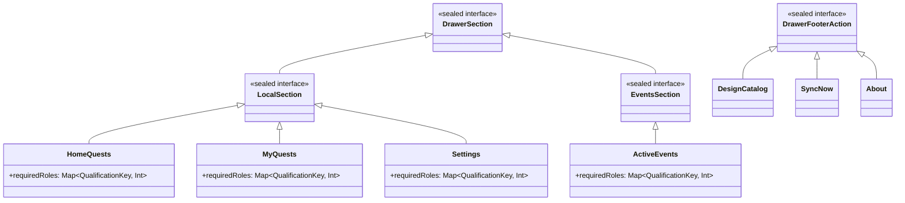

### `Visibility.kt` — изменяемые функции

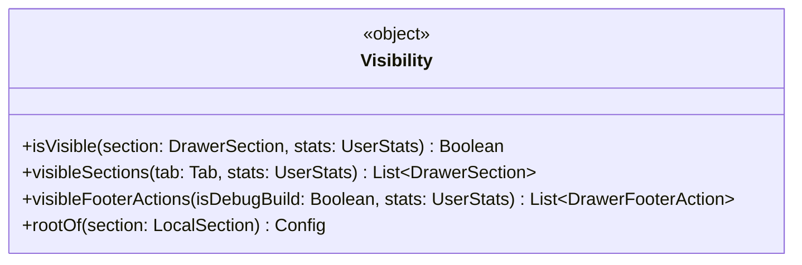

**Ключевые изменения:**
- `isVisible`: добавить OR-bypass для superqualification (`stats.qualification.developer >= QualificationLevel.LEVEL_1.points → true`)
- `visibleSections(Tab.LOCAL)`: порядок `[HomeQuests, MyQuests, Settings]` (HomeQuests первый — AC #11)
- `visibleFooterActions`: добавить параметр `stats: UserStats`; добавить `SyncNow` в output
- `rootOf(HomeQuests)`: маппинг `HomeQuests → Config.HomeQuestsRoot`

### `RootComponent` interface additions

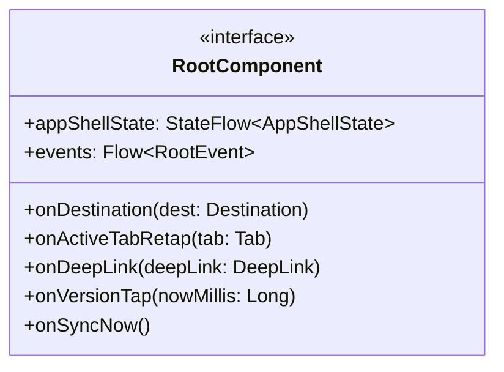

### `UserStatsRepository` interface additions

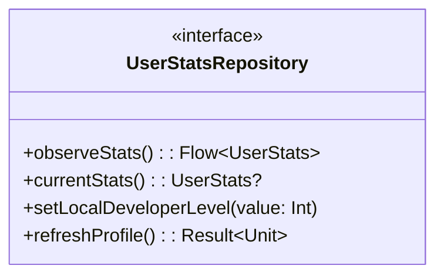

### `RootEvent` sealed interface additions

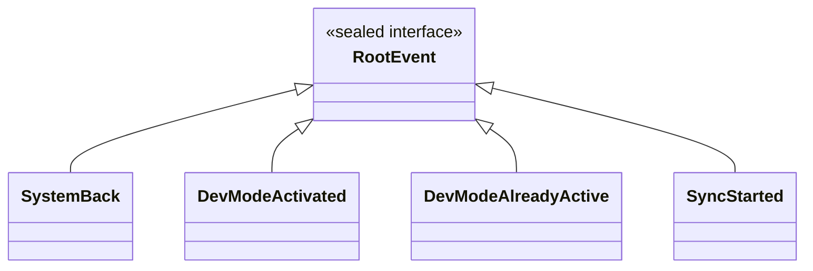

---

## L3.2 — Domain Layer: `feature:qualification:domain` (rewritten)

### `ActivateDevModeUseCase` — lambda injection pattern

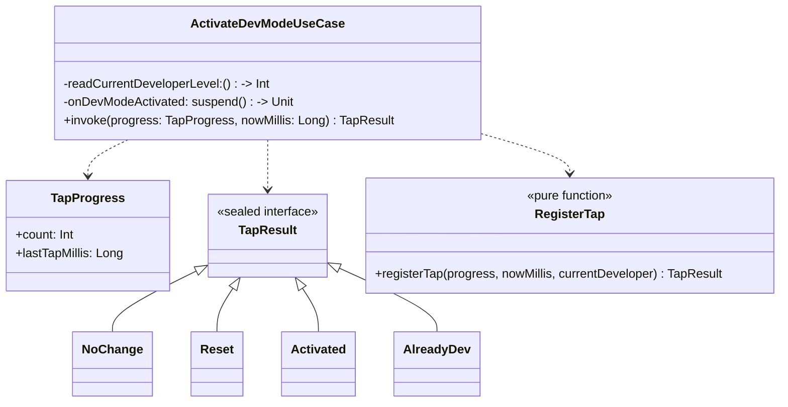

**Инварианты:**
- `readCurrentDeveloperLevel` — лямбда вместо прямой зависимости на `UserStatsRepository`
  — нельзя импортировать `app-shell:domain` из `qualification:domain` (cross-feature BLOCKER)
- `onDevModeActivated` — suspend лямбда, вызывается только при `TapResult.Activated`
- Walking Skeleton файлы к УДАЛЕНИЮ (User Decision #2): `LocalDeveloperOverride.kt`, `DeveloperLevelStats.kt`, `EffectiveDeveloperLevel.kt`, `LocalDeveloperOverrideRepository.kt`, `FakeLocalDeveloperOverrideRepository.kt`

---

## L3.3 — Data Layer: `feature:app-shell:data`

### `UserStatsRepositoryImpl` — Room + Firestore

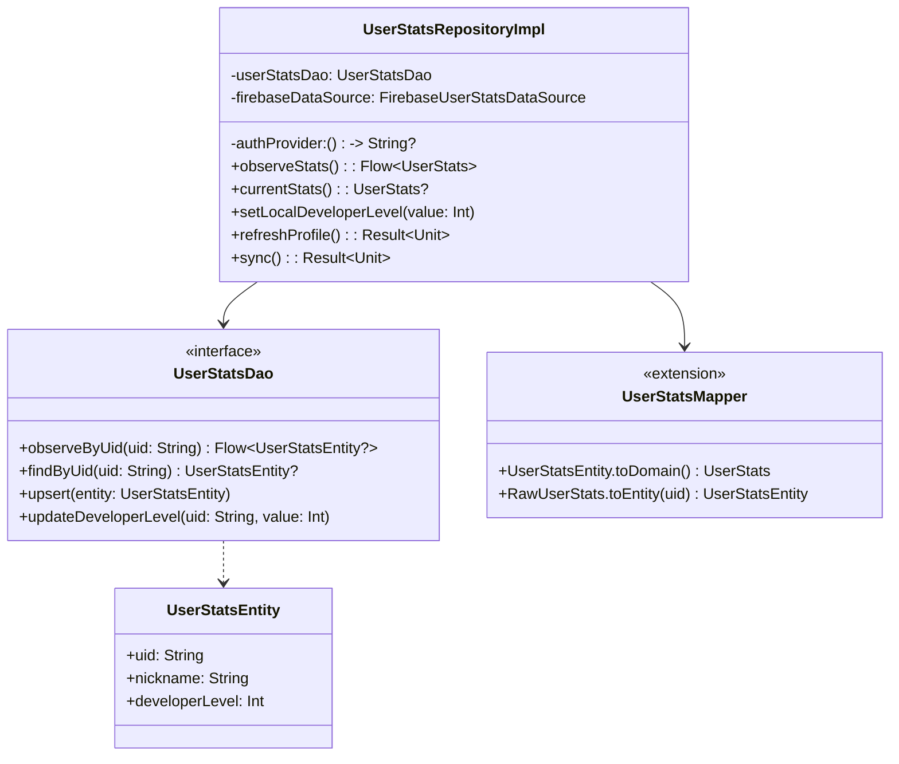

**Поведение `observeStats()`:**
1. Получает `uid` от `authProvider()` — если `null` → возвращает `emptyFlow()`
2. `userStatsDao.observeByUid(uid)` — Room Flow
3. `map { entity -> entity?.toDomain() ?: UserStats.EMPTY }`

**Поведение `setLocalDeveloperLevel(value)`:**
1. `uid = authProvider() ?: return`
2. `userStatsDao.updateDeveloperLevel(uid, value)` — targeted UPDATE (не REPLACE)

**Поведение `refreshProfile()`:**
1. `uid = authProvider() ?: return Result.failure(...)`
2. `firebaseDataSource.fetch(uid)` → `RawUserStats`
3. `entity = rawUserStats.toEntity(uid)`
4. `userStatsDao.upsert(entity)` — REPLACE вcех полей включая `developerLevel`

---

## L3.4 — Data Layer: `core:catalog:data`

### `CatalogRepositoryImpl` — Room + Firestore + URL resolution

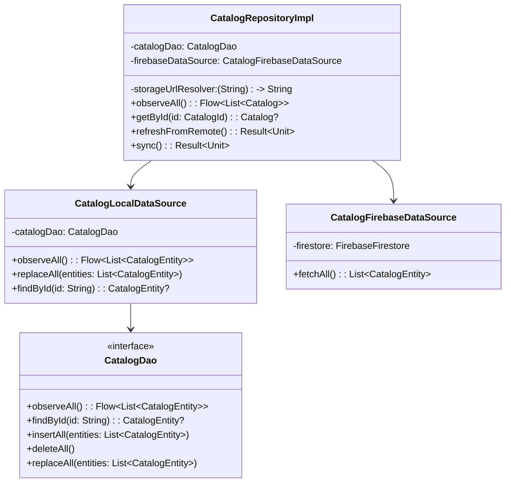

**URL resolution инвариант** (ADR-HLA-07):
- `CatalogRepositoryImpl.refreshFromRemote()` вызывает `storageUrlResolver(picturePath)` для каждого каталога
- `storageUrlResolver` — лямбда `(String) -> String`, инжектируется из Koin (платформенная зависимость)
- Domain `Catalog.picturePath` = relative path (не HTTPS URL)
- `CatalogEntity.pictureUrl: String?` = resolved HTTPS URL (хранится в Room для кэширования)
- UI получает `pictureUrl` через `CatalogDisplayItem` (presentation model) — не через domain `Catalog`

**Sorting invariant** (Codex fix #6): `CatalogRepositoryImpl.observeAll()` сортирует по `catalog.id.value ASC`

---

## L3.5 — Presentation Layer: `android:feature:app-shell:presentation`

### `DefaultRootComponent` — ключевые добавления

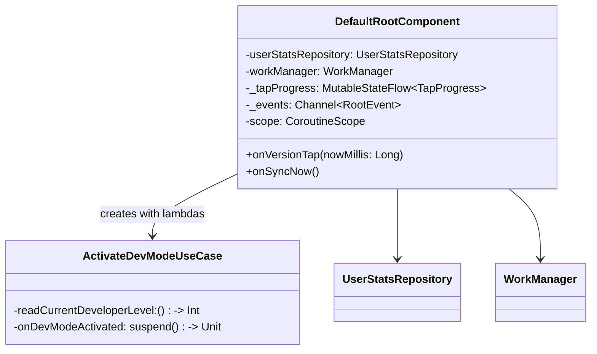

**Lambda wiring в конструкторе `DefaultRootComponent`:**
```
readCurrentDeveloperLevel = {
    _appShellState.value.userStats.qualification.developer
}
onDevModeActivated = {
    userStatsRepository.setLocalDeveloperLevel(100)
}
```

**`onVersionTap(nowMillis)`:**
1. Читает `_tapProgress.value`
2. Вызывает `activateDevModeUseCase.invoke(progress, nowMillis)` (suspend в `scope.launch`)
3. На `TapResult.Activated` → `_events.trySend(RootEvent.DevModeActivated)`
4. На `TapResult.AlreadyDev` → `_events.trySend(RootEvent.DevModeAlreadyActive)`
5. Обновляет `_tapProgress.value` с новым progress state из `registerTap()` result

**`onSyncNow()`:**
1. `workManager.enqueueUniqueWork("manual_sync", REPLACE, oneTimeSyncWorkRequest)`
2. `_events.trySend(RootEvent.SyncStarted)`

---

## L3.6 — UI Layer: `android:core:designsystem`

### `CatalogSpinner` и `CatalogGrid`

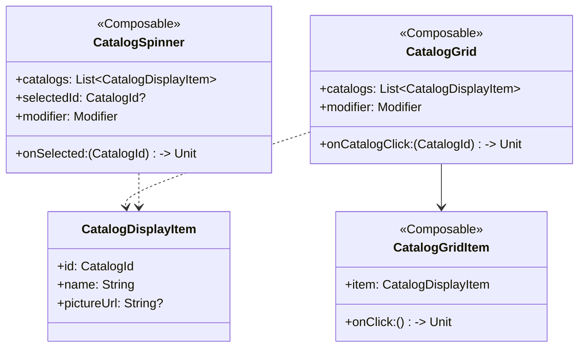

**Инварианты UI:**
- `CatalogSpinner` использует `ExposedDropdownMenuBox` (Material3)
- `CatalogGrid` использует `LazyVerticalGrid(GridCells.Fixed(2))`
- `CatalogGridItem` использует Coil `AsyncImage(model = item.pictureUrl, ...)`
- `CatalogDisplayItem` — presentation model; **НЕ** domain `Catalog` (нет `picturePath` в UI)
- `pictureUrl` = HTTPS URL, pre-resolved в data layer

---

## L3.7 — DI Wiring (Koin Modules)

### `persistenceModule` — `shared/core/persistence/`

```kotlin
val persistenceModule = module {
    single<AppDatabase> {
        Room.databaseBuilder(androidContext(), AppDatabase::class.java, "app_database")
            .build()
    }
    single<UserStatsDao> { get<AppDatabase>().userStatsDao() }
    single<CatalogDao> { get<AppDatabase>().catalogDao() }
}
```

### `appShellDataModule` — `shared/feature/app-shell/data/`

```kotlin
val appShellDataModule = module {
    single<UserStatsRepositoryImpl> {
        UserStatsRepositoryImpl(
            userStatsDao = get(),
            firebaseDataSource = get(),
            authProvider = { FirebaseAuth.getInstance().currentUser?.uid },
        )
    }
    single<UserStatsRepository> { get<UserStatsRepositoryImpl>() }
}
```

### `catalogDataModule` — `shared/core/catalog/data/`

```kotlin
val catalogDataModule = module {
    single<CatalogFirebaseDataSource> { CatalogFirebaseDataSource(get()) }
    single<CatalogLocalDataSource> { CatalogLocalDataSource(get()) }
    single<CatalogRepositoryImpl> {
        CatalogRepositoryImpl(
            localDataSource = get(),
            firebaseDataSource = get(),
            storageUrlResolver = { path ->
                FirebaseStorage.getInstance().reference.child(path).downloadUrl.await()
            },
        )
    }
    single<CatalogRepository> { get<CatalogRepositoryImpl>() }
}
```

### `syncModule` — `platform/android-services/`

```kotlin
val syncModule = module {
    single<List<Syncable>> {
        listOf(
            get<UserStatsRepositoryImpl>(),
            get<CatalogRepositoryImpl>(),
        )
    }
    single<WorkManager> { WorkManager.getInstance(androidContext()) }
}
```

---

## L3.8 — Walking Skeleton Inventory

### Файлы к УДАЛЕНИЮ (User Decision #2 — revert codex fix #2)

| Файл | Расположение | Status |
|------|-------------|--------|
| `LocalDeveloperOverride.kt` | `qualification:domain/dev_mode/model/` | REMOVED (phase-01) |
| `DeveloperLevelStats.kt` | `qualification:domain/dev_mode/model/` | REMOVED (phase-01) |
| `EffectiveDeveloperLevel.kt` | `qualification:domain/dev_mode/logic/` | REMOVED (phase-01) |
| `LocalDeveloperOverrideRepository.kt` | `qualification:domain/dev_mode/repository/` | REMOVED (phase-01) |
| `FakeLocalDeveloperOverrideRepository.kt` | `qualification:domain/dev_mode/repository/` | REMOVED (phase-01) |
| Тесты этих классов | рядом с файлами | REMOVED (phase-01) |

### Файлы к ПЕРЕМЕЩЕНИЮ (User Decision #1 — ADR-HLA-01)

| Файл | From | To | Status |
|------|------|----|--------|
| `QualificationLevel.kt` | `qualification:domain/model/` | `core:foundation/` | RENAMED (phase-01) |
| `QualificationLevelTest.kt` | `qualification:domain/test/` | `core:foundation/test/` | RENAMED (phase-01) |

### Файлы к СОХРАНЕНИЮ (Walking Skeleton, не трогаем)

| Файл | Модуль | Status |
|------|--------|--------|
| `TapProgress.kt` | `qualification:domain/dev_mode/model/` | KEPT |
| `RegisterTap.kt` | `qualification:domain/dev_mode/logic/` | KEPT |
| `Catalog.kt` | `core:catalog:domain/model/` | KEPT |
| `CatalogId.kt` | `core:catalog:domain/model/` | KEPT |
| `CatalogRepository.kt` | `core:catalog:domain/repository/` | KEPT |
| `ObserveCatalogsUseCase.kt` | `core:catalog:domain/use_case/` | KEPT |

### Новые файлы (добавляются в phase-01)

| Файл | Модуль | Status |
|------|--------|--------|
| `ActivateDevModeUseCase.kt` (rewritten) | `qualification:domain/dev_mode/use_case/` | ADDED (phase-01) |
| `UserStatsEntity.kt` | `core:persistence/` | ADDED (phase-01) |
| `UserStatsDao.kt` | `core:persistence/` | ADDED (phase-01) |
| `CatalogEntity.kt` | `core:persistence/` | ADDED (phase-01) |
| `CatalogDao.kt` | `core:persistence/` | ADDED (phase-01) |
| `AppDatabase.kt` | `core:persistence/` | ADDED (phase-01) |
| `CatalogRepositoryImpl.kt` | `core:catalog:data/` | ADDED (phase-01) |
| `CatalogFirebaseDataSource.kt` | `platform:firebase/` | ADDED (phase-01) |
| `SyncWorker.kt` | `platform:android-services/` | ADDED (phase-01) |

---

## L3.9 — Component Interaction Summary

```mermaid
graph LR
    subgraph "presentation (Android)"
        DRC["DefaultRootComponent\n+onVersionTap()\n+onSyncNow()"]
        AS["AppShellScreen\n(LaunchedEffect for events)"]
        DF["DrawerFooter\n(version tap, SyncNow click)"]
    end

    subgraph "domain (KMP)"
        UC["ActivateDevModeUseCase\n(lambda injection)"]
        RT["RegisterTap\n(pure FSM)"]
        VIS["Visibility\n(isVisible + superqual bypass)"]
        USR["UserStatsRepository\n(interface)"]
    end

    subgraph "data (KMP)"
        USRI["UserStatsRepositoryImpl\n(Room + Firestore)"]
        DAO["UserStatsDao\n(Room)"]
    end

    subgraph "platform"
        WM["WorkManager\n(SyncWorker)"]
        FB["FirebaseUserStatsDataSource"]
    end

    DF -->|onVersionTap| DRC
    DF -->|onSyncNow| DRC
    DRC -->|invoke(progress, nowMillis)| UC
    UC -->|registerTap()| RT
    UC -->|lambda: setLocalDeveloperLevel| USRI
    DRC -->|enqueueUniqueWork| WM
    DRC -->|_events.trySend| AS
    USRI -->|observeByUid| DAO
    USRI -->|fetch| FB
    VIS -->|reads qualification.developer| USR
```
