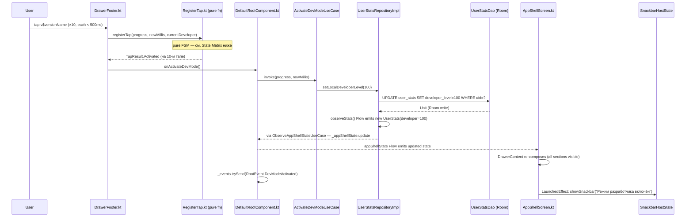
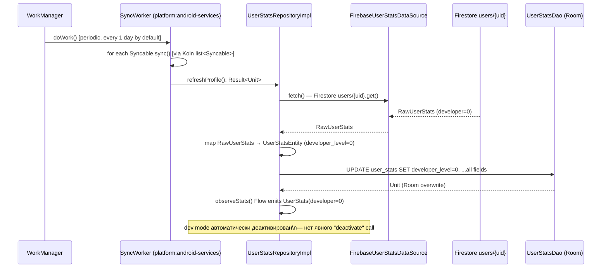
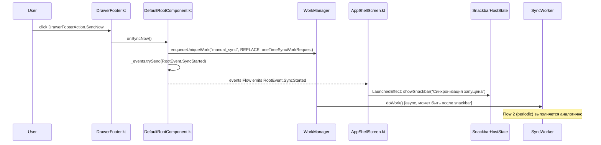
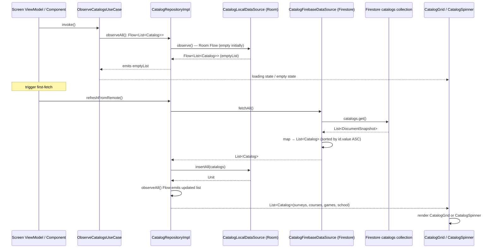
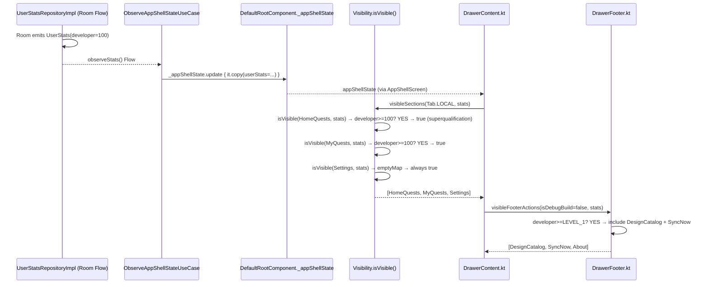
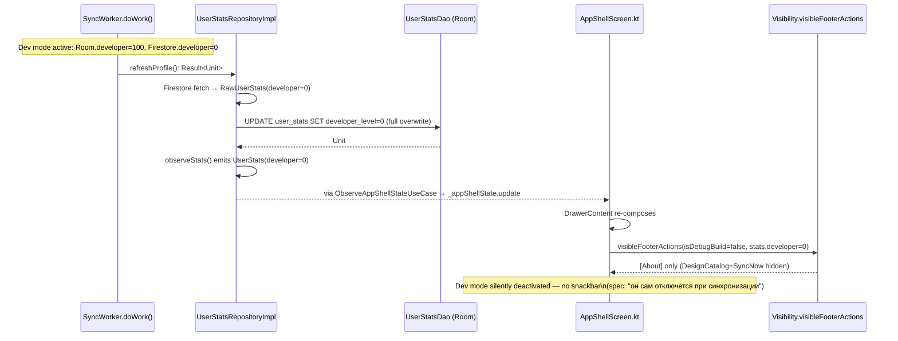

# Behavior: Menu Refactor — Data Flow Diagrams

> **⚠️ TARGET STATE.** Этот документ описывает data flows **после phase-01 implementation** фичи `menu-refactor`. Все DFD — целевые потоки данных, не current state. Для текущего состояния см. `1-research.md` + `2-grounding.md`.

Этот документ описывает 6 ключевых data flow для feature. State Matrix взяты из spec (не переписываются), здесь — маппинг на реальные file:line.

---

## Flow 1: 10-Tap Dev Mode Activation

*Target flow — post phase-01 implementation.*

**File:line mapping:**
- `DrawerFooter.kt:59` — `Text("v$versionName")` (сейчас без clickable, добавляется в implement)
- `RegisterTap.kt:34` — `fun registerTap(...)` (Walking Skeleton, pure function)
- `DefaultRootComponent.kt:56` — `MutableStateFlow<AppShellState>` (holds state)
- `ActivateDevModeUseCase` — `qualification:domain/dev_mode/use_case/`
- `UserStatsRepository.kt:15` — interface, method `setLocalDeveloperLevel` — **добавить**
- `AppShellScreen.kt:129` — `Scaffold` (добавить `snackbarHost` параметр)

---

## Flow 2: SyncWorker Periodic Pipeline (Dev Mode Auto-Deactivation)

*Target flow — post phase-01 implementation.*

**File:line mapping:**
- `SyncWorker.kt` — NEW, в `platform/android-services/` (WorkManager `CoroutineWorker`)
- `UserStatsRepository.kt:15` — добавить `suspend fun refreshProfile(): Result<Unit>`
- `UserStatsRepositoryImpl.kt:21` — существующая реализация, UPDATED для Room
- `FirebaseUserStatsDataSource.kt:28` — существующий `callbackFlow` → заменяется на одноразовый `get()` для refresh
- `UserStatsDao` — NEW в `core:persistence`
- `UserStatsEntity.kt` — NEW в `core:persistence` (см. spec `0-spec-dev-mode.md:39-65`)

**Deactivation invariant:** Нет явного вызова "deactivate overlay". Dev mode "выключается" потому что Room overwrite устанавливает `developer_level=0`, что совпадает с server value. `observeStats()` Flow эмитит UserStats с `developer=0`, и drawer re-renders.

---

## Flow 3: SyncNow Manual Trigger

*Target flow — post phase-01 implementation.*

**File:line mapping:**
- `DrawerFooter.kt:49-57` — `when (action)` — добавить `DrawerFooterAction.SyncNow` branch
- `RootComponent.kt:24` — добавить `fun onSyncNow()`
- `DefaultRootComponent.kt` — реализация `onSyncNow()` с WorkManager
- `AppShellScreen.kt` — добавить `LaunchedEffect` для `events` collection
- `RootEvent.kt:12` — добавить `data object SyncStarted : RootEvent`

---

## Flow 4: First-Launch Catalog Pull

*Target flow — post phase-01 implementation.*

**File:line mapping:**
- `ObserveCatalogsUseCase.kt` — Walking Skeleton (`core:catalog:domain/use_case/`)
- `CatalogRepository.kt` — Walking Skeleton (`core:catalog:domain/repository/`)
- `CatalogRepositoryImpl.kt` — NEW (`core:catalog:data/`)
- `CatalogLocalDataSource.kt` — NEW (`core:catalog:data/`)
- `CatalogFirebaseDataSource.kt` — NEW (`platform:firebase/`)
- `CatalogSpinner.kt`, `CatalogGrid.kt` — NEW (`android:core:designsystem/`)

**Sorting invariant (Codex fix #6):** Список каталогов сортируется по `id.value ASC` на клиенте (в `CatalogRepositoryImpl`) после Firestore fetch. Гарантирует детерминизм для тестов и UI.

---

## Flow 5: Drawer Rendering with Superqualification

*Target flow — post phase-01 implementation.*

**File:line mapping:**
- `Visibility.kt:50` — `isVisible()` — UPDATED (добавить OR-bypass для superqualification)
- `Visibility.kt:67` — `visibleSections(Tab.LOCAL)` — UPDATED (HomeQuests first)
- `Visibility.kt:142` — `visibleFooterActions()` — UPDATED signature + SyncNow
- `DrawerContent.kt:45` — caller передаёт `userStats` в `DrawerFooter`
- `AppShellState.kt:24` — `userStats: UserStats` уже присутствует

### State Matrix Map (Visibility)

Из `0-spec-dev-mode.md` Visibility matrix, mapped to `Visibility.kt:50`:

| Section requires | developer level | Result | Code path |
|---|---|---|---|
| `{D=100,T=100,...}` | ≥ LEVEL_1 (100) | **true** (superqualification) | `Visibility.kt:50` — OR-bypass (добавить) |
| `{D=100,T=100,...}` | < LEVEL_1 | depends on roles | `Visibility.kt:52` — existing AND-check |
| `{}` (empty) | any | **true** (always visible) | `Visibility.kt:50` — `all { }` on empty = true |

---

## Flow 6: Automatic Dev Mode Deactivation via Sync Overwrite

*Target flow — post phase-01 implementation.*

**Ключевой инвариант:** Нет отдельного "deactivate()" вызова. Deactivation — side effect стандартного sync overwrite. `refreshProfile()` перезаписывает **все** поля `UserStatsEntity`, включая `developer_level=0` (server value). Клиентский dev mode "исчезает" сам по себе.

**Error case:** Если `refreshProfile()` возвращает `Result.failure` (network error), Room НЕ обновляется, dev mode продолжает действовать до следующей успешной sync.

---

## State Matrix — Tap FSM (из spec, mapped to code)

Spec source: `0-spec-dev-mode.md` State Machine table.
Code: `RegisterTap.kt:34` (Walking Skeleton, file: `shared/feature/qualification/domain/...dev_mode/logic/RegisterTap.kt`).

| `progress.count` | elapsed vs 500ms | developer level | Output | Code return |
|---|---|---|---|---|
| 0 | N/A (first) | any | count=1, NoChange | `TapResult.NoChange` |
| 1..8 | ≤ 500ms | any | count+1, NoChange | `TapResult.NoChange` |
| 1..8 | > 500ms | any | count=1, Reset | `TapResult.Reset` |
| 9 | ≤ 500ms | < LEVEL_1.points | count=0, **Activated** | `TapResult.Activated` |
| 9 | ≤ 500ms | ≥ LEVEL_1.points | count=0, AlreadyDev | `TapResult.AlreadyDev` |
| 9 | > 500ms | any | count=1, Reset | `TapResult.Reset` |

`LEVEL_1.points = 100` — определяется в `QualificationLevel.kt` (moved to `core:foundation`).

---

## Footer Action Visibility Matrix (из spec, mapped to code)

Spec source: `0-spec-dev-mode.md` Footer Contract Full Matrix.
Code: `Visibility.visibleFooterActions()` (`Visibility.kt:142`) — signature UPDATED.

| `isDebugBuild` | `stats.developer` | Output | `visibleFooterActions(isDebugBuild, stats)` |
|---|---|---|---|
| true | any | `[DesignCatalog, SyncNow, About]` | debug bypass |
| false | ≥ 100 | `[DesignCatalog, SyncNow, About]` | superqualification |
| false | < 100 | `[About]` | no dev tools |

Order в output — всегда `[DesignCatalog?, SyncNow?, About]` (declaration order, filtered).
