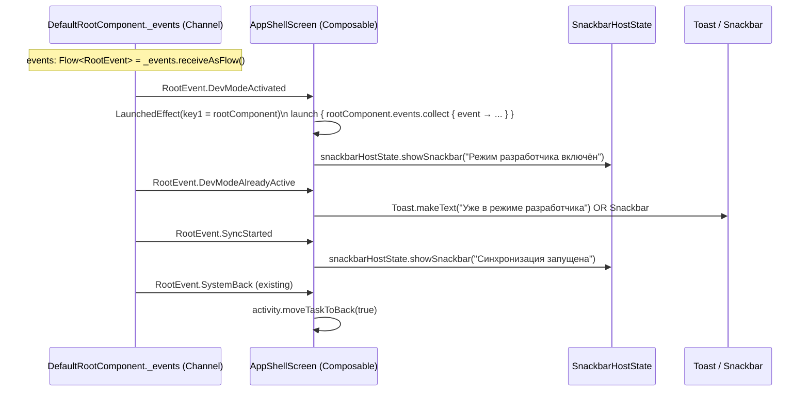

# Events: Menu Refactor

Этот документ описывает расширение `RootEvent` sealed hierarchy и event flow между `DefaultRootComponent` и `AppShellScreen`.

Canonical сигнатуры событий — в `06-api-contract.md#3.1`.

---

## RootEvent Hierarchy Extension

**File:** `shared/feature/app-shell/domain/src/commonMain/kotlin/.../model/RootEvent.kt`

### Before (existing)

```kotlin
sealed interface RootEvent {
    data object SystemBack : RootEvent
}
```

### After (menu-refactor)

```kotlin
sealed interface RootEvent {
    /** Existing — UI calls activity.finish() / moveTaskToBack() */
    data object SystemBack : RootEvent

    /** NEW — 10-tap dev mode activation succeeded. Show Snackbar. */
    data object DevModeActivated : RootEvent

    /** NEW — 10-tap on version but developer >= LEVEL_1.points already. Show Toast. */
    data object DevModeAlreadyActive : RootEvent

    /** NEW — Manual SyncNow triggered. WorkManager job enqueued. Show Snackbar. */
    data object SyncStarted : RootEvent
}
```

**Owner:** `feature:app-shell:domain`. Domain определяет event types (pure Kotlin, без Android). Presentation (DefaultRootComponent) эмитит; AppShellScreen собирает.

---

## Event Producers

| Event | Producer | Trigger |
|-------|----------|---------|
| `SystemBack` | `DefaultRootComponent` (existing) | BackStack empty + LOCAL tab + drawer closed |
| `DevModeActivated` | `DefaultRootComponent.onVersionTap()` | `ActivateDevModeUseCase` returns `TapResult.Activated` |
| `DevModeAlreadyActive` | `DefaultRootComponent.onVersionTap()` | `ActivateDevModeUseCase` returns `TapResult.AlreadyDev` |
| `SyncStarted` | `DefaultRootComponent.onSyncNow()` | `WorkManager.enqueueUniqueWork()` called |

---

## Event Flow: DefaultRootComponent → AppShellScreen



---

## Snackbar Infrastructure

**File:** `android/feature/app-shell/presentation/src/main/kotlin/.../ui/AppShellScreen.kt`

Текущий `AppShellScreen.Scaffold` **не имеет** `snackbarHost` параметра (`AppShellScreen.kt:129-141`). Необходимо добавить:

```kotlin
// AppShellScreen.kt — ADDITIONS

val snackbarHostState = remember { SnackbarHostState() }

LaunchedEffect(rootComponent) {
    rootComponent.events.collect { event ->
        when (event) {
            RootEvent.DevModeActivated ->
                snackbarHostState.showSnackbar("Режим разработчика включён")
            RootEvent.DevModeAlreadyActive ->
                snackbarHostState.showSnackbar("Уже в режиме разработчика")
            RootEvent.SyncStarted ->
                snackbarHostState.showSnackbar("Синхронизация запущена")
            RootEvent.SystemBack ->
                activity.moveTaskToBack(true)  // существующая логика
        }
    }
}

Scaffold(
    topBar = { ... },
    bottomBar = { ... },
    snackbarHost = { SnackbarHost(snackbarHostState) },  // NEW
    content = { ... },
)
```

**Note:** `DevModeAlreadyActive` показывается через `snackbarHostState.showSnackbar()` (spec упоминает "toast", но в M3 Compose контексте Snackbar является стандартным механизмом feedback).

---

## Event Channel Implementation

**File:** `android/feature/app-shell/presentation/src/.../DefaultRootComponent.kt`

```kotlin
private val _events = Channel<RootEvent>(Channel.BUFFERED)
override val events: Flow<RootEvent> = _events.receiveAsFlow()
```

`Channel.BUFFERED` — не теряет события при кратковременном отсутствии collector (например если Snackbar ещё не показался).

`_events.trySend(event)` — вызывается из корутин внутри `DefaultRootComponent` (всегда non-blocking, buffe 64 по умолчанию).

---

## Event Invariants

1. **Один producer** для каждого event type — только `DefaultRootComponent` эмитит. Composables и другие компоненты не эмитят `RootEvent` напрямую.
2. **`LaunchedEffect(rootComponent)`** — коллектор повторно запускается только при замене `rootComponent` (не при recomposition). Предотвращает дублирование коллекторов.
3. **`SyncStarted` не гарантирует успех sync** — это "sync enqueued" событие. WorkManager выполнит sync асинхронно. UI не отслеживает completion (spec не требует "sync completed" feedback).
4. **DevModeAlreadyActive ≠ error** — информационное сообщение; guard passed, ничего не записывается в БД.

---

## Snackbar Text Strings

| Event | Строка RU |
|-------|-----------|
| `DevModeActivated` | `"Режим разработчика включён"` |
| `DevModeAlreadyActive` | `"Уже в режиме разработчика"` |
| `SyncStarted` | `"Синхронизация запущена"` |

Строки — в presentation layer (Labels.kt или отдельный strings ресурс). Не в domain.

---

## Relationship to Spec

| Spec reference | Event | Resolved |
|----------------|-------|----------|
| `0-spec-dev-mode.md` FR #3 | Snackbar "Режим разработчика включён" | `RootEvent.DevModeActivated` |
| `0-spec-dev-mode.md` FR #5 | Toast "Уже в режиме разработчика" | `RootEvent.DevModeAlreadyActive` |
| `0-spec-catalog-foundation.md` FR #9 | Snackbar "Синхронизация запущена" | `RootEvent.SyncStarted` |
| `0-spec.md` User Decision #3 | `RootComponent.onSyncNow()` + `RootEvent.SyncStarted` | Реализовано |
| `2-grounding.md` Problem 4 Fix Shape (Path D) | RootComponent method + events Flow | Реализовано |

---

---

# L3 Event Details (architect-component)

> **⚠️ TARGET STATE (L3).** Этот appendix описывает event wiring **после phase-01 implementation**. Код-сниппеты — целевые контракты, не текущее состояние файлов.

*Добавлено: 2026-04-20. Автор: architect-component.*

---

## L3.1 `DefaultRootComponent.onVersionTap()` — полная реализация

```kotlin
override fun onVersionTap(nowMillis: Long) {
    scope.launch {
        val current = _tapProgress.value
        val result = activateDevModeUseCase.invoke(current, nowMillis)
        when (result) {
            is TapResult.Activated -> {
                _tapProgress.value = TapProgress.INITIAL
                _events.trySend(RootEvent.DevModeActivated)
            }
            is TapResult.AlreadyDev -> {
                _tapProgress.value = TapProgress.INITIAL
                _events.trySend(RootEvent.DevModeAlreadyActive)
            }
            is TapResult.NoChange -> {
                _tapProgress.value = result.updatedProgress
            }
            is TapResult.Reset -> {
                _tapProgress.value = TapProgress(count = 1, lastTapMillis = nowMillis)
            }
        }
    }
}
```

**Инварианты:**
- `_tapProgress.value = TapProgress.INITIAL` при Activated/AlreadyDev — FSM сбрасывается
- `TapResult.Reset` сохраняет count=1 (первый тап нового цикла = текущий тап)
- `scope.launch` — компонентный scope с `SupervisorJob()`, отменяется в `onDestroy()`

---

## L3.2 `DefaultRootComponent.onSyncNow()` — полная реализация

```kotlin
override fun onSyncNow() {
    val request = OneTimeWorkRequestBuilder<SyncWorker>()
        .setConstraints(Constraints.Builder().setRequiredNetworkType(NetworkType.CONNECTED).build())
        .build()
    workManager.enqueueUniqueWork("manual_sync", ExistingWorkPolicy.REPLACE, request)
    _events.trySend(RootEvent.SyncStarted)
}
```

**Инварианты:**
- `ExistingWorkPolicy.REPLACE` — повторный клик отменяет предыдущую очередь и ставит новую
- `NetworkType.CONNECTED` — не запускать sync без сети (опционально: можно убрать если нужен offline-queue)
- `trySend` не suspend — `onSyncNow()` не должна быть suspend; WorkManager enqueue — sync операция

---

## L3.3 `DrawerFooter.kt` — trigger wiring

```kotlin
// version text clickable trigger:
Text(
    text = "v${BuildConfig.VERSION_NAME}",
    modifier = Modifier
        .clickable {
            rootComponent.onVersionTap(System.currentTimeMillis())
        }
        .padding(vertical = 8.dp),
    style = MaterialTheme.typography.bodySmall,
    color = MaterialTheme.colorScheme.onSurfaceVariant,
)

// SyncNow footer action:
DrawerFooterAction.SyncNow -> {
    rootComponent.onSyncNow()
}
```

---

## L3.4 `AppShellScreen.kt` — event collection wiring

```kotlin
val snackbarHostState = remember { SnackbarHostState() }
val coroutineScope = rememberCoroutineScope()

LaunchedEffect(rootComponent) {
    rootComponent.events.collect { event ->
        when (event) {
            RootEvent.DevModeActivated ->
                snackbarHostState.showSnackbar(
                    message = "Режим разработчика включён",
                    duration = SnackbarDuration.Long,
                )
            RootEvent.DevModeAlreadyActive ->
                snackbarHostState.showSnackbar(
                    message = "Уже в режиме разработчика",
                    duration = SnackbarDuration.Short,
                )
            RootEvent.SyncStarted ->
                snackbarHostState.showSnackbar(
                    message = "Синхронизация запущена",
                    duration = SnackbarDuration.Short,
                )
            RootEvent.SystemBack ->
                (LocalContext.current as? Activity)?.moveTaskToBack(true)
        }
    }
}

Scaffold(
    snackbarHost = { SnackbarHost(snackbarHostState) },
    // ... остальные параметры без изменений
)
```
