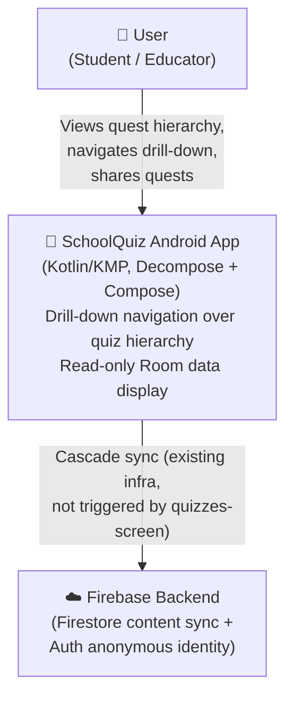
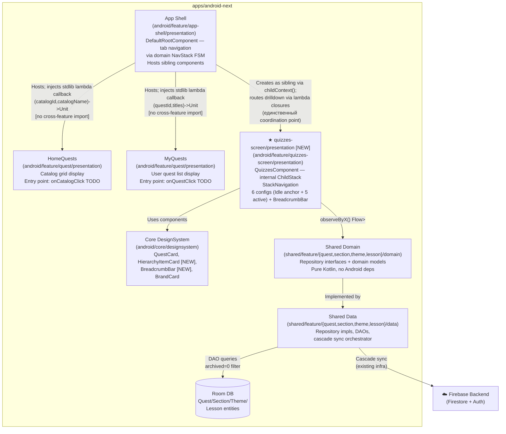
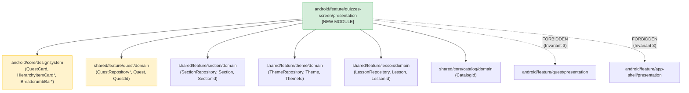
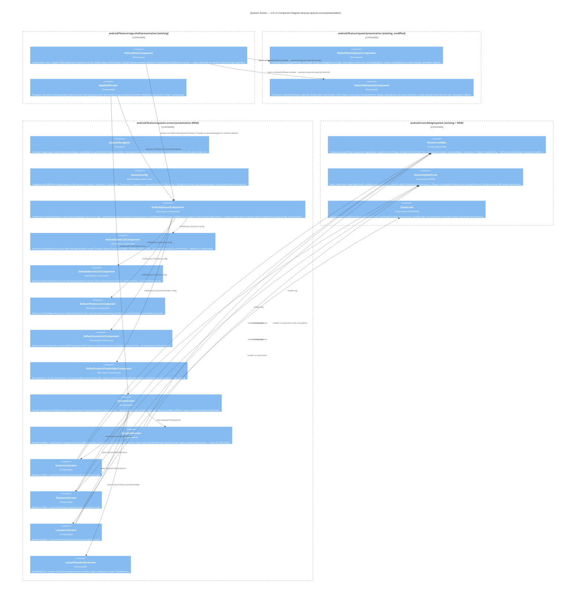

# 01 Architecture: Quizzes Screen

## Overview

`quizzes-screen` — новый Android-only presentation модуль поверх существующего data/domain стека. Реализует иерархический drill-down (Quest → Section → Theme → Lesson + LessonPlaceholder) с breadcrumb-навигацией, long-press меню (Share) и восстановлением после process death.

Ключевые архитектурные решения:
- **Изолированный ChildStack**: `QuizzesComponent` владеет своим `StackNavigation<QuizzesConfig>` — не расширяет domain `NavStack` FSM в `shared/feature/app-shell/domain/` (User Decision Q3). Изолирует фичу от app-shell architecture.
- **Read-only presentation**: фича только читает данные через существующие repository interfaces. Единственное data-layer расширение — `QuestRepository.observeByCatalog(catalogId, shelf)` — additive, без миграции схемы.
- **First serialized ChildStack**: `QuizzesConfig` — `@Serializable`, первый стек в проекте с `serializer != null` (User Decision Q2). Все существующие ChildStack используют `serializer = null` (`LocalTabComponent.kt:22`).
- **Walking Skeleton = N/A**: Feature Domain Contract = N/A — domain генерация пропущена корректно.

---

## C4 L1 — System Context



Quizzes-screen фича не взаимодействует с Firebase напрямую. Sync infrastructure — полностью в `home-and-my-quests` модуле. Фича потребляет уже синхронизированные данные из Room.

---

## C4 L2 — Containers



---

## Module Dependency Graph



`*` — расширяется или добавляется в рамках этой фичи.

### Разрешённые импорты

| От | К | Что именно |
|----|---|------------|
| `quizzes-screen/presentation` | `designsystem` | `QuestCard`, `HierarchyItemCard` [NEW], `BreadcrumbBar` [NEW], `BrandCard` |
| `quizzes-screen/presentation` | `shared/feature/quest/domain` | `QuestRepository` interface, `Quest`, `QuestId` |
| `quizzes-screen/presentation` | `shared/feature/section/domain` | `SectionRepository` interface, `Section`, `SectionId` |
| `quizzes-screen/presentation` | `shared/feature/theme/domain` | `ThemeRepository` interface, `Theme`, `ThemeId` |
| `quizzes-screen/presentation` | `shared/feature/lesson/domain` | `LessonRepository` interface, `Lesson`, `LessonId` |
| `quizzes-screen/presentation` | `shared/core/catalog/domain` | `CatalogId` value type |

### Запрещённые импорты

| Запрещено | Причина |
|-----------|---------|
| `android/feature/quest/presentation` | Bidirectional coupling нарушает Invariant 3. Координация — через factory injection из `DefaultRootComponent` |
| `android/feature/app-shell/presentation` | Нарушает one-directional coupling (app-shell → quizzes, не наоборот) |
| Любые другие `android/feature/*/presentation` | Feature boundary isolation |

---

## Integration with App-Shell

### Место `QuizzesComponent` в существующей навигации

`DefaultRootComponent` создаёт `homeQuestsComponent` и `myQuestsComponent` как flat children через `childContext("...")` (`DefaultRootComponent.kt:130-131`), не через ChildStack. Новый `QuizzesComponent` встраивается как **sibling** тем же способом.

**Механизм wiring**:
1. `DefaultRootComponent` получает `quizzesFactory: (ComponentContext) -> QuizzesComponent` в конструктор (аналог `homeQuestsFactory`/`myQuestsFactory`).
2. `DefaultRootComponent` создаёт `quizzesComponent = quizzesFactory(childContext("QuizzesContent"))`.
3. `DefaultRootComponent` инжектирует **stdlib lambda callbacks** — `(catalogId: String, catalogName: String) -> Unit` и `(questId: String, titles: List<String>) -> Unit` — в `homeQuestsFactory` и `myQuestsFactory`. Внутри лямбды: `quizzesComponent.openQuestList(...)` / `quizzesComponent.openSectionList(...)`. `QuizzesNavigator` живёт **только** в `quizzes-screen/presentation`; в `quest/presentation` он не импортируется. Stdlib lambda type — нет cross-feature import, Invariant 3 соблюдается.
4. `AppShellScreen.kt` рендерит `QuizzesContent(rootComponent.quizzesComponent)` при активном drill-down состоянии.

**Back handling**: новый ChildStack создаётся с `handleBackButton = true`. Его `BackCallback` будет выше по приоритету чем существующий `DefaultRootComponent.backHandler` (`DefaultRootComponent.kt:136-142`) пока ChildStack имеет более одного элемента. При возврате к корню stack — back делегируется root handler (возврат на HomeQuests/MyQuests). Детальная координация back приоритетов — ответственность architect-component.

**Koin DI**: `QuizzesPresentationModule` в `android/feature/quizzes-screen/presentation/.../di/`. Паттерн factory-based injection аналогичен `QuestPresentationModule.kt:25-41`. Регистрация в `AppApplication.kt` startKoin — owned by `backend-dev` (Invariant 7 scaffold ownership).

**Следование ADR-CMP-51**: `DefaultQuizzesComponent` следует тому же паттерну что `DefaultHomeQuestsComponent`/`DefaultMyQuestsComponent` — `ComponentContext by componentContext`, `coroutineScope(Dispatchers.Main + lifecycle)` для Flow collection, `instanceKeeper` для retained state при rotation.

---

## Data Flow at High Level

Фича — **read-only observer**. Нет записей в Room, нет сетевых запросов, нет изменений в Firebase. Все данные поступают через реактивные `Flow<List<T>>` из существующих repository interfaces.

| Child Component | Repository | Method | Sort | Filter |
|-----------------|-----------|--------|------|--------|
| `QuestListComponent` | `QuestRepository` | `observeByCatalog(catalogId, shelf="home")` **[NEW]** | `lastModifiedAt DESC` | `catalogId + visibleOn contains "home" + archived=0` |
| `SectionListComponent` | `SectionRepository` | `observeByQuest(questId)` | `order ASC` | `questId + archived=0` |
| `ThemeListComponent` | `ThemeRepository` | `observeBySection(sectionId)` | `order ASC` | `sectionId + archived=0` |
| `LessonListComponent` | `LessonRepository` | `observeByTheme(themeId)` | `order ASC` | `themeId + archived=0` |
| `LessonPlaceholderComponent` | — | N/A (static content) | — | — |

**Фильтрация `archived=0`**: в DAO query (ADR-CMP-52 `home-and-my-quests/03-decisions.md`). При cascade archive parent → дети пустеют через existing DAO filter (Invariant B server cascading) — фича не добавляет parent observers.

**`observeByCatalog` filter**: delimiter-wrapped LIKE pattern `(CHAR(31) || visibleOn || CHAR(31)) LIKE (...)` — идентично `QuestDao.observeByShelf:28-34`. Только `visibleOn contains "home"` + `archived=0`.

**Quest sort**: `lastModifiedAt DESC` (User Decision Q1). `Quest` / `QuestEntity` не имеют поля `order` (verified `Quest.kt:30-93`, `QuestEntity.kt:24-38`).

---

## Cross-Cutting Concerns

### Process Death Restoration — First Serialized ChildStack

**Существующая ситуация**: все ChildStack в проекте (`LocalTabComponent.kt:22`, `ShopTabComponent.kt:22`, `EventsTabComponent.kt:22`, `InternetTabComponent.kt:22`) используют `serializer = null` — stack не восстанавливается после process death.

**Quizzes-screen — исключение**: `childStack(source = navigation, serializer = QuizzesConfig.serializer(), ...)`. Decompose автоматически сериализует `List<QuizzesConfig>` через `ListSerializer(QuizzesConfig.serializer())` при `Activity.onSaveInstanceState`.

**Требования**:
- `QuizzesConfig` — `@Serializable sealed class` с 6 вариантами (Idle anchor + 5 active), каждый несёт frozen `id + title(s)` snapshot.
- `kotlinx-serialization` Gradle plugin в новом presentation module (`build.gradle.kts` — backend-dev ownership).
- Bundle overhead пренебрежимо мал: только `String/Long/Int` поля, small list.

Полное определение `QuizzesConfig` — canonical в `06-api-contract.md`.

### BrandComponentsInvariantsTest Compliance

`BrandComponentsInvariantsTest.kt:23-67` применяет правила ко всем `.kt` файлам в `android/core/designsystem/.../components/`:
1. **Запрет `Color(0x...)`** — использовать только `MaterialTheme.colorScheme.*`.
2. **`@Preview` обязателен** в каждом файле.

Новые компоненты `HierarchyItemCard.kt` и `BreadcrumbBar.kt` подпадают под оба правила. Frontend-dev обеспечивает соответствие при реализации.

### observeByCatalog — Additive Data Layer Extension

Метод `QuestRepository.observeByCatalog` добавляется в существующий interface как новый метод — без изменения существующих сигнатур, без Room schema migration. `QuestEntity` уже содержит все необходимые поля (`catalogId`, `visibleOn`, `archived`, `lastModifiedAt` — verified `QuestEntity.kt:24-38`).

**Blast radius — файлы требующие обновления**:

| Файл | Причина |
|------|---------|
| `shared/feature/quest/domain/src/commonTest/.../fake/FakeQuestRepository.kt:57` | Implements `QuestRepository` interface — compile breaks без нового метода |
| `android/feature/quest/presentation/src/test/.../fake/FakeQuestRepository.kt:11` | То же — вторая копия fake |
| `shared/core/sync/.../FakeQuestRepository.kt:20` | Третья копия fake (sync module) — confirmed by Codex grep |
| `FakeQuestLocalDataSource.kt:14` | Если `QuestLocalDataSource` interface расширяется методом (data layer) — compile breaks |

Полные сигнатуры нового метода и FakeQuestRepository поведение — canonical в `06-api-contract.md`. Все четыре файла обновляются единым PR (risk: несинхронное обновление → compile failure).

---

## Open Questions

Нет открытых блокирующих вопросов архитектурного уровня. Все User Decisions (Q1–Q4) закрыты в `2-grounding.md`. Grounding gate PASSED.

Pending (отдельные tasks):
- `06-api-contract.md` — canonical signatures: `QuizzesNavigator`, `QuizzesConfig`, `observeByCatalog`, `QuestDisplayItem.catalogId` extension, DI module wiring
- `03-decisions.md` — architectural ADRs (QuizzesNavigator injection pattern vs callback; QuestCard extension vs wrapper)
- `09-modules.md` — Gradle module dependencies для нового presentation module

---

## C4 L3 — Component Diagram (architect-component)

### Диаграмма компонентов



---

### QuizzesConfig — 6 Вариантов (summary; canonical в 06-api-contract.md)

Все поля — примитивные типы (`String`, `List<String>`) для сериализуемости через `QuizzesConfig.serializer()`.

| Variant | Ключевые поля | Breadcrumb = | Примечание |
|---------|--------------|--------------|-----------|
| `Idle` | — | — | Начальный конфиг. ChildStack[0] всегда. AppShellScreen ничего не рендерит. |
| `QuestList` | `catalogId: String`, `titles: List<String>` | `titles` (e.g. `["Каталог имя"]`) | |
| `SectionList` | `questId: String`, `titles: List<String>` | `titles` (e.g. `["Каталог", "Квест"]`) | |
| `ThemeList` | `sectionId: String`, `titles: List<String>` | `titles` (e.g. `["Каталог", "Квест", "Секция"]`) | |
| `LessonList` | `themeId: String`, `titles: List<String>` | `titles` | |
| `LessonPlaceholder` | `lessonId: String`, `lessonTitle: String`, `titles: List<String>` | `titles` (включает lessonTitle как последний элемент) | |

**`Idle` как anchor**: ChildStack никогда не пустой (Decompose constraint). `Idle` — всегда stack[0]. `openQuestList` и `openSectionList` делают `pushNew` поверх `Idle`. Возврат из корня — `popToFirst()` (удаляет все кроме `Idle`) + вызов `dismissQuizzes()` callback, скрывающего overlay в AppShellScreen. `QuizzesConfig.Idle` не несёт данных — singleton object внутри sealed class.

`titles: List<String>` — **единый паттерн** во всех вариантах. `BreadcrumbBar` всегда получает `config.titles`. `LessonPlaceholder` дополнительно несёт `lessonTitle: String` явно для текста placeholder ("Прохождение урока «{lessonTitle}»").

**Накопление titles** при каждом `pushNew`:
- `openQuestList(catalogId, catalogName)` → `QuestList(catalogId, titles=[catalogName])`
- `QuestListComponent.onQuestClick(quest)` → `pushNew(SectionList(questId, titles=config.titles + [quest.title]))`
- `SectionListComponent.onSectionClick(section)` → `pushNew(ThemeList(sectionId, titles=config.titles + [section.title]))`
- Аналогично для Theme→Lesson. `LessonListComponent.onLessonClick(lesson)` → `pushNew(LessonPlaceholder(lessonId, lessonTitle=lesson.title, titles=config.titles + [lesson.title]))`

Titles — **frozen snapshots** на момент push. Переименования в фоне (sync) не обновляют breadcrumb — User Decision #14.

---

### Component Responsibilities Table

| Component | Ответственность | Зависимости |
|-----------|-----------------|-------------|
| `DefaultQuizzesComponent` | Owns `StackNavigation<QuizzesConfig>`, `childStack(serializer=QuizzesConfig.serializer(), handleBackButton=true)`. Impl `QuizzesNavigator`. Exposes `Value<ChildStack>`. Инжектирует repositories в child через childFactory. | `QuestRepository`, `SectionRepository`, `ThemeRepository`, `LessonRepository` |
| `DefaultQuestListComponent` | Observes `QuestRepository.observeByCatalog`. Maps `Flow<List<Quest>>` → `QuestListUiState`. `onQuestClick` → `pushNew(SectionList)`. `onShareClick` → callback. | `QuestRepository` |
| `DefaultSectionListComponent` | Observes `SectionRepository.observeByQuest`. Maps → `HierarchyListUiState`. `onSectionClick` → `pushNew(ThemeList)`. | `SectionRepository` |
| `DefaultThemeListComponent` | Observes `ThemeRepository.observeBySection`. Maps → `HierarchyListUiState`. `onThemeClick` → `pushNew(LessonList)`. | `ThemeRepository` |
| `DefaultLessonListComponent` | Observes `LessonRepository.observeByTheme`. Maps → `HierarchyListUiState`. `onLessonClick` → `pushNew(LessonPlaceholder)`. | `LessonRepository` |
| `DefaultLessonPlaceholderComponent` | Нет repository. Exposes статический `LessonPlaceholderUiState(lessonTitle, titles)` из `QuizzesConfig.LessonPlaceholder`. | — |
| `QuizzesNavigator` | Interface: `openQuestList(catalogId, catalogName)`, `openSectionList(questId, titles)`. | — |
| `QuizzesScreen` | Router: `when(active.instance)` → child screen. Передаёт `onSegmentClick = { level -> component.popToLevel(level) }` в `BreadcrumbBar`. | `DefaultQuizzesComponent` (interface) |
| `BreadcrumbBar` (NEW) | Renders clickable segments, разделитель `›`, последний сегмент visual distinction. `maxLines=1 + Ellipsis`. | — |
| `HierarchyItemCard` (NEW) | `orderLabel` слева + `title` fills width. `combinedClickable` if onLongClick != null. No image/rating. | — |
| `QuestCard` (EXTENDED) | `+onLongClick: ((QuestId)->Unit)?=null`. Backward-compatible. | — |

---

### Lifecycle Pattern

Все `Default*Component` следуют паттерну `DefaultHomeQuestsComponent.kt:33-48`:

```
componentJob = SupervisorJob()
scope = CoroutineScope(Dispatchers.Main.immediate + componentJob)
lifecycle.doOnDestroy { componentJob.cancel() }
```

Repository flows: `.stateIn(scope, SharingStarted.Eagerly, initialValue = Loading)`.

| Сценарий | Механизм | Детали |
|----------|----------|--------|
| Rotation | Decompose воссоздаёт component | `DefaultQuizzesComponent` и все дочерние компоненты пересоздаются. `componentJob` и `scope` — новые. Flow collection перезапускается с `initialValue = Loading`. `stateIn(Eagerly)` сразу эмитит последнее значение из Room. Если нужно сохранять scrollPosition или другой UI state — явный `instanceKeeper` (по паттерну `SelectedCatalogHolder`). |
| Process death | `childStack(serializer=QuizzesConfig.serializer())` | Decompose сериализует `List<QuizzesConfig>` → Bundle. При restore: childFactory пересоздаёт components; repositories re-emit из Room. Frozen `titles` восстанавливаются из конфига. |
| Component destroy (navigate away) | `componentJob.cancel()` | Корутины и Flow collectors отменяются в `doOnDestroy` |

**Back Handling**: `QuizzesComponent.childStack` создаётся с `handleBackButton = true`. Decompose регистрирует `BackCallback(priority = BackCallback.PRIORITY_OVERLAY)` — выше, чем дефолтный `BackCallback.PRIORITY_DEFAULT` у `DefaultRootComponent.backHandler`. Это гарантирует что при stack > 1 quizzes перехватывает back раньше root (Essenty `DefaultBackDispatcher.kt:53-58`: dispatches to last-enabled callback at highest priority). При stack == 1 (`Idle` — единственный элемент) Decompose auto-disables callback → back достигает `DefaultRootComponent.backHandler` → dismissQuizzes + возврат на HomeQuests/MyQuests tab. `LocalTabComponent.kt:24` (`handleBackButton = false`) — не конкурирует.

REQUIRES: verify `BackCallback.PRIORITY_OVERLAY` constant value in Essenty source перед implementation (альтернатива — явный `priority = 100` если константа отсутствует в Essenty 2.x).

---

### Navigation Callback Wiring (Cross-Module Pattern)

`quest/presentation` и `quizzes-screen/presentation` не могут импортировать друг друга (Invariant 3). Cross-module wiring через lambda callbacks предоставляемые `DefaultRootComponent` (app-shell/presentation — единственный coordination shell, разрешённый ADR-HMQ-06).

```
DefaultRootComponent (app-shell/presentation)
  │
  ├─► creates DefaultQuizzesComponent → получает как QuizzesNavigator
  │
  ├─► homeQuestsFactory = { ctx ->
  │       DefaultHomeQuestsComponent(
  │           componentContext = ctx,
  │           observeCatalogs = get(),
  │           onCatalogDrillDown = { catalogId, catalogName ->
  │               quizzesComponent.openQuestList(catalogId, catalogName)  ← closure
  │           }
  │       )
  │   }
  │
  └─► myQuestsFactory = { ctx, navigator ->
          DefaultMyQuestsComponent(
              componentContext = ctx,
              authRepo = get(), observeMyQuests = get(), observeCatalogs = get(),
              navigator = navigator,
              onQuestDrillDown = { questId, titles ->
                  quizzesComponent.openSectionList(questId, titles)  ← closure
              }
          )
      }
```

**Почему lambdas, не QuizzesNavigator interface в quest/presentation**: `QuizzesNavigator` живёт в `quizzes-screen/presentation`. Если бы `DefaultHomeQuestsComponent` (в `quest/presentation`) принимал `QuizzesNavigator` как параметр — это cross-feature import, нарушающий Invariant 3. Lambda callback `(String, String) -> Unit` — stdlib type, нет cross-module import. Wiring остаётся исключительно в `DefaultRootComponent`.

REQUIRES: verify `DefaultHomeQuestsComponent` constructor signature перед implementation (текущая: `componentContext + observeCatalogs` — `DefaultHomeQuestsComponent.kt:28`).

---

### DI Factory Pattern (Koin)

`quizzesPresentationModule` в `android/feature/quizzes-screen/presentation/.../di/`:

```
module {
    factory<QuizzesComponent> { (ctx: ComponentContext) ->
        DefaultQuizzesComponent(
            componentContext = ctx,
            questRepository  = get(),
            sectionRepository = get(),
            themeRepository  = get(),
            lessonRepository = get(),
        )
    }
}
```

Child components (`DefaultQuestListComponent`, …) НЕ регистрируются отдельно — создаются через `childFactory` внутри `DefaultQuizzesComponent`. Repositories (injected via `get()`) передаются как capture в `childFactory` лямбда.

Canonical Koin module list (SSoT) — в `06-api-contract.md §13` (как в `home-and-my-quests`).

---

### State Exposure (sealed interfaces)

**QuestListUiState** (для `QuestListComponent`):

| State | Данные |
|-------|--------|
| `Loading` | — |
| `Empty` | — |
| `Loaded` | `quests: List<QuestDisplayItem>`, `expandedQuestId: QuestId?` (anchor для DropdownMenu) |

**HierarchyListUiState** (общий для Section/Theme/Lesson):

| State | Данные |
|-------|--------|
| `Loading` | — |
| `Empty` | `levelLabel: String` (e.g. `"секций"`, `"тем"`, `"уроков"`) |
| `Loaded` | `items: List<HierarchyItemUi>` — `{ id: String, title: String, orderLabel: String? }` |

**LessonPlaceholderUiState** (data class): `{ lessonTitle: String, breadcrumbTitles: List<String> }`.

Breadcrumb titles во всех screens — из `QuizzesConfig.titles` (frozen snapshot), не из UiState. `QuizzesScreen` вычитывает `config.titles` из `active.configuration` и передаёт в `BreadcrumbBar`.

---

### Resolved Design Open Questions

**OQ10 — QuestCard.onLongClick API extension**:
Решение: **Option A** — расширить `QuestCard.kt:41` параметром `onLongClick: ((QuestId) -> Unit)? = null`. Backward-compatible. `BrandComponentsInvariantsTest` требует `@Preview` (обновляется с new nullable param, no-op). Fewer files, consistent designsystem approach. Зафиксировать в `03-decisions.md`.

**OQ12 — Padding**:
Решение: **4.dp вертикально, 16.dp горизонтально** — consistent с `MyQuestsScreen.kt:90` actual value (grounding Independent Verification подтвердил 4.dp; spec ссылался ошибочно на 8.dp).

**HierarchyItemCard layout**:
`orderLabel` слева (`labelSmall`), `title` занимает оставшуюся ширину (`titleMedium`, `maxLines=2`, `Ellipsis`). Без картинки, без рейтинга. `subtitleCount = null` в MVP — count APIs в Room отсутствуют (confirmed research).
