# Behavior: Quizzes Screen — Hierarchical Drill-Down Navigation

---

<!-- HL_SECTION_START: DFD (architect-high-level writes here) -->
## Data Flow Diagrams (DFD)

### DFD 1: HomeQuests Entry → Drill-Down

```mermaid
flowchart LR
    A["User\nтап на каталог"]
    B["CatalogGrid.onCatalogClick(catalogId)\nHomeQuestsScreen.kt:56"]
    C["DefaultHomeQuestsComponent\n.onCatalogClick(catalogId)\nlookup catalogName:\nstate.catalogs.firstOrNull { it.id == catalogId }\n  ?.name ?: ''"]
    D["onCatalogDrillDown(catalogId, catalogName)\n[lambda closure из DefaultRootComponent]"]
    E["DefaultRootComponent\n→ quizzesComponent\n  .openQuestList(catalogId, catalogName)"]
    F["DefaultQuizzesComponent\nnavigation.pushNew(\n  QuizzesConfig.QuestList(\n    catalogId=catalogId,\n    titles=[catalogName]\n  )\n)"]
    G["DefaultQuestListComponent\nquestRepository\n  .observeByCatalog(catalogId, shelf='home')\n→ Flow<List<Quest>>.stateIn(scope, Eagerly)"]
    H["Room QuestDao\nWHERE catalogId=:id\n  AND visibleOn LIKE 'home'\n  AND archived=0\nORDER BY lastModifiedAt DESC"]
    I["QuestListScreen\n(subscribeAsState)\nBreadcrumbBar: [catalogName]\nLazyColumn: QuestCard per quest"]

    A --> B --> C --> D --> E --> F --> G --> H --> I
```

**Breadcrumb**: `catalogName` — frozen snapshot на момент push. Sync не обновляет breadcrumb в runtime.  
**Routing**: entry callback проходит через `DefaultRootComponent` как lambda closure (не прямой вызов HomeQuestsComponent → QuizzesComponent). Сохраняет one-directional coupling (Invariant 3).

---

### DFD 2: MyQuests Entry → Drill-Down (Q4 Catalog Resolve)

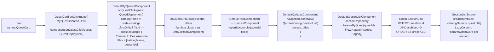

**Q4 resolve**: `catalogId` берётся из `QuestDisplayItem.catalogId` (расширение поля — Q4 Decision), **не** из `state.selectedCatalogId` (может быть `null` при фильтре «все каталоги»). Fallback `"Без каталога"` — race condition когда `state.catalogs` ещё пуст.

---

### DFD 3: Process Death Restoration

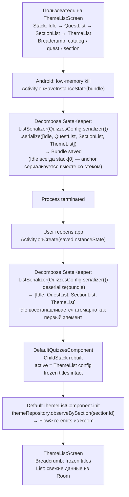

**First serialized ChildStack**: все существующие стеки (`LocalTabComponent.kt:22`, `ShopTabComponent.kt:22`, `EventsTabComponent.kt:22`, `InternetTabComponent.kt:22`) используют `serializer = null`. Quizzes-screen — первый с `serializer != null` (User Decision Q2).  
**`kotlinx-serialization` plugin** обязателен в `build.gradle.kts` нового presentation module (backend-dev ownership, Invariant 7).

---

### DFD 4: Share Intent Dispatch

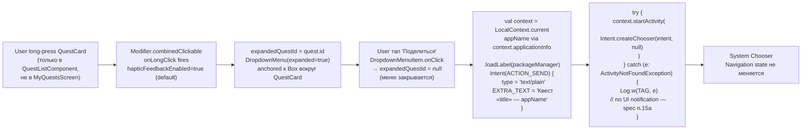

**`Modifier.combinedClickable`** — first usage в проекте (0 existing usages в `android/` codebase — verified grep).  
**Standalone `DropdownMenu`** — first usage (`CatalogSpinner.kt:55` использует `ExposedDropdownMenu` — другой компонент).  
**`Intent.ACTION_SEND`** — first usage в новом `android/` codebase (legacy only: `legacy/shop/.../ReferralFragment.kt:154`).

---

### High-Level State Machine: ChildStack

`Idle` — всегда stack[0]. ChildStack никогда не пустой (Decompose constraint: `pop()` no-op при size=1). AppShellScreen рендерит quizzes overlay только если `active.instance != QuizzesChild.Idle`. `popToFirst()` = `popTo(0)` — возвращает к `Idle`. `dismissQuizzes()` — отдельный callback, скрывающий overlay в AppShellScreen.

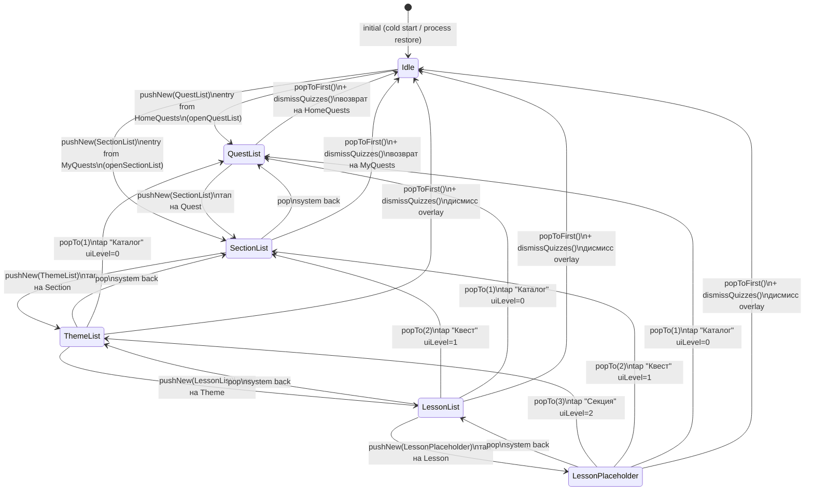

**Decompose 3.1.0 API**: `navigation.pushNew(config)` — safe для button tap. `navigation.popTo(index)` — breadcrumb tap; `index` = 0-based позиция target в ChildStack items list (Idle = 0, QuestList = 1, SectionList = 2, ThemeList = 3, LessonList = 4, LessonPlaceholder = 5). `popToFirst()` = `popTo(0)` — возвращает к Idle.  
**Breadcrumb uiLevel mapping**: breadcrumb segment `uiLevel n` (0-indexed, пользователь видит `n+1`-й столбец слева) → `navigation.popTo(n + 1)` (+1 offset: Idle занимает stack[0], QuestList занимает stack[1]). Пример: «Каталог» (uiLevel=0) → `popTo(1)`; «Квест» (uiLevel=1) → `popTo(2)`.  
**Back priority**: `QuizzesComponent.childStack` создан с `handleBackButton = true` и `BackCallback(priority = BackCallback.PRIORITY_OVERLAY)` (или explicit `priority = 100`). Essenty `DefaultBackDispatcher` dispatches to the last-enabled callback at the highest priority (`DefaultBackDispatcher.kt:53-58`). `DefaultRootComponent.backHandler` регистрируется с дефолтным `PRIORITY_DEFAULT` — гарантированно ниже. При stack == [`Idle`] (size=1) Decompose auto-disables quizzes callback → back достигает root handler → `dismissQuizzes()`. `LocalTabComponent` (`handleBackButton=false`) не конкурирует.

---

### State Matrix Expansion

#### Matrix 1: Tap Action → Code Location

| Тип элемента | Тап → действие | Long-press | Code location |
|---|---|---|---|
| Catalog (HomeQuests) | `DefaultHomeQuestsComponent.onCatalogClick` → lambda → `openQuestList` | (out of scope) | `DefaultHomeQuestsComponent.kt:50` (TODO replaced) |
| Quest (QuestListComponent) | `DefaultQuestListComponent.onQuestClick` → `pushNew(SectionList)` | DropdownMenu → Share Intent | `QuestListScreen` composable |
| Quest (MyQuestsScreen existing) | `DefaultMyQuestsComponent.onQuestClick(quest: QuestDisplayItem)` → resolves `catalogName` from `state.catalogs` → builds `titles` → lambda → `openSectionList` | None — existing UI not modified | `MyQuestsScreen.kt:87` (TODO replaced) |
| Section | `DefaultSectionListComponent.onSectionClick` → `pushNew(ThemeList)` | None (`onLongClick=null`) | `SectionListScreen` composable |
| Theme | `DefaultThemeListComponent.onThemeClick` → `pushNew(LessonList)` | None | `ThemeListScreen` composable |
| Lesson | `DefaultLessonListComponent.onLessonClick` → `pushNew(LessonPlaceholder)` | None | `LessonListScreen` composable |
| LessonPlaceholder | None (static) | None | `LessonPlaceholderScreen` composable |
| Breadcrumb segment (не последний, uiLevel `i`) | `navigation.popTo(i + 1)` (+1 offset for Idle anchor at stack[0]) | None | `BreadcrumbBar.onSegmentClick(i)` |
| Breadcrumb segment (последний) | Некликабелен | None | `BreadcrumbBar` conditional |

#### Matrix 2: Empty/Loading/Loaded → QuizzesConfig + Repository

| Состояние | QuizzesConfig variant | Repository observer | UI результат |
|---|---|---|---|
| Loading | любой | `Flow` ещё не emitted | `CircularProgressIndicator` (center, fillMaxSize) |
| Empty | `QuestList` | `observeByCatalog` → emptyList | «Нет квестов» (titleMedium, center) |
| Empty | `SectionList` | `observeByQuest` → emptyList | «Нет секций» |
| Empty | `ThemeList` | `observeBySection` → emptyList | «Нет тем» |
| Empty | `LessonList` | `observeByTheme` → emptyList | «Нет уроков» |
| Loaded | `QuestList` | `Flow<List<Quest>>` | `LazyColumn`: `QuestCard` per item |
| Loaded | `SectionList` | `Flow<List<Section>>` | `LazyColumn`: `HierarchyItemCard` per item |
| Loaded | `ThemeList` | `Flow<List<Theme>>` | `LazyColumn`: `HierarchyItemCard` per item |
| Loaded | `LessonList` | `Flow<List<Lesson>>` | `LazyColumn`: `HierarchyItemCard` per item |
| Static | `LessonPlaceholder` | N/A | «Прохождение урока «{lessonTitle}» будет добавлено позже» (center) |

#### Matrix 3: Breadcrumb Path → QuizzesConfig Fields

| QuizzesConfig variant | Breadcrumb fields | BreadcrumbBar сегменты | Кликабельность |
|---|---|---|---|
| `QuestList(catalogId, titles=[catalogName])` | `titles: List<String>` | `catalogName` | последний — некликабелен |
| `SectionList(questId, titles=[catalog, quest])` | `titles: List<String>` | `catalog › quest` | `catalog` (uiLevel=0) → popTo(1); `quest` — нет |
| `ThemeList(sectionId, titles=[catalog, quest, section])` | `titles: List<String>` | `catalog › quest › section` | первые 2; последний — нет |
| `LessonList(themeId, titles=[…, theme])` | `titles: List<String>` | `catalog › quest › section › theme` | первые 3; последний — нет |
| `LessonPlaceholder(lessonId, lessonTitle, titles=[…, lesson])` | `titles: List<String>` + `lessonTitle: String` | полный путь | первые N-1; последний — нет |

**Frozen titles**: snapshot на момент `pushNew`. Breadcrumb не меняется при фоновом rename в sync. Список текущего уровня — live Room Flow.  
**Правило popTo**: тап на breadcrumb сегмент `uiLevel i` → `navigation.popTo(i + 1)` (+1 offset: Idle занимает stack[0]) — удаляет все уровни `[i+2 … current]`. Пример: «Каталог» (uiLevel=0) → `popTo(1)` → активным становится QuestList = stack[1].

<!-- HL_SECTION_END -->

---

## Sequence Diagrams (architect-component)

### Seq-1: HomeQuests catalog tap → QuestList

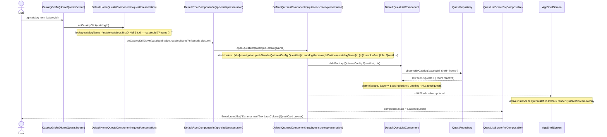

---

### Seq-2: MyQuests quest tap → SectionList (с breadcrumb catalog resolution)

```mermaid
sequenceDiagram
    actor User
    participant MyQuestsScreen as MyQuestsScreen\n(quest/presentation)
    participant MyQuestsComp as DefaultMyQuestsComponent\n(quest/presentation)
    participant RootComp as DefaultRootComponent\n(app-shell/presentation)
    participant QuizzesComp as DefaultQuizzesComponent
    participant SectionListComp as DefaultSectionListComponent
    participant SectionRepo as SectionRepository
    participant SectionListScreen as SectionListScreen\n(Composable)

    User->>MyQuestsScreen: tap QuestCard (quest: QuestDisplayItem)
    MyQuestsScreen->>MyQuestsComp: onQuestClick(quest: QuestDisplayItem)\n[QuestDisplayItem расширяется полем catalogId — User Decision Q4;\n quest.title доступен в UI scope и явно передаётся в компонент]
    Note over MyQuestsComp: catalogName = state.catalogs\n  .firstOrNull { it.id == quest.catalogId }?.name\n  ?: "Без каталога"\ntitles = [catalogName, quest.title]
    MyQuestsComp->>RootComp: onQuestDrillDown(quest.id.value, titles)\n[lambda closure]
    RootComp->>QuizzesComp: openSectionList(questId, titles)
    Note over QuizzesComp: navigation.pushNew(\n  QuizzesConfig.SectionList(questId, titles)\n)
    QuizzesComp->>SectionListComp: childFactory(SectionList config, ctx)
    SectionListComp->>SectionRepo: observeByQuest(questId)
    SectionRepo-->>SectionListComp: Flow<List<Section>> ORDER BY order ASC, archived=0
    Note over SectionListComp: Emit: Loading -> Loaded(sections)
    SectionListComp-->>SectionListScreen: state = Loaded(items=[...])
    SectionListScreen-->>User: BreadcrumbBar["Каталог > Квест"]\n+ LazyColumn(HierarchyItemCard секции)
```

---

### Seq-3: Drill-down levels (Section → Theme → Lesson) — общий паттерн

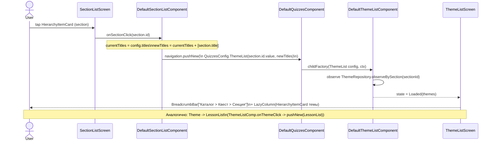

---

### Seq-4: Lesson tap → LessonPlaceholder

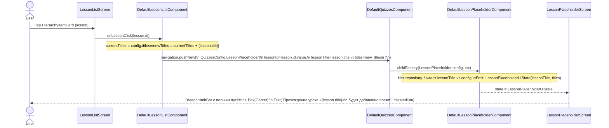

---

### Seq-5: Breadcrumb pop (тап на сегмент → pop до уровня)

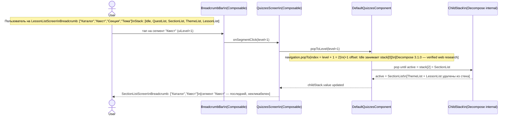

**Back coordination**: `handleBackButton = true` — Decompose держит `BackCallback(priority = PRIORITY_OVERLAY)` enabled пока stack > 1, то есть пока есть active child кроме `Idle`. При stack == [`Idle`] (size = 1, anchor only) Decompose auto-disables callback → back достигает `DefaultRootComponent.backHandler` (`DefaultRootComponent.kt:136-142`) → `dismissQuizzes()` + возврат на HomeQuests/MyQuests tab. Корни drill-down (`QuestList` от HomeQuests / `SectionList` от MyQuests) — это size = 2 (`[Idle, X]`); pop оттуда возвращает к `[Idle]` который уже передаёт back root handler-у. Конкуренции с `LocalTabComponent` (`handleBackButton=false`) нет.

---

### Seq-6: Long-press menu + Share Intent

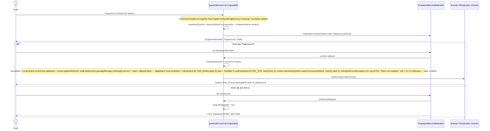

---

### Seq-7: Process death restoration

```mermaid
sequenceDiagram
    participant User
    participant AndroidOS as Android OS
    participant Decompose as Decompose StateKeeper
    participant DefaultQuizzesComp as DefaultQuizzesComponent
    participant ChildFactory as childFactory lambda
    participant Repository as Repository (Room)
    participant Screen as QuizzesScreen (Composable)

    Note over User, Screen: Пользователь на ThemeListScreen\nStack: [Idle, QuestList, SectionList, ThemeList]\nBreadcrumb: ["Каталог","Квест","Секция"]

    AndroidOS->>AndroidOS: low-memory -> kill process
    Note over AndroidOS: Activity.onSaveInstanceState\nDecompose: ListSerializer(QuizzesConfig.serializer())\n.serialize([Idle, QuestList(...), SectionList(...), ThemeList(...)])\n-> Bundle saved\nIdle anchor сериализуется как первый элемент

    User->>AndroidOS: reopen app
    AndroidOS->>Decompose: Activity restored from Bundle
    Decompose->>Decompose: ListSerializer(QuizzesConfig.serializer())\n.deserialize -> [Idle, QuestList, SectionList, ThemeList]\nIdle восстанавливается атомарно — anchor всегда stack[0]
    Decompose->>DefaultQuizzesComp: restore stack; active = ThemeList config
    DefaultQuizzesComp->>ChildFactory: childFactory(ThemeList, ctx)
    ChildFactory->>Repository: observeBySection(sectionId from config)
    Repository-->>ChildFactory: Flow<List<Theme>> from Room
    ChildFactory-->>Screen: ThemeListUiState = Loaded(themes)
    Screen-->>User: ThemeListScreen\nBreadcrumb: ["Каталог","Квест","Секция"]\n[frozen titles from QuizzesConfig.ThemeList.titles]
```

**Nota bene Decompose 3.1.0**: `saveable` delegate недоступен (только в 3.2.0+). Дополнительный component-level state (сверх того что в QuizzesConfig) требует manual `stateKeeper.consume` / `stateKeeper.register`. В MVP весь необходимый state для restore содержится в QuizzesConfig — extra state keeper не нужен.

---

### Component-Level State Matrix

#### QuestListComponent

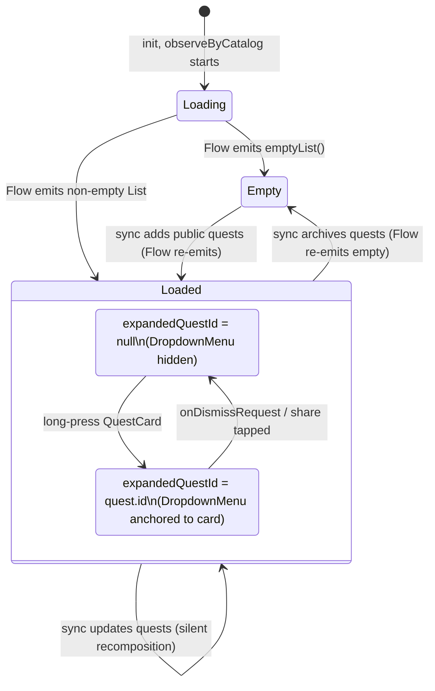

Empty state text: `"Нет квестов"` (inline string — existing pattern HomeQuestsScreen, MyQuestsScreen).

#### SectionListComponent / ThemeListComponent / LessonListComponent

(Общий `HierarchyListUiState` pattern)

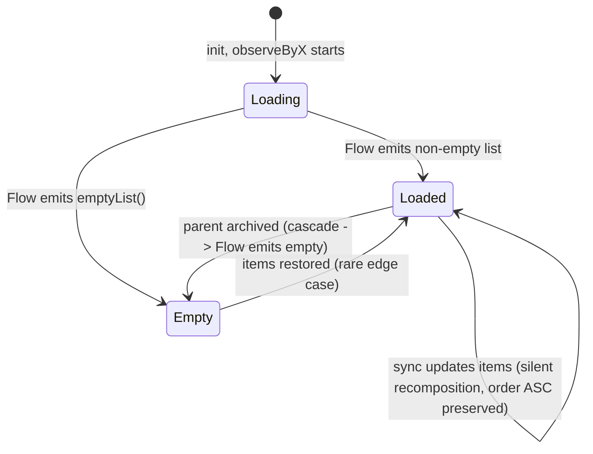

Empty state texts:
- `SectionListComponent` → `"Нет секций"`
- `ThemeListComponent` → `"Нет тем"`
- `LessonListComponent` → `"Нет уроков"`

#### LessonPlaceholderComponent

Статическое состояние — нет переходов. Создаётся один раз с `lessonTitle` из `QuizzesConfig.LessonPlaceholder`.

---

### Error Flows Summary

| Сценарий | Что происходит | Spec ref |
|----------|---------------|----------|
| Parent archived during drill-down (sync) | Repository Flow emits `[]` → component state = `Empty("Нет X")`. Без auto-pop, без toast. | AC#18, п.17 |
| Fresh install / empty Room | All Flows emit `[]` immediately → `Empty` state. Когда sync подтянет данные — `Loaded`. | AC#19 |
| Offline | Room Flows работают offline; данные доступны. Новые данные не появляются до online. | AC#20 |
| `ActivityNotFoundException` при Share | `try/catch` → `Log.w(TAG, ...)`. Menu закрыт. Navigation state не меняется. | AC#14, п.15a |
| `ActivityNotFoundException`: no app for text/plain | Аналогично предыдущему. | AC#14 |

---

### Coordination Note (для architect-high-level)

В DFD-секции (owned by HL) должен быть отражён data flow:
- Room → Repository Flow → Component `.stateIn()` → Composable `subscribeAsState()` → UI render
- Entry point activation: HomeQuestsScreen → callback → DefaultRootComponent closure → DefaultQuizzesComponent.navigation.pushNew
- Сравнение с existing Home/MyQuests data flow (тот же pattern, те же repositories)
