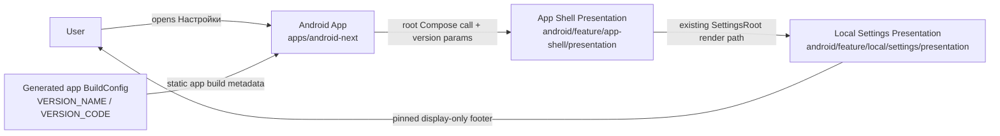
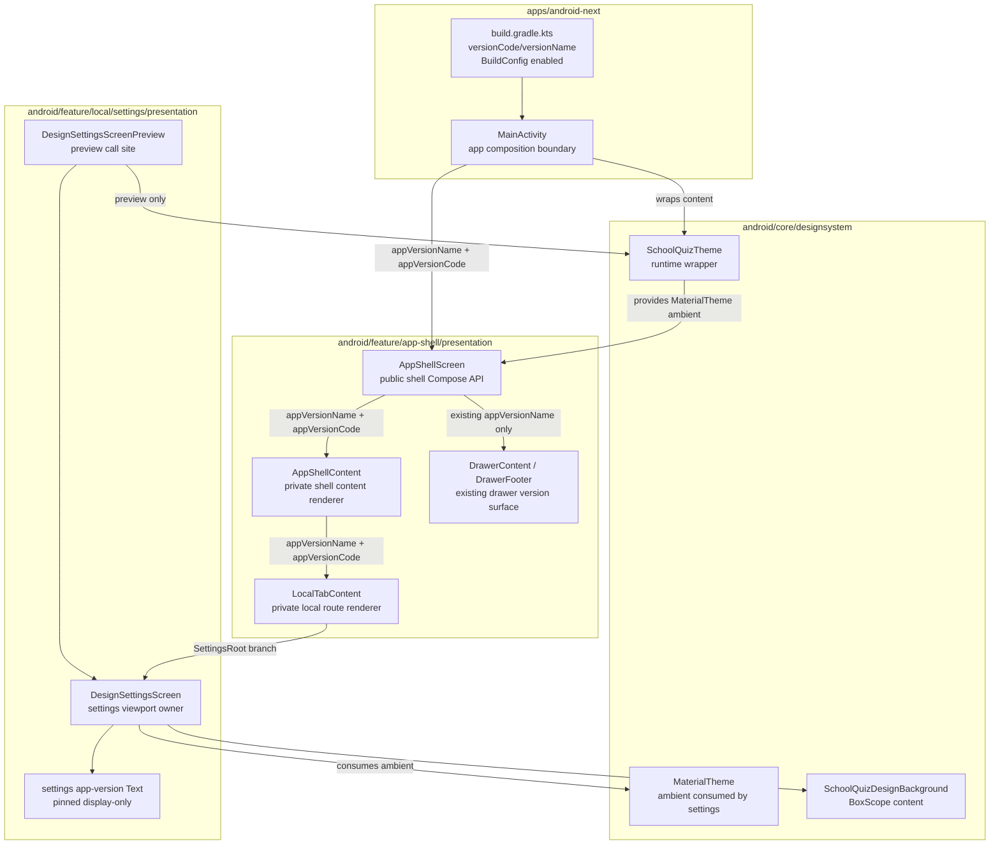
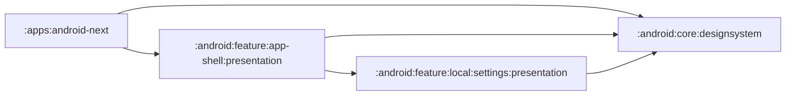
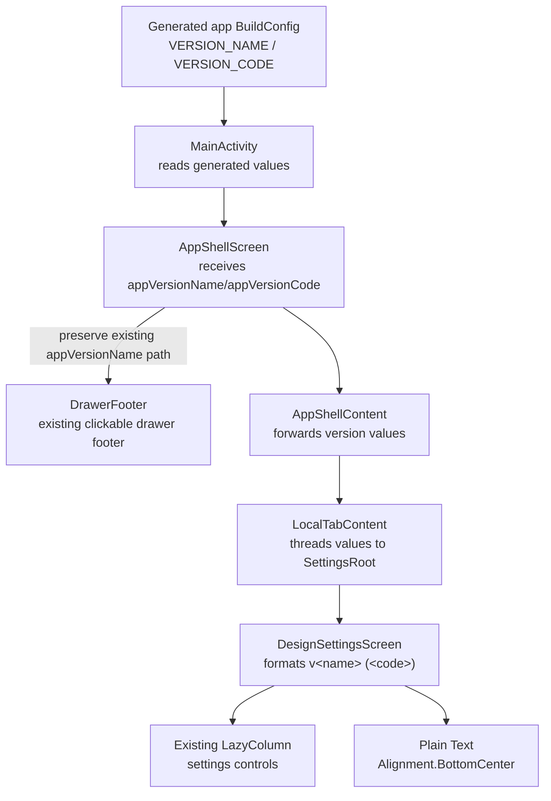
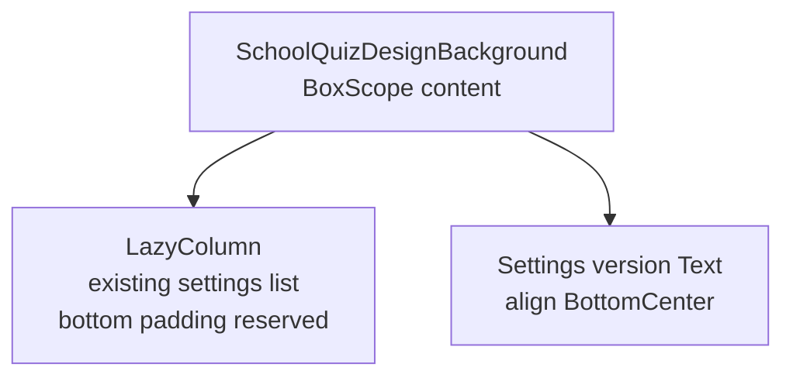

# 01 — Architecture: Settings App Version Footer

## Scope

SCH-2 adds a passive app-version footer to the existing settings screen:

- text format: `v<versionName> (<versionCode>)`;
- visible at the bottom of the settings viewport;
- centered, small, low-emphasis grey/on-surface styling;
- display-only: no tap, long-press, About dialog, developer-mode, events, storage, network, or business logic.

Feature Domain Contract is N/A. The change is limited to app build metadata propagation and Compose UI rendering.

Canonical internal Compose UI signatures are owned by `06-api-contract.md` § Internal Compose UI signatures. This architecture document intentionally describes boundaries and data ownership, not full Kotlin signatures.

## C4 L1 — System Context

### L1 boundaries

| Boundary | Owner | Decision | Evidence |
|---|---|---|---|
| App build metadata | `apps/android-next` | App module remains the only reader of generated app `BuildConfig`. | `apps/android-next/build.gradle.kts:16-17` defines version code/name; `apps/android-next/build.gradle.kts:33-34` enables BuildConfig. |
| App composition | `MainActivity` | Pass `VERSION_NAME` and `VERSION_CODE` into app-shell UI. | Existing call passes `VERSION_NAME` and `DEBUG` at `apps/android-next/src/main/java/com/tpov/schoolquiz/apps/android_next/MainActivity.kt:41-44`. |
| Shell routing/rendering | `android/feature/app-shell/presentation` | Thread version metadata through existing shell render path to settings. No new route. | Current `AppShellScreen` boundary at `android/feature/app-shell/presentation/src/main/kotlin/com/tpov/schoolquiz/android/feature/app_shell/presentation/ui/AppShellScreen.kt:121-127`; settings branch at `android/feature/app-shell/presentation/src/main/kotlin/com/tpov/schoolquiz/android/feature/app_shell/presentation/ui/AppShellScreen.kt:461-466`. |
| Settings UI | `android/feature/local/settings/presentation` | Render the footer inside `DesignSettingsScreen`. | Current settings body at `android/feature/local/settings/presentation/src/main/kotlin/com/tpov/schoolquiz/android/feature/local/settings/presentation/ui/DesignSettingsScreen.kt:48-78`. |
| Domain/data/server | N/A | No domain, data, API, storage, events, or DI work. | Spec Feature Domain Contract is N/A; grounding backend/contract check is N/A. |

## C4 L2 — Containers and Modules

### Container responsibilities

| Module / path | Responsibility for SCH-2 | Required change |
|---|---|---|
| `apps/android-next` | Own generated app version metadata, root Compose invocation, and runtime theme wrapper. | Pass `BuildConfig.VERSION_CODE` alongside existing `BuildConfig.VERSION_NAME`. No Gradle edit is needed because version fields, BuildConfig generation, and direct design-system dependency already exist. |
| `android/feature/app-shell/presentation` | Own shell UI boundary, drawer, scaffold, shell content rendering, and local tab routing. | Add required version-code propagation through shell UI, private shell content rendering, and private local route rendering. Preserve drawer behavior. |
| `android/feature/local/settings/presentation` | Own settings screen layout and footer rendering. | Add required version props to settings UI, render pinned footer, update preview. The production screen consumes `MaterialTheme` ambient and `SchoolQuizDesignBackground`; `SchoolQuizTheme` is used only by the preview. |
| `android/core/designsystem` | Provide `SchoolQuizTheme`, MaterialTheme setup, and `SchoolQuizDesignBackground`. | No design-system API change. `MainActivity` applies `SchoolQuizTheme` at runtime; settings consumes MaterialTheme ambient and background primitives. |
| `shared/{core,feature}` / data / platform | No responsibility for SCH-2. | No changes. |

## Feature-Relevant Gradle Dependency Graph

This graph is feature-scoped, not an exhaustive graph of every direct dependency in these Gradle files. It shows dependencies relevant to the SCH-2 render path and theming path.

Evidence:

- App module depends on app-shell presentation and directly on core design-system at `apps/android-next/build.gradle.kts:40-48`; `MainActivity` wraps content in `SchoolQuizTheme` at `apps/android-next/src/main/java/com/tpov/schoolquiz/apps/android_next/MainActivity.kt:40-50`.
- App-shell presentation has an existing dependency/import path to local settings; research records `android/feature/app-shell/presentation/build.gradle.kts:10-11` and `android/feature/app-shell/presentation/src/main/kotlin/com/tpov/schoolquiz/android/feature/app_shell/presentation/ui/AppShellScreen.kt:461-466`.
- Settings uses design-system primitives; current screen imports and uses `SchoolQuizDesignBackground` and MaterialTheme at `android/feature/local/settings/presentation/src/main/kotlin/com/tpov/schoolquiz/android/feature/local/settings/presentation/ui/DesignSettingsScreen.kt:48-78`.

No new Gradle dependency is introduced by SCH-2. In particular, `android/feature/local/settings/presentation` must not depend on app-shell or app module.

### Gradle dependency audit

| Gradle file | Real direct dependencies relevant to SCH-2 | Existing non-SCH-2 dependencies | SCH-2 impact |
|---|---|---|---|
| `apps/android-next/build.gradle.kts:40-48` | Includes `:android:feature:app-shell:presentation` and direct `:android:core:designsystem`; the runtime path uses `SchoolQuizTheme` in `MainActivity` at `apps/android-next/src/main/java/com/tpov/schoolquiz/apps/android_next/MainActivity.kt:40-50`. | Also includes shared app-shell data/domain, quest/authoring/quizzes presentation, navigation, Firebase/platform dependencies, and more outside the SCH-2 footer path. | No dependency changes; app already has the direct modules needed for version propagation and theming. |
| `android/feature/app-shell/presentation/build.gradle.kts:10-24` | Includes `:android:feature:local:settings:presentation` and `:android:core:designsystem`, which are directly relevant to rendering the settings route. | Also includes profile, economy, quest, quest-authoring, quizzes, catalog/sync/navigation/domain dependencies that predate SCH-2. | No dependency changes; SCH-2 only threads values through the existing app-shell to settings route. |
| `android/feature/local/settings/presentation/build.gradle.kts:9-15` | Includes `:android:core:designsystem` plus Compose/UI/lifecycle dependencies used by `DesignSettingsScreen`. | Compose tooling/debug dependency is existing. | No dependency changes; settings already has the design-system primitives needed for the footer. |
| `android/core/designsystem/build.gradle.kts:9-17` | Has Compose/design dependencies and domain dependencies used by design-system components. | No dependency on local settings or app-shell. | No dependency changes; design-system remains lower-level and does not learn about SCH-2. |

## Short L3 / Component Graph

Component facts:

- `AppShellScreen` currently documents that library modules cannot access app `BuildConfig` directly at `android/feature/app-shell/presentation/src/main/kotlin/com/tpov/schoolquiz/android/feature/app_shell/presentation/ui/AppShellScreen.kt:107-110`.
- Current `AppShellScreen` signature has `appVersionName` but no version-code parameter at `android/feature/app-shell/presentation/src/main/kotlin/com/tpov/schoolquiz/android/feature/app_shell/presentation/ui/AppShellScreen.kt:121-127`.
- `AppShellScreen` calls private `AppShellContent` at `android/feature/app-shell/presentation/src/main/kotlin/com/tpov/schoolquiz/android/feature/app_shell/presentation/ui/AppShellScreen.kt:287-295`; current `AppShellContent` signature is at `android/feature/app-shell/presentation/src/main/kotlin/com/tpov/schoolquiz/android/feature/app_shell/presentation/ui/AppShellScreen.kt:318-326`.
- `AppShellContent` calls `LocalTabContent` at `android/feature/app-shell/presentation/src/main/kotlin/com/tpov/schoolquiz/android/feature/app_shell/presentation/ui/AppShellScreen.kt:338-346`.
- Current `LocalTabContent` call site is at `android/feature/app-shell/presentation/src/main/kotlin/com/tpov/schoolquiz/android/feature/app_shell/presentation/ui/AppShellScreen.kt:338-345`; current private signature is at `android/feature/app-shell/presentation/src/main/kotlin/com/tpov/schoolquiz/android/feature/app_shell/presentation/ui/AppShellScreen.kt:422-430`.
- Current settings route renders `DesignSettingsScreen(selectedStyle, onStyleSelected, modifier)` at `android/feature/app-shell/presentation/src/main/kotlin/com/tpov/schoolquiz/android/feature/app_shell/presentation/ui/AppShellScreen.kt:461-466`.
- `DesignSettingsScreen` currently renders only settings controls in a full-size `LazyColumn` at `android/feature/local/settings/presentation/src/main/kotlin/com/tpov/schoolquiz/android/feature/local/settings/presentation/ui/DesignSettingsScreen.kt:48-78`.
- The settings preview call site is `android/feature/local/settings/presentation/src/main/kotlin/com/tpov/schoolquiz/android/feature/local/settings/presentation/ui/DesignSettingsScreen.kt:298-305`.

## Layout Feasibility

The footer should be a pinned sibling inside the settings background rather than a final scroll item.

Feasibility evidence:

- `SchoolQuizDesignBackground` accepts `content: @Composable BoxScope.() -> Unit`, so a non-scroll sibling can be aligned independently from the `LazyColumn` at `android/core/designsystem/src/main/kotlin/com/tpov/schoolquiz/android/core/designsystem/components/SchoolQuizDesign.kt:169-200`.
- Existing low-emphasis settings text already uses MaterialTheme typography and `onSurface.copy(alpha = ...)` at `android/feature/local/settings/presentation/src/main/kotlin/com/tpov/schoolquiz/android/feature/local/settings/presentation/ui/DesignSettingsScreen.kt:80-92`.
- `MainActivity` applies `SchoolQuizTheme` at runtime around `AppShellScreen` at `apps/android-next/src/main/java/com/tpov/schoolquiz/apps/android_next/MainActivity.kt:40-50`; `DesignSettingsScreen` consumes `MaterialTheme` and `SchoolQuizDesignBackground` in production at `android/feature/local/settings/presentation/src/main/kotlin/com/tpov/schoolquiz/android/feature/local/settings/presentation/ui/DesignSettingsScreen.kt:24,37,47-78`, while `SchoolQuizTheme` appears in the settings file only for preview at `android/feature/local/settings/presentation/src/main/kotlin/com/tpov/schoolquiz/android/feature/local/settings/presentation/ui/DesignSettingsScreen.kt:298-306`.

Implementation must reserve bottom padding in the `LazyColumn` so the pinned footer does not cover the final settings option.

## Preserved Existing Behavior

Drawer version behavior remains separate and unchanged:

- Existing drawer version text is clickable at `android/feature/app-shell/presentation/src/main/kotlin/com/tpov/schoolquiz/android/feature/app_shell/presentation/ui/drawer/DrawerFooter.kt:73-81`.
- Existing drawer About dialog is local drawer behavior at `android/feature/app-shell/presentation/src/main/kotlin/com/tpov/schoolquiz/android/feature/app_shell/presentation/ui/drawer/DrawerFooter.kt:85-96`.
- Existing repeated version-tap developer-mode path lives at `android/feature/app-shell/presentation/src/main/kotlin/com/tpov/schoolquiz/android/feature/app_shell/presentation/component/DefaultRootComponent.kt:318-337`.

SCH-2 must not reuse `DrawerFooter` for settings and must not wire the settings footer to the drawer `onVersionTap` path.

## Non-Goals / Boundaries

- No new navigation destination or route state.
- No new domain model, rule, use case, repository, or walking skeleton.
- No Koin binding.
- No Room, SharedPreferences, DataStore, cache, migration, sync, Firebase, or network change.
- No analytics or event contract.
- No change to drawer footer format, About dialog, or developer-mode behavior.
- No web prior-art research is required because no external SDK/platform behavior is introduced.
