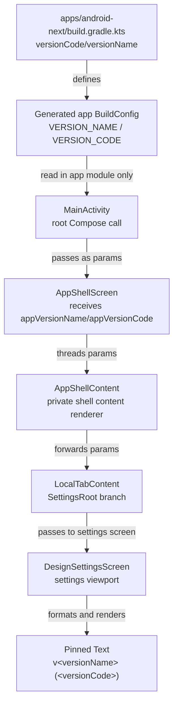

# 02 — Behavior: Settings App Version Footer

## Behavioral Summary

When the user opens settings, the app shows the existing design settings plus a passive footer at the visible bottom of the settings viewport. The footer displays the generated app build metadata as `v<versionName> (<versionCode>)`, for example `v0.1.0 (1)`.

The feature adds no state machine and no branchy business behavior. The spec State Matrix is N/A, and this design does not expand it.

## DFD — App Build Metadata to Settings Footer



### Data classification

| Data | Source | Transport | Sink | Side effects |
|---|---|---|---|---|
| `versionName` | Generated app `BuildConfig.VERSION_NAME`; app Gradle source at `apps/android-next/build.gradle.kts:16-17` | Compose parameters from app layer to settings UI | Footer `Text` | None |
| `versionCode` | Generated app `BuildConfig.VERSION_CODE`; app Gradle source at `apps/android-next/build.gradle.kts:16-17` | Compose parameters from app layer to settings UI | Footer `Text` | None |

BuildConfig generation is already enabled at `apps/android-next/build.gradle.kts:33-34`.

## Sequence — Rendering Settings Footer

```mermaid
sequenceDiagram
    autonumber
    participant Gradle as apps/android-next build.gradle.kts
    participant BC as Generated BuildConfig
    participant Activity as MainActivity
    participant Shell as AppShellScreen
    participant Content as AppShellContent
    participant Local as LocalTabContent
    participant Settings as DesignSettingsScreen
    participant Footer as Settings footer Text

    Gradle->>BC: generate VERSION_NAME / VERSION_CODE
    Activity->>BC: read VERSION_NAME and VERSION_CODE
    Activity->>Shell: pass appVersionName and appVersionCode
    Shell->>Content: pass version values to private shell content renderer
    Content->>Local: forward version values to local content renderer
    Local->>Settings: pass values for LocalConfig.SettingsRoot
    Settings->>Settings: render existing LazyColumn with reserved bottom padding
    Settings->>Footer: render "v&lt;versionName&gt; (&lt;versionCode&gt;)"
    Footer-->>Settings: passive centered low-emphasis text pinned to bottom
```

Current code path evidence:

- `MainActivity` currently passes `BuildConfig.VERSION_NAME` and `BuildConfig.DEBUG` at `apps/android-next/src/main/java/com/tpov/schoolquiz/apps/android_next/MainActivity.kt:41-44`; SCH-2 adds `BuildConfig.VERSION_CODE` to the same call.
- `AppShellScreen` documents the app BuildConfig boundary at `android/feature/app-shell/presentation/src/main/kotlin/com/tpov/schoolquiz/android/feature/app_shell/presentation/ui/AppShellScreen.kt:107-110`.
- Current `AppShellScreen` signature is at `android/feature/app-shell/presentation/src/main/kotlin/com/tpov/schoolquiz/android/feature/app_shell/presentation/ui/AppShellScreen.kt:121-127`.
- `AppShellScreen` calls private `AppShellContent` at `android/feature/app-shell/presentation/src/main/kotlin/com/tpov/schoolquiz/android/feature/app_shell/presentation/ui/AppShellScreen.kt:287-295`; current `AppShellContent` signature is at `android/feature/app-shell/presentation/src/main/kotlin/com/tpov/schoolquiz/android/feature/app_shell/presentation/ui/AppShellScreen.kt:318-326`.
- `AppShellContent` calls `LocalTabContent` at `android/feature/app-shell/presentation/src/main/kotlin/com/tpov/schoolquiz/android/feature/app_shell/presentation/ui/AppShellScreen.kt:338-346`; current `LocalTabContent` private signature is at `android/feature/app-shell/presentation/src/main/kotlin/com/tpov/schoolquiz/android/feature/app_shell/presentation/ui/AppShellScreen.kt:422-430`.
- Current settings branch renders `DesignSettingsScreen` at `android/feature/app-shell/presentation/src/main/kotlin/com/tpov/schoolquiz/android/feature/app_shell/presentation/ui/AppShellScreen.kt:461-466`.
- Current settings body is a full-size `LazyColumn` at `android/feature/local/settings/presentation/src/main/kotlin/com/tpov/schoolquiz/android/feature/local/settings/presentation/ui/DesignSettingsScreen.kt:48-78`.
- Pinned sibling layout is feasible because `SchoolQuizDesignBackground` exposes `BoxScope` content at `android/core/designsystem/src/main/kotlin/com/tpov/schoolquiz/android/core/designsystem/components/SchoolQuizDesign.kt:169-200`.

## Sequence — Display-Only Tap / Long-Press No-Op

```mermaid
sequenceDiagram
    autonumber
    actor User
    participant Footer as Settings footer Text
    participant Settings as DesignSettingsScreen
    participant Drawer as DrawerFooter
    participant Root as root implementation

    User->>Footer: tap / repeated tap / long-press
    Note over Footer: Plain Text only; no clickable, combinedClickable, pointerInput, or callback
    Footer-->>User: no state change, no visual action, no navigation
    Footer--x Settings: no onClick emitted
    Footer--x Drawer: no About dialog path reused
    Footer--x Root: no version-tap developer-mode path invoked
```

Preservation evidence:

- Drawer version text is currently clickable at `android/feature/app-shell/presentation/src/main/kotlin/com/tpov/schoolquiz/android/feature/app_shell/presentation/ui/drawer/DrawerFooter.kt:73-81`.
- Drawer About dialog is at `android/feature/app-shell/presentation/src/main/kotlin/com/tpov/schoolquiz/android/feature/app_shell/presentation/ui/drawer/DrawerFooter.kt:85-96`.
- Existing repeated version-tap developer-mode path is at `android/feature/app-shell/presentation/src/main/kotlin/com/tpov/schoolquiz/android/feature/app_shell/presentation/component/DefaultRootComponent.kt:318-337`.

SCH-2 settings footer must not call or reuse these paths.

## Primary User Journey Trace

| Journey | Trigger | Code path | Expected SCH-2 behavior |
|---|---|---|---|
| Happy path: user opens settings | User selects «Настройки» from app shell/drawer | Existing route reaches `LocalConfig.SettingsRoot`; shell path is `AppShellScreen` → `AppShellContent` → `LocalTabContent`; current settings render point is `android/feature/app-shell/presentation/src/main/kotlin/com/tpov/schoolquiz/android/feature/app_shell/presentation/ui/AppShellScreen.kt:461-466` | `DesignSettingsScreen` shows existing settings controls plus centered low-emphasis `v<versionName> (<versionCode>)` pinned to viewport bottom. |
| Build metadata changes between releases | Developer changes app Gradle version and rebuilds | `apps/android-next/build.gradle.kts:16-17` → generated BuildConfig → `MainActivity` | Footer reflects generated `VERSION_NAME` and `VERSION_CODE`; no hardcoded production label. |
| Offline / fresh install / logout / process death | User opens settings in any runtime/user/network state | App generated BuildConfig values are read locally; no repository/network/auth/storage path exists | Footer is stable and visible because it depends only on build metadata. |
| Repeated tap / parallel actions | User taps or long-presses settings footer | Settings footer has no callback; drawer path at `android/feature/app-shell/presentation/src/main/kotlin/com/tpov/schoolquiz/android/feature/app_shell/presentation/ui/drawer/DrawerFooter.kt:73-96` and existing root version-tap logic remain separate | No navigation, dialog, developer-mode action, event, storage write, or state mutation. |

## Acceptance Criteria Trace

| AC | Code path / design proof |
|---|---|
| 1. Visible bottom contains centered display-only text with both fields, not a last row floating after a short list. | `DesignSettingsScreen` owns layout at `android/feature/local/settings/presentation/src/main/kotlin/com/tpov/schoolquiz/android/feature/local/settings/presentation/ui/DesignSettingsScreen.kt:48-78`; use `SchoolQuizDesignBackground` `BoxScope` from `android/core/designsystem/src/main/kotlin/com/tpov/schoolquiz/android/core/designsystem/components/SchoolQuizDesign.kt:169-200` to render a pinned sibling and reserve `LazyColumn` bottom padding. |
| 2. `versionName = "0.1.0"` and `versionCode = 1` displays exactly `v0.1.0 (1)`. | Values come from `apps/android-next/build.gradle.kts:16-17`; settings UI formats `v<versionName> (<versionCode>)`. Canonical internal UI signature details belong in `06-api-contract.md` § Internal Compose UI signatures. |
| 3. Small typography and low-emphasis grey/on-surface color, centered horizontally. | Settings already uses MaterialTheme and low-emphasis `onSurface.copy(alpha = ...)` pattern at `android/feature/local/settings/presentation/src/main/kotlin/com/tpov/schoolquiz/android/feature/local/settings/presentation/ui/DesignSettingsScreen.kt:80-92`; footer should use the same theme family and center alignment. |
| 4. Offline, fresh install, logout, or process death still shows footer. | DFD has no network/storage/auth input; build metadata is generated app metadata from `apps/android-next/build.gradle.kts:16-17`. |
| 5. Tap or long-press causes no navigation, dialog, dev-mode action, storage write, or mutation. | Footer is plain `Text` with no input modifier/callback; existing interactive drawer code remains isolated at `android/feature/app-shell/presentation/src/main/kotlin/com/tpov/schoolquiz/android/feature/app_shell/presentation/ui/drawer/DrawerFooter.kt:73-96` and existing root version-tap logic remains out of scope. |
| 6. Existing drawer footer, drawer version tap behavior, and About dialog are unchanged. | App-shell continues to pass existing `appVersionName` to drawer; SCH-2 does not require changes to `android/feature/app-shell/presentation/src/main/kotlin/com/tpov/schoolquiz/android/feature/app_shell/presentation/ui/drawer/DrawerFooter.kt:73-96` or dev-mode path. |
| 7. Relevant compile/tests show no stale call sites. | Required version-code parameter should expose stale calls. Known call sites are current `AppShellScreen` call at `apps/android-next/src/main/java/com/tpov/schoolquiz/apps/android_next/MainActivity.kt:41-44`, intermediate `AppShellContent` call/signature at `android/feature/app-shell/presentation/src/main/kotlin/com/tpov/schoolquiz/android/feature/app_shell/presentation/ui/AppShellScreen.kt:287-326`, current `LocalTabContent` call/signature at `android/feature/app-shell/presentation/src/main/kotlin/com/tpov/schoolquiz/android/feature/app_shell/presentation/ui/AppShellScreen.kt:338-346` and `android/feature/app-shell/presentation/src/main/kotlin/com/tpov/schoolquiz/android/feature/app_shell/presentation/ui/AppShellScreen.kt:422-430`, current settings branch at `android/feature/app-shell/presentation/src/main/kotlin/com/tpov/schoolquiz/android/feature/app_shell/presentation/ui/AppShellScreen.kt:461-466`, and preview at `android/feature/local/settings/presentation/src/main/kotlin/com/tpov/schoolquiz/android/feature/local/settings/presentation/ui/DesignSettingsScreen.kt:298-305`. |

## Debug / Release Behavior

The settings footer is visible in debug and release. `MainActivity` already passes `BuildConfig.DEBUG` separately for debug-gated shell behavior at `apps/android-next/src/main/java/com/tpov/schoolquiz/apps/android_next/MainActivity.kt:41-44`; SCH-2 version rendering must not be gated by `isDebugBuild`.

## State Matrix

State Matrix: **N/A**.

Reason:

- No feature state is introduced.
- No branchy business logic exists.
- Version metadata is static per build.
- User/session/network/storage state does not influence the footer.

## Behavior Non-Goals

- No About dialog from the settings footer.
- No repeated-tap developer-mode behavior from the settings footer.
- No analytics/event emission.
- No storage write or preference update.
- No route or navigation mutation.
- No domain/data/backend side effect.
