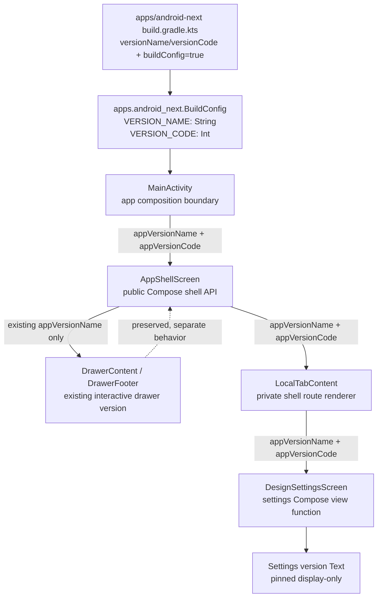
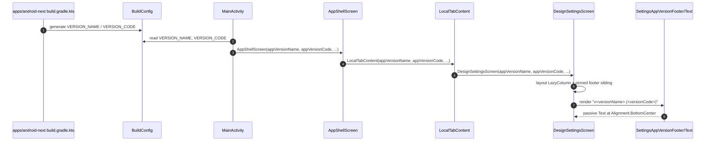
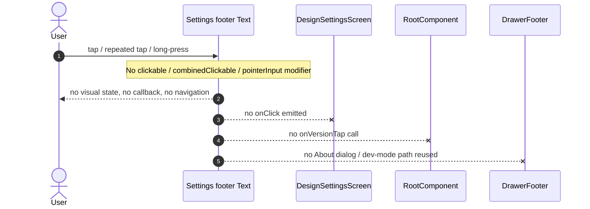

# Component Draft: Settings App Version Footer

## 0. Inputs / Scope Guard

Read inputs:

- `AGENTS.md`
- `.claude/PROJECT-CONTEXT.md`
- `.claude/rules/clean-architecture.md`
- `.claude/rules/navigation.md`
- `.claude/rules/di-patterns.md`
- `.claude/rules/testing.md`
- `docs/invariants.md`
- `docs/features/settings-app-version-footer/0-spec.md`
- `docs/features/settings-app-version-footer/1-research.md`
- `docs/features/settings-app-version-footer/2-grounding.md`

Design constraints confirmed:

- Design-stage only; no production code changes in this draft.
- Feature Domain Contract: **N/A**.
- No repositories, use cases, storage, Firebase, Room, migrations, network, events, Koin bindings, or navigation destinations.
- App `BuildConfig` remains app-layer-only. Android library modules receive generated build metadata as parameters.
- Settings footer is **display-only**. It must not reuse drawer footer tap/dev-mode/About behavior.

## 1. Proposed C4 L3 Component Graph



### Component responsibilities

| Component | Responsibility | Design decision |
|---|---|---|
| `apps/android-next` Gradle config | Defines app version metadata and generated app `BuildConfig`. | Existing source of truth; no Gradle change expected. |
| `BuildConfig` | Generated app-layer metadata source. | Read only from app module (`MainActivity`). |
| `MainActivity` | Composition boundary between app module and library presentation modules. | Pass `BuildConfig.VERSION_NAME` and `BuildConfig.VERSION_CODE` into `AppShellScreen`. |
| `AppShellScreen` | Public shell Compose API; owns drawer/scaffold/local tab rendering. | Add `appVersionCode: Int` next to existing `appVersionName: String`. Preserve drawer behavior. |
| `LocalTabContent` | Private route renderer for `LocalConfig` children. | Thread app version props only into `LocalConfig.SettingsRoot`. |
| `DesignSettingsScreen` | Public settings Compose view function. | Add version props and render pinned footer as passive `Text`. |
| Settings version footer `Text` | Display `v<versionName> (<versionCode>)` centered at visible bottom. | Use MaterialTheme small typography + low-emphasis `onSurface`; no click/long-click modifiers. |

## 2. Proposed Compose / Class Boundaries

### 2.1 App metadata source

No wrapper class or domain model is recommended for this feature. The app metadata is static build metadata and the spec explicitly has no domain contract.

```kotlin
// apps/android-next/src/main/java/.../MainActivity.kt
AppShellScreen(
    rootComponent = rootComponent,
    appVersionName = BuildConfig.VERSION_NAME,
    appVersionCode = BuildConfig.VERSION_CODE,
    isDebugBuild = BuildConfig.DEBUG,
    selectedDesignStyle = selectedDesignStyle,
    onDesignStyleChange = { style -> /* existing persistence path */ },
)
```

### 2.2 `AppShellScreen` public UI API

Canonical proposal:

```kotlin
@Composable
fun AppShellScreen(
    rootComponent: RootComponent,
    appVersionName: String,
    appVersionCode: Int,
    isDebugBuild: Boolean,
    selectedDesignStyle: SchoolQuizDesignStyle,
    onDesignStyleChange: (SchoolQuizDesignStyle) -> Unit,
    modifier: Modifier = Modifier,
)
```

Notes:

- `appVersionCode` should be required, not defaulted, so stale call sites fail at compile time.
- Place `appVersionCode` immediately after `appVersionName`; these two values form one app metadata group.
- Existing drawer call should remain `DrawerContent(versionName = appVersionName, ...)`; drawer output stays `v<versionName>` and remains clickable exactly as today.

### 2.3 `LocalTabContent` private boundary

Canonical proposal:

```kotlin
@Composable
private fun LocalTabContent(
    component: LocalTabComponent,
    selectedDesignStyle: SchoolQuizDesignStyle,
    onDesignStyleChange: (SchoolQuizDesignStyle) -> Unit,
    appVersionName: String,
    appVersionCode: Int,
    paddingValues: PaddingValues,
)
```

Only the `LocalConfig.SettingsRoot` branch consumes the app version values:

```kotlin
LocalConfig.SettingsRoot -> DesignSettingsScreen(
    selectedStyle = selectedDesignStyle,
    onStyleSelected = onDesignStyleChange,
    appVersionName = appVersionName,
    appVersionCode = appVersionCode,
    modifier = Modifier.padding(paddingValues),
)
```

No `LocalTabComponent`, child stack model, or domain navigation config change is needed.

### 2.4 `DesignSettingsScreen` public UI API

Canonical proposal:

```kotlin
@Composable
fun DesignSettingsScreen(
    selectedStyle: SchoolQuizDesignStyle,
    onStyleSelected: (SchoolQuizDesignStyle) -> Unit,
    appVersionName: String,
    appVersionCode: Int,
    modifier: Modifier = Modifier,
)
```

Recommended internal split:

```kotlin
@Composable
private fun SettingsAppVersionFooter(
    versionName: String,
    versionCode: Int,
    modifier: Modifier = Modifier,
)
```

Footer rendering contract:

```kotlin
Text(
    text = "v$versionName ($versionCode)",
    modifier = modifier,
    style = MaterialTheme.typography.labelSmall,
    color = MaterialTheme.colorScheme.onSurface.copy(alpha = 0.6f),
    textAlign = TextAlign.Center,
)
```

Pinned layout shape:

```kotlin
SchoolQuizDesignBackground(modifier = modifier.fillMaxSize()) {
    LazyColumn(
        modifier = Modifier.fillMaxSize(),
        contentPadding = PaddingValues(
            start = 16.dp,
            top = 24.dp,
            end = 16.dp,
            bottom = 72.dp, // reserve visual space for pinned footer
        ),
    ) {
        // existing header + design-style options unchanged
    }

    SettingsAppVersionFooter(
        versionName = appVersionName,
        versionCode = appVersionCode,
        modifier = Modifier
            .align(Alignment.BottomCenter)
            .padding(horizontal = 16.dp, vertical = 16.dp)
            .fillMaxWidth(),
    )
}
```

Rationale:

- `SchoolQuizDesignBackground` exposes `BoxScope` content, so a sibling footer can be pinned independently of scroll content.
- Extra `LazyColumn` bottom padding prevents the last settings card from being obscured under the pinned footer.
- No `clickable`, `combinedClickable`, `pointerInput`, semantics action, callback, or root-component call is attached to the footer.

## 3. Sequence Diagrams

### 3.1 Rendering settings footer



### 3.2 Display-only tap / long-press behavior



## 4. Component ADRs

### ADR-CMP-SCH2-01: Pass app version metadata as primitive UI props

**Status:** Proposed

**Decision:** Pass `appVersionName: String` and `appVersionCode: Int` from `MainActivity` through `AppShellScreen` and `LocalTabContent` to `DesignSettingsScreen`.

**Rationale:**

- Existing code already passes app `BuildConfig.VERSION_NAME` as `appVersionName` to `AppShellScreen`.
- Library modules cannot read app `BuildConfig` directly.
- The feature is UI-only; a domain model/use case/repository would create a second source of truth for static build metadata.
- Required parameters produce compile-time stale-call-site failures.

**Alternatives Considered:**

1. **Read app `BuildConfig` directly in `DesignSettingsScreen`.** Rejected: settings presentation is an Android library module and research confirms the app-shell KDoc explicitly treats app `BuildConfig` as app-layer-only.
2. **Introduce `AppVersionInfo` domain/core model/provider.** Rejected: over-design for a display-only footer with Feature Domain Contract = N/A; would add DI/public contracts for no business rule.
3. **Format the full label in `MainActivity` and pass `appVersionLabel: String`.** Rejected: it hides the requirement that both fields are present from downstream UI tests and makes it easier to accidentally diverge from the canonical format in previews/tests.

### ADR-CMP-SCH2-02: Pin footer as a non-scroll sibling inside settings background

**Status:** Proposed

**Decision:** Render the version footer as a `BoxScope` sibling aligned to `Alignment.BottomCenter`, while retaining the settings controls in the existing `LazyColumn` with additional bottom content padding.

**Rationale:**

- Acceptance criterion requires the footer at the visible bottom, not merely the last item of a short list.
- `SchoolQuizDesignBackground` already gives a `BoxScope`, making pinned sibling layout a small local change.
- Scroll content remains scrollable and unaffected except for bottom padding to avoid overlap.

**Alternatives Considered:**

1. **Add version as the last `LazyColumn` item.** Rejected: on short content it may float directly after the style list instead of being anchored to the viewport bottom.
2. **Use `Scaffold(bottomBar = ...)` inside settings.** Rejected: app-shell already owns the outer scaffold and insets; nesting a second scaffold for one passive text increases layout/inset complexity.
3. **Place footer in `AppShellScreen` overlay.** Rejected: app-shell would need route-specific layout knowledge for local settings internals and could accidentally affect other local tab screens.

### ADR-CMP-SCH2-03: Keep settings footer display-only and separate from drawer footer

**Status:** Proposed

**Decision:** The settings footer is a plain `Text` with no tap/long-press callback. The existing drawer footer remains the only version surface connected to `onVersionTap`, About dialog, and developer-mode activation.

**Rationale:**

- Spec requests display only and explicitly excludes About/developer-mode behavior.
- Existing drawer footer is interactive and therefore not safe to reuse directly for settings.
- No state mutation means offline/fresh-install/logout/process-death behavior is naturally stable.

**Alternatives Considered:**

1. **Reuse `DrawerFooter` in settings.** Rejected: it includes click behavior and About dialog ownership that would violate AC #5 and AC #6.
2. **Add hidden repeated-tap dev-mode activation to settings too.** Rejected: not requested, expands scope, and duplicates drawer-owned behavior.
3. **Add a callback like `onVersionClick` with a no-op implementation.** Rejected: creates an attractive nuisance and weakens the display-only contract.

### ADR-CMP-SCH2-04: No DI / Room / storage changes

**Status:** Proposed

**Decision:** Do not add or change Koin modules, Room entities, DAOs, migrations, repositories, use cases, or persistence.

**Rationale:**

- Version metadata is generated static build metadata in `apps/android-next`.
- Spec and grounding both mark backend/storage/domain contract as N/A.
- The footer does not observe user/session/network state.

**Alternatives Considered:**

1. **Create an injectable `AppInfoProvider`.** Rejected: unnecessary DI binding for static metadata already available at composition boundary.
2. **Persist version info in preferences/database.** Rejected: stale-prone duplicate source of truth and directly out of scope.

## 5. `04-testing.md` Strategy Draft

### 5.1 Test surfaces

| Surface | Proposed coverage |
|---|---|
| Compile / call-site coverage | Required parameters on `AppShellScreen` and `DesignSettingsScreen` make stale call sites fail. Run app compile and test compile. |
| `DesignSettingsScreen` UI test | Prefer direct Compose UI test in settings presentation if test dependencies already exist or can be added by the implementation owner. Assert exact version text and absence of click action. |
| Existing `AppShellScreenTest` | Update existing call site to pass `appVersionCode`; optionally assert settings route displays the full footer if test fixture can navigate to `SettingsRoot` deterministically. |
| Manual/visual QA | Verify pinned bottom placement, centered alignment, small low-emphasis grey styling, and drawer behavior unchanged. |
| Grep checks | Verify no `BuildConfig` usage in settings/app-shell library production code except comments, no Koin in UI, no `onVersionTap` path from settings footer. |

### 5.2 Acceptance criteria mapping

| AC | Coverage plan |
|---|---|
| 1. Visible bottom contains centered display-only text with both fields, not just a last row. | Compose UI bounds/screenshot test if available; otherwise manual QA plus code review of pinned `BoxScope.align(Alignment.BottomCenter)` and `LazyColumn` bottom padding. |
| 2. `versionName = "0.1.0"`, `versionCode = 1` renders exactly `v0.1.0 (1)`. | Direct Compose UI test: `onNodeWithText("v0.1.0 (1)").assertIsDisplayed()`. Preview should use the same sample values. |
| 3. Small typography and low-emphasis grey/on-surface color, centered. | Code review against `MaterialTheme.typography.labelSmall`, `MaterialTheme.colorScheme.onSurface.copy(alpha = 0.6f)`, `TextAlign.Center`, `Alignment.BottomCenter`; manual visual QA. Automated color/typography assertions are not recommended without screenshot/golden infrastructure. |
| 4. Offline/fresh install/logout/process death still shows footer. | Architecture proof + compile: data comes from generated `BuildConfig` passed via parameters, not repository/network/storage/auth state. Optional process recreation manual smoke. |
| 5. Tap/long-press causes no navigation/dialog/dev-mode/storage/state mutation. | Compose semantics test: footer node has no click action; grep/code review: no `clickable`, `combinedClickable`, `pointerInput`, `onVersionTap`, repository/storage callback in settings footer. Manual tap/long-press smoke. |
| 6. Existing drawer footer/About/dev-mode unchanged. | No changes to `DrawerContent`, `DrawerFooter`, `DefaultRootComponent.onVersionTap`; existing app-shell tests compile. Manual drawer smoke: drawer still shows `v<versionName>`, About dialog still works, repeated taps behavior unchanged. |
| 7. Relevant compile/tests show no stale call sites. | `grep -RIn --include='*.kt' 'DesignSettingsScreen(' android apps shared`; `grep -RIn --include='*.kt' 'AppShellScreen(' android apps shared`; `./gradlew :apps:android-next:assembleDebug --no-configuration-cache`; `./gradlew test --no-configuration-cache`; `./gradlew assembleDebugAndroidTest --no-configuration-cache` if androidTest call site changes; ideally `./gradlew ciCheck --no-configuration-cache`. |

### 5.3 Suggested test cases

```kotlin
@Test
fun settingsFooter_displaysCanonicalVersionLabel() {
    composeRule.setContent {
        SchoolQuizTheme {
            DesignSettingsScreen(
                selectedStyle = SchoolQuizDesignStyle.Clean,
                onStyleSelected = {},
                appVersionName = "0.1.0",
                appVersionCode = 1,
            )
        }
    }

    composeRule.onNodeWithText("v0.1.0 (1)").assertIsDisplayed()
}
```

```kotlin
@Test
fun settingsFooter_isDisplayOnly() {
    composeRule.setContent {
        SchoolQuizTheme {
            DesignSettingsScreen(
                selectedStyle = SchoolQuizDesignStyle.Clean,
                onStyleSelected = {},
                appVersionName = "0.1.0",
                appVersionCode = 1,
            )
        }
    }

    composeRule
        .onNodeWithText("v0.1.0 (1)")
        .assert(SemanticsMatcher.keyNotDefined(SemanticsActions.OnClick))
}
```

Implementation note: if direct settings UI tests require new Gradle test dependencies, route that scaffold/build-file edit through the implementation owner. Do not weaken the production design to avoid a test dependency.

## 6. `06-api-contract.md` Draft

Backend/API contract: **N/A**.

Public UI API changes are required because both Compose entry points are public across module boundaries.

### 6.1 `AppShellScreen`

```kotlin
@Composable
fun AppShellScreen(
    rootComponent: RootComponent,
    appVersionName: String,
    appVersionCode: Int,
    isDebugBuild: Boolean,
    selectedDesignStyle: SchoolQuizDesignStyle,
    onDesignStyleChange: (SchoolQuizDesignStyle) -> Unit,
    modifier: Modifier = Modifier,
)
```

Compatibility policy:

- Source-breaking update is acceptable inside the app repo; update all call sites atomically.
- Do not add a default value for `appVersionCode`; compile failure is the desired stale-call-site detector.

### 6.2 `DesignSettingsScreen`

```kotlin
@Composable
fun DesignSettingsScreen(
    selectedStyle: SchoolQuizDesignStyle,
    onStyleSelected: (SchoolQuizDesignStyle) -> Unit,
    appVersionName: String,
    appVersionCode: Int,
    modifier: Modifier = Modifier,
)
```

Compatibility policy:

- Source-breaking update is acceptable inside the app repo; update production caller and preview atomically.
- Keep formatting inside settings UI so direct UI tests can assert the canonical label.

### 6.3 No new contracts

No REST, WebSocket, push, event, domain, repository, storage, Koin, navigation, or analytics contract is introduced.

## 7. DI / Room / Storage Decision

| Area | Decision | Verification basis |
|---|---|---|
| Koin | N/A — no new module/factory/single binding. | Static app metadata is passed as Compose parameters. |
| Room | N/A — no entities, DAOs, database version, migrations. | Spec excludes storage; footer is generated build metadata. |
| SharedPreferences / DataStore | N/A — do not persist version label. | Avoid duplicate stale source of truth. |
| Firebase / network | N/A. | No server-side context, offline behavior independent of network. |
| Domain/use cases | N/A. | Feature Domain Contract = N/A. |

## 8. Objections / Risks to Likely High-Level Positions

1. **If high-level design proposes a shared/core `AppInfo` provider:** object at component level unless future features also need structured app metadata. For SCH-2 alone, it adds DI and public contracts without business logic. Current app-layer parameter boundary is simpler and already established.
2. **If high-level design proposes changing drawer footer to include `versionCode`:** object as scope creep. Spec AC #6 says existing drawer footer and About/dev-mode behavior are unchanged. Settings can show `v<versionName> (<versionCode>)` while drawer keeps `v<versionName>`.
3. **If high-level design proposes rendering footer from app-shell overlay instead of settings:** object because app-shell would gain settings-specific layout knowledge. The local settings screen already has the `BoxScope` surface needed for a pinned footer.
4. **If high-level design proposes adding a new destination/About screen:** object as out of scope. The footer is display-only and creates no navigation state.
5. **If high-level design proposes a `LazyColumn` final item:** object unless product relaxes pinned semantics. It fails the strongest reading of AC #1 on short content.
6. **If high-level design proposes a reverse import from local/settings to app-shell:** blocker. It would create or risk bidirectional feature coupling; the existing flow must remain app → app-shell → local/settings.

### 8.1 Compatibility with current high-level draft

I read the parallel high-level draft at `docs/features/settings-app-version-footer/design-drafts/high-level.md` after writing this component draft.

No blocker objections to the high-level module-boundary position:

- It keeps `apps/android-next` as the only `BuildConfig` reader.
- It uses the existing app → app-shell → local/settings rendering path.
- It rejects shared/core `AppInfo`, Koin, domain, storage, navigation, events, and drawer behavior changes.
- It renders the footer inside `DesignSettingsScreen`, not as an app-shell overlay.

One doc-structure nuance for the lead:

- High-level says `06-api-contract.md` is N/A because there is no external/API/domain contract. Component-level design agrees for backend/domain API, but still recommends capturing the **internal public Compose UI signatures** somewhere in the final design pack because `AppShellScreen` and `DesignSettingsScreen` are public functions across module boundaries. If the lead omits `06-api-contract.md`, these signatures should live in `01-architecture.md` or `03-decisions.md`.

## 9. Open Questions

None blocking.

The only implementation-level judgment is whether automated direct settings UI tests are added in the settings module or coverage is placed in existing app-shell androidTest/manual QA. This does not block the component design because the public UI contract and compile-gate strategy are clear.
