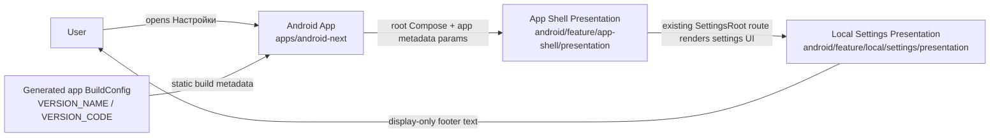
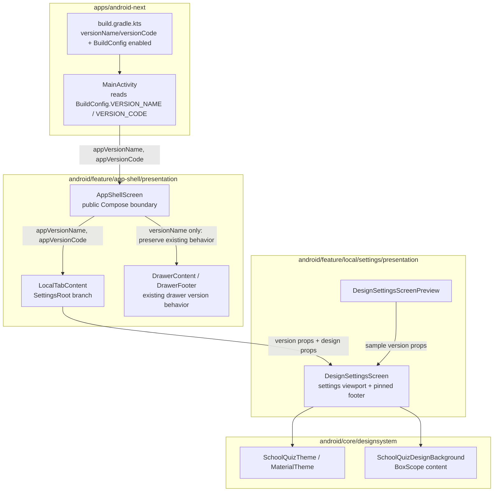
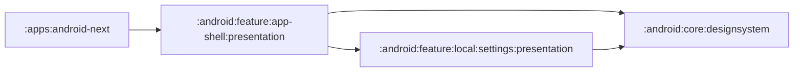
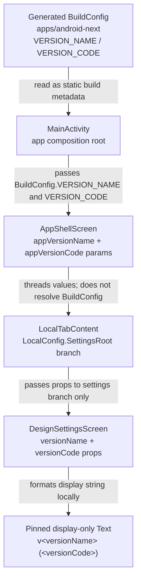

# High-Level Architecture Draft — Settings App Version Footer

> Draft only. This document is the `architect-high-level` first-round proposal and intentionally does not edit final design docs (`01-architecture.md`, `02-behavior.md`, `03-decisions.md`, etc.).

## 0. Inputs and Scope

Read inputs:

- `AGENTS.md`
- `.claude/PROJECT-CONTEXT.md`
- `.claude/rules/clean-architecture.md`
- `.claude/rules/navigation.md`
- `.claude/rules/di-patterns.md`
- `.claude/rules/testing.md`
- `docs/invariants.md`
- `docs/features/settings-app-version-footer/0-spec.md`
- `docs/features/settings-app-version-footer/1-research.md`
- `docs/features/settings-app-version-footer/2-grounding.md`

Feature scope:

- Show app build version footer on settings screen as `v<versionName> (<versionCode>)`.
- Small, grey / low-emphasis, centered, pinned to visible settings viewport bottom.
- Display-only: no tap / long-press / About / developer-mode behavior.
- Pure UI wiring. No domain, data, network, storage, Koin, navigation-state, or server work.
- Feature Domain Contract: N/A.

## 1. Proposed C4 L1 — System Context



### C4 L1 Boundary Decisions

| Boundary | Decision | Rationale |
|---|---|---|
| App build metadata | Owned by `apps/android-next` | Only the app module can safely read generated app `BuildConfig`; library modules should not read app `BuildConfig` directly. Existing `AppShellScreen` already documents this boundary for `VERSION_NAME` / `DEBUG`. |
| Shell routing | Owned by `android/feature/app-shell/presentation` | Existing `LocalConfig.SettingsRoot` branch renders `DesignSettingsScreen`; no new destination is needed. |
| Settings rendering | Owned by `android/feature/local/settings/presentation` | The requested footer is part of the settings viewport and should be rendered in the settings screen, not drawer/app root. |
| Domain/data/backend | N/A | Spec and grounding confirm no business logic, repositories, APIs, events, storage, sync, auth, or server work. |

## 2. Proposed C4 L2 — Containers / Modules



### Real Dependency Graph



Notes:

- `app-shell -> local/settings` is an existing direct composition dependency used to render `DesignSettingsScreen` for `LocalConfig.SettingsRoot`; this feature should not add a reverse `local/settings -> app-shell` dependency.
- The drawer footer is not the settings footer. It remains in app-shell drawer UI, formats only `v$versionName`, and keeps its existing click/About/dev-mode behavior.
- No new module should be introduced for app metadata; a shared `AppInfo` provider would be disproportionate for this Light UI-only feature.

## 3. DFD — BuildConfig to Settings Footer



### DFD Classification

| Data | Classification | Source | Sink | Persistence / side effects |
|---|---|---|---|---|
| `versionName` | Static build metadata | `apps/android-next` generated `BuildConfig.VERSION_NAME` | `DesignSettingsScreen` footer text | None |
| `versionCode` | Static build metadata | `apps/android-next` generated `BuildConfig.VERSION_CODE` | `DesignSettingsScreen` footer text | None |
| Footer tap / long-press | N/A | No handler should exist | N/A | None |

Security/privacy note: app version metadata is not user data and does not require auth/network/storage handling.

## 4. High-Level API / Contract Decision (`06-api-contract.md`)

`06-api-contract.md`: **N/A**.

Reason:

- No REST, WebSocket, push, Firebase, Room, repository, use case, or public domain contract change.
- The only "API" changed is an internal Compose function parameter surface between app composition, app-shell, and settings presentation.
- Feature Domain Contract is explicitly N/A in spec.

Recommended final-doc handling:

- Either omit `06-api-contract.md` for this Light feature, or create a short N/A document if the lead requires every numbered slot to exist.
- If created, it should state: "No external API/domain contract; internal UI parameters only."

## 5. Conditional Docs Decision

| Document | Needed? | Decision |
|---|---:|---|
| `07-events.md` | No | Footer is display-only. No analytics/event bus/domain events/tap handling should be added. Existing drawer version tap events remain unchanged and outside scope. |
| `08-storage-model.md` | No | No Room, SharedPreferences, migration, cache, sync cursor, or persistence change. Existing design-style preference remains unchanged. |

## 6. Web Prior-Art Decision

Web researcher: **not needed**.

Reasoning:

- No new SDK/library/platform API is introduced.
- BuildConfig usage is already present in local app code and documented at the app-shell boundary.
- UI styling uses existing project Compose/MaterialTheme patterns; no external best-practice decision is needed.
- The feature is an internal, deterministic client UI polish task.

Revisit trigger:

- If implementation proposes a new Gradle/versioning plugin, generated resource strategy, or shared app-info library, then web/official-doc verification becomes useful. Current design rejects that expansion.

## 7. High-Level ADRs

### ADR-HL-01 — App module remains the source for build metadata

**Status:** Proposed

**Decision:** Pass `BuildConfig.VERSION_NAME` and `BuildConfig.VERSION_CODE` from `apps/android-next` into app-shell UI parameters, then onward to settings UI.

**Rationale:**

- App `BuildConfig` belongs to the app module.
- Existing `AppShellScreen` already takes `appVersionName` from the app layer because library modules cannot access app `BuildConfig` directly.
- This preserves Compose screens as parameterized view functions and avoids service-location/Koin/platform reads in UI.

**Alternatives Considered:**

1. **Read app `BuildConfig` directly in `DesignSettingsScreen`.** Rejected: settings presentation is an Android library module and must not depend on app module generated classes.
2. **Create domain/use-case/repository `AppInfoProvider`.** Rejected: adds unnecessary architecture, DI, tests, and ownership for static UI metadata in a Light feature with Domain Contract N/A.
3. **Use Android resources for version text.** Rejected: still needs app-layer wiring for versionCode/versionName and adds no benefit for this diagnostic string.

**Consequences:**

- `AppShellScreen` and `LocalTabContent` need an internal version-code parameter in addition to existing version-name propagation.
- Existing app-shell androidTest call site must be updated if parameter is required.

### ADR-HL-02 — Settings footer is rendered in local settings presentation

**Status:** Proposed

**Decision:** Render the pinned version footer inside `DesignSettingsScreen`, using version values passed as props.

**Rationale:**

- The user asked for the footer at the bottom of the settings screen, not globally in the shell.
- `SchoolQuizDesignBackground` provides a `BoxScope`, so settings can host a non-scroll sibling/overlay/footer while preserving existing scroll content.
- Settings presentation already owns typography/color choices for settings rows and secondary text.

**Alternatives Considered:**

1. **Render footer in `AppShellScreen` as a shell overlay only when SettingsRoot is active.** Rejected: splits settings layout responsibility across shell and settings screen, makes padding/overlap rules harder to reason about, and weakens the settings viewport contract.
2. **Append footer as the last `LazyColumn` item.** Rejected: spec requires pinned/display-only bottom placement; on short content it could float near content rather than visible viewport bottom.
3. **Reuse drawer `DrawerFooter`.** Rejected: drawer footer is interactive, has About/dev-mode behavior, and formats only `v$versionName`.

**Consequences:**

- Settings screen signature should receive display values.
- Settings preview should provide sample values.
- Implementation should reserve enough bottom inset/content padding so the pinned footer does not cover last scroll items.

### ADR-HL-03 — No new navigation, DI, domain, storage, events, or backend contracts

**Status:** Proposed

**Decision:** Treat this as app-layer parameter threading plus Compose rendering only.

**Rationale:**

- Spec says "чисто UI" and Feature Domain Contract = N/A.
- Existing settings route (`LocalConfig.SettingsRoot`) already exists.
- Build version metadata is static and independent from auth/session/network/storage.

**Alternatives Considered:**

1. **Add a settings component/use case for version display.** Rejected: there is no behavior or lifecycle-owned state to model; would add ceremony without boundary benefit.
2. **Add Koin binding for version metadata.** Rejected: creates a new DI concern for static build constants and risks duplicate/missing module registration.
3. **Add an event for footer exposure/taps.** Rejected: display-only requirement says no tap side effects; no analytics requirement exists.

**Consequences:**

- Design final docs should mark `06-api-contract.md`, `07-events.md`, and `08-storage-model.md` as N/A.
- Validation focuses on compile, stale call sites, and UI behavior rather than domain/data tests.

### ADR-HL-04 — Preserve existing app-shell-to-settings dependency without widening coupling

**Status:** Proposed

**Decision:** Use the existing `app-shell -> local/settings` direct composition dependency; do not add any reverse dependency from settings to app-shell or other feature modules.

**Rationale:**

- App-shell already imports and renders sibling feature screen functions as the parent shell composition layer.
- Cross-feature invariant forbids bidirectional feature coupling.
- Passing primitive display props from parent to child does not create a new reverse dependency.

**Alternatives Considered:**

1. **Move settings screen into app-shell to avoid cross-feature call.** Rejected: settings has an existing feature module and this would be an unnecessary ownership move.
2. **Introduce a shared core UI contract solely for version footer.** Rejected: too broad for one local settings footer and risks core knowing feature-specific UI needs.
3. **Have settings import app-shell or root component to fetch version values.** Rejected: creates reverse feature coupling and violates view-function boundary.

**Consequences:**

- Component-level design must keep settings independent from app-shell/root component types.
- Any proposal adding `DefaultRootComponent`, app-shell navigation types, or Koin access to local settings should be contested.

## 8. Objections / Risks for Component-Level Design

These are likely component-level pitfalls the high-level design should push back on:

1. **Do not place footer as a final `LazyColumn` item** if the accepted requirement remains pinned to visible bottom. Use settings container layout to pin independently from scroll content, with scroll bottom padding to prevent overlap.
2. **Do not reuse `DrawerFooter`** in settings. Its behavior is interactive and coupled to About/dev-mode concerns.
3. **Do not add `onVersionTap`, `onLongClick`, analytics callbacks, or hidden developer-mode behavior** to the settings footer. Display-only is a functional requirement.
4. **Do not read `BuildConfig` inside `android/feature/app-shell/presentation` or `android/feature/local/settings/presentation`.** Keep app module as source.
5. **Do not introduce a Decompose Component/ViewModel/use case/repository/Koin module** for this footer. There is no state lifecycle or business behavior to own.
6. **Do not add a reverse dependency from local settings to app-shell** just to get version data. Parent passes props down.
7. **Do not hardcode `v0.1.0 (1)`** except in previews/tests. Production must reflect generated build metadata.
8. **Do not gate the settings footer on `BuildConfig.DEBUG` / `isDebugBuild`.** Spec requires normal debug and release visibility.
9. **Do not mutate existing drawer footer behavior.** Drawer remains `v$versionName`, clickable, and owns About/dev-mode behavior unless a separate product decision changes it.
10. **Avoid a raw hardcoded grey color** if MaterialTheme low-emphasis color already fits project style; use existing theme tokens / `onSurface` alpha pattern.

## 9. Validation Guidance for Implementation Phases

Minimum implementation validation expected from design:

```bash
grep -RIn --include='*.kt' 'DesignSettingsScreen(' android apps shared
grep -RIn --include='*.kt' 'AppShellScreen(' android apps shared
./gradlew :apps:android-next:assembleDebug --no-configuration-cache
```

If `AppShellScreenTest` signature changes, also build instrumented test APK or run the relevant test target where practical:

```bash
./gradlew assembleDebugAndroidTest --no-configuration-cache
```

Canonical merge gate remains:

```bash
./gradlew ciCheck --no-configuration-cache
```

Manual UX check:

- Open settings.
- Confirm `v0.1.0 (1)` (or current build metadata) is centered at visible viewport bottom.
- Tap/long-press footer: no action.
- Open drawer: existing drawer version/About/dev-mode behavior unchanged.

## 10. Open Questions

None blocking for design.

Resolved by spec/research/grounding:

- Format: `v<versionName> (<versionCode>)`.
- Placement: pinned/display-only at visible bottom of settings viewport.
- Build types: show in debug and release.
- Domain/API/storage/events: N/A.

Implementation-level choice left to component design:

- Exact Kotlin parameter type/name for version code (`Int` is expected because `BuildConfig.VERSION_CODE` is an integer), and exact Compose layout mechanics for pinned footer + scroll padding.
